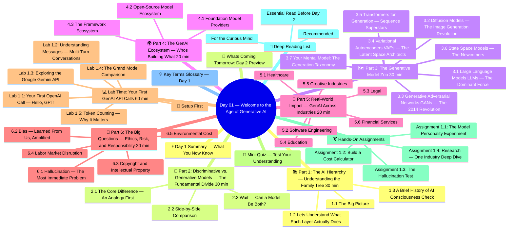

# Day 01 — Welcome to the Age of Generative AI

> **Week 1 | Foundations** | ⏱️ Estimated Time: 3–4 hours | 🔥 Difficulty: Beginner-Friendly

---

## 👋 Before We Dive In — A Moment of Curiosity

Let's begin with a question. Not a textbook question.  A *real* one.

> *What if you could whisper a description of your dream home to a computer and watch it render the image in real time?*  
> *What if you could describe a legal contract problem in plain English and get a clause-by-clause analysis back in seconds?*  
> *What if a machine could co-write your novel, compose music to your poem, or debug your code while you sip coffee?*

This isn't science fiction anymore. Every one of these things is happening RIGHT NOW, powered by **Generative AI** — arguably the most disruptive class of technology in the last fifty years.

Welcome to Day 1. You are beginning a 30-day journey that will take you from curious observer to hands-on builder. By the time you finish this course, you'll be building real applications with GPT-4, running open-source models on your own machine, fine-tuning LLMs on custom data, and deploying production-grade AI systems.

But first, we need to understand: **What exactly IS Generative AI?** And how did we get here?

---

## 🧠 Concept Map




---

## 🎯 Learning Objectives — What You'll Know By Tonight

By the end of today, you will be able to:

- [ ] Draw and explain the AI hierarchy: AI → ML → Deep Learning → Generative AI
- [ ] Distinguish clearly between *discriminative* and *generative* models (and articulate why this distinction matters)
- [ ] Name at least 5 types of generative models and give a real-world example of each
- [ ] Identify 10+ industries where GenAI is already creating disruption
- [ ] Understand who the key players are in today's GenAI ecosystem
- [ ] Make your first actual API call to a live AI model

You'll walk away from today with your *very first GenAI program already running*. Let's go.

---

## 📚 Part 1: The AI Hierarchy — Understanding the Family Tree (30 min)

### 1.1 The Big Picture

Here's a question: when people say "AI," what do they mean?

The frustrating (and fascinating) answer is: **it depends**. AI is a broad umbrella term. Underneath it lives a rich ecosystem of techniques, some four decades old, some born just last year. Let's map it out.

```
🌐 Artificial Intelligence (AI)
│
│   "Systems that can perform tasks which normally require human intelligence."
│
└── 🧪 Machine Learning (ML)
    │
    │   "Learning from data without being explicitly programmed for every case."
    │
    └── 🧠 Deep Learning (DL)
        │
        │   "Multi-layered neural networks that learn hierarchical representations."
        │
        └── ✨ Generative AI (GenAI)
                │
                "Creating brand-new content: text, images, audio, video, code."
```

Think of it like Russian nesting dolls. Every inner layer is a *subset* of the outer one — more specialized, more powerful for specific tasks, but not a replacement.

---

### 1.2 Let's Understand What Each Layer Actually Does

**🌐 Artificial Intelligence (Born ~1950s)**

AI began with a deceptively simple idea: can we make machines *reason*? Alan Turing posed the question in 1950. Early "AI" was rule-based systems — explicitly programmed with `IF-THEN` logic trees. 

```
IF patient has fever AND cough THEN possible_diagnosis = "flu"
IF patient has fever AND stiff neck THEN possible_diagnosis = "meningitis"
```

These systems worked for narrow, well-defined problems. But the real world is messy. Rules break down. The world has too many exceptions.

**🧪 Machine Learning (Matured ~1980s–2000s)**

Instead of hard-coding rules, what if the machine *learned* rules from examples?

```
Training Data →  [Algorithm]  →  Model
   (input)         learns          (stores learned patterns)

New Input    →  [Model]  →  Prediction
```

This is the revolution of ML. Instead of telling a spam filter *"if the email has the word 'lottery', mark it spam"*, you show it millions of labelled emails (spam/not-spam) and let it *figure out* the patterns itself.

Three flavors of ML dominate the field:

| Learning Type | Core Idea | Classic Example |
|---|---|---|
| **Supervised** | Learn from labeled input-output pairs | Image classification, spam detection |
| **Unsupervised** | Find hidden structure in unlabeled data | Clustering customers, topic modeling |
| **Reinforcement** | Learn by trial-and-error to maximize reward | Game-playing AI, robot locomotion |

**🧠 Deep Learning (Explosion ~2012–present)**

Deep Learning took ML and added *depth*. By stacking many layers of artificial neurons (hence "deep"), these models can automatically learn increasingly abstract representations.

Classic ML required *feature engineering* — humans manually deciding which aspects of data mattered (edge detection for images, word frequency for text). Deep Learning *eliminates* this manual step. The network discovers what matters on its own.

The watershed moment: in 2012, a deep neural network called AlexNet slashed the image classification error rate on the ImageNet benchmark from ~26% to ~15% — a jaw-dropping improvement that triggered the GPU revolution and modern AI as we know it.

**✨ Generative AI (The Current Wave ~2017–present)**

Now we arrive at our subject. GenAI is deep learning applied not just to *understand* content but to *create* new content that never existed before.

The moment that changed everything: **"Attention Is All You Need"** — the 2017 paper by Vaswani et al. at Google that introduced the **Transformer architecture**. We'll study Transformers on Day 4, but for now know: this single paper launched the era of GPT, BERT, DALL-E, Stable Diffusion, and everything that followed.

---

### 1.3 A Brief History of AI Consciousness Check

Here's something to sit with for a moment:

> The human brain has roughly **86 billion neurons**, each connected to thousands of others.  
> GPT-4 has an estimated **1.8 trillion parameters** (Mixture of Experts architecture).

Numbers aren't directly comparable — neurons and parameters are different things — but it gives you a sense of *scale*. These aren't toys. These are planetary-scale pattern-recognition engines.

And here's the wild part: even the researchers who built them don't fully understand *why* they work so well. Emergent capabilities — abilities that appear without being explicitly trained — are one of the great mysteries of modern AI. 

We're steering a ship we don't fully understand. That's both exciting and a reminder to stay humble.

---

## 🧩 Part 2: Discriminative vs. Generative Models — The Fundamental Divide (30 min)

This distinction is so important it will come up literally every day of this course. Let's nail it now.

### 2.1 The Core Difference — An Analogy First

Imagine two different kinds of art critics:

**The Discriminator** is like a museum curator. Show her a painting and she'll tell you: "Baroque — 17th century, probably Dutch." She can *classify*, *label*, *judge*. But ask her to *paint something*, and she's stuck. That's not her role.

**The Generator** is like the artist. She doesn't just judge — she *creates*. Given a prompt ("paint me a melancholy sunset over an industrial city"), she produces something new that never existed before.

This maps directly to ML:

**Discriminative Models** learn `P(Y|X)` — given input X (e.g., an image), what is the probability of label Y (e.g., "cat")?

- Their job: *draw boundaries* between classes
- They learn: "What makes this a cat vs. a dog?"
- They can NOT generate: they have no model of what the world looks like

**Generative Models** learn `P(X)` or `P(X|Y)` — the probability distribution *of the data itself*.

- Their job: *model how the world generates data*
- They learn: "What does a cat actually look like, in all its variety?"
- They CAN generate: sample from their learned distribution to create new examples

### 2.2 Side-by-Side Comparison

| Aspect | Discriminative Models | Generative Models |
|---|---|---|
| **Core Question** | "What is this?" | "What could this be?" |
| **Mathematical Goal** | Learn P(Y\|X) | Learn P(X) or P(X\|Y) |
| **Output** | Label, class, probability | New data sample |
| **Classic Examples** | Logistic Regression, SVM, BERT (classification) | GPT-4, DALL-E, Stable Diffusion, VAEs |
| **Training Data Needed** | Labeled pairs (X, Y) | Often just X (can be unlabeled) |
| **Strength** | Classification accuracy | Creative generation |
| **Limitation** | Blind box — no world model | Can hallucinate (generate plausible-but-false) |
| **2024 Use Cases** | Spam detection, face recognition, medical diagnosis | Writing assistants, art generation, code completion |

### 2.3 Wait — Can a Model Be Both?

Great question. Some modern models blur this line:

- **BERT** is fundamentally **discriminative** — but it was *trained* with a generative-adjacent objective (masked language modeling). It predicts masked tokens but isn't designed for open-ended generation.
- **GPT-4** is **generative** — but it can be prompted to classify, extract, and discriminate.
- **Stable Diffusion** uses both — a discriminative encoder (VAE encoder) plus a generative decoder.

The generative/discriminative lens is a spectrum, not a binary. Understanding *where* a model sits on this spectrum helps you choose the right tool.

---

## 🗺️ Part 3: The Generative Model Zoo (30 min)

Now let's catalog the major families of generative models. Each works differently. Each has strengths and weaknesses.

### 3.1 Large Language Models (LLMs) — The Dominant Force

**What they are:** Neural networks trained on massive text corpora to predict the next token. At sufficient scale, they become extraordinarily versatile.

**How they work (conceptually):**
```
Input:  "The capital of France is"
Model:  P("Paris") = 0.97, P("Lyon") = 0.01, P("Berlin") = 0.001, ...
Output: "Paris"
```

But this "next-word prediction" objective, scaled to human-level text datasets, produces something remarkable: a model that can reason, summarize, translate, code, joke, console — apparently truly *understanding* language.

**Key Models in 2024–2025:**
| Model | Company | Key Strength | Context Window |
|---|---|---|---|
| **GPT-4o** | OpenAI | All-around excellence, multimodal | 128K tokens |
| **Claude 3.5 Sonnet** | Anthropic | Writing, analysis, coding | 200K tokens |
| **Gemini 1.5 Pro** | Google DeepMind | Multimodal, long context | 1M tokens |
| **LLaMA 3.1 405B** | Meta AI | Best open-source | 128K tokens |
| **Mistral Large** | Mistral AI | European, efficient | 128K tokens |
| **Grok-2** | xAI | Real-time web data | 128K tokens |

### 3.2 Diffusion Models — The Image Generation Revolution

**What they are:** Models that learn to generate images by learning to *reverse* a process of adding noise.

**Intuitive explanation:**

Step 1 (Forward/Training): Take a beautiful photo of a cat. Add tiny amounts of random noise, step by step, until you have pure static.

Step 2 (Backward/Generation): The model learns to *undo* this process — given noisy data, predict the slightly-less-noisy original. Train on millions of images until the model can turn pure noise into sharp images.

```
[Pure Noise] → [Slightly less noisy] → ... → [Clear Image]
              ←←←←←← MODEL REVERSES ←←←←←←
```

**Why they're incredible:** Text-to-image quality is stunning. Stable Diffusion can generate photorealistic images, any art style, any scene, from a text description in seconds.

**Key Models:**
- **DALL-E 3** (OpenAI) — Integrated with ChatGPT, great instruction-following
- **Stable Diffusion XL** (Stability AI) — Open-source, runs locally
- **Midjourney v6** — Best aesthetic quality, community favorite
- **Imagen 3** (Google) — Outstanding photorealism

### 3.3 Generative Adversarial Networks (GANs) — The 2014 Revolution

**What they are:** Two networks compete against each other in a zero-sum game:

```
Generator Network:    Creates fake images
        ↓
Discriminator Network: "Is this real or fake?"
        ↓  
Generator improves based on discriminator's feedback
        ↓
Discriminator improves to catch better fakes
        ↓ [cycle continues until equilibrium]
```

Think of it as a master forger (Generator) competing against an art authentication expert (Discriminator). The forger gets better by learning from every time they get caught; the expert gets better every time a fake slips past.

**Key Models:**
- **StyleGAN3** (NVIDIA) — Photorealistic human face generation
- **CycleGAN** — Image-to-image translation (horse → zebra, summer → winter)
- **BigGAN** — High-resolution image synthesis

**Why they're less dominant now:** Diffusion models surpassed GANs in quality and stability (GANs are notoriously hard to train — the "mode collapse" problem plagues them).

### 3.4 Variational Autoencoders (VAEs) — The Latent Space Architects

**What they are:** Models that learn a compressed *latent representation* of data, then learn to decode it back.

```
Input Image → [Encoder] → Latent Vector z (compressed) → [Decoder] → Reconstructed Image

To Generate New Images: Sample z from a Gaussian distribution → [Decoder] → New Image
```

**Key Insight:** The latent space is smooth and continuous. You can *interpolate* between points:

```
z_cat = encode(cat photo)
z_dog = encode(dog photo)
z_catdog = 0.5 * z_cat + 0.5 * z_dog  →  decode → some weird cat-dog hybrid!
```

**Where VAEs shine:** Image editing, data compression, anomaly detection, and as encoders inside diffusion models.

### 3.5 Transformers for Generation — Sequence Superstars

Beyond LLMs, Transformers power:
- **Music generation** (MusicGen, Jukebox)
- **Protein folding** (AlphaFold 2 — a revolutionary application)
- **Video generation** (Sora, RunwayML Gen-3)
- **Code generation** (GitHub Copilot, AlphaCode 2)

### 3.6 State Space Models — The Newcomers

The newest family: **Mamba** (2023) and derivatives challenge Transformer dominance with linear-time sequence modeling — much more efficient for very long sequences. Watch this space in 2025.

---

### 3.7 Your Mental Model: The Generation Taxonomy

```
GENERATIVE MODELS
│
├── TEXT (Seq-to-Seq)
│   ├── Decoder-Only: GPT family, Claude, LLaMA (autoregressive generation)
│   ├── Encoder-Decoder: T5, BART (translation, summarization)
│   └── Diffusion-for-text: MDLM (emerging)
│
├── IMAGE
│   ├── Diffusion: DALL-E 3, Stable Diffusion, Imagen
│   ├── GANs: StyleGAN, CycleGAN
│   └── Flow-based: GLOW, RealNVP
│
├── AUDIO
│   ├── Speech Synthesis: ElevenLabs, OpenAI TTS, Bark
│   └── Music: MusicGen, AudioCraft, Suno
│
├── VIDEO
│   ├── OpenAI Sora (diffusion-based)
│   └── RunwayML Gen-3, Kling
│
├── CODE
│   ├── GitHub Copilot (GPT-4-based)
│   └── AlphaCode 2, Codestral
│
└── MULTI-MODAL (Cross-modal)
    ├── GPT-4o: text + vision + voice
    ├── Gemini 1.5 Ultra: text + vision + audio + video
    └── Claude 3.5 Sonnet: text + vision
```

---

## 🌍 Part 4: The GenAI Ecosystem — Who's Building What (20 min)

### 4.1 Foundation Model Providers

These are the companies building the massive models at the frontier:

**OpenAI** (San Francisco, founded 2015)
- Models: GPT-4o, o1, o3, DALL-E 3, Whisper (speech-to-text), Sora (video)
- Revenue model: ChatGPT Plus ($20/mo), API access, Enterprise
- Investor: Microsoft (~$13B invested)
- Differentiator: First-mover advantage, richest ecosystem, RLHF alignment research

**Anthropic** (San Francisco, founded 2021)
- Models: Claude 3.5 Sonnet, Claude 3 Opus, Claude 3 Haiku
- Founded by ex-OpenAI researchers (Dario and Daniela Amodei)
- Focus: AI safety research and "constitutional AI" alignment
- Investors: Google ($2B+), Amazon ($4B)
- Differentiator: Strong on writing quality, very long context windows (200K+)

**Google DeepMind** (London/Mountain View)
- Models: Gemini 1.5 Pro/Ultra/Flash, Imagen 3, MusicLM, AlphaFold
- Differentiation: Multimodal from the ground up, enormous search data advantage
- Distribution: Integrated into Google Search, Gmail, Docs, Android

**Meta AI** (Menlo Park)
- Models: LLaMA 3.1 (8B, 70B, 405B), Code Llama, AudioCraft
- Strategy: Open-source everything — democratize AI
- Impact: LLaMA enabled thousands of companies to run models locally without API costs

**Mistral AI** (Paris, founded 2023)
- Models: Mistral 7B, Mixtral 8x7B (MoE), Mistral Large 2
- Known for: State-of-the-art open-weights models that punch above their weight
- European: Subject to EU AI regulations, growing compliance-focused customer base

**xAI** (Elon Musk, 2023)
- Models: Grok-2
- Access to real-time X (formerly Twitter) data
- Growing quickly, integrated into X/Twitter

### 4.2 Open-Source Model Ecosystem

Open-source models have *massively* democratized AI. You can download and run these on your own hardware:

| Model | Params | Context | Strengths |
|---|---|---|---|
| **LLaMA 3.1 8B** | 8B | 128K | Fastest local model, great for prototyping |
| **LLaMA 3.1 70B** | 70B | 128K | Near-GPT-4 quality, production-ready |
| **Mistral 7B** | 7B | 32K | Incredibly efficient, punches far above its size |
| **Phi-3 Medium** | 14B | 128K | Microsoft, excellent reasoning |
| **Qwen 2.5 72B** | 72B | 128K | Alibaba, excellent multilingual |
| **Gemma 2 27B** | 27B | 8K | Google, safety-focused |
| **DeepSeek-R1** | 671B | 128K | Reasoning-focused, Chinese lab |

**How to run locally?** Tools like [Ollama](https://ollama.ai) let you run full models on your MacBook or Windows PC in one command:
```bash
ollama run llama3.1
```

### 4.3 The Framework Ecosystem

These are the libraries you'll use to *build* with GenAI:

| Framework | What It Does | Best For |
|---|---|---|
| **LangChain** | Build LLM chains, agents, RAG systems | Full-stack LLM apps |
| **LlamaIndex** | Data ingestion + retrieval for LLMs | Document Q&A, RAG |
| **Hugging Face** | Model hub + training infrastructure | Open-source models |
| **Ollama** | Run local models easily | Local development |
| **Instructor** | Structured outputs from LLMs | Data extraction |
| **DSPy** | Programming with LMs declaratively | Prompt optimization |
| **Semantic Kernel** | Microsoft's LLM framework | Enterprise apps |

---

## 🚀 Part 5: Real-World Impact — GenAI Across Industries (20 min)

Let's ground this in reality. Where is GenAI creating value *right now*?

### 5.1 Healthcare

**Clinical Note Documentation:**  
Physicians spend ~2 hours per day on administrative documentation for every 1 hour with patients. GenAI (Nuance DAX, Abridge, Suki) listens to patient-physician conversations and auto-generates structured clinical notes in the EHR. Physicians report 50%+ reduction in documentation time.

**Drug Discovery:**  
AlphaFold 2 (DeepMind) predicted the 3D structures of ~200 million proteins in a single year — a task that would have taken the scientific community millennia with traditional methods. Protein structure = key to understanding how drugs bind to targets.

**Radiology:**  
Models like Med-PaLM M (Google/DeepMind) can analyze medical images (X-rays, MRIs) and generate detailed clinical reports. Early studies show accuracy matching expert radiologists on specific tasks.

**Mental Health:**  
Conversational AI companions (Woebot, Wysa) provide CBT-based mental health support at scale — filling gaps where human therapists are unavailable or unaffordable.

### 5.2 Software Engineering

This is the most immediate impact domain for most readers:

- **GitHub Copilot**: Used by 1.8 million developers. Studies suggest 35–55% productivity improvement on well-defined tasks.
- **Cursor**: IDE with deep GPT-4 integration that can refactor codebases, explain bugs, write entire features.
- **Devin (Cognition)**: First AI "software engineer" that can complete full GitHub issues autonomously.
- **AlphaCode 2 (DeepMind)**: Placed in the 87th percentile in competitive programming contests.

### 5.3 Legal

- **Contract Review**: Kira Systems, Harvey AI analyze contracts for risk clauses, finding issues that junior lawyers miss.
- **Legal Research**: CaseMark, CoCounsel surface relevant precedents from millions of case documents instantly.
- **Document Drafting**: Generating first drafts of contracts, briefs, compliance documents.

### 5.4 Education

- **Personalized Tutoring**: Khan Academy's Khanmigo uses GPT-4 to provide Socratic tutoring — guiding students to answers rather than giving them directly.
- **Content Generation**: Textbook publishers generate adaptive practice problems at scale.
- **Language Learning**: Duolingo Max uses GPT-4 for role-play conversation practice with real-time feedback.

### 5.5 Creative Industries

The most controversial application. GenAI both threatens and enables:

| Application | Threat | Opportunity |
|---|---|---|
| Writing | Ghost-writing, content farms | Overcoming writer's block, first drafts |
| Art/Design | Stock image disruption | Rapid prototyping, concept art |
| Music | Session musician work | Personalized soundtracks, democratized production |
| Film | VFX artist displacement | Indie filmmakers producing Hollywood-quality content |

### 5.6 Financial Services

- **Earnings Report Synthesis**: Bloomberg GPT trained on financial data for market-specific tasks.
- **Fraud Detection**: Generative models create synthetic fraud transaction data to train better detectors.
- **Customer Service**: Bank of America's Erica (AI assistant) handles 10+ million client interactions monthly.

---

## 🤔 Part 6: The Big Questions — Ethics, Risk, and Responsibility (20 min)

You can't study GenAI without confronting the hard questions. Not later. Now.

### 6.1 Hallucination — The Most Immediate Problem

LLMs *make things up*. Confidently. Coherently. With citations.

```
User: "Who founded the IEEE Computer Society?"
LLM: "The IEEE Computer Society was founded in 1946 by Dr. Edmund A. Pemberton..."
Reality: Dr. Edmund A. Pemberton doesn't exist. The answer is fabricated.
```

Why does this happen? Because the model's objective is *predicting the next plausible token*, not *telling the truth*. It has no internal "I don't know" mechanism — it will confabulate rather than admit ignorance.

**Mitigation strategies:**
- Retrieval-Augmented Generation (RAG) — give the model real sources to cite
- Chain-of-thought prompting — force step-by-step reasoning
- Confidence scores and consistency checks
- Human-in-the-loop verification for high-stakes decisions

### 6.2 Bias — Learned From Us, Amplified

Training data is human-generated. Humans hold biases — cultural, racial, gender, socioeconomic. Models absorb these biases and can amplify them at scale.

**Example:** Early image generation models over-represented certain demographics in "professional" prompts even in 2022. Text models can make stereotyped associations.

**The hard truth:** There's no bias-free training data. Every choice about which data to include, filter, or weight is a value judgment.

### 6.3 Copyright and Intellectual Property

A model trained on billions of web pages, books, and artworks — does this constitute copyright infringement? The legal landscape is evolving rapidly:

- The New York Times sued OpenAI and Microsoft (2023)
- Getty Images sued Stability AI over image training data
- The EU AI Act (2024) mandates disclosure of training data sources

**Unsettled question:** Who owns outputs? The user? The model company? No one?

### 6.4 Labor Market Disruption

Goldman Sachs estimated generative AI could automate tasks equivalent to 300 million full-time jobs globally. But historical evidence suggests technology creates new jobs it makes others obsolete — the question is whether *this* transition happens too fast for labor markets to adapt.

### 6.5 Environmental Cost

Training GPT-3 required an estimated 1,287 MWh of electricity — equivalent to ~570 tons of CO₂, or 120 cars driven for a year. And GPT-4 is orders of magnitude larger.

Inference (running the model) also consumes enormous energy at scale. A ChatGPT query consumes ~10x more energy than a Google Search query.

These costs matter. They should factor into our thinking about responsible deployment.

---

## 💻 Lab Time: Your First GenAI API Calls (60 min)

Let's stop theorizing and start building. We'll make live API calls today. You'll see the magic with your own eyes.

### 🔧 Setup First

If you haven't already set up your environment, see `environment-setup.md` in the root directory. You'll need:

```bash
# In your project's virtual environment
pip install openai anthropic google-generativeai python-dotenv tiktoken
```

Create a `.env` file:
```
OPENAI_API_KEY=sk-...
ANTHROPIC_API_KEY=sk-ant-...
GOOGLE_API_KEY=AIza...
```

### Lab 1.1: Your First OpenAI Call — Hello, GPT!

```python
# lab_01_01_openai_hello.py
"""
Your very first interaction with a Large Language Model via API.
Run this once, read the output carefully — you are communicating 
with a 175B+ parameter neural network trained on a significant 
portion of human-written text.
"""
import os
from openai import OpenAI
from dotenv import load_dotenv

load_dotenv()

# Initialize client (reads OPENAI_API_KEY from environment)
client = OpenAI(api_key=os.getenv("OPENAI_API_KEY"))

print("=" * 60)
print("Lab 1.1: Your First OpenAI API Call")
print("=" * 60)

# Simple chat completion
response = client.chat.completions.create(
    model="gpt-4o-mini",          # Fast, cheap, still very capable
    messages=[
        {
            "role": "system",          # Sets the AI's persona/context
            "content": "You are a brilliant but surprisingly humble AI researcher who explains concepts with vivid analogies and genuine enthusiasm."
        },
        {
            "role": "user",            # The human's message
            "content": "In 3 sentences, what is Generative AI and why should someone care about it in 2025?"
        }
    ],
    temperature=0.7,               # Creativity dial: 0=robotic, 2=chaotic
    max_tokens=300,                # Maximum response length
)

# Unpack the response
message = response.choices[0].message.content
tokens_used = response.usage.total_tokens
input_tokens = response.usage.prompt_tokens
output_tokens = response.usage.completion_tokens

print(f"\nModel: {response.model}")
print(f"\nResponse:\n{message}")
print(f"\n📊 Token Usage:")
print(f"   Input tokens:  {input_tokens}")
print(f"   Output tokens: {output_tokens}")
print(f"   Total tokens:  {tokens_used}")
print(f"   Estimated cost: ${tokens_used * 0.00015 / 1000:.6f} USD")  # gpt-4o-mini pricing

# Let's understand what a "message" object looks like
print("\n🔍 Full Response Object:")
print(f"   ID:            {response.id}")
print(f"   Created:       {response.created}")
print(f"   Finish Reason: {response.choices[0].finish_reason}")
print(f"   System Fingerprint: {response.system_fingerprint}")
```

**Try it!** Run this file. Notice:
- The `system` message sets your AI's personality
- `temperature=0.7` gives you varied, interesting responses
- Run it multiple times — you'll get different answers each time (that's temperature at work)

---

### Lab 1.2: Understanding Messages — Multi-Turn Conversations

```python
# lab_01_02_multiturn_conversation.py
"""
LLMs are stateless. They don't remember previous conversations.
To create a conversation, you send the ENTIRE history each time.
This is how ChatGPT "remembers" — it's sending growing context windows.
"""
import os
from openai import OpenAI
from dotenv import load_dotenv

load_dotenv()
client = OpenAI()

def chat_with_history(conversation_history, user_message):
    """Add user message, get response, update history."""
    conversation_history.append({
        "role": "user",
        "content": user_message
    })
    
    response = client.chat.completions.create(
        model="gpt-4o-mini",
        messages=conversation_history,
        temperature=0.7,
    )
    
    assistant_message = response.choices[0].message.content
    
    # Add assistant response to history
    conversation_history.append({
        "role": "assistant",
        "content": assistant_message
    })
    
    return assistant_message, conversation_history

# Start a conversation about GenAI
history = [
    {"role": "system", "content": "You are a patient GenAI tutor teaching a curious beginner. Keep responses under 100 words."}
]

print("=" * 60)
print("Lab 1.2: Multi-Turn Conversation Demo")
print("=" * 60)

questions = [
    "What's a token in the context of LLMs?",
    "How many tokens is roughly a typical webpage?",
    "Does GPT-4 have the same token limit as GPT-3.5?"
]

for question in questions:
    print(f"\n👤 User: {question}")
    response, history = chat_with_history(history, question)
    print(f"🤖 AI: {response}")
    print(f"   [History length: {len(history)} messages, "
          f"~{sum(len(m['content']) for m in history) // 4} tokens]")

print(f"\n💡 Key insight: The ENTIRE {len(history)}-message history is sent")
print(f"   with every API call. Context window limits bound conversation length.")
```

---

### Lab 1.3: Exploring the Google Gemini API

```python
# lab_01_03_gemini_first_call.py
"""
Different AI providers, different APIs. Let's meet Gemini.
Google's multimodal model family — built from the ground up to handle
text, images, audio, and video in the same model.
"""
import google.generativeai as genai
import os
from dotenv import load_dotenv

load_dotenv()
genai.configure(api_key=os.getenv("GOOGLE_API_KEY"))

print("=" * 60)
print("Lab 1.3: Google Gemini API")
print("=" * 60)

# List available models
print("\n📋 Available Gemini Models:")
for m in genai.list_models():
    if 'generateContent' in m.supported_generation_methods:
        print(f"   {m.name}")

# Use Gemini 1.5 Flash (fast and cheap for prototyping)
model = genai.GenerativeModel("gemini-1.5-flash")

# Simple completion
response = model.generate_content(
    "List 5 surprising use cases for Generative AI in 2025 that most people haven't thought of. Be specific and creative."
)

print(f"\nGemini's Response:\n{response.text}")
print(f"\nToken counts:")
print(f"   Prompt:     {response.usage_metadata.prompt_token_count}")
print(f"   Response:   {response.usage_metadata.candidates_token_count}")
print(f"   Total:      {response.usage_metadata.total_token_count}")

# Multi-turn with Gemini (using chat session)
print("\n" + "=" * 40)
print("Multi-turn with Gemini:")
print("=" * 40)

chat = model.start_chat(history=[])

responses = [
    chat.send_message("What is a Foundation Model? One sentence only."),
    chat.send_message("Give me a real example, and why it's called 'foundation'."),
    chat.send_message("How is GPT-4 different from BERT? Very brief."),
]

for i, r in enumerate(responses, 1):
    print(f"\nTurn {i}: {r.text}")
```

---

### Lab 1.4: The Grand Model Comparison

```python
# lab_01_04_model_comparison.py
"""
The same question, sent to three different models.
Notice the differences in style, depth, tone, and accuracy.
This hands-on comparison teaches more than any lecture.
"""
import os
from openai import OpenAI
import anthropic
from dotenv import load_dotenv
import time

load_dotenv()

openai_client = OpenAI()
claude_client = anthropic.Anthropic()

question = """
Explain the concept of 'emergent capabilities' in large language models.
Use one concrete example and keep your answer under 150 words.
"""

print("=" * 60)
print("Lab 1.4: Three-Way Model Comparison")
print("=" * 60)
print(f"\nQuestion: {question.strip()}\n")

# ---- GPT-4o-mini ----
print("=" * 40)
print("🟢 GPT-4o-mini (OpenAI)")
print("=" * 40)

start_time = time.time()
gpt_response = openai_client.chat.completions.create(
    model="gpt-4o-mini",
    messages=[{"role": "user", "content": question}],
    temperature=0.5,
    max_tokens=300
)
gpt_time = time.time() - start_time

print(gpt_response.choices[0].message.content)
print(f"\n⏱️ Response time: {gpt_time:.2f}s | 📊 Tokens: {gpt_response.usage.total_tokens}")
print(f"💰 Estimated cost: ${gpt_response.usage.total_tokens * 0.00015 / 1000:.6f}")

# ---- Claude Haiku ----
print("\n" + "=" * 40)
print("🟡 Claude 3 Haiku (Anthropic)")
print("=" * 40)

start_time = time.time()
claude_response = claude_client.messages.create(
    model="claude-3-haiku-20240307",
    max_tokens=300,
    messages=[{"role": "user", "content": question}]
)
claude_time = time.time() - start_time

print(claude_response.content[0].text)
print(f"\n⏱️ Response time: {claude_time:.2f}s | 📊 Input: {claude_response.usage.input_tokens} | Output: {claude_response.usage.output_tokens}")

# ---- Comparison Summary ----
print("\n" + "=" * 40)
print("📊 Comparison Summary")
print("=" * 40)
print(f"{'Metric':<25} {'GPT-4o-mini':<20} {'Claude Haiku':<20}")
print("-" * 65)
print(f"{'Response time':<25} {gpt_time:.2f}s{'':<16} {claude_time:.2f}s")
print(f"{'Tokens (output)':<25} {gpt_response.usage.completion_tokens:<20} {claude_response.usage.output_tokens:<20}")

print("""
📝 Reflection questions:
1. Which response did you find clearer? More accurate?
2. Did the models use different analogies or framings?
3. Which would you use for a customer-facing product?
4. What factors beyond response quality matter for real-world choice?
""")
```

---

### Lab 1.5: Token Counting — Why It Matters

```python
# lab_01_05_token_counting.py
"""
Tokens are the currency of LLMs. Every character you send costs money.
Every character you receive costs more money. Understanding tokenization
is the difference between an app that costs $10/month and $10,000/month.
"""
import tiktoken
from openai import OpenAI
from dotenv import load_dotenv
import os

load_dotenv()

print("=" * 60)
print("Lab 1.5: Understanding Tokens")  
print("=" * 60)

# GPT-4/GPT-4o use cl100k_base encoding
enc = tiktoken.get_encoding("cl100k_base")

# --- Basic tokenization ---
texts = [
    "Hello, world!",
    "Generative AI is transforming the software industry.",
    "The quick brown fox jumps over the lazy dog.",
    "ChatGPT,  please help me debug this Python code: def foo(): return 'bar'",
    "🤖 AI is 人工知能 in Japanese and ИИ in Russian.",  # multilingual
]

print("\n📊 Tokenization Examples:")
print(f"{'Text':<60} {'Tokens':<8} {'Chars':<8} {'Ratio'}")
print("-" * 90)

for text in texts:
    tokens = enc.encode(text)
    ratio = len(text) / len(tokens)
    print(f"{text[:57]+'...' if len(text)>57 else text:<60} {len(tokens):<8} {len(text):<8} {ratio:.1f} chars/tok")

# --- Decode tokens to see what they actually are ---
print("\n\n🔍 Token Breakdown for 'Generative AI':")
text = "Generative AI is fascinating technology!"
tokens = enc.encode(text)
print(f"   Text:   '{text}'")
print(f"   Tokens: {tokens}")
print(f"   Decoded pieces: {[enc.decode([t]) for t in tokens]}")

# --- Real-world cost calculation ---
print("\n\n💰 Real Cost Calculator (gpt-4o pricing):")
pricing = {
    "gpt-4o":          {"input": 5.00,   "output": 15.00},   # per 1M tokens
    "gpt-4o-mini":     {"input": 0.15,   "output": 0.60},
    "text-embedding-3-small": {"input": 0.02,   "output": 0.00},
}

scenarios = [
    {"name": "Single Q&A",         "input_tokens": 500,    "output_tokens": 200},
    {"name": "Essay generation",   "input_tokens": 300,    "output_tokens": 1500},
    {"name": "RAG pipeline",       "input_tokens": 3000,   "output_tokens": 500},
    {"name": "Code review",        "input_tokens": 2000,   "output_tokens": 800},
]

print(f"\n{'Scenario':<25}", end="")
for model in pricing:
    print(f" {model.split('/')[0][:15]:<18}", end="")
print()
print("-" * 85)

for scenario in scenarios:
    print(f"{scenario['name']:<25}", end="")
    for model, prices in pricing.items():
        cost = (scenario['input_tokens'] * prices['input'] + 
                scenario['output_tokens'] * prices['output']) / 1_000_000
        print(f" ${cost:<17.6f}", end="")
    print()

monthly_calls = 100_000  # 100K API calls per month
avg_tokens = 800
print(f"\n📈 Scale projection: {monthly_calls:,} API calls/month × ~{avg_tokens} tokens each")
for model, prices in pricing.items():
    monthly_cost = monthly_calls * avg_tokens * (prices['input'] + prices['output']) / 2 / 1_000_000
    print(f"   {model}: ~${monthly_cost:.2f}/month")
```

---

## 🎯 Mini-Quiz — Test Your Understanding

Don't skip these! They'll stick in your memory better than re-reading.

**Conceptual Questions:**

1. A friend says "AI and Machine Learning are the same thing." How do you correct them in one sentence?

2. A spam filter that labels emails "spam" or "not spam" is:
   - A) A generative model
   - B) A discriminative model  
   - C) A reinforcement learning model
   
3. Which of these can a discriminative model NOT do? (Select all that apply)
   - A) Classify images
   - B) Detect fraud
   - C) Write a poem
   - D) Generate a face image

4. What makes diffusion models different from GANs for image generation?

5. Anthropic's Claude and OpenAI's GPT-4 both accept text and return text. Name TWO non-text-based things they can also process.

6. Why does increasing `temperature` from 0.1 to 1.5 produce more creative (but potentially less accurate) responses?

7. A company wants to build an AI that answers questions about their 10,000-page internal documentation. Which approach needs a generative model, and which approach would RAG (Retrieval-Augmented Generation) help with?

8. You make 1,000 API calls to GPT-4o per day, each with 500 input tokens and 300 output tokens. Estimate your monthly cost. (Hint: use $5/M input and $15/M output)

9. What is a "context window" and why does its size matter?

10. **Reflection**: Think about your own work or studies. Where could a generative AI save you the most time? What specific task? Would you trust the output without human review?

---

## 🏋️ Hands-On Assignments

### Assignment 1.1: The Model Personality Experiment

Modify `lab_01_01_openai_hello.py`:
1. Change the system prompt to give the AI a very specific personality (e.g., "a pirate who is also a data scientist")
2. Change the temperature to 0.1, run 3 times, compare outputs
3. Set temperature to 1.8, run 3 times, compare outputs
4. Write a 100-word reflection: what did you learn about temperature?

### Assignment 1.2: Build a Cost Calculator

Extend `lab_01_05_token_counting.py` to:
1. Accept a system prompt and user message as input
2. Count tokens BEFORE sending to the API
3. Fetch the actual response and token counts
4. Compare your pre-call estimate to the actual usage
5. Print a formatted receipt showing tokens used and exact cost

### Assignment 1.3: The Hallucination Test

1. Ask GPT-4o-mini about a real public figure (e.g., Alan Turing, Yann LeCun)
2. Ask about specific biographical facts: birthdate, publications, quotes
3. Cross-check every claim against Wikipedia
4. Document any hallucinations you find
5. Try the same with Claude Haiku
6. Which model hallucinated more? Is there a pattern to what they got wrong?

### Assignment 1.4: Research — One Industry Deep Dive

Pick one industry where GenAI is having impact (from Section 5 or one you know). Research:
1. The specific task being automated/augmented
2. The model or tool being used
3. Quantified impact if available (time saved, accuracy, cost)
4. Risks or criticisms

Write a 300-word brief. You'll use this as context for future labs.

---

## 📖 Deep Reading List

### Essential (Read Before Day 2)
- [Attention Is All You Need (2017)](https://arxiv.org/abs/1706.03762) — Read the Abstract and Introduction only; we'll dissect it on Day 4
- [OpenAI's Usage Policies](https://openai.com/policies/usage-policies) — Know what you're agreeing to as a developer
- [State of AI Report 2024](https://www.stateof.ai/) — Executive summary section only

### Recommended
- [GPT-4 Technical Report](https://arxiv.org/abs/2303.08774) — Skim sections 1-3
- [Anthropic's Model Card: Claude 3](https://www-cdn.anthropic.com/de8ba9b01c9ab7cbabf5c33b80b7bbc618857627/Model_Card_Claude_3.pdf)
- [The Illustrated GPT-2 by Jay Alammar](https://jalammar.github.io/illustrated-gpt2/) — Visual introduction

### For the Curious Mind
- [The Bitter Lesson (Rich Sutton)](http://www.incompleteideas.net/IncIdeas/BitterLesson.html) — 8 minutes that will change how you think about AI design
- [Sparks of AGI: Early experiments with GPT-4](https://arxiv.org/abs/2303.12528) — Did GPT-4 show signs of general intelligence?

---

## 💡 Key Terms Glossary — Day 1

| Term | Definition |
|---|---|
| **AI** | Umbrella term: systems that simulate human intelligence |
| **Machine Learning** | Systems that learn patterns from data without explicit programming |
| **Deep Learning** | ML using multi-layer neural networks for hierarchical representation learning |
| **Generative AI** | Models that create new content (text, image, audio, video, code) |
| **LLM** | Large Language Model — a foundation model trained on text data |
| **Foundation Model** | Massive pre-trained model usable as a base for many tasks |
| **Token** | The atomic unit of text for LLMs; typically 4 chars or ~0.75 words |
| **Context Window** | Maximum tokens an LLM can consider at once (prompt + response) |
| **Temperature** | Randomness parameter: 0=deterministic, 2=maximum chaos |
| **Hallucination** | When an LLM generates confident-sounding but fabricated information |
| **Discriminative Model** | Classifies/predicts labels from input; learns P(Y\|X) |
| **Generative Model** | Creates new data samples; models the data distribution P(X) |
| **Diffusion Model** | Generates data by learning to reverse a noise-adding process |
| **GAN** | Generative Adversarial Network — generator + discriminator compete |
| **VAE** | Variational Autoencoder — encodes to latent space, decodes to generate |
| **RAG** | Retrieval-Augmented Generation — ground LLM responses in external documents |
| **Transformer** | Architecture with self-attention mechanism powering most modern LLMs |
| **System Prompt** | Instructions given to an LLM before the user's message to set context/persona |

---

## ⚡ Day 1 Summary — What You Now Know

```
Before today:                     After today:
"AI is... kinda like robots"  →   Precise understanding of AI taxonomy
Not sure what GenAI is        →   Know 5 model types and 20+ real models
No API experience              →   Made live calls to GPT-4 and Gemini
Unaware of costs               →   Can calculate and optimize API costs
Naive about AI capabilities    →   Aware of hallucination, bias, risks
```

You've done something important today. You've moved from observer to participant. Those API calls you made? Real communication with models running on datacenters around the world. This is where it starts.

---

## 🔗 What's Coming Tomorrow: Day 2 Preview

Tomorrow we peel back the hood and look at *why* this all works. Specifically:

- **The biological inspiration**: How do artificial neurons relate to actual brain neurons?
- **Backpropagation**: The algorithm that makes all of machine learning possible — the single most important algorithm in modern AI
- **Gradient descent**: Visualized, intuited, and implemented from scratch
- **Why deep networks beat shallow ones**: The representational power argument
- **Building your first neural network**... in pure NumPy (no cheating with PyTorch — yet)

Tomorrow is conceptually the hardest day of Week 1. Come prepared, come curious.

> 💬 *"The journey of a thousand miles begins with a single step... or in this case, a single `client.chat.completions.create()` call."*

See you on Day 2. 🚀

---
*Day 1 of 30 | Week 1: Foundations | GenAI Mastery Course*
