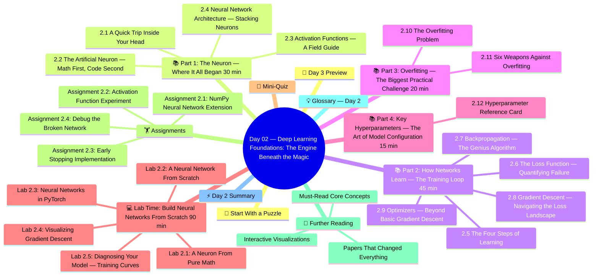

# Day 02 — Deep Learning Foundations: The Engine Beneath the Magic

> **Week 1 | Foundations** | ⏱️ Estimated Time: 4–5 hours | 🔥 Difficulty: Intermediate

---

## 🤔 Start With a Puzzle

Before we open a single code file, let me ask you something strange:

> How did you learn to recognize a cat?

Did someone hand you a rulebook that said: "If it has pointed ears AND whiskers AND four legs AND makes a meowing sound, it is a cat"? Of course not. You saw hundreds of cats — in pictures, in real life, maybe even got scratched by one. You built an internal model through *experience*, not through instructions.

Now here's the other question:

> How do you teach a *computer* to recognize a cat?

For the first 40 years of computer vision, the answer was: write the rulebook. Human engineers spent years manually specifying edges, gradients, colour histograms, and feature descriptors. It was painstaking and it kind of worked — until you hit a cat wearing a Halloween costume, or a cat in unusual lighting, and the whole system collapsed.

Then came Deep Learning. And the answer changed completely.

Instead of writing the rules, you show the model *millions of examples* and let it discover the rules itself. Automatically. Hierarchically. At scales that leave human feature engineers in the dust.

Today you're going to understand *exactly* how this works — starting from a single fake neuron and building up to the full training loop that powers every AI model you'll use in this course.

---

## 🧠 Concept Map




---

## 🎯 Learning Objectives

By the end of today you will:

- [ ] Explain how a biological neuron maps to an artificial neuron (and where the analogy breaks down)
- [ ] Build a neural network from scratch in pure NumPy — no shortcuts
- [ ] Intuitively understand forward propagation, loss calculation, and backpropagation
- [ ] Know which activation function to choose and why
- [ ] Implement gradient descent and watch a model actually learn
- [ ] Understand overfitting and three ways to fix it
- [ ] Build and train a classifier in PyTorch with a real training loop

---

## 📚 Part 1: The Neuron — Where It All Began (30 min)

### 2.1 A Quick Trip Inside Your Head

Consider a single neuron in your brain. It has:
- **Dendrites**: thousands of incoming wire-like connections from other neurons
- **Cell body**: receives all those signals and decides what to do with them
- **Axon**: one outgoing wire that fires to the next neuron... if the signal is strong enough

The "if the signal is strong enough" part is key. Neurons don't fire for every tiny input — they have a *threshold*. Only when the combined incoming signal crosses that threshold does the neuron "fire" (produce an output signal).

And crucially: how strongly one neuron listens to another neuron depends on the **strength of their connection (synapse)**. Learning, in the biological sense, is largely the business of adjusting synapse strengths.

Warren McCulloch and Walter Pitts formalized this idea in 1943 — creating the first mathematical model of a neuron. Frank Rosenblatt turned it into the **Perceptron** in 1958. That's what we're about to build.

---

### 2.2 The Artificial Neuron — Math First, Code Second

An artificial neuron (perceptron) does exactly three things:

```
Step 1: RECEIVE multiple inputs
        x₁ = 0.5  (e.g., pixel brightness)
        x₂ = 0.8  (e.g., another pixel)
        x₃ = 0.2  (e.g., another feature)

Step 2: WEIGHT and SUM them
        z = w₁·x₁ + w₂·x₂ + w₃·x₃ + b
          = (0.3)(0.5) + (0.7)(0.8) + (-0.2)(0.2) + 0.1
          = 0.15 + 0.56 - 0.04 + 0.1
          = 0.77

Step 3: ACTIVATE (apply a non-linear function)
        output = σ(0.77) = 1/(1+e^{-0.77}) ≈ 0.68
```

That's it. A single neuron is just: **weighted sum → activation function → output**.

The weights `w₁, w₂, w₃` and bias `b` are what the model *learns*. They start random. Training adjusts them.

**Why the non-linear activation?** Because without it, stacking multiple layers of neurons is mathematically equivalent to having just one layer. Non-linearity is what gives deep networks their *expressive power* — the ability to approximate any continuous function (Universal Approximation Theorem). Linearity stacks into linearity. Non-linearity stacks into complexity.

---

### 2.3 Activation Functions — A Field Guide

Every neuron needs an activation function. Here's your cheat sheet:

| Activation | Formula | Range | Visual Shape | When to Use |
|---|---|---|---|---|
| **Sigmoid** | `1/(1+e^{-x})` | (0, 1) | S-curve | Binary output only |
| **Tanh** | `(eˣ-e^{-x})/(eˣ+e^{-x})` | (-1, 1) | Centered S-curve | RNNs, older architectures |
| **ReLU** | `max(0, x)` | [0, ∞) | Hockey stick | Default for hidden layers |
| **Leaky ReLU** | `max(0.01x, x)` | (-∞, ∞) | Slight slope below 0 | When neurons "die" (zero gradient) |
| **GELU** | `x · Φ(x)` | (-∞, ∞) | Smooth ReLU | Transformers (BERT, GPT) |
| **SiLU/Swish** | `x · σ(x)` | (-∞, ∞) | Smooth, slightly neg | Modern LLMs (LLaMA, Gemma) |
| **Softmax** | `eˣⁱ / Σeˣʲ` | (0,1), sum=1 | N-way distribution | Multi-class output layer only |

**The ReLU Story:** Before ReLU (introduced ~2011), sigmoid and tanh dominated. They cause the **vanishing gradient problem** — in deep networks (many layers), gradients shrink exponentially as you backpropagate. By layer 10, the gradient is essentially zero, and early layers don't learn. ReLU's gradient is simply 1 (for positive inputs), which doesn't vanish. It was a breakthrough that enabled training deep networks.

**The Modern Move to GELU:** Transformers use GELU because it's smoother than ReLU (no sharp kink at 0), which helps with optimization in very large models.

---

### 2.4 Neural Network Architecture — Stacking Neurons

A single neuron is weak. Stack thousands in layers, and you get something extraordinary.

```
INPUT LAYER         HIDDEN LAYER 1      HIDDEN LAYER 2      OUTPUT LAYER
(raw features)      (learned patterns)  (complex patterns)  (prediction)

   x₁ ──────────────► h₁₁ ─────────────► h₂₁ ─────────────► ŷ₁
   x₂ ─────────────╱  h₁₂ ──────────────╱h₂₂ ──────────────╱ ŷ₂
   x₃ ──────────────► h₁₃ ─────────────► h₂₃ ─────────────►
                       h₁₄
```

**Standard terminology:**

| Term | Meaning |
|---|---|
| **Neuron / Node** | A single processing unit |
| **Layer** | A group of neurons (all at the same "depth") |
| **Input Layer** | Layer 0 — receives raw features |
| **Hidden Layers** | Layers 1..N-1 — learn internal representations |
| **Output Layer** | Final layer — produces predictions |
| **Deep Neural Network** | A network with 2+ hidden layers |
| **Width** | Number of neurons in a layer |
| **Depth** | Number of layers |
| **Parameters** | Total count of weights + biases (these are what's trained) |

**Parameter count formula:**

For a layer with N_in inputs and N_out neurons:
```
Parameters = N_in × N_out (weights) + N_out (biases) = N_out × (N_in + 1)
```

Example: a 3-layer network (input=784, hidden=256, output=10):
```
Layer 1: 784 × 256 + 256 = 200,960 parameters
Layer 2: 256 × 10  + 10  = 2,570 parameters
Total: 203,530 parameters
```

That's 200K numbers to learn. GPT-3 has 175 billion. Same principle, vastly different scale.

---

## 📚 Part 2: How Networks Learn — The Training Loop (45 min)

This is the most important conceptual section of the entire course. Read slowly.

### 2.5 The Four Steps of Learning

Neural network training is a cycle of four steps, repeated thousands of times:

```
┌─────────────────────────────────────────────────────────┐
│                  THE TRAINING LOOP                       │
│                                                          │
│  1. FORWARD PASS                                         │
│     Input → [Network] → Prediction ŷ                    │
│                                                          │
│  2. LOSS CALCULATION                                     │
│     Compare ŷ to true label y → Loss L (a single number)│
│                                                          │
│  3. BACKWARD PASS (Backpropagation)                     │
│     Compute ∂L/∂w for every weight w                    │
│     (How much does each weight contribute to the error?)│
│                                                          │
│  4. WEIGHT UPDATE (Gradient Descent)                    │
│     w ← w - lr × ∂L/∂w                                 │
│     (Nudge each weight to reduce the loss)              │
│                                                          │
│  Repeat until loss is acceptably low.                   │
└─────────────────────────────────────────────────────────┘
```

### 2.6 The Loss Function — Quantifying Failure

A loss function measures *how wrong* our model is. It converts a potentially complex prediction error into a single number we can minimize.

| Task | Loss Function | Formula | Intuition |
|---|---|---|---|
| **Regression** | Mean Squared Error | `L = (1/n)Σ(ŷ - y)²` | Penalizes large errors quadratically |
| **Binary Classification** | Binary Cross-Entropy | `L = -[y·log(ŷ) + (1-y)·log(1-ŷ)]` | Penalizes confident wrong predictions harshly |
| **Multi-Class** | Categorical Cross-Entropy | `L = -Σ yᵢ·log(ŷᵢ)` | Extends BCE to K classes |
| **Language Modeling** | Cross-Entropy (next token) | Same as Cat. CE over vocab | Higher perplexity = worse model |

**Why Cross-Entropy for classification?** Intuition: if the model says P(cat)=0.99 and the true label is "dog", the loss is `-log(0.01) ≈ 4.6` — very high. If P(cat)=0.51, loss is `-log(0.49) ≈ 0.71` — lower. The `-log` function punishes confident wrong answers *more* than uncertain wrong answers. This is the right behavior.

### 2.7 Backpropagation — The Genius Algorithm

Backpropagation is often described as "the most important algorithm in machine learning." Let's understand it intuitively.

**The Core Question:** We have a loss L. We have weights W₁, W₂, ..., Wₙ scattered throughout this deep network. How much does each weight contribute to L? Which weights should we increase? Which should we decrease?

The answer: **chain rule of calculus**.

```
If L depends on W through intermediate variables (activations a₁, a₂...),
then:

∂L/∂W₁ = (∂L/∂a₂) × (∂a₂/∂a₁) × (∂a₁/∂W₁)

This chains backward through the network — hence "backpropagation."
```

**Intuitive analogy:** Think of a factory assembly line. A defective final product comes out. To find the root cause, you trace backward: which final assembly step failed? Which sub-assembly fed that step? Which raw material fed that sub-assembly? You trace the *chain of causality* backward to the source.

Backprop does the same — traces the chain of contribution from each weight to the final loss.

**The computational graph perspective:**

```
Input x → [Linear W₁] → z₁ → [ReLU] → a₁ → [Linear W₂] → z₂ → [Sigmoid] → ŷ → [BCE Loss] → L

Forward:  →→→→→→→→→→→→→→→→→→→→→→→→→→→→→→→→→→→→→→→→→→→→→→→
Backward: ←←←←←←←←←←←←←←←←←←←←←←←←←←←←←←←←←←←←←←←←←←←

∂L/∂W₂ = (∂L/∂ŷ) × (∂ŷ/∂z₂)   [gradient of output layer]
∂L/∂W₁ = (∂L/∂a₁) × (∂a₁/∂z₁) × (∂z₁/∂W₁)  [chains further back]
```

Every deep learning framework (PyTorch, TensorFlow, JAX) implements automatic differentiation — they build this computational graph automatically and backpropagate gradients for you. When you call `loss.backward()` in PyTorch, this is what happens.

### 2.8 Gradient Descent — Navigating the Loss Landscape

Once we have gradients (∂L/∂W for every W), we use them to update weights:

```
W_new = W_old - learning_rate × ∂L/∂W
```

**Visual intuition:** Imagine you're blindfolded on a hilly landscape and want to reach the lowest point (minimum loss). You feel the slope under your feet (the gradient) and take a step downhill. The step size is the **learning rate**.

```
Too large learning rate:  ↓↑↓↑ (bouncing over the minimum, never converging)
Too small learning rate:  ↓↓↓↓↓ (takes forever, may get stuck in bad local minima)
Just right:               ↓↓↓✓ (converges steadily to a good minimum)
```

**The three flavors:**

| Variant | Update Frequency | Pro | Con |
|---|---|---|---|
| **Batch GD** | Once per full dataset | Stable gradients | Extremely slow for large datasets |
| **Stochastic GD (SGD)** | Once per single example | Fast updates | Very noisy |
| **Mini-Batch GD** | Once per batch (16-256 samples) | Best of both | Standard in practice |

### 2.9 Optimizers — Beyond Basic Gradient Descent

Modern training uses sophisticated optimizers that adapt the learning rate per-parameter:

**Momentum:** Accumulates a velocity vector (exponential moving average of gradients). Like a ball rolling downhill — it keeps moving in the prevailing direction even if individual gradients are noisy.

```
v = β₁·v_prev + (1-β₁)·gradient
W = W - lr × v
```

**Adam (Adaptive Moment Estimation):** The default for most models. Combines momentum with per-parameter adaptive learning rates.

```python
# Adam update (simplified)
m = β₁·m + (1-β₁)·g         # First moment (momentum)
v = β₂·v + (1-β₂)·g²        # Second moment (variance)
m̂ = m/(1-β₁ᵗ)              # Bias correction
v̂ = v/(1-β₂ᵗ)
W = W - lr × m̂/(√v̂ + ε)    # Update
```

**AdamW:** Adam + L2 weight decay applied correctly. Standard for training transformers and LLMs.

**Why Adam over SGD?** Adam adapts learning rates per-parameter. Sparse features (appear rarely) get larger updates; frequent features get more careful updates. For NLP and attention models, this matters enormously.

---

## 📚 Part 3: Overfitting — The Biggest Practical Challenge (20 min)

### 2.10 The Overfitting Problem

```
Perfect training performance: Loss → 0  ✓
Terrible test performance:    Loss → ∞  ✗

This gap = OVERFITTING
```

**What's happening:** The model memorized the training data instead of learning generalizable patterns. Like a student who memorized the exact practice exam questions but can't solve a slightly different version.

Think of it visually:

```
Data pattern:  y = x² + noise

Underfitting:  y = a  (flat line — too simple, misses the curve)
Good fit:      y = ax² + bx + c  (captures the trend)
Overfitting:   y = a₀ + a₁x + a₂x² + ... + a₁₅x¹⁵  (perfectly fits every noise point)
```

Deep networks have billions of parameters. They CAN memorize any training set. We need explicit mechanisms to prevent this.

### 2.11 Six Weapons Against Overfitting

**1. More Data**
The best cure. More diverse training examples → harder to memorize → better generalization. Collect more data whenever possible.

**2. Dropout**
During training, randomly set some neurons' outputs to zero (with probability p). This prevents any single neuron from becoming "load-bearing" — the network must learn redundant representations.

```python
# During training
x = torch.randn(4, 256)
dropout = nn.Dropout(p=0.5)  # 50% of neurons zeroed randomly
x_dropped = dropout(x)       # Different neurons zeroed each forward pass

# During inference: dropout is automatically disabled
model.eval()
x_no_drop = dropout(x)  # All neurons active but outputs scaled by (1-p)
```

**3. L1 / L2 Regularization (Weight Decay)**
Add a penalty for large weights to the loss:
```
L_total = L_original + λ × Σ|wᵢ|     (L1 — promotes sparsity)
L_total = L_original + λ × Σwᵢ²      (L2 — shrinks all weights)
```
This discourages the model from relying too heavily on any single feature.

**4. Batch Normalization**
Normalize activations within each mini-batch. Reduces internal covariate shift, enables higher learning rates, acts as mild regularizer.

```
BatchNorm(x) = γ × (x - μ_batch) / σ_batch + β
```

**5. Early Stopping**
Monitor validation loss during training. Stop when validation loss starts increasing while training loss keeps decreasing — the model is beginning to overfit.

```
Epoch 10: train_loss=0.3, val_loss=0.32  ✓
Epoch 20: train_loss=0.2, val_loss=0.31  ✓
Epoch 30: train_loss=0.1, val_loss=0.35  ← overfitting starts here!
Epoch 40: train_loss=0.05, val_loss=0.45  ✗ — stop here
```

**6. Data Augmentation**
Create additional training examples by transforming existing ones:
- Images: flip, rotate, crop, adjust brightness, add noise
- Text: synonym replacement, back-translation, paraphrasing

---

## 📚 Part 4: Key Hyperparameters — The Art of Model Configuration (15 min)

### 2.12 Hyperparameter Reference Card

| Hyperparameter | What It Controls | Typical Values | Rule of Thumb |
|---|---|---|---|
| **Learning Rate** | Step size in gradient descent | 1e-5 to 1e-2 | Start with 3e-4, use LR scheduler |
| **Batch Size** | Samples per gradient update | 16 to 2048 | Larger = more stable but needs more memory |
| **Epochs** | Full passes over dataset | 5 to 300 | Use early stopping instead of fixed epochs |
| **Hidden Size** | Neurons per layer | 64 to 4096 | More = more capacity; watch for overfitting |
| **Num Layers** | Network depth | 2 to 100+ | Deeper = more complex patterns |
| **Dropout Rate** | Fraction of neurons to zero | 0.1 to 0.5 | 0.1–0.2 for small models, 0.3–0.5 for large |
| **Weight Decay** | L2 regularization strength | 0.0 to 0.1 | Typical: 0.01 for AdamW |

**Learning Rate Schedulers:**

```python
# Warm-up + cosine decay (standard for transformers)
scheduler = torch.optim.lr_scheduler.CosineAnnealingLR(optimizer, T_max=100)

# Step decay (simpler)
scheduler = torch.optim.lr_scheduler.StepLR(optimizer, step_size=30, gamma=0.1)

# One-cycle (fast.ai approach — often best)
scheduler = torch.optim.lr_scheduler.OneCycleLR(optimizer, max_lr=0.01, total_steps=1000)
```

---

## 💻 Lab Time: Build Neural Networks From Scratch (90 min)

### Lab 2.1: A Neuron From Pure Math

```python
# lab_02_01_single_neuron.py
"""
Build a single artificial neuron from pure Python + NumPy.
No PyTorch, no shortcuts. This is where understanding begins.
"""
import numpy as np

print("=" * 60)
print("Lab 2.1: Building a Single Neuron From Scratch")
print("=" * 60)

# ---- Activation Functions ----
def sigmoid(z):
    """σ(z) = 1 / (1 + e^{-z}) — output in (0,1)"""
    return 1 / (1 + np.exp(-np.clip(z, -500, 500)))  # clip for numerical stability

def sigmoid_derivative(a):
    """d(σ)/dz = σ(z)(1 - σ(z)) = a(1-a) — given already-activated output"""
    return a * (1 - a)

def relu(z):
    return np.maximum(0, z)

def relu_derivative(z):
    return (z > 0).astype(float)

def tanh(z):
    return np.tanh(z)

def gelu(z):
    """Gaussian Error Linear Unit — used in BERT, GPT"""
    import scipy.special
    return z * 0.5 * (1 + scipy.special.erf(z / np.sqrt(2)))

# Demo each activation
print("\n📊 Activation Function Outputs:")
z_values = np.array([-3, -1, 0, 1, 3])
print(f"{'z':>6}  {'Sigmoid':>10}  {'ReLU':>8}  {'Tanh':>8}")
print("-" * 40)
for z in z_values:
    print(f"{z:>6.1f}  {sigmoid(z):>10.4f}  {relu(z):>8.4f}  {tanh(z):>8.4f}")

# ---- Single Neuron ----
print("\n\n🧠 A Single Neuron in Action:")

class Neuron:
    """A single artificial neuron."""
    def __init__(self, n_inputs, activation='sigmoid'):
        # Initialize weights with small random values (Xavier-inspired)
        self.weights = np.random.randn(n_inputs) * np.sqrt(2.0 / n_inputs)
        self.bias = 0.0
        self.activation_name = activation
    
    def activate(self, z):
        if self.activation_name == 'sigmoid':
            return sigmoid(z)
        elif self.activation_name == 'relu':
            return relu(z)
        elif self.activation_name == 'tanh':
            return tanh(z)
    
    def forward(self, x):
        """Weighted sum → activation."""
        self.last_input = x
        self.last_z = np.dot(x, self.weights) + self.bias
        self.last_output = self.activate(self.last_z)
        return self.last_output
    
    def backward(self, d_output, learning_rate=0.1):
        """Update weights via gradient descent."""
        # Chain rule: dL/dz = dL/da × da/dz
        d_z = d_output * sigmoid_derivative(self.last_output)
        
        # Gradients for weights and bias
        d_weights = self.last_input * d_z
        d_bias = d_z
        
        # Update parameters (gradient descent)
        self.weights -= learning_rate * d_weights
        self.bias -= learning_rate * d_bias
        
        return d_z * self.weights  # pass gradient upstream

# Tiny example: neuron that learns to detect "majority 1s"
neuron = Neuron(n_inputs=3, activation='sigmoid')

# Training data: [inputs], target
X_train = np.array([[1,1,0], [1,0,1], [0,1,1], [1,1,1],
                     [0,0,1], [0,1,0], [1,0,0], [0,0,0]])
y_train = np.array([1, 1, 1, 1, 0, 0, 0, 0])  # majority 1s?

print("Initial weights:", np.round(neuron.weights, 4))
print("Initial bias:   ", round(neuron.bias, 4))

# Train for 200 epochs
losses = []
for epoch in range(500):
    epoch_loss = 0
    for x, y in zip(X_train, y_train):
        pred = neuron.forward(x)
        loss = (pred - y) ** 2
        epoch_loss += loss
        grad = 2 * (pred - y)   # ∂MSE/∂pred
        neuron.backward(grad, learning_rate=0.1)
    
    losses.append(epoch_loss / len(X_train))
    if epoch % 100 == 0:
        print(f"Epoch {epoch:3d}: Loss = {epoch_loss/len(X_train):.4f}")

print("\nFinal weights:", np.round(neuron.weights, 4))
print("Final bias:   ", round(neuron.bias, 4))
print("\nPredictions on training data:")
for x, y in zip(X_train, y_train):
    pred = neuron.forward(x)
    correct = "✓" if (pred > 0.5) == y else "✗"
    print(f"  Input {x} | Target: {y} | Predicted: {pred:.3f} ({correct})")
```

---

### Lab 2.2: A Neural Network From Scratch

```python
# lab_02_02_neural_network_numpy.py
"""
Full 2-layer neural network in pure NumPy.
We'll train it on the classic XOR problem — a problem that 
single neurons CANNOT solve (it's not linearly separable).
This is why we need multiple layers!
"""
import numpy as np
import matplotlib.pyplot as plt

print("=" * 60)
print("Lab 2.2: Neural Network From Scratch — XOR Problem")
print("=" * 60)

# The XOR problem:
# 0 XOR 0 = 0 | 1 XOR 0 = 1
# 0 XOR 1 = 1 | 1 XOR 1 = 0
# (A single neuron cannot draw a line to separate these classes.)

X = np.array([[0,0], [0,1], [1,0], [1,1]], dtype=float)
y = np.array([[0], [1], [1], [0]], dtype=float)

print("XOR truth table:")
print("Input  | Output")
for xi, yi in zip(X, y):
    print(f"  {xi}  →  {yi[0]}")

class NeuralNet:
    """
    A 2-layer neural network:
    Input(2) → Hidden(8, ReLU) → Output(1, Sigmoid)
    """
    
    def __init__(self, input_size, hidden_size, output_size, lr=0.1):
        self.lr = lr
        
        # Xavier initialization — prevents vanishing/exploding activations
        scale1 = np.sqrt(2.0 / input_size)
        scale2 = np.sqrt(2.0 / hidden_size)
        
        self.W1 = np.random.randn(input_size, hidden_size) * scale1   # [2, 8]
        self.b1 = np.zeros((1, hidden_size))                           # [1, 8]
        self.W2 = np.random.randn(hidden_size, output_size) * scale2  # [8, 1]
        self.b2 = np.zeros((1, output_size))                           # [1, 1]
        
        print(f"\nNetwork parameters:")
        print(f"  W1: {self.W1.shape} = {self.W1.size} weights")
        print(f"  b1: {self.b1.shape} = {self.b1.size} biases")
        print(f"  W2: {self.W2.shape} = {self.W2.size} weights")
        print(f"  b2: {self.b2.shape} = {self.b2.size} biases")
        print(f"  Total: {self.W1.size + self.b1.size + self.W2.size + self.b2.size} parameters")
    
    def relu(self, z):
        return np.maximum(0, z)
    
    def relu_backward(self, z):
        return (z > 0).astype(float)
    
    def sigmoid(self, z):
        return 1 / (1 + np.exp(-np.clip(z, -500, 500)))
    
    def forward(self, X):
        """Forward pass: compute predictions."""
        # Layer 1: Linear + ReLU
        self.z1 = X @ self.W1 + self.b1      # [batch, 8]
        self.a1 = self.relu(self.z1)           # [batch, 8]
        
        # Layer 2: Linear + Sigmoid
        self.z2 = self.a1 @ self.W2 + self.b2  # [batch, 1]
        self.a2 = self.sigmoid(self.z2)         # [batch, 1]
        
        return self.a2
    
    def loss(self, y_pred, y_true):
        """Binary cross-entropy loss."""
        eps = 1e-8  # prevent log(0)
        return -np.mean(y_true * np.log(y_pred + eps) + (1-y_true) * np.log(1-y_pred + eps))
    
    def backward(self, X, y_true):
        """Backpropagation — compute gradients for all parameters."""
        m = X.shape[0]
        
        # ---- Output Layer Backward ----
        # d(BCE)/d(a2) × d(sigmoid)/d(z2)
        dz2 = self.a2 - y_true                  # [batch, 1]
        dW2 = (self.a1.T @ dz2) / m             # [8, 1]
        db2 = np.sum(dz2, axis=0, keepdims=True) / m  # [1, 1]
        
        # ---- Hidden Layer Backward ----
        da1 = dz2 @ self.W2.T                  # [batch, 8]
        dz1 = da1 * self.relu_backward(self.z1) # [batch, 8] — chain rule through ReLU
        dW1 = (X.T @ dz1) / m                  # [2, 8]
        db1 = np.sum(dz1, axis=0, keepdims=True) / m  # [1, 8]
        
        # ---- Update Parameters ----
        self.W2 -= self.lr * dW2
        self.b2 -= self.lr * db2
        self.W1 -= self.lr * dW1
        self.b1 -= self.lr * db1
    
    def train(self, X, y, epochs=5000):
        losses = []
        for epoch in range(epochs):
            y_pred = self.forward(X)
            l = self.loss(y_pred, y)
            losses.append(l)
            self.backward(X, y)
            if epoch % 1000 == 0:
                acc = np.mean((y_pred > 0.5) == y) * 100
                print(f"Epoch {epoch:5d}: Loss = {l:.4f} | Accuracy = {acc:.0f}%")
        return losses

# Create and train
np.random.seed(42)
net = NeuralNet(input_size=2, hidden_size=8, output_size=1, lr=0.5)

print("\n🏃 Training...")
losses = net.train(X, y, epochs=5000)

print("\n✅ Final Predictions:")
predictions = net.forward(X)
for i, (xi, yi) in enumerate(zip(X, y)):
    pred = predictions[i, 0]
    label = 1 if pred > 0.5 else 0
    correct = "✓" if label == yi[0] else "✗"
    print(f"  {xi} → {pred:.4f} → {label} (True: {int(yi[0])}) {correct}")

# Visualize decision boundary
print("\n📈 Loss curve: started high, decreased to near-zero — network learned!")
print(f"   Initial loss: {losses[0]:.4f}")
print(f"   Final loss:   {losses[-1]:.4f}")
print(f"   Reduction:    {(1 - losses[-1]/losses[0])*100:.1f}%")
```

---

### Lab 2.3: Neural Networks in PyTorch

```python
# lab_02_03_pytorch_neural_network.py
"""
Now we use PyTorch — the framework behind most production AI systems.
PyTorch handles forward pass, autograd, and optimizers automatically.
We build a classifier for synthetic data.
"""
import torch
import torch.nn as nn
import torch.optim as optim
from torch.utils.data import DataLoader, TensorDataset, random_split
import numpy as np

print("=" * 60)
print("Lab 2.3: Neural Networks in PyTorch")
print("=" * 60)
print(f"PyTorch version: {torch.__version__}")
device = torch.device("cuda" if torch.cuda.is_available() else "cpu")
print(f"Device: {device}")

torch.manual_seed(42)

# ---- Create Synthetic Dataset ----
n_samples = 2000
n_features = 20

# Linearly separable but with noise — a realistic classification scenario
X = torch.randn(n_samples, n_features)
# Target: 1 if first 5 features sum > 0, else 0
y_raw = (X[:, :5].sum(dim=1) > 0).float()
# Add 20% noise
noise_mask = torch.rand(n_samples) < 0.2
y = torch.where(noise_mask, 1 - y_raw, y_raw).unsqueeze(1)

print(f"\nDataset: {n_samples} samples × {n_features} features")
print(f"Class balance: {y.mean():.2%} positive")

# ---- Train/Val Split ----
dataset = TensorDataset(X, y)
train_size = int(0.8 * len(dataset))
val_size = len(dataset) - train_size
train_dataset, val_dataset = random_split(dataset, [train_size, val_size])

train_loader = DataLoader(train_dataset, batch_size=64, shuffle=True)
val_loader = DataLoader(val_dataset, batch_size=64)

print(f"Train: {train_size} | Val: {val_size}")

# ---- Define Model ----
class BinaryClassifier(nn.Module):
    """
    A flexible MLP for binary classification.
    Demonstrates BatchNorm and Dropout as regularizers.
    """
    def __init__(self, input_size, hidden_sizes, dropout_rate=0.3):
        super().__init__()
        
        layers = []
        prev_size = input_size
        
        for i, hidden_size in enumerate(hidden_sizes):
            layers.append(nn.Linear(prev_size, hidden_size))
            layers.append(nn.BatchNorm1d(hidden_size))
            layers.append(nn.GELU())  # Modern activation
            layers.append(nn.Dropout(dropout_rate))
            prev_size = hidden_size
        
        layers.append(nn.Linear(prev_size, 1))
        layers.append(nn.Sigmoid())
        
        self.network = nn.Sequential(*layers)
        
        # Parameter count
        total_params = sum(p.numel() for p in self.parameters())
        trainable = sum(p.numel() for p in self.parameters() if p.requires_grad)
        print(f"\nModel Architecture: {input_size} → {hidden_sizes} → 1")
        print(f"Total parameters:    {total_params:,}")
        print(f"Trainable:           {trainable:,}")
    
    def forward(self, x):
        return self.network(x)

model = BinaryClassifier(
    input_size=n_features,
    hidden_sizes=[128, 64, 32],
    dropout_rate=0.3
).to(device)

# ---- Training Setup ----
criterion = nn.BCELoss()
optimizer = optim.AdamW(model.parameters(), lr=1e-3, weight_decay=0.01)
scheduler = optim.lr_scheduler.CosineAnnealingLR(optimizer, T_max=50)

# ---- Training Loop ----
print("\n🏃 Training for 50 epochs...")
print(f"{'Epoch':<7} {'Train Loss':<13} {'Val Loss':<13} {'Val Acc':<10} {'LR'}")
print("-" * 55)

best_val_loss = float('inf')
patience = 10
no_improve = 0

history = {'train_loss': [], 'val_loss': [], 'val_acc': []}

for epoch in range(1, 51):
    # --- Training Phase ---
    model.train()
    train_loss = 0.0
    for X_batch, y_batch in train_loader:
        X_batch, y_batch = X_batch.to(device), y_batch.to(device)
        
        optimizer.zero_grad()
        preds = model(X_batch)
        loss = criterion(preds, y_batch)
        loss.backward()
        
        # Gradient clipping — prevents exploding gradients
        torch.nn.utils.clip_grad_norm_(model.parameters(), max_norm=1.0)
        
        optimizer.step()
        train_loss += loss.item()
    
    train_loss /= len(train_loader)
    
    # --- Validation Phase ---
    model.eval()
    val_loss = 0.0
    correct = 0
    total = 0
    
    with torch.no_grad():
        for X_batch, y_batch in val_loader:
            X_batch, y_batch = X_batch.to(device), y_batch.to(device)
            preds = model(X_batch)
            val_loss += criterion(preds, y_batch).item()
            predicted = (preds > 0.5).float()
            correct += (predicted == y_batch).sum().item()
            total += y_batch.size(0)
    
    val_loss /= len(val_loader)
    val_acc = correct / total
    current_lr = optimizer.param_groups[0]['lr']
    
    history['train_loss'].append(train_loss)
    history['val_loss'].append(val_loss)
    history['val_acc'].append(val_acc)
    
    # Early stopping
    if val_loss < best_val_loss:
        best_val_loss = val_loss
        no_improve = 0
        torch.save(model.state_dict(), 'best_model.pt')  # Save best model
    else:
        no_improve += 1
    
    scheduler.step()
    
    if epoch % 5 == 0 or epoch <= 3:
        print(f"{epoch:<7} {train_loss:<13.4f} {val_loss:<13.4f} {val_acc:<10.2%} {current_lr:.2e}")
    
    if no_improve >= patience:
        print(f"\n⏹ Early stopping at epoch {epoch} (no improvement for {patience} epochs)")
        break

print(f"\n✅ Training complete!")
print(f"   Best validation loss: {best_val_loss:.4f}")
print(f"   Best validation accuracy: {max(history['val_acc']):.2%}")

# Load best model and evaluate
model.load_state_dict(torch.load('best_model.pt', map_location=device))
model.eval()

print(f"\nLoss curve summary:")
print(f"   First epoch  train/val: {history['train_loss'][0]:.4f} / {history['val_loss'][0]:.4f}")
print(f"   Final epoch  train/val: {history['train_loss'][-1]:.4f} / {history['val_loss'][-1]:.4f}")
gap = history['train_loss'][-1] - history['val_loss'][-1]
print(f"   Train-Val gap: {abs(gap):.4f}")
if abs(gap) > 0.05:
    print("   ⚠️  Significant gap — may need stronger regularization")
else:
    print("   ✓  Small gap — model is generalizing well")
```

---

### Lab 2.4: Visualizing Gradient Descent

```python
# lab_02_04_gradient_descent_viz.py
"""
Watch gradient descent in action on a simple 2D loss landscape.
This visualization is worth a thousand equations.
"""
import numpy as np
import matplotlib.pyplot as plt
from mpl_toolkits.mplot3d import Axes3D

print("=" * 60)
print("Lab 2.4: Gradient Descent Visualization")
print("=" * 60)

# ---- Simple loss function to minimize ----
# f(w1, w2) = w1² + 2·w2² + 2·w1·w2 - 3·w1
# Global minimum at approximately w1=2, w2=-1

def loss_fn(w1, w2):
    return w1**2 + 2*w2**2 + 2*w1*w2 - 3*w1

def grad_fn(w1, w2):
    """Analytical gradient of loss_fn."""
    dw1 = 2*w1 + 2*w2 - 3
    dw2 = 4*w2 + 2*w1
    return np.array([dw1, dw2])

# ---- Compare Three Optimizers ----
def run_optimizer(name, w_init, lr, n_steps=50, momentum=0.9):
    """Run gradient descent and track the path."""
    w = np.array(w_init, dtype=float)
    path = [w.copy()]
    losses = [loss_fn(*w)]
    
    v = np.zeros(2)  # velocity for momentum
    
    for step in range(n_steps):
        g = grad_fn(*w)
        
        if name == "SGD":
            w -= lr * g
        elif name == "SGD+Momentum":
            v = momentum * v + lr * g
            w -= v
        elif name == "Adam":
            # Simplified Adam
            beta1, beta2, eps = 0.9, 0.999, 1e-8
            if step == 0:
                m, vv = np.zeros(2), np.zeros(2)
            m = beta1 * m + (1 - beta1) * g
            vv = beta2 * vv + (1 - beta2) * g**2
            m_hat = m / (1 - beta1**(step+1))
            v_hat = vv / (1 - beta2**(step+1))
            w -= lr * m_hat / (np.sqrt(v_hat) + eps)
        
        path.append(w.copy())
        losses.append(loss_fn(*w))
    
    return np.array(path), losses

configs = [
    ("SGD",           [3.0, 2.0], 0.1),
    ("SGD+Momentum",  [3.0, 2.0], 0.1),
    ("Adam",          [3.0, 2.0], 0.3),
]

# Create visualizations
fig, axes = plt.subplots(1, 2, figsize=(14, 6))

# Contour plot of loss landscape
w1_range = np.linspace(-1, 4, 100)
w2_range = np.linspace(-3, 3, 100)
W1, W2 = np.meshgrid(w1_range, w2_range)
Z = loss_fn(W1, W2)

colors = ['#e74c3c', '#3498db', '#2ecc71']

ax1 = axes[0]
contour = ax1.contourf(W1, W2, Z, levels=30, cmap='viridis', alpha=0.8)
plt.colorbar(contour, ax=ax1)

for i, (name, w_init, lr) in enumerate(configs):
    path, _ = run_optimizer(name, w_init, lr)
    ax1.plot(path[:,0], path[:,1], 'o-', color=colors[i], label=name, 
             markersize=3, linewidth=1.5)
    ax1.plot(path[0,0], path[0,1], 's', color=colors[i], markersize=8)  # Start
    ax1.plot(path[-1,0], path[-1,1], '*', color=colors[i], markersize=12)  # End

ax1.plot(2, -1, 'w*', markersize=15, label='Global Min')
ax1.set_xlabel('w₁')
ax1.set_ylabel('w₂')
ax1.set_title('Optimization Paths on Loss Landscape')
ax1.legend()

# Loss curves
ax2 = axes[1]
for i, (name, w_init, lr) in enumerate(configs):
    _, losses = run_optimizer(name, w_init, lr)
    ax2.plot(losses, color=colors[i], label=name, linewidth=2)

ax2.set_xlabel('Step')
ax2.set_ylabel('Loss')
ax2.set_title('Loss vs. Training Step')
ax2.legend()
ax2.set_yscale('log')
ax2.grid(True, alpha=0.3)

plt.tight_layout()
plt.savefig('gradient_descent_viz.png', dpi=150, bbox_inches='tight')
plt.show()

print("\n✅ Visualization saved! Observe:")
print("   1. SGD moves straight downhill — slow, noisy")
print("   2. SGD+Momentum oscillates but accelerates through valleys")
print("   3. Adam converges fastest with adaptive step sizes")
print("   4. All three reach near the same minimum")

# Print final values
print("\nFinal losses after 50 steps:")
for name, w_init, lr in configs:
    path, losses = run_optimizer(name, w_init, lr)
    print(f"  {name:<20}: {losses[-1]:.6f} (final w={path[-1].round(3)})")
```

---

### Lab 2.5: Diagnosing Your Model — Training Curves

```python
# lab_02_05_model_diagnostics.py
"""
Learn to read training curves and diagnose training problems.
A data scientist who can't read a loss curve is flying blind.
"""
import numpy as np
import matplotlib.pyplot as plt

print("=" * 60)
print("Lab 2.5: Model Diagnostics via Training Curves")
print("=" * 60)

np.random.seed(42)
epochs = np.arange(100)

def generate_curves(scenario):
    """Generate synthetic training curves for different scenarios."""
    if scenario == "good_fit":
        train = 0.8 * np.exp(-0.06*epochs) + 0.1 + np.random.randn(100)*0.01
        val   = 0.85 * np.exp(-0.055*epochs) + 0.12 + np.random.randn(100)*0.02
    
    elif scenario == "overfitting":
        train = 0.7 * np.exp(-0.08*epochs) + 0.05 + np.random.randn(100)*0.01
        val   = 0.7 * np.exp(-0.04*epochs) + 0.15 + 0.003*epochs + np.random.randn(100)*0.02
    
    elif scenario == "underfitting":
        train = 0.3 * np.exp(-0.02*epochs) + 0.55 + np.random.randn(100)*0.01
        val   = 0.33 * np.exp(-0.015*epochs) + 0.60 + np.random.randn(100)*0.02
    
    elif scenario == "lr_too_high":
        train = np.abs(np.sin(0.3*epochs)) * 0.4 + 0.4 + np.random.randn(100)*0.05
        val   = np.abs(np.sin(0.3*epochs)) * 0.45 + 0.45 + np.random.randn(100)*0.05
    
    return np.clip(train, 0.01, 1.5), np.clip(val, 0.01, 1.5)

scenarios = {
    "Good Fit": "good_fit",
    "Overfitting": "overfitting",
    "Underfitting": "underfitting",
    "LR Too High": "lr_too_high",
}

fig, axes = plt.subplots(2, 2, figsize=(14, 10))
fig.suptitle("Training Curve Patterns — Learn to Read These!", fontsize=14)

diagnoses = {
    "Good Fit": "Both curves decrease and converge.\nVal loss slightly above train — normal.\n✅ Keep training or stop here.",
    "Overfitting": "Train loss keeps dropping, val loss rises.\nGap grows over time.\n🔧 Fix: add dropout, weight decay, more data.",
    "Underfitting": "Both losses remain high. Model too simple.\n🔧 Fix: increase model size,\n   more epochs, tune learning rate.",
    "LR Too High": "Both losses oscillate wildly.\n🔧 Fix: reduce learning rate by 10×.",
}

for ax, (scenario_name, scenario_key) in zip(axes.flatten(), scenarios.items()):
    train_losses, val_losses = generate_curves(scenario_key)
    ax.plot(epochs, train_losses, label='Train Loss', color='#3498db', linewidth=2)
    ax.plot(epochs, val_losses, label='Val Loss', color='#e74c3c', linewidth=2)
    ax.set_title(f"Scenario: {scenario_name}", fontsize=12, fontweight='bold')
    ax.set_xlabel('Epoch')
    ax.set_ylabel('Loss')
    ax.legend()
    ax.grid(True, alpha=0.3)
    ax.text(0.98, 0.97, diagnoses[scenario_name], transform=ax.transAxes,
            fontsize=8, verticalalignment='top', horizontalalignment='right',
            bbox=dict(boxstyle='round', facecolor='lightyellow', alpha=0.8))

plt.tight_layout()
plt.savefig('training_curves.png', dpi=150)
plt.show()

print("\n📊 Four Patterns Every ML Engineer Must Recognize:")
for name, diag in diagnoses.items():
    print(f"\n  {name}:")
    for line in diag.split('\n'):
        print(f"    {line}")
```

---

## 🎯 Mini-Quiz

**Quick-fire knowledge check (answers at end of next day):**

1. What property of a sigmoid function causes the vanishing gradient problem in deep networks?

2. You train a model with 100% training accuracy but 60% test accuracy. Name this problem and give TWO fixes.

3. In gradient descent: `w = w - lr × ∂L/∂w`. If the gradient is positive, does the weight increase or decrease? Why does this make sense?

4. Why can a single neuron NOT solve the XOR problem, but a 2-layer network can?

5. What is the difference between `model.train()` and `model.eval()` in PyTorch? Why does it matter?

6. You add dropout with p=0.3 to a 100-neuron layer. On average, how many neurons are active during each forward pass during training?

7. You have: train_loss=0.10, val_loss=0.11. Is this overfitting? What if it were val_loss=0.45?

8. Why is mini-batch gradient descent preferred over pure stochastic (single-sample) GD?

9. Batch Normalization normalizes over which dimension — samples or features? Why does this difference matter?

10. You're training with Adam (lr=1e-3) and validation loss stops improving after epoch 20. List 3 things you could try next.

---

## 🏋️ Assignments

### Assignment 2.1: NumPy Neural Network Extension
Extend `lab_02_02_neural_network_numpy.py`:
1. Add L2 regularization to the loss and gradients
2. Experiment with hidden sizes: [4, 8, 16, 32] — what's the smallest that solves XOR?
3. Try different learning rates: [0.01, 0.1, 0.5, 2.0]
4. Plot loss curves side-by-side for different configs
5. Write: why does LR=2.0 likely fail?

### Assignment 2.2: Activation Function Experiment
In `lab_02_03_pytorch_neural_network.py`:
1. Replace `nn.GELU()` with each of: ReLU, Sigmoid, Tanh, Leaky ReLU
2. Train for 30 epochs and compare final val accuracy
3. Which activation converges fastest? Which has the highest final accuracy?
4. Explain in 150 words *why* the winner wins (use the vanishing gradient argument if applicable)

### Assignment 2.3: Early Stopping Implementation
Implement early stopping from scratch (without relying on PyTorch Lightning or Keras):
1. Track val_loss at each epoch
2. Save model checkpoint whenever val_loss improves
3. Stop training after `patience=10` epochs of no improvement
4. Load best checkpoint after stopping
5. Compare: final model vs best-checkpoint model performance

### Assignment 2.4: Debug the Broken Network
I've deliberately introduced bugs into this network. Find and fix all 3:
```python
class BrokenNet(nn.Module):
    def __init__(self):
        super().__init__()
        self.fc1 = nn.Linear(10, 64)
        self.fc2 = nn.Linear(64, 32)
        self.fc3 = nn.Linear(32, 1)
    
    def forward(self, x):
        x = self.fc1(x)           # Bug 1: no activation
        x = torch.relu(self.fc2(x))
        x = torch.sigmoid(self.fc3(x))
        return x

model = BrokenNet()
optimizer = optim.Adam(model.parameters(), lr=1e-3)
criterion = nn.MSELoss()           # Bug 2: wrong loss for binary classification

for epoch in range(10):
    for x_batch, y_batch in loader:
        preds = model(x_batch)     
        loss = criterion(preds, y_batch)
        loss.backward()
        optimizer.step()           # Bug 3: missing optimizer.zero_grad()
```

---

## 📖 Further Reading

### Must-Read (Core Concepts)
- [Neural Networks and Deep Learning — Michael Nielsen](http://neuralnetworksanddeeplearning.com/) — Chapters 1 and 2
- [CS231n: Neural Networks Part 1 (Stanford)](http://cs231n.stanford.edu/index.html)
- [The Backpropagation Algorithm — Andrej Karpathy's blog](https://karpathy.github.io/neuralnets/)

### Papers That Changed Everything
- [Learning Representations by Back-Propagating Errors (Rumelhart, 1986)](https://www.nature.com/articles/323533a0) — Original backprop paper
- [Adam: A Method for Stochastic Optimization (Kingma & Ba, 2015)](https://arxiv.org/abs/1412.6980)
- [Dropout: A Simple Way to Prevent Neural Networks from Overfitting (Srivastava, 2014)](https://www.cs.toronto.edu/~hinton/absps/JMLRdropout.pdf)
- [Batch Normalization (Ioffe & Szegedy, 2015)](https://arxiv.org/abs/1502.03167)

### Interactive Visualizations
- [TensorFlow Playground](https://playground.tensorflow.org/) — Train neural networks in your browser, visualize decision boundaries in real-time
- [3Blue1Brown: Neural Networks series (YouTube)](https://www.3blue1brown.com/topics/neural-networks) — Best visual introduction anywhere

---

## 💡 Glossary — Day 2

| Term | Definition |
|---|---|
| **Perceptron** | The simplest neural network — a single weighted sum + threshold |
| **Activation Function** | Non-linear function applied to neuron output; enables complex representations |
| **ReLU** | Rectified Linear Unit: `max(0,x)` — default for hidden layers |
| **GELU** | Gaussian Error Linear Unit — smooth activation used in Transformers |
| **Forward Pass** | Data flowing input → output through the network |
| **Loss Function** | Measures model error as a single number to minimize |
| **Backpropagation** | Algorithm to compute gradients by applying chain rule backward |
| **Gradient Descent** | Parameter update rule: move opposite to gradient direction |
| **Learning Rate** | Step size for gradient descent updates |
| **Mini-batch** | Subset of training data used for one gradient update |
| **Epoch** | One full pass over the entire training dataset |
| **Optimizer** | Algorithm for updating weights (SGD, Adam, AdamW) |
| **Adam** | Adaptive gradient optimizer combining momentum + per-parameter learning rates |
| **Overfitting** | Model memorizes training data; poor generalization |
| **Dropout** | Training regularizer — randomly zeros neurons during forward pass |
| **Batch Normalization** | Normalizes layer activations within a mini-batch |
| **Early Stopping** | Stop training when validation performance stops improving |
| **Gradient Clipping** | Cap gradient norm to prevent exploding updates |
| **Xavier Initialization** | Weight initialization scaled by layer dimensions |
| **Vanishing Gradient** | Gradients shrink exponentially in deep networks with sigmoid/tanh |

---

## ⚡ Day 2 Summary

```
Before today:                         After today:
"Neural networks are magic"       →   You wrote one from pure NumPy
Backprop was mysterious           →   You implemented it yourself
Loss curves looked like noise     →   You can diagnose 4 common patterns
Never seen PyTorch training loop  →   You have a reusable template
"Overfitting happens sometimes"   →   6 specific solutions in your toolkit
```

Day 2 is genuinely the hardest foundation day — you just absorbed the conceptual machinery that underlies ALL of modern deep learning. The Transformer you'll study on Day 4? It runs on exactly these principles.

---

## 🔗 Day 3 Preview

Tomorrow: **Advanced Network Architectures**.

We'll look at *Convolutional Neural Networks* (why do images need different architectures than tables of numbers?), *Recurrent Neural Networks* (how did we model sequences before Transformers?), and *LSTMs* (what problem do they solve and why do Transformers make them mostly obsolete?).

Understanding the *history* of why things were invented — and why they were replaced — will make Transformers click on Day 4 in a way that "just learning Transformers" never could.

> 💬 *"Tell me and I forget. Teach me and I remember. Involve me and I learn."*  
> — Benjamin Franklin (reinterpreted for deep learning: implement it and you'll never forget backprop)

See you on Day 3. 🚀

---
*Day 2 of 30 | Week 1: Foundations | GenAI Mastery Course*
