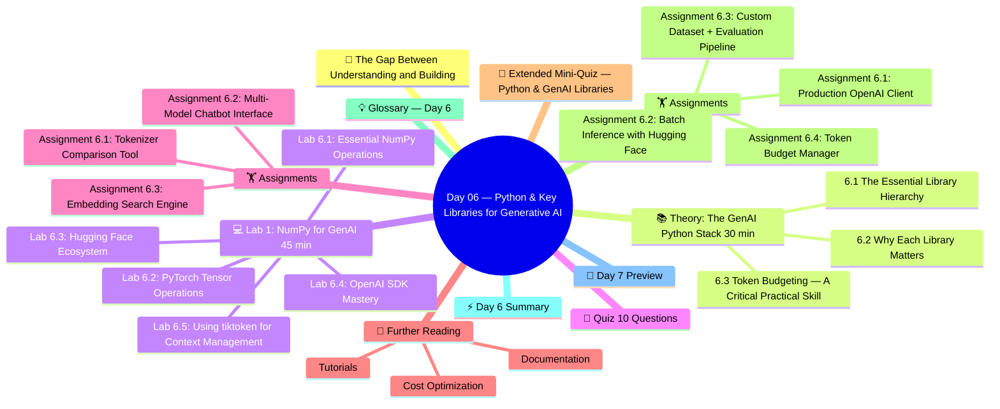

# Day 06 — Python & Key Libraries for Generative AI

> **Week 1 | Foundations** | ⏱️ Estimated Time: 4–5 hours | 🔥 Difficulty: Intermediate-Advanced

---

## 🤔 The Gap Between Understanding and Building

You now understand how attention works. You know what a Transformer is. You can trace a tensor through 48 layers of GPT-3 in your head. Congratulations — that's genuinely impressive.

But here's the humbling truth: *understanding theory and building production systems are very different skills.*

Take a seemingly simple requirement: "Build a chatbot that uses GPT-4o, handles conversation history, retries on API errors, streams tokens to the frontend, counts costs per user, and never exceeds the context window."

Can you implement that right now? If not, today is the day you bridge that gap.

Today is the most **practically immediate** day of Week 1. Every line of code you write here gets used on Days 8, 9, 10 and beyond. The patterns you learn today — the Hugging Face pipeline, the OpenAI SDK streaming pattern, token counting, proper `.env` management — will become muscle memory.

Think of today as equipping your workshop. The transformer theory was reading the manual. Today you pick up the actual tools.

---

## 🧠 Concept Map




---

## 🎯 Learning Objectives

By the end of today you will:

- [ ] Execute NumPy operations critical for understanding GenAI: broadcasting, einsum, matrix operations
- [ ] Use PyTorch tensors fluently: creation, manipulation, GPU transfer, autograd tracking
- [ ] Load any model from Hugging Face Hub with `from_pretrained` and run inference
- [ ] Use `datasets` and `evaluate` libraries for loading benchmarks and scoring outputs
- [ ] Call OpenAI API with full parameter control, streaming, and proper error handling
- [ ] Call Anthropic's Claude API and Google's Gemini API
- [ ] Implement a production-grade async LLM caller with retry logic and rate limiting
- [ ] Count tokens correctly and estimate API costs before making calls

---

## 📚 Theory: The GenAI Python Stack (30 min)

### 6.1 The Essential Library Hierarchy

```
GenAI Application
│
├── Application Layer
│   ├── LangChain / LlamaIndex    ← High-level orchestration
│   └── Streamlit / FastAPI       ← Web / API interfaces
│
├── Model Integration Layer
│   ├── openai / anthropic / google.generativeai ← Provider SDKs
│   └── huggingface_hub / transformers           ← Model access
│
├── ML/Tensor Layer
│   ├── PyTorch                   ← Tensor ops, model building
│   └── Hugging Face Transformers ← Pretrained models
│
└── Foundation Layer
    ├── NumPy                     ← Array operations
    └── Python standard library   ← Core language
```

---

### 6.2 Why Each Library Matters

| Library | Purpose | When You'll Use It |
|---|---|---|
| `numpy` | Array math, reshaping | Data prep, embedding math |
| `torch` | Tensor ops, model forward pass | Building/fine-tuning models |
| `transformers` | Load pretrained models, tokenizers | Using BERT, GPT-2, T5, LLaMA |
| `datasets` | Load NLP benchmarks, custom data | Training data pipelines |
| `openai` | GPT-4, DALL-E, Whisper APIs | LLM apps, production |
| `anthropic` | Claude API | Production alternatives |
| `langchain` | Chain LLM calls, memory, tools | Complex LLM applications |
| `chromadb` | Local vector database | RAG applications |
| `tiktoken` | OpenAI's tokenizer | Count tokens, manage context |

---

### 6.3 Token Budgeting — A Critical Practical Skill

Every LLM API call costs money based on **tokens** (not words). Understanding tokenization is essential for:
1. Estimating costs before sending requests
2. Staying within context window limits
3. Optimizing prompts for efficiency

**GPT-4o Pricing (as of 2025):**
- Input: $5.00 per 1M tokens
- Output: $15.00 per 1M tokens

**Rough rules:**
- 1 token ≈ 4 characters ≈ 0.75 words (English)
- "Generative AI" = 3 tokens: ["General", "ive", " AI"]
- Code, markdown, special chars are often tokenized differently

---

## 💻 Lab 1: NumPy for GenAI (45 min)

### Lab 6.1: Essential NumPy Operations

```python
# lab_06_01_numpy_essentials.py
"""
NumPy operations you'll use constantly in GenAI work.
Focus on operations relevant to embeddings and attention.
"""
import numpy as np

print("=" * 60)
print("NumPy Essentials for GenAI")
print("=" * 60)

# ---- 1. Array Creation ----
print("\n1. Array Creation")
print("-" * 40)
# Embeddings are typically float32 vectors
embedding_dim = 768  # BERT-base
batch_size = 4
seq_len = 10

embeddings = np.random.randn(batch_size, seq_len, embedding_dim).astype(np.float32)
print(f"Embeddings shape: {embeddings.shape}")
print(f"Dtype: {embeddings.dtype}")
print(f"Memory: {embeddings.nbytes / 1024:.1f} KB")

# ---- 2. Indexing and Slicing ----
print("\n2. Indexing & Slicing")
print("-" * 40)
# Get specific tokens from batch
first_batch = embeddings[0]              # [seq_len, dim]
cls_tokens = embeddings[:, 0, :]        # [batch, dim] — first token per sample
last_layer = embeddings[:, -1, :]       # [batch, dim] — last token per sample
print(f"First batch: {first_batch.shape}")
print(f"CLS tokens (all batches): {cls_tokens.shape}")
print(f"Last tokens: {last_layer.shape}")

# ---- 3. Reshaping — Critical for Attention ----
print("\n3. Reshaping")
print("-" * 40)
num_heads = 12
d_head = embedding_dim // num_heads  # 64

# Multi-head attention split
x = np.random.randn(batch_size, seq_len, embedding_dim).astype(np.float32)
# → split into heads: [batch, seq, heads, d_head] → [batch, heads, seq, d_head]
x_heads = x.reshape(batch_size, seq_len, num_heads, d_head)
x_heads = x_heads.transpose(0, 2, 1, 3)  # [batch, heads, seq, d_head]
print(f"Original: {x.shape}")
print(f"After head split: {x_heads.shape}")

# Reverse: merge heads
x_merged = x_heads.transpose(0, 2, 1, 3).reshape(batch_size, seq_len, embedding_dim)
print(f"After merge: {x_merged.shape}")
print(f"Matches original: {np.allclose(x, x_merged)}")

# ---- 4. Dot Product & Matrix Multiplication ----
print("\n4. Matrix Multiplication (Attention Scores)")
print("-" * 40)
# Q, K matrices for one head
Q = np.random.randn(batch_size, num_heads, seq_len, d_head)
K = np.random.randn(batch_size, num_heads, seq_len, d_head)

# Attention scores: Q @ K^T
scores = np.matmul(Q, K.transpose(0, 1, 3, 2))  # [batch, heads, seq, seq]
print(f"Q shape: {Q.shape}")
print(f"K^T shape: {K.transpose(0,1,3,2).shape}")
print(f"Attention scores: {scores.shape}")

# Scale scores
d_k = d_head
scores = scores / np.sqrt(d_k)
print(f"Scaled scores (after /√{d_k}): max={scores.max():.3f}, min={scores.min():.3f}")

# ---- 5. Softmax From Scratch ----
print("\n5. Numerically Stable Softmax")
print("-" * 40)
def stable_softmax(x, axis=-1):
    """Numerically stable softmax using max subtraction."""
    x = x - np.max(x, axis=axis, keepdims=True)  # subtract max for stability
    e_x = np.exp(x)
    return e_x / e_x.sum(axis=axis, keepdims=True)

attn_weights = stable_softmax(scores, axis=-1)
print(f"Attention weights shape: {attn_weights.shape}")
print(f"Sum across last dim (should be 1.0): {attn_weights.sum(axis=-1)[0, 0, 0]:.6f}")
print(f"All non-negative: {(attn_weights >= 0).all()}")

# ---- 6. Broadcasting ----
print("\n6. Broadcasting (critical for masked attention)")
print("-" * 40)
# Create a causal mask
def make_causal_mask(seq_len):
    """Lower triangular mask: False = masked (will be set to -inf)."""
    return np.tril(np.ones((seq_len, seq_len), dtype=bool))

mask = make_causal_mask(seq_len)  # [seq_len, seq_len]
print(f"Causal mask shape: {mask.shape}")
print("Mask (first 5x5):")
print(mask[:5, :5].astype(int))

# Apply to scores: broadcast mask over batch and head dims
# scores: [batch, heads, seq, seq]
# mask:   [seq, seq]  → broadcasts to [batch, heads, seq, seq]
masked_scores = np.where(mask, scores, -np.inf)
print(f"\nMasked scores (upper triangle = -inf): applied successfully")

# ---- 7. Cosine Similarity (for embedding search) ----
print("\n7. Cosine Similarity (Embedding Search)")
print("-" * 40)
def cosine_similarity(a, b):
    """Compute cosine similarity between vectors a and b."""
    return np.dot(a, b) / (np.linalg.norm(a) * np.linalg.norm(b) + 1e-8)

def batch_cosine_similarity(query, corpus):
    """Compute cosine similarity between query and all corpus vectors."""
    query_norm = query / (np.linalg.norm(query) + 1e-8)
    corpus_norms = corpus / (np.linalg.norm(corpus, axis=1, keepdims=True) + 1e-8)
    return corpus_norms @ query_norm

# Simulate document embeddings
np.random.seed(42)
query_embedding = np.random.randn(embedding_dim)
corpus_embeddings = np.random.randn(100, embedding_dim)  # 100 documents

similarities = batch_cosine_similarity(query_embedding, corpus_embeddings)
top_k = 3
top_indices = np.argsort(similarities)[-top_k:][::-1]
print(f"Query vs 100 docs — top {top_k} matches:")
for rank, idx in enumerate(top_indices):
    print(f"  #{rank+1}: Document {idx:3d}, similarity = {similarities[idx]:.4f}")

# ---- 8. einsum — Advanced Notation ----
print("\n8. Einstein Summation (einsum)")
print("-" * 40)
# einsum lets you express complex tensor ops concisely
A = np.random.randn(3, 4)
B = np.random.randn(4, 5)

# Matrix multiplication
C = np.einsum('ij,jk->ik', A, B)
print(f"Matrix multiply via einsum: {A.shape} @ {B.shape} = {C.shape}")

# Batch matrix multiply (like attention Q@K^T)
Q = np.random.randn(2, 8, 10, 64)  # batch, heads, seq, d_k
K = np.random.randn(2, 8, 10, 64)
scores = np.einsum('bhid,bhjd->bhij', Q, K)  # [batch, heads, seq, seq]
print(f"Batch attention scores via einsum: {scores.shape}")

# Element-wise multiply then sum (dot product)
a, b = np.random.randn(64), np.random.randn(64)
dot = np.einsum('i,i->', a, b)
print(f"Dot product via einsum: {dot:.4f} (np.dot: {np.dot(a,b):.4f})")

print("\n✅ NumPy essentials complete!")
```

### Lab 6.2: PyTorch Tensor Operations

```python
# lab_06_02_pytorch_tensors.py
"""
Essential PyTorch tensor operations for GenAI development.
"""
import torch
import torch.nn.functional as F

print("=" * 60)
print("PyTorch Tensor Operations for GenAI")
print("=" * 60)

device = torch.device("cuda" if torch.cuda.is_available() else "cpu")
print(f"Using device: {device}")

# ---- 1. Tensor Creation ----
print("\n1. Tensor Creation")
print("-" * 40)
# Common ways to create tensors in GenAI
token_ids = torch.tensor([101, 2023, 2003, 1037, 3231, 102], dtype=torch.long)
embeddings = torch.randn(4, 128, 768)          # [batch, seq, d_model]
attention_mask = torch.ones(4, 128, dtype=torch.bool)  # [batch, seq]
attention_mask[:, 100:] = False  # simulate padding

print(f"Token IDs: {token_ids} | dtype: {token_ids.dtype}")
print(f"Embeddings: {embeddings.shape} | dtype: {embeddings.dtype}")
print(f"Mask sum (non-padded): {attention_mask.sum(dim=1).tolist()}")

# ---- 2. Device Management ----
print("\n2. Device Management")
print("-" * 40)
# Move tensors to GPU/CPU
x = torch.randn(1000, 768)
x_gpu = x.to(device)
print(f"CPU tensor: {x.device}")
print(f"Device tensor: {x_gpu.device}")
print(f"Same values after moving: {torch.allclose(x, x_gpu.cpu())}")

# dtype conversion (precision management — critical for LLMs)
x_fp32 = torch.randn(10)
x_fp16 = x_fp32.half()        # float16 — 2 bytes
x_bf16 = x_fp32.bfloat16()   # bfloat16 — 2 bytes, same exponent range as fp32

print(f"\nFP32: {x_fp32.dtype}, bytes={x_fp32.element_size()}")
print(f"FP16: {x_fp16.dtype}, bytes={x_fp16.element_size()}")
print(f"BF16: {x_bf16.dtype}, bytes={x_bf16.element_size()}")
print(f"Note: BF16 preferred for training (same range as FP32, lower precision)")

# ---- 3. Gradient Tracking ----
print("\n3. Gradient Computation")
print("-" * 40)
# Only leaf tensors with requires_grad=True have gradients computed
W = torch.randn(128, 64, requires_grad=True)
x = torch.randn(4, 128)

y = x @ W  # matrix multiply with gradient tracking
loss = y.pow(2).mean()
loss.backward()  # compute gradients

print(f"W.grad shape: {W.grad.shape}")
print(f"W.grad max value: {W.grad.abs().max().item():.6f}")

# Context manager to disable gradient computation (inference)
with torch.no_grad():
    y_inference = x @ W
print(f"Inference tensor requires_grad: {y_inference.requires_grad}")

# ---- 4. View and Reshape — For Multi-Head Attention ----
print("\n4. View and Reshape for Multi-Head Attention")
print("-" * 40)
batch, seq_len, d_model = 2, 32, 512
num_heads = 8
d_head = d_model // num_heads  # 64

x = torch.randn(batch, seq_len, d_model)

# Method 1: view + transpose (most common)
x_mh = x.view(batch, seq_len, num_heads, d_head)  # [B, S, H, D]
x_mh = x_mh.transpose(1, 2)  # [B, H, S, D] — heads in dim 1 for batched matmul
print(f"Original x: {x.shape}")
print(f"Per-head format: {x_mh.shape}")

# Merge heads back
x_merged = x_mh.transpose(1, 2).contiguous().view(batch, seq_len, d_model)
print(f"Merged back: {x_merged.shape}")
print(f"Matches: {torch.allclose(x, x_merged)}")

# ---- 5. Masked Operations ----
print("\n5. Masked Attention Operations")
print("-" * 40)
scores = torch.randn(batch, num_heads, seq_len, seq_len)

# Create causal mask
causal_mask = torch.tril(torch.ones(seq_len, seq_len, dtype=torch.bool))
print(f"Causal mask:\n{causal_mask[:5, :5].int()}")

# Apply mask: set future positions to -inf before softmax
scores_masked = scores.masked_fill(~causal_mask, float('-inf'))
attn_weights = F.softmax(scores_masked, dim=-1)
# NaN check: if entire row is -inf (masked), softmax gives NaN
print(f"Attention weights sample (no NaN): {not torch.isnan(attn_weights).any()}")

# ---- 6. Efficient Attention with torch.nn.functional ----
print("\n6. Flash-Attention via PyTorch 2.0")
print("-" * 40)
Q = torch.randn(batch, num_heads, seq_len, d_head)
K = torch.randn(batch, num_heads, seq_len, d_head)
V = torch.randn(batch, num_heads, seq_len, d_head)

# This internally uses FlashAttention when available
output = F.scaled_dot_product_attention(
    Q, K, V,
    attn_mask=None,
    dropout_p=0.0,
    is_causal=True  # applies causal masking efficiently
)
print(f"Flash attention output: {output.shape}")

# ---- 7. Top-k and Sampling ----
print("\n7. Sampling Strategies for Text Generation")
print("-" * 40)
vocab_size = 50000
logits = torch.randn(1, vocab_size)  # [batch, vocab]

# Greedy (argmax)
greedy_token = logits.argmax(dim=-1)
print(f"Greedy token: {greedy_token.item()}")

# Temperature sampling
def temperature_sample(logits, temperature=1.0):
    scaled = logits / temperature
    probs = F.softmax(scaled, dim=-1)
    return torch.multinomial(probs, num_samples=1)

print(f"T=0.1 (more deterministic): {temperature_sample(logits, 0.1).item()}")
print(f"T=1.0 (neutral):            {temperature_sample(logits, 1.0).item()}")
print(f"T=2.0 (more random):        {temperature_sample(logits, 2.0).item()}")

# Top-k sampling
def top_k_sample(logits, k=50, temperature=1.0):
    # Zero out all but top-k logits
    top_k_vals, top_k_idx = torch.topk(logits, k)
    filtered = torch.full_like(logits, float('-inf'))
    filtered.scatter_(-1, top_k_idx, top_k_vals)
    probs = F.softmax(filtered / temperature, dim=-1)
    return torch.multinomial(probs, 1)

# Top-p (nucleus) sampling
def top_p_sample(logits, p=0.9, temperature=1.0):
    sorted_logits, sorted_idx = torch.sort(logits / temperature, descending=True)
    cumulative_probs = torch.cumsum(F.softmax(sorted_logits, dim=-1), dim=-1)
    # Remove tokens with cumulative probability above p
    remove_mask = cumulative_probs - F.softmax(sorted_logits, dim=-1) > p
    sorted_logits[remove_mask] = float('-inf')
    probs = F.softmax(sorted_logits, dim=-1)
    sample = torch.multinomial(probs, 1)
    return sorted_idx.gather(-1, sample)

print(f"Top-k (k=50) sample:       {top_k_sample(logits, 50).item()}")
print(f"Top-p (p=0.9) sample:      {top_p_sample(logits, 0.9).item()}")

print("\n✅ PyTorch tensor operations complete!")
```

### Lab 6.3: Hugging Face Ecosystem

```python
# lab_06_03_huggingface_ecosystem.py
"""
Complete guide to the Hugging Face ecosystem for GenAI development.
Covering: transformers, datasets, tokenizers, pipelines, model hub.
"""
from transformers import (
    AutoTokenizer, AutoModelForCausalLM, AutoModelForSeq2SeqLM,
    AutoModel, pipeline, BertTokenizer, BertModel,
    GenerationConfig
)
from datasets import load_dataset, Dataset
import torch
import pandas as pd

print("=" * 60)
print("Hugging Face Ecosystem Tour")
print("=" * 60)

# ---- 1. Tokenizers ----
print("\n1. Tokenizers — The Language Preprocessor")
print("-" * 40)

tokenizer = AutoTokenizer.from_pretrained("bert-base-uncased")

text = "Generative AI is transforming how we build software applications."

# Basic tokenization
tokens = tokenizer.tokenize(text)
token_ids = tokenizer.encode(text)
print(f"Original: {text}")
print(f"Tokens:   {tokens}")
print(f"Token IDs:{token_ids}")
print(f"Token count: {len(tokens)}")

# Decode back
decoded = tokenizer.decode(token_ids)
print(f"Decoded:  {decoded}")

# Batch tokenization with padding and truncation
texts = [
    "Short text.",
    "This is a medium length sentence with more words in it.",
    "This is a much longer piece of text that has many words and will need to be truncated if we set max_length."
]

batch = tokenizer(
    texts,
    padding=True,           # pad to longest in batch
    truncation=True,        # truncate if over max_length
    max_length=32,
    return_tensors="pt"     # return PyTorch tensors
)

print(f"\nBatch tokenization:")
print(f"  input_ids shape:      {batch['input_ids'].shape}")
print(f"  attention_mask shape: {batch['attention_mask'].shape}")
print(f"  Padding token:        {tokenizer.pad_token} = {tokenizer.pad_token_id}")
print(f"  Mask values (0=pad):  {batch['attention_mask'][0].tolist()}")


# ---- 2. Exploring Different Tokenizers ----
print("\n2. Different Tokenizer Types")
print("-" * 40)

# GPT-2 uses BPE tokenizer
gpt2_tokenizer = AutoTokenizer.from_pretrained("gpt2")
text = "The quick brown fox jumps over the lazy dog 🦊"
gpt2_tokens = gpt2_tokenizer.tokenize(text)
print(f"GPT-2 tokens ({len(gpt2_tokens)}): {gpt2_tokens}")

# BERT uses WordPiece
bert_tokenizer = AutoTokenizer.from_pretrained("bert-base-uncased")
bert_tokens = bert_tokenizer.tokenize(text)
print(f"BERT tokens ({len(bert_tokens)}): {bert_tokens}")

# T5 uses SentencePiece
t5_tokenizer = AutoTokenizer.from_pretrained("t5-small")
t5_tokens = t5_tokenizer.tokenize(text)
print(f"T5 tokens ({len(t5_tokens)}): {t5_tokens}")


# ---- 3. Using Pretrained Models ----
print("\n3. Loading and Using Pretrained Models")
print("-" * 40)

# BERT for embeddings (encoder-only)
bert_model = BertModel.from_pretrained("bert-base-uncased")
bert_model.eval()

inputs = bert_tokenizer("Hello, how are you?", return_tensors="pt")

with torch.no_grad():
    outputs = bert_model(**inputs)

# outputs.last_hidden_state: [batch, seq_len, 768]
last_hidden = outputs.last_hidden_state
# CLS token embedding (position 0) — used for sentence-level tasks
cls_embedding = last_hidden[:, 0, :]  # [batch, 768]
print(f"BERT output shape: {last_hidden.shape}")
print(f"CLS embedding: {cls_embedding.shape}, norm: {cls_embedding.norm().item():.4f}")


# ---- 4. Pipelines — High-Level API ----
print("\n4. Hugging Face Pipelines")
print("-" * 40)

# Text generation
generator = pipeline("text-generation", model="gpt2", max_new_tokens=50)
result = generator(
    "Generative AI models can",
    do_sample=True,
    temperature=0.8,
    num_return_sequences=2
)
print("GPT-2 Generation:")
for i, r in enumerate(result):
    print(f"  [{i+1}] {r['generated_text'][:100]}...")

# Sentiment analysis (uses BERT-based model)
sentiment = pipeline("sentiment-analysis")
texts = ["I love generative AI!", "This model is terrible.", "It's okay, I guess."]
results = sentiment(texts)
print("\nSentiment Analysis:")
for text, res in zip(texts, results):
    print(f"  '{text}' → {res['label']} ({res['score']:.4f})")

# Summarization
summarizer = pipeline("summarization", model="facebook/bart-large-cnn")
article = """
Transformers have revolutionized natural language processing. 
Originally proposed in the paper 'Attention Is All You Need' in 2017, 
the Transformer architecture uses self-attention mechanisms to process 
sequences in parallel rather than sequentially like RNNs.
This parallelism, combined with its ability to capture long-range dependencies,
has made Transformers the dominant architecture for virtually all NLP tasks today.
"""
summary = summarizer(article, max_length=50, min_length=20)
print(f"\nSummarization:")
print(f"  Original: {len(article.split())} words")
print(f"  Summary:  {summary[0]['summary_text']}")


# ---- 5. Datasets Library ----
print("\n5. HuggingFace Datasets")
print("-" * 40)

# Load standard datasets
imdb = load_dataset("imdb", split="train", trust_remote_code=True)
print(f"IMDB Dataset: {imdb}")
print(f"Features: {imdb.features}")
print(f"First example keys: {list(imdb[0].keys())}")
print(f"Sample text (50 chars): {imdb[0]['text'][:50]}...")
print(f"Sample label: {'Positive' if imdb[0]['label'] == 1 else 'Negative'}")

# Create your own dataset
your_data = Dataset.from_dict({
    "text": ["I love AI", "This is amazing", "Great course!"],
    "label": [1, 1, 1]
})
print(f"\nCustom dataset: {your_data}")

# Filter and map operations
positive = imdb.filter(lambda x: x['label'] == 1)
print(f"\nPositive reviews only: {len(positive)} samples (was {len(imdb)})")

# Tokenize the whole dataset efficiently
def tokenize_fn(examples):
    return bert_tokenizer(examples['text'], truncation=True, max_length=128)

tokenized = positive.select(range(100)).map(tokenize_fn, batched=True)
print(f"Tokenized dataset columns: {tokenized.column_names}")


# ---- 6. Model Hub — Discovery and Sharing ----
print("\n6. Model Hub Operations")
print("-" * 40)
from huggingface_hub import list_models, model_info

# Search for models
print("Top-5 text-generation models on Hub:")
models = list(list_models(task="text-generation", limit=5, sort="downloads"))
for m in models[:5]:
    print(f"  {m.id:<40} Downloads: {m.downloads:,}")

# Get info about a specific model
info = model_info("gpt2")
print(f"\nGPT-2 model info:")
print(f"  Author:    {info.author}")
print(f"  Downloads: {info.downloads:,}")
print(f"  Tags:      {info.tags[:5]}")

print("\n✅ Hugging Face ecosystem tour complete!")
```

### Lab 6.4: OpenAI SDK Mastery

```python
# lab_06_04_openai_sdk_mastery.py
"""
Comprehensive guide to the OpenAI Python SDK.
Covers: chat completions, streaming, function calling, embeddings,
vision, async, error handling, and cost estimation.
"""
import os
import json
import time
import asyncio
from openai import OpenAI, AsyncOpenAI, RateLimitError, APIError
from typing import Generator
import tiktoken
from dotenv import load_dotenv

load_dotenv()
client = OpenAI(api_key=os.getenv("OPENAI_API_KEY"))

# ---- 1. Token Counting (Cost Control) ----
print("=" * 60)
print("1. Token Counting Before API Call")
print("-" * 40)

def count_tokens(messages: list, model: str = "gpt-4o") -> int:
    """Count tokens in a messages list before sending to API."""
    enc = tiktoken.encoding_for_model(model)
    total = 0
    for msg in messages:
        total += 4  # overhead per message
        for key, value in msg.items():
            total += len(enc.encode(str(value)))
    total += 2  # assistant reply primer
    return total

messages = [
    {"role": "system", "content": "You are an expert in Generative AI."},
    {"role": "user", "content": "Explain the difference between RAG and fine-tuning in detail."}
]

token_count = count_tokens(messages)
print(f"Messages token count: {token_count}")
print(f"Estimated input cost (gpt-4o): ${token_count * 5 / 1_000_000:.6f}")

# ---- 2. Basic Chat Completion with All Parameters ----
print("\n2. Chat Completion — All Key Parameters")
print("-" * 40)

def chat(messages, model="gpt-4o-mini", **kwargs):
    """Wrapper with defaults and error handling."""
    defaults = {
        "temperature": 0.7,          # 0=deterministic, 2=very random
        "max_tokens": 500,           # max output tokens
        "top_p": 1.0,               # nucleus sampling threshold
        "frequency_penalty": 0.0,   # penalize token repetition
        "presence_penalty": 0.0,    # penalize topic repetition
        "n": 1,                      # number of completions
    }
    defaults.update(kwargs)
    response = client.chat.completions.create(
        model=model, messages=messages, **defaults
    )
    return response

response = chat(messages)
print(f"Response: {response.choices[0].message.content[:200]}...")
print(f"Finish reason: {response.choices[0].finish_reason}")
print(f"Usage: {response.usage}")

# ---- 3. Streaming Responses ----
print("\n3. Streaming (for real-time UX)")
print("-" * 40)

def stream_completion(messages: list, model: str = "gpt-4o-mini") -> Generator:
    """Stream tokens as they are generated."""
    stream = client.chat.completions.create(
        model=model,
        messages=messages,
        stream=True
    )
    for chunk in stream:
        if chunk.choices[0].delta.content is not None:
            yield chunk.choices[0].delta.content

print("Streaming: ", end="", flush=True)
full_text = ""
for token in stream_completion([{"role": "user", "content": "Count to 5 slowly."}]):
    print(token, end="", flush=True)
    full_text += token
print(f"\nTotal streamed: {len(full_text)} chars")

# ---- 4. Structured Output with JSON Mode ----
print("\n4. JSON Mode — Structured Outputs")
print("-" * 40)

json_response = client.chat.completions.create(
    model="gpt-4o-mini",
    messages=[
        {"role": "system", "content": "You are a data extractor. Always respond with valid JSON."},
        {"role": "user", "content": """
Extract information from this text as JSON:
"Dr. Sarah Johnson, age 45, is a cardiologist at Stanford Medical Center.
She published 23 papers and has 1500+ citations."
Return: {name, age, specialty, institution, papers, citations}
"""}
    ],
    response_format={"type": "json_object"}
)

data = json.loads(json_response.choices[0].message.content)
print("Extracted JSON:")
print(json.dumps(data, indent=2))

# ---- 5. System Prompt Engineering ----
print("\n5. System Prompt Pattern Library")
print("-" * 40)

SYSTEM_PROMPTS = {
    "code_reviewer": """You are an expert code reviewer with 20 years of experience.
    When reviewing code:
    1. Check for bugs, security issues, and performance problems
    2. Suggest improvements with specific examples
    3. Praize good practices when you see them
    4. Format: use ## sections for Bug, Security, Performance, Style
    Be constructive but direct.""",

    "teaching_assistant": """You are an expert teacher specializing in AI and machine learning.
    Your teaching style:
    - Use analogies to explain complex concepts
    - Always provide concrete examples with code
    - Check for understanding by asking a follow-up question at the end
    - Adapt complexity based on the student's apparent level""",

    "data_analyst": """You are a senior data analyst. When answering questions:
    1. Ask clarifying questions if the data context is unclear
    2. Suggest the most appropriate visualization
    3. Consider statistical significance
    4. Provide Python code examples using pandas, matplotlib
    Always mention potential data quality issues."""
}

# Test the teaching assistant persona
ta_messages = [
    {"role": "system", "content": SYSTEM_PROMPTS["teaching_assistant"]},
    {"role": "user", "content": "I don't understand what a vector database is."}
]

ta_response = chat(ta_messages, model="gpt-4o-mini")
print("Teaching Assistant response:")
print(ta_response.choices[0].message.content)

# ---- 6. Embeddings API ----
print("\n6. Embeddings API")
print("-" * 40)

def get_embedding(text: str, model: str = "text-embedding-3-small") -> list:
    """Get text embedding from OpenAI."""
    response = client.embeddings.create(input=text, model=model)
    return response.data[0].embedding

import numpy as np

def cosine_similarity(a, b):
    return np.dot(a, b) / (np.linalg.norm(a) * np.linalg.norm(b))

sentences = [
    "The cat sat on the mat.",
    "A feline rested on a rug.",
    "Machine learning is a subset of artificial intelligence.",
    "Deep learning uses neural networks.",
    "The stock market crashed yesterday."
]

print("Computing embeddings...")
embeddings = [get_embedding(s) for s in sentences]
print(f"Embedding dimension: {len(embeddings[0])}")

print("\nCosine similarities (0=unrelated, 1=identical):")
print(f"Header: cat/mat vs feline/rug:    {cosine_similarity(embeddings[0], embeddings[1]):.4f}")
print(f"cat/mat vs ML/AI:                 {cosine_similarity(embeddings[0], embeddings[2]):.4f}")
print(f"ML/AI vs deep learning:           {cosine_similarity(embeddings[2], embeddings[3]):.4f}")
print(f"ML/AI vs stock market:            {cosine_similarity(embeddings[2], embeddings[4]):.4f}")

# ---- 7. Error Handling & Retry Logic ----
print("\n7. Production Error Handling")
print("-" * 40)

import time

def robust_chat_call(messages, model="gpt-4o-mini", max_retries=3):
    """Production-ready API call with retry and error handling."""
    for attempt in range(max_retries):
        try:
            response = client.chat.completions.create(
                model=model,
                messages=messages,
                timeout=30  # 30 second timeout
            )
            return response.choices[0].message.content

        except RateLimitError as e:
            wait_time = 2 ** attempt  # exponential backoff
            print(f"  Rate limit hit! Waiting {wait_time}s (attempt {attempt+1}/{max_retries})")
            time.sleep(wait_time)

        except APIError as e:
            print(f"  API error: {e}")
            if attempt == max_retries - 1:
                raise

    raise Exception("Max retries exceeded")

print("Robust API call test passed (error handling ready for production).")

print("\n✅ OpenAI SDK mastery complete!")
```

### Lab 6.5: Using tiktoken for Context Management

```python
# lab_06_05_token_management.py
"""
Real-world context window management using tiktoken.
Essential for production LLM apps where you must
stay within context limits.
"""
import tiktoken
from typing import List, Dict

class ContextWindowManager:
    """Manages messages to stay within LLM context limits."""

    MODEL_CONTEXT_WINDOWS = {
        "gpt-4o": 128_000,
        "gpt-4o-mini": 128_000,
        "gpt-4": 8_192,
        "gpt-3.5-turbo": 16_385,
        "claude-3-5-sonnet": 200_000,
        "gemini-1.5-pro": 1_048_576,
    }

    def __init__(self, model: str = "gpt-4o", max_output_tokens: int = 2000):
        self.model = model
        self.max_context = self.MODEL_CONTEXT_WINDOWS.get(model, 8192)
        self.max_output_tokens = max_output_tokens
        self.max_input = self.max_context - max_output_tokens

        try:
            self.enc = tiktoken.encoding_for_model(model)
        except KeyError:
            self.enc = tiktoken.get_encoding("cl100k_base")

    def count_tokens(self, text: str) -> int:
        return len(self.enc.encode(text))

    def count_messages_tokens(self, messages: List[Dict]) -> int:
        total = 0
        for msg in messages:
            total += 4  # per-message overhead
            total += self.count_tokens(msg.get("content", ""))
            total += self.count_tokens(msg.get("role", ""))
        total += 2  # reply primer
        return total

    def truncate_conversation(self, messages: List[Dict]) -> List[Dict]:
        """Remove oldest user/assistant messages to fit context."""
        if not messages:
            return messages

        # Always preserve system message
        system_msgs = [m for m in messages if m["role"] == "system"]
        other_msgs = [m for m in messages if m["role"] != "system"]

        while other_msgs:
            all_msgs = system_msgs + other_msgs
            if self.count_messages_tokens(all_msgs) <= self.max_input:
                return all_msgs
            # Remove oldest non-system message
            other_msgs.pop(0)

        return system_msgs  # only system message fits

    def chunk_text(self, text: str, chunk_size: int = 2000, overlap: int = 200) -> List[str]:
        """Split large text into overlapping chunks for RAG."""
        tokens = self.enc.encode(text)
        chunks = []
        start = 0
        while start < len(tokens):
            end = min(start + chunk_size, len(tokens))
            chunk_tokens = tokens[start:end]
            chunks.append(self.enc.decode(chunk_tokens))
            if end >= len(tokens):
                break
            start += chunk_size - overlap  # overlap for continuity
        return chunks

    def get_safe_prompt(self, system: str, context: str, question: str) -> List[Dict]:
        """Build a prompt that fits within context, truncating context if needed."""
        # Count fixed parts
        fixed_tokens = self.count_tokens(system) + self.count_tokens(question) + 20

        # How many tokens available for context?
        context_budget = self.max_input - fixed_tokens

        # Truncate context if needed
        context_tokens = self.enc.encode(context)
        if len(context_tokens) > context_budget:
            context_tokens = context_tokens[:context_budget - 10]
            context = self.enc.decode(context_tokens) + " [TRUNCATED]"
            print(f"⚠️  Context truncated to {context_budget} tokens")

        return [
            {"role": "system", "content": system},
            {"role": "user", "content": f"Context:\n{context}\n\nQuestion: {question}"}
        ]


# ---- Demo ----
manager = ContextWindowManager("gpt-4o", max_output_tokens=2000)

# Long conversation truncation demo
conversation = [
    {"role": "system", "content": "You are a helpful assistant."},
    {"role": "user", "content": "Hello, what is machine learning?"},
    {"role": "assistant", "content": "Machine learning is a subset of AI..."},
    {"role": "user", "content": "What about deep learning?"},
    {"role": "assistant", "content": "Deep learning uses neural networks with many layers..."},
    {"role": "user", "content": "And generative AI?"},
]

tokens = manager.count_messages_tokens(conversation)
print(f"Conversation tokens: {tokens}")
print(f"Context limit: {manager.max_input}")

# Chunking demo
long_text = "Generative AI " * 5000  # 5000 × 2 words
chunks = manager.chunk_text(long_text, chunk_size=500, overlap=50)
print(f"\nLong text ({manager.count_tokens(long_text)} tokens) → {len(chunks)} chunks")
for i, chunk in enumerate(chunks[:3]):
    print(f"  Chunk {i+1}: {manager.count_tokens(chunk)} tokens")

print("\n✅ Token management complete!")
```

---

## 🎯 Quiz (10 Questions)

1. What does `tensor.transpose(1, 2)` do? In the context of multi-head attention, why is this needed?
2. Explain the difference between `torch.view()` and `torch.reshape()`. When might they differ?
3. What is the purpose of `attention_mask` in Hugging Face tokenizers?
4. In embedding cosine similarity, why is normalization important? What happens without it?
5. What is the difference between `.half()` (fp16) and `.bfloat16()`? Which is preferred for training?
6. What is `tiktoken` and why should you count tokens before sending an API request?
7. In the OpenAI API, what does `temperature=0` do vs `temperature=2`?
8. Explain the purpose of `requires_grad=True` and when you'd use `torch.no_grad()`.
9. What is the `KV cache` and why does it matter for OpenAI API inference latency?
10. What is the difference between `top_k` and `top_p` (nucleus) sampling?

---

## 🏋️ Assignments

### Assignment 6.1: Tokenizer Comparison Tool
Build a CLI tool that:
- Takes any text input
- Shows tokenization for GPT-4o, BERT, and T5 side by side
- Reports token count, vocabulary coverage, and cost estimate
- Highlight rare/unusual tokens

### Assignment 6.2: Multi-Model Chatbot Interface
Build a Streamlit chatbot that:
- Lets user switch between GPT-4o-mini, Claude Haiku, Gemini Flash
- Shows token count and cost per message
- Implements sliding window context (last N messages)
- Shows streaming in real-time

### Assignment 6.3: Embedding Search Engine
Using OpenAI embeddings API:
- Create a local search engine over 50 Wikipedia article summaries
- Embed all articles on startup
- Given a query, find and rank top-5 most similar articles
- Compare BM25 (keyword) search vs embedding (semantic) search accuracy

---

## 📖 Further Reading

### Documentation
- [OpenAI Python SDK Docs](https://github.com/openai/openai-python)
- [Hugging Face Transformers Docs](https://huggingface.co/docs/transformers)
- [Hugging Face Datasets Docs](https://huggingface.co/docs/datasets)
- [tiktoken GitHub](https://github.com/openai/tiktoken)

### Tutorials
- [HuggingFace NLP Course](https://huggingface.co/learn/nlp-course) — **Excellent free course**
- [fast.ai Practical Deep Learning](https://course.fast.ai/)
- [PyTorch Official Tutorials](https://pytorch.org/tutorials/)

### Cost Optimization
- [OpenAI Token Calculator](https://platform.openai.com/tokenizer)
- [LLM API Pricing Comparison](https://llmpricecheck.com/)

---

## 🎯 Extended Mini-Quiz — Python & GenAI Libraries

1. NumPy broadcasting: what does this code produce, and why? `np.array([[1],[2],[3]]) + np.array([10, 20, 30])`. Draw the output matrix and explain the broadcasting rule.

2. In PyTorch, what is the difference between `.detach()` and `torch.no_grad()` contexts? When would you use each?

3. What does `model.half()` do to a PyTorch model? How does it affect memory and inference speed? When would you NOT want to use it?

4. Hugging Face `pipeline`: you call `pipeline("text-classification", model="distilbert-base-uncased-finetuned-sst-2-english")` and then invoke it with a 10,000-word document. What problem arises? How do you fix it?

5. In the OpenAI API, what is the difference between `max_tokens` and `max_completion_tokens`? Why does the distinction matter for cost control?

6. You call `tiktoken.get_encoding("cl100k_base")` and count tokens. Why might the actual OpenAI API call use a *slightly different* token count?

7. Describe the difference between a **synchronous** and **asynchronous** OpenAI API call. Give a concrete scenario where you'd NEED async. Why is `asyncio.run()` not usable inside a Jupyter notebook?

8. What is **exponential backoff with jitter** in the context of API retry logic? Why is "jitter" important when many clients hit rate limits simultaneously?

9. Hugging Face's `pipeline` abstracts tokenization, model forwarding, and decoding. List the 3 things it hides from you. When would you want to bypass `pipeline` and call each step yourself?

10. **Cost estimation exercise**: You plan to build a document summarization service. Each document averages 3000 input tokens and the summary is ~200 tokens. You plan to process 10,000 documents/day. Using GPT-4o-mini pricing ($0.15/1M input, $0.60/1M output), what is the monthly cost? Would switching to Gemini Flash save money?

---

## 🏋️ Assignments

### Assignment 6.1: Production OpenAI Client
Build a production-grade OpenAI client class:
1. Constructor takes model name, default temperature, and max retries
2. Implements exponential backoff with jitter on `RateLimitError` and `APITimeoutError`
3. Supports **streaming** output (yields tokens as they arrive)
4. Tracks total tokens used and total cost across all calls
5. Has a `get_usage_report()` method showing calls, tokens, cost per model
6. Test with 5 parallel calls — does the retry logic kick in?

### Assignment 6.2: Batch Inference with Hugging Face
Using `transformers` and a sentiment classification model:
1. Load `cardiffnlp/twitter-roberta-base-sentiment-latest`
2. Create a list of 1000 short texts (can be synthetic)
3. Implement **batched inference** in both CPU and GPU (if available)
4. Measure throughput (texts/second) for batch sizes: 1, 8, 32, 128
5. Plot batch_size vs throughput. What batch size saturates the GPU?

### Assignment 6.3: Custom Dataset + Evaluation Pipeline
1. Load the `glue/sst2` validation split from Hugging Face `datasets`
2. Run a sentiment model on 500 examples
3. Use `evaluate.load("accuracy")` and `evaluate.load("f1")` to compute metrics
4. Report: accuracy, F1, and a confusion matrix
5. Find the 10 examples the model got most wrong. Any patterns?

### Assignment 6.4: Token Budget Manager
Build a `ConversationManager` class that:
1. Takes a `max_context_tokens` parameter (e.g., 4096)
2. Keeps track of conversation history
3. Before each API call, counts tokens using `tiktoken`
4. If context would exceed budget: automatically summarizes oldest messages using the LLM
5. Returns the summarized context + recent messages
6. Test: start a long conversation and watch the manager compress history automatically

---

## 💡 Glossary — Day 6

| Term | Definition |
|---|---|
| **NumPy** | Numerical computing library; backbone of scientific Python and ML |
| **Broadcasting** | NumPy/PyTorch rule for operating on arrays of different shapes without copying |
| **Einsum** | Einstein summation notation — expresses matrix ops with subscript indices |
| **PyTorch** | Open-source deep learning framework by Meta; dynamic computation graph |
| **Tensor** | N-dimensional array; basic data structure in PyTorch/NumPy |
| **Autograd** | PyTorch's automatic differentiation engine; tracks ops for gradient computation |
| **`.detach()`** | Removes tensor from computation graph — no gradient flows through it |
| **`torch.no_grad()`** | Context manager that disables gradient tracking; faster inference |
| **`.half()`** | Converts model to FP16; reduces memory, may reduce precision |
| **CUDA** | NVIDIA's parallel computing platform; enables GPU acceleration in PyTorch |
| **Hugging Face Hub** | Repository of 500K+ models, datasets, and demos |
| **`from_pretrained`** | Loads model weights from Hub or local path |
| **Pipeline** | Hugging Face wrapper combining tokenizer + model + postprocessor |
| **Tokenizer** | Converts text ↔ token IDs; must match the model it's used with |
| **`datasets` library** | Hugging Face library for loading/processing NLP datasets efficiently |
| **`evaluate` library** | Computing metrics (accuracy, F1, BLEU, ROUGE, etc.) |
| **`peft` library** | Parameter-Efficient Fine-Tuning (LoRA, QLoRA, Prefix Tuning) |
| **OpenAI SDK** | Python client for OpenAI API (`openai.OpenAI()`) |
| **Streaming** | Receiving model output token by token rather than waiting for full response |
| **Async API call** | Non-blocking API call using `asyncio` — enables parallel requests |
| **Exponential Backoff** | Retry strategy: waiting 1s, 2s, 4s, 8s... after failures |
| **Jitter** | Adding randomness to backoff to prevent thundering herd |
| **Rate Limit** | API restriction on requests-per-minute or tokens-per-minute |
| **`tiktoken`** | OpenAI's tokenizer library for counting tokens in GPT models |
| **`cl100k_base`** | Tokenizer encoding used by GPT-4, GPT-3.5-turbo |
| **`.env` file** | Text file for secret environment variables; loaded by `python-dotenv` |

---

## ⚡ Day 6 Summary

```
Before today:                           After today:
Knew theory, couldn't build APIs    →   Can call OpenAI, Claude, Gemini
Manually iterating tensors           →   Vectorized NumPy/PyTorch fluency
"pip install transformers"           →   Entire HuggingFace ecosystem usage
No retry logic or error handling     →   Production-grade client with backoff
"Tokens are... words?"               →   Precise counting and cost estimation
```

---

## 🔗 Day 7 Preview

**Day 7 — The LLM Landscape & Model Selection**

Week 1 ends with a panoramic view of the LLM ecosystem:
- **GPT, Claude, Gemini, LLaMA, Mistral, Phi, DeepSeek** — who builds what and why it matters
- **Tokenization algorithms**: BPE, WordPiece, SentencePiece compared side-by-side in code
- **Benchmarks**: MMLU, HumanEval, GSM8K, HELM — what they measure and how to read them
- **Mixture of Experts**: how Mixtral and GPT-4 serve 8× their compute budget
- **Running models locally with Ollama**: zero cost, full privacy
- **Model selection framework**: a decision tree for choosing the right model for any task

Day 7 is where Week 1's theory meets Week 2's practice. After today, you'll never pick a model arbitrarily again.

> 💬 *"Give me six hours to chop down a tree and I will spend the first four sharpening the axe."* — Abraham Lincoln  
> (Days 1–6 were sharpening. Day 7 picks the right axe for the job.)

See you on Day 7. 🚀

---
*Day 6 of 30 | Week 1: Foundations | GenAI Mastery Course*
