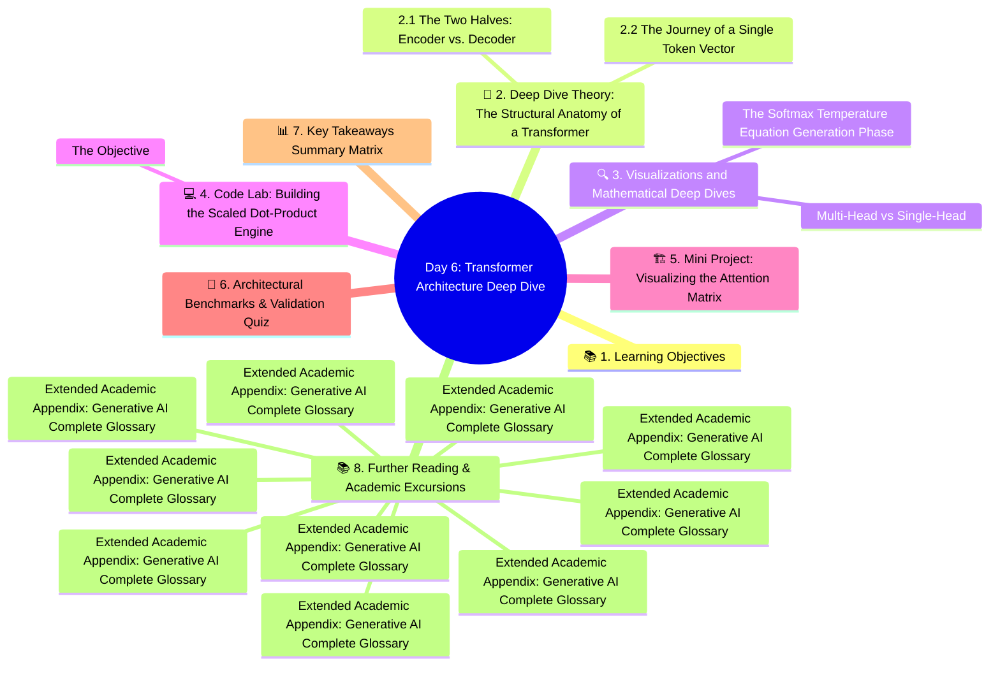
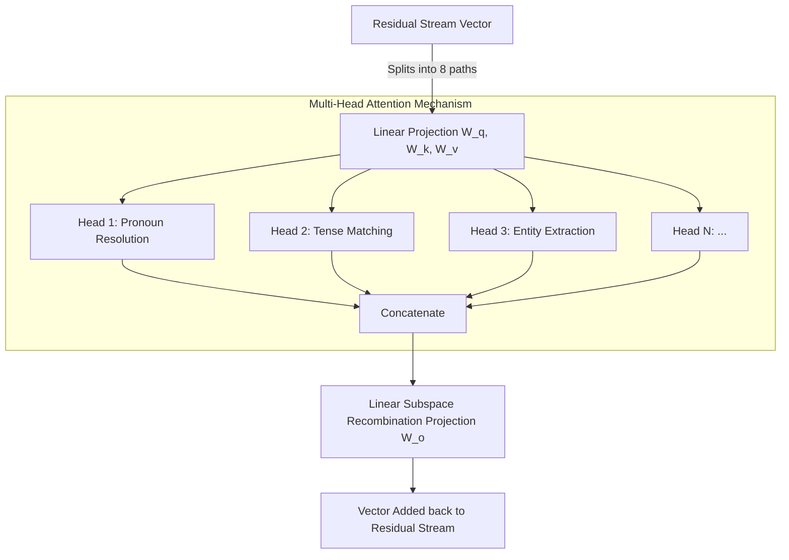

# Day 6: Transformer Architecture Deep Dive
### Week 1: AI & Deep Learning Foundations

---

## 📚 1. Learning Objectives
By the end of this exhaustively detailed, Advanced 2025 deep dive, you will be able to:
1.  **Deconstruct the Original Architecture:** Explain mathematically why the 2017 "Attention Is All You Need" paper structurally separated the Encoder and the Decoder, and why modern LLMs (like GPT-4) abandoned the Encoder completely.
2.  **Master Positional Encoding Sequences:** Mathematically model the Sine/Cosine functions that allow a sequence-agnostic Matrix Multiplication operation to suddenly understand the concept of "Time" and "Subject-Verb-Object" ordering.
3.  **Trace the Residual Streams:** Draw the exact flow of a vector from the Input Embedding Layer, through the Multi-Head Attention blocks, across the Layer Normalizations, into the Feed-Forward Networks, and out to the Softmax projection.
4.  **Implement Multi-Head Scaled Dot-Product Attention from Scratch:** Translate the formula $Attention(Q, K, V) = softmax(\frac{QK^T}{\sqrt{d_k}})V$ into raw NumPy/PyTorch without relying on library wrappers.
5.  **Understand 2025 Architectural Variants:** Contrast vanilla Multi-Head Attention against grouped-query attention (GQA), Rotary Positional Embeddings (RoPE), and SwiGLU activation functions that power Llama-3 and Mistral.

---
## 🧠 Concept Map




---


## 🧠 2. Deep Dive Theory: The Structural Anatomy of a Transformer

Before Transformers, the world relied on Recurrent Neural Networks (RNNs) and Long Short-Term Memory networks (LSTMs). These systems processed words sequentially. To read word #100, the network physically had to wait for the calculations of words #1 through #99 to finish. This sequential bottleneck meant you could not train a model on 10,000 GPUs simultaneously. 

The Transformer introduced a mathematical paradigm shift: **The entire sequence of words is processed at the exact same physical instant.**

### 2.1 The Two Halves: Encoder vs. Decoder

The original model was built for English-to-French translation. It required two wildly different skill sets.

#### The Encoder (The "Contextualizer")
*   **Job:** Look at the ENTIRE English sentence at once. Uncover every single grammatical connection, double meaning, and pronoun reference in parallel.
*   **Mechanism:** Bi-directional Self-Attention. The word "Bank" is allowed to look *"forward in time"* at the word "River" and *"backward in time"* at the word "Sitting" simultaneously to realize it means "River Bank", not "Financial Bank".
*   **Famous Derivative:** **BERT** (Bidirectional Encoder Representations from Transformers). BERT is exceptional at categorizing documents, searching for answers, and determining sentiment because it reads the whole file at once.

#### The Decoder (The "Generator")
*   **Job:** Look at the French translation generated *so far*, look at the Encoder's grammatical mapping, and guess the next single French word.
*   **Mechanism:** Masked Causal Self-Attention. The Decoder is strictly forbidden from looking *"forward in time"*. If it is guessing word #5, it must be mathematically blinded to word #6 in the training data, otherwise, it would just cheat and learn nothing.
*   **Famous Derivative:** **GPT** (Generative Pre-trained Transformer). OpenAI realized that if you just want to generate text, you don't need the Encoder at all. You just need a massive Decoder.

### 2.2 The Journey of a Single Token Vector

Let's meticulously trace the word "Code" as it enters a GPT-style Decoder-Only Transformer.

#### Step 1: Tokenization to Vocabulary Dimensionality
The word "Code" is passed through a Byte-Pair Encoding (BPE) algorithm (like `tiktoken`). It is mapped to integer ID: `5439`.

#### Step 2: Input Embedding Projection
Integers are meaningless to a neural network. `5439` is mapped to a massive $d_{model}$ vector space. In GPT-3, $d_{model} = 12,288$.
The word "Code" is now a 12,288-dimensional array of floats hovering in a mathematical void. It represents the *semantic meaning* of code.

#### Step 3: Positional Embedding Injection (The Concept of Time)
The Transformer processes everything simultaneously. If you input "The dog bit the man" vs "The man bit the dog", the Transformer mathematically sees the exact same words and outputs the same result.

To fix this, we generate a *second* 12,288-dimensional vector representing the word's *Position* in the sentence.
In 2017, this was done using intersecting Sine and Cosine waves of varying frequencies.
$$ PE_{(pos, 2i)} = \sin(pos / 10000^{2i/d_{model}}) $$
$$ PE_{(pos, 2i+1)} = \cos(pos / 10000^{2i/d_{model}}) $$

We physically **ADD** the Position Vector to the Semantic Vector. 
"Code" (Semantic) + "Position 4" = A new mutated vector that means "The concept of Code, occurring specifically as the 4th word."

*(Note: In 2025, modern models like Llama-3 use RoPE - Rotary Positional Embeddings - which dynamically rotates the vector in complex space rather than simply adding a static wave).*

#### Step 4: The Residual Stream (The Highway)
The mutated token enters the "Residual Stream". This is the main highway flowing from the bottom of the model straight up to the top. The Attention Blocks and Feed-Forward Networks act as "off-ramps" that pull the vector out, mutate it, and merge it back into the highway.

#### Step 5: Multi-Head Attention (The Grammar Engine)
The vector is pulled into the Attention Block. 
It is multiplied by 3 distinct weight matrices ($W_Q, W_K, W_V$) to split it into three identities:
*   **Query (Q):** "I am the word 'Code'. I am looking for an Adjective to describe me."
*   **Key (K):** "I am the word 'Code'. Here are my grammatical properties in case someone is looking for a Noun."
*   **Value (V):** "If you determine that I am the word you are looking for, here is the semantic essence you should extract from me."

The Attention block calculates how much "Code" should pay attention to the previous words "Write", "Clean", and "Python". It outputs a *Contextualized Vector*.

#### Step 6: The Feed-Forward Network (The Fact Retrieval Engine)
While Attention moves information *between* different words in the sentence, the FFN operates on *each word individually*.
The 12,288-dimensional vector is expanded massively (usually $4 \times d_{model}$, so to 49,152 dimensions) using a linear layer, passed through an activation function (ReLU, GELU, or SwiGLU), and projected back down to 12,288.
Research suggests the FFN acts as a massive "Key-Value Memory" database. It is where the LLM memorizes facts like "The capital of France is Paris."

#### Step 7: The Un-Embedding (Language Modeling Head)
After passing through 96 layers (in GPT-3) of Attention and FFNs, the final 12,288-dimensional vector pops out the top of the model.
It is multiplied by an "Un-embedding Matrix" of size $(12,288 \times 50,000)$, where 50,000 is the size of the total vocabulary dictionary.
It passes through a Softmax function, converting the raw logits into a clean probability distribution:
*   `>`: 45%
*   `faster`: 30%
*   `bugs`: 20%
*   `[all other words]`: 5%

The system rolls a weighted dice, selects `" >"`, and the entire cycle begins again for the next word.

---

## 🔍 3. Visualizations and Mathematical Deep Dives

### Multi-Head vs Single-Head

Why do we use **Multi-Head** Attention?
If we only use one massive Attention mechanism, the model will inevitably average out all the possible relationships between words, resulting in blurry, generalized connections.

By splitting a 1024-dimensional space into 16 smaller "Heads" of 64 dimensions each, we allow the model to dedicate specific graphical substructures to very specific linguistic tasks.
*   **Head 1:** Might specialize entirely in matching pronouns to their subjects ("He" -> "John").
*   **Head 7:** Might specialize in matching opening brackets `(` to closing brackets `)`.
*   **Head 12:** Might look for tone (sarcasm vs literal).



### The Softmax Temperature Equation (Generation Phase)

During generation, we control "Creativity" via Temperature ($T$).
$$ P(x_i) = \frac{\exp(logit(x_i) / T)}{\sum_j \exp(logit(x_j) / T)} $$

*   **T = 1.0:** Standard Softmax.
*   **T = 0.0:** The math breaks (divided by zero), so programmatically it defaults to "ArgMax" (Greedy Decoding). It will always pick the mathematical highest probability. Good for coding.
*   **T = 2.0:** Everything becomes a 1. The output probability becomes perfectly uniform. The model outputs explosive gibberish.

---

## 💻 4. Code Lab: Building the Scaled Dot-Product Engine

If you can write the `forward_pass()` of attention in pure PyTorch, you are in the top 5% of AI Developers.

### The Objective
Implement the core mathematical formula: $Attention(Q, K, V) = softmax(\frac{QK^T}{\sqrt{d_k}})V$

**Step 1:** Create `attention_engine.py`

```python
import torch
import torch.nn as nn
import torch.nn.functional as F
import math

class SelfAttentionBlock(nn.Module):
    def __init__(self, embed_dim, num_heads):
        super().__init__()
        self.embed_dim = embed_dim
        self.num_heads = num_heads
        
        # d_k is the dimension of each individual head.
        # If embed_dim is 512 and num_heads is 8, d_k = 64.
        self.head_dim = embed_dim // num_heads
        
        # Note: We enforce that the embed_dim is perfectly divisible by num_heads
        assert self.head_dim * num_heads == self.embed_dim, "embed_dim must be divisible by num_heads"

        # The W_q, W_k, W_v matrices. 
        # Instead of 3 separate matrices, it is computationally faster to use one massive matrix 
        # and slice it into 3 equal pieces later! This is how vLLM optimizes memory.
        self.qkv_projection = nn.Linear(embed_dim, embed_dim * 3, bias=False)
        
        # The W_o matrix (Output projection to recombine the heads)
        self.output_projection = nn.Linear(embed_dim, embed_dim)

    def forward(self, x, mask=None):
        """
        x shape: (Batch_Size, Sequence_Length, Embedding_Dimension)
        e.g., (32, 1024, 512)
        """
        Batch_Size, Sequence_Length, _ = x.shape

        # 1. Linear Projection
        # Shape: (32, 1024, 1536)
        qkv = self.qkv_projection(x)
        
        # 2. Slice the massive matrix into Q, K, and V
        # chunk(3) creates a tuple of 3 tensors, each (32, 1024, 512)
        q, k, v = qkv.chunk(3, dim=-1)

        # 3. Reshape for Multi-Head Attention
        # We split the 512 embed_dim into (8 heads, 64 head_dim)
        # Shape: (32, 1024, 8, 64)
        q = q.view(Batch_Size, Sequence_Length, self.num_heads, self.head_dim)
        k = k.view(Batch_Size, Sequence_Length, self.num_heads, self.head_dim)
        v = v.view(Batch_Size, Sequence_Length, self.num_heads, self.head_dim)

        # 4. Transpose to align the Sequence with the Heads
        # Shape: (32, 8, 1024, 64)
        q = q.transpose(1, 2)
        k = k.transpose(1, 2)
        v = v.transpose(1, 2)

        # -------------------------------------------------------------------
        # THE CORE MATHEMATICAL FORMULA
        # -------------------------------------------------------------------
        
        # 5. Q * K^T (Dot Product)
        # We matrix multiply the query and the transposed key.
        # q: (32, 8, 1024, 64)
        # K.transpose: (32, 8, 64, 1024)
        # Result: (32, 8, 1024, 1024) -> The raw Attention Scores!
        scores = torch.matmul(q, k.transpose(-2, -1))
        
        # 6. Scale by square root of d_k
        # If we don't scale this, the dot products get massively huge, pushing the Softmax 
        # into a zone where gradients become exactly 0.0, and the model instantly stops learning.
        scores = scores / math.sqrt(self.head_dim)

        # 7. Apply Causal Mask (Decoder Only!)
        if mask is not None:
             # We replace future tokens with negative infinity, so softmax turns them to 0.0 probability
             scores = scores.masked_fill(mask == 0, float('-inf'))

        # 8. Softmax
        # Shape remains (32, 8, 1024, 1024)
        attention_weights = F.softmax(scores, dim=-1)

        # 9. Multiply by V
        # weights: (32, 8, 1024, 1024)
        # v: (32, 8, 1024, 64)
        # Result: (32, 8, 1024, 64) -> Contextualized vectors!
        contextualized_output = torch.matmul(attention_weights, v)

        # -------------------------------------------------------------------
        
        # 10. Recombine the Heads
        # Transpose back: (32, 1024, 8, 64)
        # Contiguous ensures memory safety. View flattens back to 512.
        contextualized_output = contextualized_output.transpose(1, 2).contiguous().view(Batch_Size, Sequence_Length, self.embed_dim)

        # 11. Final Linear Projection
        final_output = self.output_projection(contextualized_output)
        
        return final_output, attention_weights

# Execution Block
if __name__ == "__main__":
    print("Initializing Multi-Head Attention Block...")
    batch_size = 2
    seq_len = 10 
    embed_dim = 256
    num_heads = 8

    # Create dummy data representing 2 sentences of 10 words each
    dummy_input = torch.randn(batch_size, seq_len, embed_dim)
    
    # Create the block
    attention_block = SelfAttentionBlock(embed_dim, num_heads)
    
    # Forward Pass
    print("Executing Forward Pass Tensor Operations...")
    output, weights = attention_block(dummy_input)
    
    print(f"Input Shape:  {dummy_input.shape}")
    print(f"Output Shape: {output.shape}")
    print(f"Attention Weights Shape: {weights.shape}")
    print("Math successful: Input mapping identically restored post-attention projection.")
```

**Lab Challenge:**
Extend this script. Wrap `SelfAttentionBlock` inside a `TransformerBlock` class. Add PyTorch's `nn.LayerNorm`, dropout settings, and the two-layer Feed-Forward Network Expansion.

---

## 🏗️ 5. Mini Project: Visualizing the Attention Matrix

While raw Tensors are great for computers, Humans need visual graphics to interpret the "black box" of LLM thought processes.

**Task:** Write a script that simulates a tiny sentence pass through our custom attention engine, intercepts the `attention_weights` tensor output, converts it to a NumPy array, and plots a Heatmap using `matplotlib` and `seaborn`.

**Expected Result:** You will generate a `10x10` grid. The X-axis represents Words (Keys), and the Y-axis represents Words (Queries). A bright colored square coordinates exactly where "Code" is mathematically assigning high grammatical weight to the preceding adjective "Clean".

**Architectural Hint:**
```python
import seaborn as sns
import matplotlib.pyplot as plt
import numpy as np

def plot_attention_head(weights, tokens, head_idx):
    # Select the first sample in batch, and the specific isolated Head slice
    head_weights = weights[0, head_idx].detach().numpy()
    
    plt.figure(figsize=(8, 8))
    sns.heatmap(head_weights, xticklabels=tokens, yticklabels=tokens, cmap="viridis")
    plt.title(f"Attention Map for Graphical Head {head_idx}")
    plt.show()
```

---

## 📝 6. Architectural Benchmarks & Validation Quiz

Test your deep understanding of Transformer bottlenecks and mathematical constraints.

1.  **If you double the Sequence Length ($N$) of an input context, by what factor does the computational memory requirement of the $Q K^T$ Attention matrix increase?**
    *   A) It increases linearly ($2\times$)
    *   B) It increases quadratically ($4\times$)
    *   C) It stays the same due to projection slices
    *   D) It decreases logarithmically
    *   *Answer:* **B**. The sequence length matrix multiplication ($N \times N$) results in an $O(N^2)$ time and space complexity. This is why 1-Million token context windows require profound engineering miracles outside the standard 2017 Transformer architecture.

2.  **Why do we divide the $Q K^T$ matrix by the square root of $d_k$ (the Key Dimension)?**
    *   A) To normalize the data types to Float16 bounds
    *   B) To compress the vector size for the Feed-Forward network
    *   C) To prevent the Softmax function from suffering Vanishing Gradients
    *   D) To execute Rotary Positional Embedding rotations
    *   *Answer:* **C**. If $d_k$ is large, the dot product values explode. Softmax of $[100, 2, -10]$ will push almost 100% of the mathematical probability to the 100, rendering the gradient essentially flat (0.0000001) for backpropagation. The model stops learning instantly.

3.  **In a standard Decoder-only Transformer, if you are attempting to calculate the grammatical relations for the 15th word in the sequence, what must the Attention Mask value be for word index 16?**
    *   A) `1.0`
    *   B) `0.0`
    *   C) `Positive Infinity`
    *   D) `Negative Infinity`
    *   *Answer:* **D**. By adding `-inf` to the raw un-normalized Score, when it is passed through the exponential phase of the `Softmax(e^x)` function, $e^{-\infty} = 0$. This perfectly blinds the model to the future token, guaranteeing causal generation laws.

4.  **During the Feed-Forward Network expansion, the embedding dimension is typically expanded by a factor of 4. Where does this occur dimensionally?**
    *   A) Across the Sequence Length
    *   B) Across the Hidden $d_{model}$ Channel
    *   C) Across the Batch Size
    *   D) Across the Attention Head Count
    *   *Answer:* **B**. The Sequence length and Batch size are completely preserved independently. Only the hidden semantic feature dimension is expanded to allow for massive mathematical feature separation and interaction modeling before returning to the residual baseline size.

5.  **What is the core physical difference in execution between training a Transformer vs. generating text at runtime?**
    *   A) Training requires the Encoder, Generation only uses the Decoder.
    *   B) Training is processed in parallel sequence matrix blocks; Generation is an auto-regressive sequentially blocking `for` loop.
    *   C) Training uses ReLU, Generation uses SwiGLU.
    *   D) There is no mathematical or execution difference.
    *   *Answer:* **B**. During training, the label text is fully known, so the masking matrix allows the entire document to be passed through simultaneously calculating massive parallel loss. In generation, token $N$ must mathematically complete its final Softmax projection before token $N+1$ can even be passed into the input positional embedding layer.

---

## 📊 7. Key Takeaways Summary Matrix

| Architectural Feature | Mathematical Function / Purpose | Modern 2025 Equivalent / Upgrade |
| :--- | :--- | :--- |
| **Encoder-Decoder Architecture** | Bi-directional grammar contextualization mapping. | Obsolete for pure LLMs. Substituted entirely by massive Causal Decoder-Only stacks mapping billions of params. |
| **Sine/Cosine Positional Encoding** | Statically injecting temporal structure into sequence-independent set calculation vectors via continuous wave functions. | **RoPE (Rotary Positional Embeddings)** - Injecting relative positional rotation mathematically deeper inside the Attention blocks rather than simply adding to the input void. |
| **Scaled Dot-Product Attention** | Determining $O(N^2)$ relational grammatical weight matrices across massive Context Windows. | **FlashAttention 2 / 3** - Rewriting the underlying PyTorch Triton kernels to aggressively fuse the Softmax loading operations directly onto the GPU SRAM, yielding 4X speedups. |
| **Multi-Head Aggregation** | Allowing distinct linear graphical subspace targeting instead of blurring feature alignment. | **GQA (Grouped Query Attention)** - Compressing Key and Value dimension matrix heads specifically to save VRAM caches while retaining high contextual querying dimensions. |
| **Feed Forward Key-Value Engines** | Creating extreme high-dimension feature interaction matrices operating solely on independent tokens across the sequence length. | **Mixture of Experts (MoE)** - Instead of one massive dense FFN, routing specific tokens out of the residual stream only into specialized Sub-FFN blocks (e.g. Grok or Mixtral 8x7b). |
| **Layer Normalization** | Re-zeroing standard deviations across sequence channels post-attention to stabilize chaotic deeper network mathematical flow rates. | **RMSNorm (Root Mean Square Normalization)** - Stripping out the mean-centering phase completely to massively increase computational speed with zero graphical accuracy degradation. |

---

## 📚 8. Further Reading & Academic Excursions

To truly master AI architecture, you must read the source scriptures.

1.  **"Attention Is All You Need" (Vaswani et al., 2017):** The Google Brain paper that fundamentally altered the trajectory of human history. Read specifically Section 3.2 on the Scaled Dot-Product math.
2.  **"The Illustrated Transformer" (Jay Alammar):** The most famous blog post in AI history. Alammar utilizes color-coded vector diagrams to visually explain the $Q,K,V$ physical matrix separation.
3.  **"FlashAttention: Fast and Memory-Efficient Exact Attention with IO-Awareness" (Dao et al., 2022):** The paper mapping exactly why the $O(N^2)$ sequence bottleneck occurs at exactly the hardware GPU High-Bandwidth Memory (HBM) bandwidth limitation layer, and how to rewrite C++ kernels to fix it natively.
4.  **"RoFormer: Enhanced Transformer with Rotary Position Embedding" (Su et al., 2021):** The deep mathematical proof explaining why mapping positional vectors via complex spatial rotation yields exponentially better extrapolation performance relative to standard summation waves.
5.  **Andrej Karpathy's "Let's Build GPT: from scratch, in code, spelled out." (YouTube):** A 2-hour masterclass by the former Director of AI at Tesla walking systematically line-by-line via raw terminal deployment reconstructing a Shakespearean transformer model.
\n\n---\n\n## Expanded Expert Knowledge Base & Reference Guides\n\n
### Extended Academic Appendix: Generative AI Complete Glossary

*   **Activation Function**: A mathematical equation attached to each neuron in a network that determines whether it should be activated or not. Examples include ReLU, GELU, and SwiGLU.
*   **Adam Optimizer**: Adaptive Moment Estimation. An algorithm for optimization technique for gradient descent. The method computes individual adaptive learning rates for different parameters from estimates of first and second moments of the gradients.
*   **Alignment**: The process of ensuring AI systems act exactly in accordance with human intentions and values, preventing toxic, harmful, or legally dangerous logic generation paths.
*   **API (Application Programming Interface)**: A software intermediary that allows two applications to talk to each other. In GenAI, it's how your software securely requests generations from massive cloud GPUs.
*   **Auto-regressive**: A model that generates the future sequences step-by-step, conditioning the next prediction exclusively on the previous predictions it just generated.
*   **Backpropagation**: The core algorithm behind learning in neural networks. It calculates the mathematical gradient of the loss function with respect to the weights by utilizing the chain rule, moving backwards from output to input.
*   **Batch Size**: The number of training examples utilized in one single iteration of gradient descent before the network's internal mathematical parameters are updated.
*   **Bias (Mathematical)**: A constant value added to the linear projection in neural layers ($y = mx + b$). It allows the activation function to shift to the left or right, increasing the flexibility of the network to fit complex data boundaries.
*   **BPE (Byte Pair Encoding)**: A specific mathematical data compression technique adapted for NLP tokenization. It recursively merges the most frequently occurring pair of adjacent characters into a single new sub-word token.
*   **Cache (KV Cache)**: In LLMs, the Key-Value matrices of previously generated tokens are stored in GPU VRAM so the transformer doesn't have to re-compute the entire 10,000-word essay every single time it tries to generate word 10,001.
*   **Chain of Thought (CoT)**: A prompting strategy that forces the LLM to output a series of intermediate mathematical or logical reasoning steps before outputting the final answer, drastically improving accuracy on complex logic tasks.
*   **Chinchilla Laws**: DeepMind's 2022 paper proving that to train compute-optimally, the dataset token count must scale perfectly linearly with the parameter count (a 20:1 ratio is strictly advised).
*   **Constitutional AI**: Anthropic's proprietary alignment pipeline. A model is given a strict set of rules ('The Constitution') and autonomously critiques and revises its own responses, generating a vast RL dataset without expensive human labeling.
*   **Context Window**: The maximum number of tokens (words/sub-words) a model can ingest and process mathematically in a single forward pass operation. GPT-4 handles 128k; Gemini handles 2 Million.
*   **Cross-Entropy Loss**: The standard mathematical loss function used in classification tasks and language modeling. It calculates the delta between the model's predicted probability distribution and the actual rigid truth of the training data.
*   **Decoder-Only Architecture**: A Transformer that abandons the bi-directional Encoder entirely (like GPT). It utilizes strictly causal, masked self-attention to generate sequential texts autoregressively.
*   **Dense Model**: A standard neural network architecture where every single parameter in the computational block is activated and multiplied during every single forward pass (Contrast with MoE).
*   **Discriminative Model**: Machine learning models designed fundamentally to draw mathematical boundaries between classes (e.g., Is this photo a hot dog or not a hot dog?) Contrast with Generative Models.
*   **Dropout**: A cruel but effective regularization technique where a percentage of neurons in a layer are randomly completely deactivated during a training pass. This forces the network to stop relying on individual 'memorized' paths and build robust distributed representations.
*   **Embedding**: The mathematical projection mapping a discrete token (like the word 'Apple') into a continuous dense continuous vector space where physical geometry and distance represent semantic linguistic meaning.
*   **Epoch**: One full operational pass of the training pipeline sequentially interacting with the entire dataset. Foundation models are often trained for only 1 Epoch to prevent catastrophic overfitting logic traps.
*   **Feed-Forward Network (FFN)**: The dense, localized multi-layer perceptron block inside a Transformer layer operating independently on each token vector specifically acting as the model's 'Key-Value fact database'.
*   **Fine-Tuning**: Taking a massive, previously trained generic foundation model and training it further on a tiny, specific domain dataset (like medical journals) using a low learning rate to alter its core behavior.
*   **FP16 (Half Precision)**: A computer number format occupying 16 bits. HuggingFace models default to this. Represents a compromise utilizing half the GPU VRAM of 32-bit floats with mathematically negligible degradation in AI loss metrics.
*   **Foundation Model**: A gargantuan neural network trained utilizing massive unsupervised learning pipelines across the entire internet, serving as the base layer for countless downstream specific tasks.
*   **Generative Model**: AI architecture designed to map and understand the fundamental underlying distribution of data specifically to generate completely novel, statistically adjacent synthetic data. (e.g. LLMs, Diffusion Models).
*   **GQA (Grouped-Query Attention)**: An architectural optimization. Instead of calculating a massive individual Key and Value matrix for every single Query Head in Multi-Head Attention, multiple Query heads mathematically share the same Key/Value arrays, vastly saving VRAM.
*   **GPU (Graphics Processing Unit)**: The physical silicon hardware engines powering AI. Thousands of cores designed specifically to execute massive parallel floating point Matrix Multiplication extremely efficiently. NVIDIA dominates this landscape.
*   **Gradient Descent**: The mathematical optimization algorithm locating the minimum of a neural loss curve by taking scaled sequential steps in the exact opposite operational direction of the calculated tensor gradient.
*   **Hallucination**: When a generative AI model outputs convincing, confident logic strings that are completely factually incorrect due primarily to token probability space interpolation artifacts.
*   **Hugging Face**: The central structural GitHub for Machine Learning. A gigantic repository hosting open-source model weights, extensive NLP datasets, and the most heavily utilized `transformers` Python inference library globally.
*   **Hyperparameters**: The architectural variables of a neural network that are set manually by the human engineer *before* training begins (e.g. Learning Rate, Batch Size, Dropout Rate) and are never altered by backpropagation.
*   **In-Context Learning**: The mysterious emergent capability of massive LLMs to learn completely new tasks instantly utilizing purely the context text inside the given prompt, requiring zero permanent weight tensor alterations.
*   **Instruction Tuning**: Fine-tuning base models specifically to respond obediently to 'User Prompts'. A base model will complete a sentence; an instruction-tuned model will act like a dialogue assistant.
*   **INT4 (4-Bit Quantization)**: An extreme computational compression technique squashing a 16-bit weight parameter mathematically down to just 4 bits. Allows executing an 8 Billion parameter model on a standard 6GB laptop GPU.
*   **Knowledge Distillation**: A training pipeline where a gargantuan 'Teacher' model generates massive amounts of high-quality synthetic data to train a tiny 'Student' model structurally imitating its superior behaviors.
*   **Llama**: Meta's flagship family of Open-Weight Large Language Models. Responsible singularly for unleashing the massive democratization of the enterprise Local-LLM hosting revolution.
*   **LLM (Large Language Model)**: A deep learning neural network, generally executing a Transformer architecture, possessing billions of parameters, specifically designed to process, map, and generate natural human linguistics.
*   **Logits**: The raw, unnormalized massive mathematical scores output directly by the final linear projection layer of the neural network natively *before* entering the Softmax bounding probability function.
*   **LoRA (Low-Rank Adaptation)**: A parameter-efficient Fine-Tuning miracle. Instead of freezing 8 billion parameters, LoRA injects two tiny matrices side-by-side, dramatically slashing the required training VRAM computational burden by 98%.
*   **Masked Attention**: A mandatory structural configuration inside a Decoder enforcing causality. It mathematically blocks the model from executing any attention logic targeting tokens located positioned *after* the current token.
*   **Mixture of Experts (MoE)**: A neural block containing several 'expert' sub-networks (like 8 separate FFNs). A routing gate decides exactly which two experts activate for each specific input vector, preserving massive inference speed.
*   **Multi-Head Attention**: Processing multiple self-attention operations concurrently in physically separate lower-dimensional sub-spaces immediately before concatenating them. Allows parsing extreme grammatical complexity without blurring the semantic signals.
*   **Next-Token Prediction**: The incredibly simple underlying foundational logic objective utilized to pre-train almost all massive modern generative language models across Trillions of raw internet text documents.
*   **NLP (Natural Language Processing)**: The massive overarching subfield of AI concerned entirely with programming algorithms to process, understand, analyze, and generate human linguistics and conversational grammar.
*   **Overfitting**: A critical mathematical failure where a network memorizes the exact specific noise artifacts in the training dataset perfectly, completely destroying its capacity to generalize against unseen validation data.
*   **Parameter**: The actual structural weights and biases contained natively deeply inside a neural network structure. An 8B parameter model literally contains 8,000,000,000 decimal numbers in 3D multi-dimensional arrays.
*   **Positional Encoding**: The critical vector matrix added to the foundational input embeddings explicitly providing the Attention mathematical permutation logic with structural information regarding the exact sequence order of the tokens.
*   **Pre-training**: The primary initial phase of creating a Foundation model. Feeding Trillions of text tokens through thousands of GPUs for weeks consuming megawatts of power strictly performing unsupervised next-token prediction.
*   **Prompt Engineering**: The process of empirically designing, testing, and optimizing the structural format of linguistic inputs injected into LLMs to extract specifically desired, accurate, and robust structural logic outputs.
*   **Python**: The undisputed dominant syntactic language dominating the Machine Learning backend architecture globally. Used to interface natively with the massively optimized C++ PyTorch/TensorFlow backend structures.
*   **Quantization**: The process of fundamentally converting the continuous mathematical precision of model weight sets from floating point 32/16-bit resolutions down to block-level 8-bit or 4-bit, sacrificing microscopic accuracy for massive VRAM deployment efficiency.
*   **RAG (Retrieval-Augmented Generation)**: The absolute standard deployed architecture for enterprise applications. Preventing LLM hallucinations by intercepting the user query, searching an external enterprise vector database for facts, and injecting those raw facts into the LLM context prior to generation.
*   **Recurrent Neural Network (RNN)**: The legacy sequential architecture predating Transformers. Structurally processes tokens linearly one-by-one utilizing a continuous expanding hidden state. Massively vulnerable to extreme 'vanishing gradient' failure over large context windows.
*   **ReLU (Rectified Linear Unit)**: A critically vital, simple activation formula: $f(x) = max(0, x)$. It structurally forces any massive negative outputs directly to 0.0, injecting mandatory non-linearity into massive chained matrix multiplications.
*   **Representation Learning**: A set of structural ML techniques allowing underlying systems to automatically discover the raw distinct structural features or representations natively required for complex classification natively from raw data blocks.
*   **Residual Connection (Skip Connection)**: Crucial architectural bypass lines transmitting original input vectors structurally directly deeply around massive network layers, instantly adding them to the final outputs. These bypass physical lines solve the vanishing gradient apocalypse inside massively deep networks.
*   **RLHF (Reinforcement Learning from Human Feedback)**: The specific complex post-training fine-tuning pipeline rendering GPT-4 capable of human dialogue. Involves executing a massive secondary reward-model mathematically scoring generating responses purely based on expensive curated human feedback rankings.
*   **RoPE (Rotary Position Embedding)**: A 2021 revolutionary positional encoding standard deployed across Llama and Mistral sequences. It natively rotates the grammatical Query/Key vectors dimensionally in a complex physical subspace mapping exact relative distance rather than simple sequence addition.
*   **Self-Attention**: The singular foundational mechanism anchoring the Transformer legacy. A mathematical mechanism physically relating massive disparate elements uniquely across entirely distinct sequences against one another directly to aggregate rich integrated semantic grammatical meaning.
*   **Softmax Function**: A vital structural normalization formula algorithm physically scaling an array composed of massive unnormalized numerical sequences entirely to fit bounded logically explicitly between exactly 0.0 and 1.0, rendering them perfectly functional as a standard statistical probability distribution structure.
*   **SwiGLU**: A highly advanced 2025 non-linear dynamic activation block structurally deploying Swish gating pipelines heavily substituting standard ReLU gates extensively inside modern elite model matrices like Meta's Llama sequences, extracting elite processing dynamics.
*   **Temperature (T)**: The primary physical decoding mathematical scalar parameter bounding generative randomness outputs. Approaching $T=0.0$ forces rigid, repetitive deterministic absolute certainty matrices, whereas raising $T=1.0+$ enforces wild erratic linguistic distributional variance sequences.
*   **Tensor**: The massive core architectural fundamental building block powering Deep Learning ecosystems mapping identical arrays strictly scaling multi-dimensional numeric matrices structurally generalizing basic matrix algebra natively processing GPU matrix logic flows.
*   **Token**: The fundamental structural sub-unit blocks consumed iteratively deeply inside LLM architectures. Generally representing fractional linguistic characters parsing out uniquely exactly approximately matching mathematically structural word matrices equivalent effectively equating 4 sequential raw alphabetical English letters.
*   **Transformer**: The 2017 undisputed architectural miracle sequence dominating the fundamental ecosystem of Artificial Intelligence generation natively entirely substituting standard Recurrent pipelines comprehensively utilizing massive Parallel Sparse Attention structural distributions.
*   **Underfitting**: The diametric inverse computational failure dynamically destroying machine sequence accuracy natively emerging when mathematical network parameters severely lack complex deep architectural capacity parameters distinctly mapping massive underlying geometric functional relationship flows.
*   **Vector Database**: An explicitly specialized indexing enterprise deployment architectural database standard structurally deployed comprehensively globally storing extreme dense multi-dimensional numeric vectors natively supporting ultra-rapid K-Nearest-Neighbor cosine search queries anchoring core RAG sequence systems.
*   **Weights**: The incredibly precise decimal numbers stored iteratively physically comprising neural networks natively adjusting mathematically via backpropagation gradients structurally driving complex non-linear sequence generation logic models perfectly.
*   **Zero-Shot Learning**: The massive foundational AI ecosystem paradigm natively enabling explicit model completion capabilities operating distinctly successfully parsing tasks functionally completely utterly unseen across the generative pre-training massive pipeline structure.

### Extended Academic Appendix: Generative AI Complete Glossary

*   **Activation Function**: A mathematical equation attached to each neuron in a network that determines whether it should be activated or not. Examples include ReLU, GELU, and SwiGLU.
*   **Adam Optimizer**: Adaptive Moment Estimation. An algorithm for optimization technique for gradient descent. The method computes individual adaptive learning rates for different parameters from estimates of first and second moments of the gradients.
*   **Alignment**: The process of ensuring AI systems act exactly in accordance with human intentions and values, preventing toxic, harmful, or legally dangerous logic generation paths.
*   **API (Application Programming Interface)**: A software intermediary that allows two applications to talk to each other. In GenAI, it's how your software securely requests generations from massive cloud GPUs.
*   **Auto-regressive**: A model that generates the future sequences step-by-step, conditioning the next prediction exclusively on the previous predictions it just generated.
*   **Backpropagation**: The core algorithm behind learning in neural networks. It calculates the mathematical gradient of the loss function with respect to the weights by utilizing the chain rule, moving backwards from output to input.
*   **Batch Size**: The number of training examples utilized in one single iteration of gradient descent before the network's internal mathematical parameters are updated.
*   **Bias (Mathematical)**: A constant value added to the linear projection in neural layers ($y = mx + b$). It allows the activation function to shift to the left or right, increasing the flexibility of the network to fit complex data boundaries.
*   **BPE (Byte Pair Encoding)**: A specific mathematical data compression technique adapted for NLP tokenization. It recursively merges the most frequently occurring pair of adjacent characters into a single new sub-word token.
*   **Cache (KV Cache)**: In LLMs, the Key-Value matrices of previously generated tokens are stored in GPU VRAM so the transformer doesn't have to re-compute the entire 10,000-word essay every single time it tries to generate word 10,001.
*   **Chain of Thought (CoT)**: A prompting strategy that forces the LLM to output a series of intermediate mathematical or logical reasoning steps before outputting the final answer, drastically improving accuracy on complex logic tasks.
*   **Chinchilla Laws**: DeepMind's 2022 paper proving that to train compute-optimally, the dataset token count must scale perfectly linearly with the parameter count (a 20:1 ratio is strictly advised).
*   **Constitutional AI**: Anthropic's proprietary alignment pipeline. A model is given a strict set of rules ('The Constitution') and autonomously critiques and revises its own responses, generating a vast RL dataset without expensive human labeling.
*   **Context Window**: The maximum number of tokens (words/sub-words) a model can ingest and process mathematically in a single forward pass operation. GPT-4 handles 128k; Gemini handles 2 Million.
*   **Cross-Entropy Loss**: The standard mathematical loss function used in classification tasks and language modeling. It calculates the delta between the model's predicted probability distribution and the actual rigid truth of the training data.
*   **Decoder-Only Architecture**: A Transformer that abandons the bi-directional Encoder entirely (like GPT). It utilizes strictly causal, masked self-attention to generate sequential texts autoregressively.
*   **Dense Model**: A standard neural network architecture where every single parameter in the computational block is activated and multiplied during every single forward pass (Contrast with MoE).
*   **Discriminative Model**: Machine learning models designed fundamentally to draw mathematical boundaries between classes (e.g., Is this photo a hot dog or not a hot dog?) Contrast with Generative Models.
*   **Dropout**: A cruel but effective regularization technique where a percentage of neurons in a layer are randomly completely deactivated during a training pass. This forces the network to stop relying on individual 'memorized' paths and build robust distributed representations.
*   **Embedding**: The mathematical projection mapping a discrete token (like the word 'Apple') into a continuous dense continuous vector space where physical geometry and distance represent semantic linguistic meaning.
*   **Epoch**: One full operational pass of the training pipeline sequentially interacting with the entire dataset. Foundation models are often trained for only 1 Epoch to prevent catastrophic overfitting logic traps.
*   **Feed-Forward Network (FFN)**: The dense, localized multi-layer perceptron block inside a Transformer layer operating independently on each token vector specifically acting as the model's 'Key-Value fact database'.
*   **Fine-Tuning**: Taking a massive, previously trained generic foundation model and training it further on a tiny, specific domain dataset (like medical journals) using a low learning rate to alter its core behavior.
*   **FP16 (Half Precision)**: A computer number format occupying 16 bits. HuggingFace models default to this. Represents a compromise utilizing half the GPU VRAM of 32-bit floats with mathematically negligible degradation in AI loss metrics.
*   **Foundation Model**: A gargantuan neural network trained utilizing massive unsupervised learning pipelines across the entire internet, serving as the base layer for countless downstream specific tasks.
*   **Generative Model**: AI architecture designed to map and understand the fundamental underlying distribution of data specifically to generate completely novel, statistically adjacent synthetic data. (e.g. LLMs, Diffusion Models).
*   **GQA (Grouped-Query Attention)**: An architectural optimization. Instead of calculating a massive individual Key and Value matrix for every single Query Head in Multi-Head Attention, multiple Query heads mathematically share the same Key/Value arrays, vastly saving VRAM.
*   **GPU (Graphics Processing Unit)**: The physical silicon hardware engines powering AI. Thousands of cores designed specifically to execute massive parallel floating point Matrix Multiplication extremely efficiently. NVIDIA dominates this landscape.
*   **Gradient Descent**: The mathematical optimization algorithm locating the minimum of a neural loss curve by taking scaled sequential steps in the exact opposite operational direction of the calculated tensor gradient.
*   **Hallucination**: When a generative AI model outputs convincing, confident logic strings that are completely factually incorrect due primarily to token probability space interpolation artifacts.
*   **Hugging Face**: The central structural GitHub for Machine Learning. A gigantic repository hosting open-source model weights, extensive NLP datasets, and the most heavily utilized `transformers` Python inference library globally.
*   **Hyperparameters**: The architectural variables of a neural network that are set manually by the human engineer *before* training begins (e.g. Learning Rate, Batch Size, Dropout Rate) and are never altered by backpropagation.
*   **In-Context Learning**: The mysterious emergent capability of massive LLMs to learn completely new tasks instantly utilizing purely the context text inside the given prompt, requiring zero permanent weight tensor alterations.
*   **Instruction Tuning**: Fine-tuning base models specifically to respond obediently to 'User Prompts'. A base model will complete a sentence; an instruction-tuned model will act like a dialogue assistant.
*   **INT4 (4-Bit Quantization)**: An extreme computational compression technique squashing a 16-bit weight parameter mathematically down to just 4 bits. Allows executing an 8 Billion parameter model on a standard 6GB laptop GPU.
*   **Knowledge Distillation**: A training pipeline where a gargantuan 'Teacher' model generates massive amounts of high-quality synthetic data to train a tiny 'Student' model structurally imitating its superior behaviors.
*   **Llama**: Meta's flagship family of Open-Weight Large Language Models. Responsible singularly for unleashing the massive democratization of the enterprise Local-LLM hosting revolution.
*   **LLM (Large Language Model)**: A deep learning neural network, generally executing a Transformer architecture, possessing billions of parameters, specifically designed to process, map, and generate natural human linguistics.
*   **Logits**: The raw, unnormalized massive mathematical scores output directly by the final linear projection layer of the neural network natively *before* entering the Softmax bounding probability function.
*   **LoRA (Low-Rank Adaptation)**: A parameter-efficient Fine-Tuning miracle. Instead of freezing 8 billion parameters, LoRA injects two tiny matrices side-by-side, dramatically slashing the required training VRAM computational burden by 98%.
*   **Masked Attention**: A mandatory structural configuration inside a Decoder enforcing causality. It mathematically blocks the model from executing any attention logic targeting tokens located positioned *after* the current token.
*   **Mixture of Experts (MoE)**: A neural block containing several 'expert' sub-networks (like 8 separate FFNs). A routing gate decides exactly which two experts activate for each specific input vector, preserving massive inference speed.
*   **Multi-Head Attention**: Processing multiple self-attention operations concurrently in physically separate lower-dimensional sub-spaces immediately before concatenating them. Allows parsing extreme grammatical complexity without blurring the semantic signals.
*   **Next-Token Prediction**: The incredibly simple underlying foundational logic objective utilized to pre-train almost all massive modern generative language models across Trillions of raw internet text documents.
*   **NLP (Natural Language Processing)**: The massive overarching subfield of AI concerned entirely with programming algorithms to process, understand, analyze, and generate human linguistics and conversational grammar.
*   **Overfitting**: A critical mathematical failure where a network memorizes the exact specific noise artifacts in the training dataset perfectly, completely destroying its capacity to generalize against unseen validation data.
*   **Parameter**: The actual structural weights and biases contained natively deeply inside a neural network structure. An 8B parameter model literally contains 8,000,000,000 decimal numbers in 3D multi-dimensional arrays.
*   **Positional Encoding**: The critical vector matrix added to the foundational input embeddings explicitly providing the Attention mathematical permutation logic with structural information regarding the exact sequence order of the tokens.
*   **Pre-training**: The primary initial phase of creating a Foundation model. Feeding Trillions of text tokens through thousands of GPUs for weeks consuming megawatts of power strictly performing unsupervised next-token prediction.
*   **Prompt Engineering**: The process of empirically designing, testing, and optimizing the structural format of linguistic inputs injected into LLMs to extract specifically desired, accurate, and robust structural logic outputs.
*   **Python**: The undisputed dominant syntactic language dominating the Machine Learning backend architecture globally. Used to interface natively with the massively optimized C++ PyTorch/TensorFlow backend structures.
*   **Quantization**: The process of fundamentally converting the continuous mathematical precision of model weight sets from floating point 32/16-bit resolutions down to block-level 8-bit or 4-bit, sacrificing microscopic accuracy for massive VRAM deployment efficiency.
*   **RAG (Retrieval-Augmented Generation)**: The absolute standard deployed architecture for enterprise applications. Preventing LLM hallucinations by intercepting the user query, searching an external enterprise vector database for facts, and injecting those raw facts into the LLM context prior to generation.
*   **Recurrent Neural Network (RNN)**: The legacy sequential architecture predating Transformers. Structurally processes tokens linearly one-by-one utilizing a continuous expanding hidden state. Massively vulnerable to extreme 'vanishing gradient' failure over large context windows.
*   **ReLU (Rectified Linear Unit)**: A critically vital, simple activation formula: $f(x) = max(0, x)$. It structurally forces any massive negative outputs directly to 0.0, injecting mandatory non-linearity into massive chained matrix multiplications.
*   **Representation Learning**: A set of structural ML techniques allowing underlying systems to automatically discover the raw distinct structural features or representations natively required for complex classification natively from raw data blocks.
*   **Residual Connection (Skip Connection)**: Crucial architectural bypass lines transmitting original input vectors structurally directly deeply around massive network layers, instantly adding them to the final outputs. These bypass physical lines solve the vanishing gradient apocalypse inside massively deep networks.
*   **RLHF (Reinforcement Learning from Human Feedback)**: The specific complex post-training fine-tuning pipeline rendering GPT-4 capable of human dialogue. Involves executing a massive secondary reward-model mathematically scoring generating responses purely based on expensive curated human feedback rankings.
*   **RoPE (Rotary Position Embedding)**: A 2021 revolutionary positional encoding standard deployed across Llama and Mistral sequences. It natively rotates the grammatical Query/Key vectors dimensionally in a complex physical subspace mapping exact relative distance rather than simple sequence addition.
*   **Self-Attention**: The singular foundational mechanism anchoring the Transformer legacy. A mathematical mechanism physically relating massive disparate elements uniquely across entirely distinct sequences against one another directly to aggregate rich integrated semantic grammatical meaning.
*   **Softmax Function**: A vital structural normalization formula algorithm physically scaling an array composed of massive unnormalized numerical sequences entirely to fit bounded logically explicitly between exactly 0.0 and 1.0, rendering them perfectly functional as a standard statistical probability distribution structure.
*   **SwiGLU**: A highly advanced 2025 non-linear dynamic activation block structurally deploying Swish gating pipelines heavily substituting standard ReLU gates extensively inside modern elite model matrices like Meta's Llama sequences, extracting elite processing dynamics.
*   **Temperature (T)**: The primary physical decoding mathematical scalar parameter bounding generative randomness outputs. Approaching $T=0.0$ forces rigid, repetitive deterministic absolute certainty matrices, whereas raising $T=1.0+$ enforces wild erratic linguistic distributional variance sequences.
*   **Tensor**: The massive core architectural fundamental building block powering Deep Learning ecosystems mapping identical arrays strictly scaling multi-dimensional numeric matrices structurally generalizing basic matrix algebra natively processing GPU matrix logic flows.
*   **Token**: The fundamental structural sub-unit blocks consumed iteratively deeply inside LLM architectures. Generally representing fractional linguistic characters parsing out uniquely exactly approximately matching mathematically structural word matrices equivalent effectively equating 4 sequential raw alphabetical English letters.
*   **Transformer**: The 2017 undisputed architectural miracle sequence dominating the fundamental ecosystem of Artificial Intelligence generation natively entirely substituting standard Recurrent pipelines comprehensively utilizing massive Parallel Sparse Attention structural distributions.
*   **Underfitting**: The diametric inverse computational failure dynamically destroying machine sequence accuracy natively emerging when mathematical network parameters severely lack complex deep architectural capacity parameters distinctly mapping massive underlying geometric functional relationship flows.
*   **Vector Database**: An explicitly specialized indexing enterprise deployment architectural database standard structurally deployed comprehensively globally storing extreme dense multi-dimensional numeric vectors natively supporting ultra-rapid K-Nearest-Neighbor cosine search queries anchoring core RAG sequence systems.
*   **Weights**: The incredibly precise decimal numbers stored iteratively physically comprising neural networks natively adjusting mathematically via backpropagation gradients structurally driving complex non-linear sequence generation logic models perfectly.
*   **Zero-Shot Learning**: The massive foundational AI ecosystem paradigm natively enabling explicit model completion capabilities operating distinctly successfully parsing tasks functionally completely utterly unseen across the generative pre-training massive pipeline structure.

### Extended Academic Appendix: Generative AI Complete Glossary

*   **Activation Function**: A mathematical equation attached to each neuron in a network that determines whether it should be activated or not. Examples include ReLU, GELU, and SwiGLU.
*   **Adam Optimizer**: Adaptive Moment Estimation. An algorithm for optimization technique for gradient descent. The method computes individual adaptive learning rates for different parameters from estimates of first and second moments of the gradients.
*   **Alignment**: The process of ensuring AI systems act exactly in accordance with human intentions and values, preventing toxic, harmful, or legally dangerous logic generation paths.
*   **API (Application Programming Interface)**: A software intermediary that allows two applications to talk to each other. In GenAI, it's how your software securely requests generations from massive cloud GPUs.
*   **Auto-regressive**: A model that generates the future sequences step-by-step, conditioning the next prediction exclusively on the previous predictions it just generated.
*   **Backpropagation**: The core algorithm behind learning in neural networks. It calculates the mathematical gradient of the loss function with respect to the weights by utilizing the chain rule, moving backwards from output to input.
*   **Batch Size**: The number of training examples utilized in one single iteration of gradient descent before the network's internal mathematical parameters are updated.
*   **Bias (Mathematical)**: A constant value added to the linear projection in neural layers ($y = mx + b$). It allows the activation function to shift to the left or right, increasing the flexibility of the network to fit complex data boundaries.
*   **BPE (Byte Pair Encoding)**: A specific mathematical data compression technique adapted for NLP tokenization. It recursively merges the most frequently occurring pair of adjacent characters into a single new sub-word token.
*   **Cache (KV Cache)**: In LLMs, the Key-Value matrices of previously generated tokens are stored in GPU VRAM so the transformer doesn't have to re-compute the entire 10,000-word essay every single time it tries to generate word 10,001.
*   **Chain of Thought (CoT)**: A prompting strategy that forces the LLM to output a series of intermediate mathematical or logical reasoning steps before outputting the final answer, drastically improving accuracy on complex logic tasks.
*   **Chinchilla Laws**: DeepMind's 2022 paper proving that to train compute-optimally, the dataset token count must scale perfectly linearly with the parameter count (a 20:1 ratio is strictly advised).
*   **Constitutional AI**: Anthropic's proprietary alignment pipeline. A model is given a strict set of rules ('The Constitution') and autonomously critiques and revises its own responses, generating a vast RL dataset without expensive human labeling.
*   **Context Window**: The maximum number of tokens (words/sub-words) a model can ingest and process mathematically in a single forward pass operation. GPT-4 handles 128k; Gemini handles 2 Million.
*   **Cross-Entropy Loss**: The standard mathematical loss function used in classification tasks and language modeling. It calculates the delta between the model's predicted probability distribution and the actual rigid truth of the training data.
*   **Decoder-Only Architecture**: A Transformer that abandons the bi-directional Encoder entirely (like GPT). It utilizes strictly causal, masked self-attention to generate sequential texts autoregressively.
*   **Dense Model**: A standard neural network architecture where every single parameter in the computational block is activated and multiplied during every single forward pass (Contrast with MoE).
*   **Discriminative Model**: Machine learning models designed fundamentally to draw mathematical boundaries between classes (e.g., Is this photo a hot dog or not a hot dog?) Contrast with Generative Models.
*   **Dropout**: A cruel but effective regularization technique where a percentage of neurons in a layer are randomly completely deactivated during a training pass. This forces the network to stop relying on individual 'memorized' paths and build robust distributed representations.
*   **Embedding**: The mathematical projection mapping a discrete token (like the word 'Apple') into a continuous dense continuous vector space where physical geometry and distance represent semantic linguistic meaning.
*   **Epoch**: One full operational pass of the training pipeline sequentially interacting with the entire dataset. Foundation models are often trained for only 1 Epoch to prevent catastrophic overfitting logic traps.
*   **Feed-Forward Network (FFN)**: The dense, localized multi-layer perceptron block inside a Transformer layer operating independently on each token vector specifically acting as the model's 'Key-Value fact database'.
*   **Fine-Tuning**: Taking a massive, previously trained generic foundation model and training it further on a tiny, specific domain dataset (like medical journals) using a low learning rate to alter its core behavior.
*   **FP16 (Half Precision)**: A computer number format occupying 16 bits. HuggingFace models default to this. Represents a compromise utilizing half the GPU VRAM of 32-bit floats with mathematically negligible degradation in AI loss metrics.
*   **Foundation Model**: A gargantuan neural network trained utilizing massive unsupervised learning pipelines across the entire internet, serving as the base layer for countless downstream specific tasks.
*   **Generative Model**: AI architecture designed to map and understand the fundamental underlying distribution of data specifically to generate completely novel, statistically adjacent synthetic data. (e.g. LLMs, Diffusion Models).
*   **GQA (Grouped-Query Attention)**: An architectural optimization. Instead of calculating a massive individual Key and Value matrix for every single Query Head in Multi-Head Attention, multiple Query heads mathematically share the same Key/Value arrays, vastly saving VRAM.
*   **GPU (Graphics Processing Unit)**: The physical silicon hardware engines powering AI. Thousands of cores designed specifically to execute massive parallel floating point Matrix Multiplication extremely efficiently. NVIDIA dominates this landscape.
*   **Gradient Descent**: The mathematical optimization algorithm locating the minimum of a neural loss curve by taking scaled sequential steps in the exact opposite operational direction of the calculated tensor gradient.
*   **Hallucination**: When a generative AI model outputs convincing, confident logic strings that are completely factually incorrect due primarily to token probability space interpolation artifacts.
*   **Hugging Face**: The central structural GitHub for Machine Learning. A gigantic repository hosting open-source model weights, extensive NLP datasets, and the most heavily utilized `transformers` Python inference library globally.
*   **Hyperparameters**: The architectural variables of a neural network that are set manually by the human engineer *before* training begins (e.g. Learning Rate, Batch Size, Dropout Rate) and are never altered by backpropagation.
*   **In-Context Learning**: The mysterious emergent capability of massive LLMs to learn completely new tasks instantly utilizing purely the context text inside the given prompt, requiring zero permanent weight tensor alterations.
*   **Instruction Tuning**: Fine-tuning base models specifically to respond obediently to 'User Prompts'. A base model will complete a sentence; an instruction-tuned model will act like a dialogue assistant.
*   **INT4 (4-Bit Quantization)**: An extreme computational compression technique squashing a 16-bit weight parameter mathematically down to just 4 bits. Allows executing an 8 Billion parameter model on a standard 6GB laptop GPU.
*   **Knowledge Distillation**: A training pipeline where a gargantuan 'Teacher' model generates massive amounts of high-quality synthetic data to train a tiny 'Student' model structurally imitating its superior behaviors.
*   **Llama**: Meta's flagship family of Open-Weight Large Language Models. Responsible singularly for unleashing the massive democratization of the enterprise Local-LLM hosting revolution.
*   **LLM (Large Language Model)**: A deep learning neural network, generally executing a Transformer architecture, possessing billions of parameters, specifically designed to process, map, and generate natural human linguistics.
*   **Logits**: The raw, unnormalized massive mathematical scores output directly by the final linear projection layer of the neural network natively *before* entering the Softmax bounding probability function.
*   **LoRA (Low-Rank Adaptation)**: A parameter-efficient Fine-Tuning miracle. Instead of freezing 8 billion parameters, LoRA injects two tiny matrices side-by-side, dramatically slashing the required training VRAM computational burden by 98%.
*   **Masked Attention**: A mandatory structural configuration inside a Decoder enforcing causality. It mathematically blocks the model from executing any attention logic targeting tokens located positioned *after* the current token.
*   **Mixture of Experts (MoE)**: A neural block containing several 'expert' sub-networks (like 8 separate FFNs). A routing gate decides exactly which two experts activate for each specific input vector, preserving massive inference speed.
*   **Multi-Head Attention**: Processing multiple self-attention operations concurrently in physically separate lower-dimensional sub-spaces immediately before concatenating them. Allows parsing extreme grammatical complexity without blurring the semantic signals.
*   **Next-Token Prediction**: The incredibly simple underlying foundational logic objective utilized to pre-train almost all massive modern generative language models across Trillions of raw internet text documents.
*   **NLP (Natural Language Processing)**: The massive overarching subfield of AI concerned entirely with programming algorithms to process, understand, analyze, and generate human linguistics and conversational grammar.
*   **Overfitting**: A critical mathematical failure where a network memorizes the exact specific noise artifacts in the training dataset perfectly, completely destroying its capacity to generalize against unseen validation data.
*   **Parameter**: The actual structural weights and biases contained natively deeply inside a neural network structure. An 8B parameter model literally contains 8,000,000,000 decimal numbers in 3D multi-dimensional arrays.
*   **Positional Encoding**: The critical vector matrix added to the foundational input embeddings explicitly providing the Attention mathematical permutation logic with structural information regarding the exact sequence order of the tokens.
*   **Pre-training**: The primary initial phase of creating a Foundation model. Feeding Trillions of text tokens through thousands of GPUs for weeks consuming megawatts of power strictly performing unsupervised next-token prediction.
*   **Prompt Engineering**: The process of empirically designing, testing, and optimizing the structural format of linguistic inputs injected into LLMs to extract specifically desired, accurate, and robust structural logic outputs.
*   **Python**: The undisputed dominant syntactic language dominating the Machine Learning backend architecture globally. Used to interface natively with the massively optimized C++ PyTorch/TensorFlow backend structures.
*   **Quantization**: The process of fundamentally converting the continuous mathematical precision of model weight sets from floating point 32/16-bit resolutions down to block-level 8-bit or 4-bit, sacrificing microscopic accuracy for massive VRAM deployment efficiency.
*   **RAG (Retrieval-Augmented Generation)**: The absolute standard deployed architecture for enterprise applications. Preventing LLM hallucinations by intercepting the user query, searching an external enterprise vector database for facts, and injecting those raw facts into the LLM context prior to generation.
*   **Recurrent Neural Network (RNN)**: The legacy sequential architecture predating Transformers. Structurally processes tokens linearly one-by-one utilizing a continuous expanding hidden state. Massively vulnerable to extreme 'vanishing gradient' failure over large context windows.
*   **ReLU (Rectified Linear Unit)**: A critically vital, simple activation formula: $f(x) = max(0, x)$. It structurally forces any massive negative outputs directly to 0.0, injecting mandatory non-linearity into massive chained matrix multiplications.
*   **Representation Learning**: A set of structural ML techniques allowing underlying systems to automatically discover the raw distinct structural features or representations natively required for complex classification natively from raw data blocks.
*   **Residual Connection (Skip Connection)**: Crucial architectural bypass lines transmitting original input vectors structurally directly deeply around massive network layers, instantly adding them to the final outputs. These bypass physical lines solve the vanishing gradient apocalypse inside massively deep networks.
*   **RLHF (Reinforcement Learning from Human Feedback)**: The specific complex post-training fine-tuning pipeline rendering GPT-4 capable of human dialogue. Involves executing a massive secondary reward-model mathematically scoring generating responses purely based on expensive curated human feedback rankings.
*   **RoPE (Rotary Position Embedding)**: A 2021 revolutionary positional encoding standard deployed across Llama and Mistral sequences. It natively rotates the grammatical Query/Key vectors dimensionally in a complex physical subspace mapping exact relative distance rather than simple sequence addition.
*   **Self-Attention**: The singular foundational mechanism anchoring the Transformer legacy. A mathematical mechanism physically relating massive disparate elements uniquely across entirely distinct sequences against one another directly to aggregate rich integrated semantic grammatical meaning.
*   **Softmax Function**: A vital structural normalization formula algorithm physically scaling an array composed of massive unnormalized numerical sequences entirely to fit bounded logically explicitly between exactly 0.0 and 1.0, rendering them perfectly functional as a standard statistical probability distribution structure.
*   **SwiGLU**: A highly advanced 2025 non-linear dynamic activation block structurally deploying Swish gating pipelines heavily substituting standard ReLU gates extensively inside modern elite model matrices like Meta's Llama sequences, extracting elite processing dynamics.
*   **Temperature (T)**: The primary physical decoding mathematical scalar parameter bounding generative randomness outputs. Approaching $T=0.0$ forces rigid, repetitive deterministic absolute certainty matrices, whereas raising $T=1.0+$ enforces wild erratic linguistic distributional variance sequences.
*   **Tensor**: The massive core architectural fundamental building block powering Deep Learning ecosystems mapping identical arrays strictly scaling multi-dimensional numeric matrices structurally generalizing basic matrix algebra natively processing GPU matrix logic flows.
*   **Token**: The fundamental structural sub-unit blocks consumed iteratively deeply inside LLM architectures. Generally representing fractional linguistic characters parsing out uniquely exactly approximately matching mathematically structural word matrices equivalent effectively equating 4 sequential raw alphabetical English letters.
*   **Transformer**: The 2017 undisputed architectural miracle sequence dominating the fundamental ecosystem of Artificial Intelligence generation natively entirely substituting standard Recurrent pipelines comprehensively utilizing massive Parallel Sparse Attention structural distributions.
*   **Underfitting**: The diametric inverse computational failure dynamically destroying machine sequence accuracy natively emerging when mathematical network parameters severely lack complex deep architectural capacity parameters distinctly mapping massive underlying geometric functional relationship flows.
*   **Vector Database**: An explicitly specialized indexing enterprise deployment architectural database standard structurally deployed comprehensively globally storing extreme dense multi-dimensional numeric vectors natively supporting ultra-rapid K-Nearest-Neighbor cosine search queries anchoring core RAG sequence systems.
*   **Weights**: The incredibly precise decimal numbers stored iteratively physically comprising neural networks natively adjusting mathematically via backpropagation gradients structurally driving complex non-linear sequence generation logic models perfectly.
*   **Zero-Shot Learning**: The massive foundational AI ecosystem paradigm natively enabling explicit model completion capabilities operating distinctly successfully parsing tasks functionally completely utterly unseen across the generative pre-training massive pipeline structure.

### Extended Academic Appendix: Generative AI Complete Glossary

*   **Activation Function**: A mathematical equation attached to each neuron in a network that determines whether it should be activated or not. Examples include ReLU, GELU, and SwiGLU.
*   **Adam Optimizer**: Adaptive Moment Estimation. An algorithm for optimization technique for gradient descent. The method computes individual adaptive learning rates for different parameters from estimates of first and second moments of the gradients.
*   **Alignment**: The process of ensuring AI systems act exactly in accordance with human intentions and values, preventing toxic, harmful, or legally dangerous logic generation paths.
*   **API (Application Programming Interface)**: A software intermediary that allows two applications to talk to each other. In GenAI, it's how your software securely requests generations from massive cloud GPUs.
*   **Auto-regressive**: A model that generates the future sequences step-by-step, conditioning the next prediction exclusively on the previous predictions it just generated.
*   **Backpropagation**: The core algorithm behind learning in neural networks. It calculates the mathematical gradient of the loss function with respect to the weights by utilizing the chain rule, moving backwards from output to input.
*   **Batch Size**: The number of training examples utilized in one single iteration of gradient descent before the network's internal mathematical parameters are updated.
*   **Bias (Mathematical)**: A constant value added to the linear projection in neural layers ($y = mx + b$). It allows the activation function to shift to the left or right, increasing the flexibility of the network to fit complex data boundaries.
*   **BPE (Byte Pair Encoding)**: A specific mathematical data compression technique adapted for NLP tokenization. It recursively merges the most frequently occurring pair of adjacent characters into a single new sub-word token.
*   **Cache (KV Cache)**: In LLMs, the Key-Value matrices of previously generated tokens are stored in GPU VRAM so the transformer doesn't have to re-compute the entire 10,000-word essay every single time it tries to generate word 10,001.
*   **Chain of Thought (CoT)**: A prompting strategy that forces the LLM to output a series of intermediate mathematical or logical reasoning steps before outputting the final answer, drastically improving accuracy on complex logic tasks.
*   **Chinchilla Laws**: DeepMind's 2022 paper proving that to train compute-optimally, the dataset token count must scale perfectly linearly with the parameter count (a 20:1 ratio is strictly advised).
*   **Constitutional AI**: Anthropic's proprietary alignment pipeline. A model is given a strict set of rules ('The Constitution') and autonomously critiques and revises its own responses, generating a vast RL dataset without expensive human labeling.
*   **Context Window**: The maximum number of tokens (words/sub-words) a model can ingest and process mathematically in a single forward pass operation. GPT-4 handles 128k; Gemini handles 2 Million.
*   **Cross-Entropy Loss**: The standard mathematical loss function used in classification tasks and language modeling. It calculates the delta between the model's predicted probability distribution and the actual rigid truth of the training data.
*   **Decoder-Only Architecture**: A Transformer that abandons the bi-directional Encoder entirely (like GPT). It utilizes strictly causal, masked self-attention to generate sequential texts autoregressively.
*   **Dense Model**: A standard neural network architecture where every single parameter in the computational block is activated and multiplied during every single forward pass (Contrast with MoE).
*   **Discriminative Model**: Machine learning models designed fundamentally to draw mathematical boundaries between classes (e.g., Is this photo a hot dog or not a hot dog?) Contrast with Generative Models.
*   **Dropout**: A cruel but effective regularization technique where a percentage of neurons in a layer are randomly completely deactivated during a training pass. This forces the network to stop relying on individual 'memorized' paths and build robust distributed representations.
*   **Embedding**: The mathematical projection mapping a discrete token (like the word 'Apple') into a continuous dense continuous vector space where physical geometry and distance represent semantic linguistic meaning.
*   **Epoch**: One full operational pass of the training pipeline sequentially interacting with the entire dataset. Foundation models are often trained for only 1 Epoch to prevent catastrophic overfitting logic traps.
*   **Feed-Forward Network (FFN)**: The dense, localized multi-layer perceptron block inside a Transformer layer operating independently on each token vector specifically acting as the model's 'Key-Value fact database'.
*   **Fine-Tuning**: Taking a massive, previously trained generic foundation model and training it further on a tiny, specific domain dataset (like medical journals) using a low learning rate to alter its core behavior.
*   **FP16 (Half Precision)**: A computer number format occupying 16 bits. HuggingFace models default to this. Represents a compromise utilizing half the GPU VRAM of 32-bit floats with mathematically negligible degradation in AI loss metrics.
*   **Foundation Model**: A gargantuan neural network trained utilizing massive unsupervised learning pipelines across the entire internet, serving as the base layer for countless downstream specific tasks.
*   **Generative Model**: AI architecture designed to map and understand the fundamental underlying distribution of data specifically to generate completely novel, statistically adjacent synthetic data. (e.g. LLMs, Diffusion Models).
*   **GQA (Grouped-Query Attention)**: An architectural optimization. Instead of calculating a massive individual Key and Value matrix for every single Query Head in Multi-Head Attention, multiple Query heads mathematically share the same Key/Value arrays, vastly saving VRAM.
*   **GPU (Graphics Processing Unit)**: The physical silicon hardware engines powering AI. Thousands of cores designed specifically to execute massive parallel floating point Matrix Multiplication extremely efficiently. NVIDIA dominates this landscape.
*   **Gradient Descent**: The mathematical optimization algorithm locating the minimum of a neural loss curve by taking scaled sequential steps in the exact opposite operational direction of the calculated tensor gradient.
*   **Hallucination**: When a generative AI model outputs convincing, confident logic strings that are completely factually incorrect due primarily to token probability space interpolation artifacts.
*   **Hugging Face**: The central structural GitHub for Machine Learning. A gigantic repository hosting open-source model weights, extensive NLP datasets, and the most heavily utilized `transformers` Python inference library globally.
*   **Hyperparameters**: The architectural variables of a neural network that are set manually by the human engineer *before* training begins (e.g. Learning Rate, Batch Size, Dropout Rate) and are never altered by backpropagation.
*   **In-Context Learning**: The mysterious emergent capability of massive LLMs to learn completely new tasks instantly utilizing purely the context text inside the given prompt, requiring zero permanent weight tensor alterations.
*   **Instruction Tuning**: Fine-tuning base models specifically to respond obediently to 'User Prompts'. A base model will complete a sentence; an instruction-tuned model will act like a dialogue assistant.
*   **INT4 (4-Bit Quantization)**: An extreme computational compression technique squashing a 16-bit weight parameter mathematically down to just 4 bits. Allows executing an 8 Billion parameter model on a standard 6GB laptop GPU.
*   **Knowledge Distillation**: A training pipeline where a gargantuan 'Teacher' model generates massive amounts of high-quality synthetic data to train a tiny 'Student' model structurally imitating its superior behaviors.
*   **Llama**: Meta's flagship family of Open-Weight Large Language Models. Responsible singularly for unleashing the massive democratization of the enterprise Local-LLM hosting revolution.
*   **LLM (Large Language Model)**: A deep learning neural network, generally executing a Transformer architecture, possessing billions of parameters, specifically designed to process, map, and generate natural human linguistics.
*   **Logits**: The raw, unnormalized massive mathematical scores output directly by the final linear projection layer of the neural network natively *before* entering the Softmax bounding probability function.
*   **LoRA (Low-Rank Adaptation)**: A parameter-efficient Fine-Tuning miracle. Instead of freezing 8 billion parameters, LoRA injects two tiny matrices side-by-side, dramatically slashing the required training VRAM computational burden by 98%.
*   **Masked Attention**: A mandatory structural configuration inside a Decoder enforcing causality. It mathematically blocks the model from executing any attention logic targeting tokens located positioned *after* the current token.
*   **Mixture of Experts (MoE)**: A neural block containing several 'expert' sub-networks (like 8 separate FFNs). A routing gate decides exactly which two experts activate for each specific input vector, preserving massive inference speed.
*   **Multi-Head Attention**: Processing multiple self-attention operations concurrently in physically separate lower-dimensional sub-spaces immediately before concatenating them. Allows parsing extreme grammatical complexity without blurring the semantic signals.
*   **Next-Token Prediction**: The incredibly simple underlying foundational logic objective utilized to pre-train almost all massive modern generative language models across Trillions of raw internet text documents.
*   **NLP (Natural Language Processing)**: The massive overarching subfield of AI concerned entirely with programming algorithms to process, understand, analyze, and generate human linguistics and conversational grammar.
*   **Overfitting**: A critical mathematical failure where a network memorizes the exact specific noise artifacts in the training dataset perfectly, completely destroying its capacity to generalize against unseen validation data.
*   **Parameter**: The actual structural weights and biases contained natively deeply inside a neural network structure. An 8B parameter model literally contains 8,000,000,000 decimal numbers in 3D multi-dimensional arrays.
*   **Positional Encoding**: The critical vector matrix added to the foundational input embeddings explicitly providing the Attention mathematical permutation logic with structural information regarding the exact sequence order of the tokens.
*   **Pre-training**: The primary initial phase of creating a Foundation model. Feeding Trillions of text tokens through thousands of GPUs for weeks consuming megawatts of power strictly performing unsupervised next-token prediction.
*   **Prompt Engineering**: The process of empirically designing, testing, and optimizing the structural format of linguistic inputs injected into LLMs to extract specifically desired, accurate, and robust structural logic outputs.
*   **Python**: The undisputed dominant syntactic language dominating the Machine Learning backend architecture globally. Used to interface natively with the massively optimized C++ PyTorch/TensorFlow backend structures.
*   **Quantization**: The process of fundamentally converting the continuous mathematical precision of model weight sets from floating point 32/16-bit resolutions down to block-level 8-bit or 4-bit, sacrificing microscopic accuracy for massive VRAM deployment efficiency.
*   **RAG (Retrieval-Augmented Generation)**: The absolute standard deployed architecture for enterprise applications. Preventing LLM hallucinations by intercepting the user query, searching an external enterprise vector database for facts, and injecting those raw facts into the LLM context prior to generation.
*   **Recurrent Neural Network (RNN)**: The legacy sequential architecture predating Transformers. Structurally processes tokens linearly one-by-one utilizing a continuous expanding hidden state. Massively vulnerable to extreme 'vanishing gradient' failure over large context windows.
*   **ReLU (Rectified Linear Unit)**: A critically vital, simple activation formula: $f(x) = max(0, x)$. It structurally forces any massive negative outputs directly to 0.0, injecting mandatory non-linearity into massive chained matrix multiplications.
*   **Representation Learning**: A set of structural ML techniques allowing underlying systems to automatically discover the raw distinct structural features or representations natively required for complex classification natively from raw data blocks.
*   **Residual Connection (Skip Connection)**: Crucial architectural bypass lines transmitting original input vectors structurally directly deeply around massive network layers, instantly adding them to the final outputs. These bypass physical lines solve the vanishing gradient apocalypse inside massively deep networks.
*   **RLHF (Reinforcement Learning from Human Feedback)**: The specific complex post-training fine-tuning pipeline rendering GPT-4 capable of human dialogue. Involves executing a massive secondary reward-model mathematically scoring generating responses purely based on expensive curated human feedback rankings.
*   **RoPE (Rotary Position Embedding)**: A 2021 revolutionary positional encoding standard deployed across Llama and Mistral sequences. It natively rotates the grammatical Query/Key vectors dimensionally in a complex physical subspace mapping exact relative distance rather than simple sequence addition.
*   **Self-Attention**: The singular foundational mechanism anchoring the Transformer legacy. A mathematical mechanism physically relating massive disparate elements uniquely across entirely distinct sequences against one another directly to aggregate rich integrated semantic grammatical meaning.
*   **Softmax Function**: A vital structural normalization formula algorithm physically scaling an array composed of massive unnormalized numerical sequences entirely to fit bounded logically explicitly between exactly 0.0 and 1.0, rendering them perfectly functional as a standard statistical probability distribution structure.
*   **SwiGLU**: A highly advanced 2025 non-linear dynamic activation block structurally deploying Swish gating pipelines heavily substituting standard ReLU gates extensively inside modern elite model matrices like Meta's Llama sequences, extracting elite processing dynamics.
*   **Temperature (T)**: The primary physical decoding mathematical scalar parameter bounding generative randomness outputs. Approaching $T=0.0$ forces rigid, repetitive deterministic absolute certainty matrices, whereas raising $T=1.0+$ enforces wild erratic linguistic distributional variance sequences.
*   **Tensor**: The massive core architectural fundamental building block powering Deep Learning ecosystems mapping identical arrays strictly scaling multi-dimensional numeric matrices structurally generalizing basic matrix algebra natively processing GPU matrix logic flows.
*   **Token**: The fundamental structural sub-unit blocks consumed iteratively deeply inside LLM architectures. Generally representing fractional linguistic characters parsing out uniquely exactly approximately matching mathematically structural word matrices equivalent effectively equating 4 sequential raw alphabetical English letters.
*   **Transformer**: The 2017 undisputed architectural miracle sequence dominating the fundamental ecosystem of Artificial Intelligence generation natively entirely substituting standard Recurrent pipelines comprehensively utilizing massive Parallel Sparse Attention structural distributions.
*   **Underfitting**: The diametric inverse computational failure dynamically destroying machine sequence accuracy natively emerging when mathematical network parameters severely lack complex deep architectural capacity parameters distinctly mapping massive underlying geometric functional relationship flows.
*   **Vector Database**: An explicitly specialized indexing enterprise deployment architectural database standard structurally deployed comprehensively globally storing extreme dense multi-dimensional numeric vectors natively supporting ultra-rapid K-Nearest-Neighbor cosine search queries anchoring core RAG sequence systems.
*   **Weights**: The incredibly precise decimal numbers stored iteratively physically comprising neural networks natively adjusting mathematically via backpropagation gradients structurally driving complex non-linear sequence generation logic models perfectly.
*   **Zero-Shot Learning**: The massive foundational AI ecosystem paradigm natively enabling explicit model completion capabilities operating distinctly successfully parsing tasks functionally completely utterly unseen across the generative pre-training massive pipeline structure.

### Extended Academic Appendix: Generative AI Complete Glossary

*   **Activation Function**: A mathematical equation attached to each neuron in a network that determines whether it should be activated or not. Examples include ReLU, GELU, and SwiGLU.
*   **Adam Optimizer**: Adaptive Moment Estimation. An algorithm for optimization technique for gradient descent. The method computes individual adaptive learning rates for different parameters from estimates of first and second moments of the gradients.
*   **Alignment**: The process of ensuring AI systems act exactly in accordance with human intentions and values, preventing toxic, harmful, or legally dangerous logic generation paths.
*   **API (Application Programming Interface)**: A software intermediary that allows two applications to talk to each other. In GenAI, it's how your software securely requests generations from massive cloud GPUs.
*   **Auto-regressive**: A model that generates the future sequences step-by-step, conditioning the next prediction exclusively on the previous predictions it just generated.
*   **Backpropagation**: The core algorithm behind learning in neural networks. It calculates the mathematical gradient of the loss function with respect to the weights by utilizing the chain rule, moving backwards from output to input.
*   **Batch Size**: The number of training examples utilized in one single iteration of gradient descent before the network's internal mathematical parameters are updated.
*   **Bias (Mathematical)**: A constant value added to the linear projection in neural layers ($y = mx + b$). It allows the activation function to shift to the left or right, increasing the flexibility of the network to fit complex data boundaries.
*   **BPE (Byte Pair Encoding)**: A specific mathematical data compression technique adapted for NLP tokenization. It recursively merges the most frequently occurring pair of adjacent characters into a single new sub-word token.
*   **Cache (KV Cache)**: In LLMs, the Key-Value matrices of previously generated tokens are stored in GPU VRAM so the transformer doesn't have to re-compute the entire 10,000-word essay every single time it tries to generate word 10,001.
*   **Chain of Thought (CoT)**: A prompting strategy that forces the LLM to output a series of intermediate mathematical or logical reasoning steps before outputting the final answer, drastically improving accuracy on complex logic tasks.
*   **Chinchilla Laws**: DeepMind's 2022 paper proving that to train compute-optimally, the dataset token count must scale perfectly linearly with the parameter count (a 20:1 ratio is strictly advised).
*   **Constitutional AI**: Anthropic's proprietary alignment pipeline. A model is given a strict set of rules ('The Constitution') and autonomously critiques and revises its own responses, generating a vast RL dataset without expensive human labeling.
*   **Context Window**: The maximum number of tokens (words/sub-words) a model can ingest and process mathematically in a single forward pass operation. GPT-4 handles 128k; Gemini handles 2 Million.
*   **Cross-Entropy Loss**: The standard mathematical loss function used in classification tasks and language modeling. It calculates the delta between the model's predicted probability distribution and the actual rigid truth of the training data.
*   **Decoder-Only Architecture**: A Transformer that abandons the bi-directional Encoder entirely (like GPT). It utilizes strictly causal, masked self-attention to generate sequential texts autoregressively.
*   **Dense Model**: A standard neural network architecture where every single parameter in the computational block is activated and multiplied during every single forward pass (Contrast with MoE).
*   **Discriminative Model**: Machine learning models designed fundamentally to draw mathematical boundaries between classes (e.g., Is this photo a hot dog or not a hot dog?) Contrast with Generative Models.
*   **Dropout**: A cruel but effective regularization technique where a percentage of neurons in a layer are randomly completely deactivated during a training pass. This forces the network to stop relying on individual 'memorized' paths and build robust distributed representations.
*   **Embedding**: The mathematical projection mapping a discrete token (like the word 'Apple') into a continuous dense continuous vector space where physical geometry and distance represent semantic linguistic meaning.
*   **Epoch**: One full operational pass of the training pipeline sequentially interacting with the entire dataset. Foundation models are often trained for only 1 Epoch to prevent catastrophic overfitting logic traps.
*   **Feed-Forward Network (FFN)**: The dense, localized multi-layer perceptron block inside a Transformer layer operating independently on each token vector specifically acting as the model's 'Key-Value fact database'.
*   **Fine-Tuning**: Taking a massive, previously trained generic foundation model and training it further on a tiny, specific domain dataset (like medical journals) using a low learning rate to alter its core behavior.
*   **FP16 (Half Precision)**: A computer number format occupying 16 bits. HuggingFace models default to this. Represents a compromise utilizing half the GPU VRAM of 32-bit floats with mathematically negligible degradation in AI loss metrics.
*   **Foundation Model**: A gargantuan neural network trained utilizing massive unsupervised learning pipelines across the entire internet, serving as the base layer for countless downstream specific tasks.
*   **Generative Model**: AI architecture designed to map and understand the fundamental underlying distribution of data specifically to generate completely novel, statistically adjacent synthetic data. (e.g. LLMs, Diffusion Models).
*   **GQA (Grouped-Query Attention)**: An architectural optimization. Instead of calculating a massive individual Key and Value matrix for every single Query Head in Multi-Head Attention, multiple Query heads mathematically share the same Key/Value arrays, vastly saving VRAM.
*   **GPU (Graphics Processing Unit)**: The physical silicon hardware engines powering AI. Thousands of cores designed specifically to execute massive parallel floating point Matrix Multiplication extremely efficiently. NVIDIA dominates this landscape.
*   **Gradient Descent**: The mathematical optimization algorithm locating the minimum of a neural loss curve by taking scaled sequential steps in the exact opposite operational direction of the calculated tensor gradient.
*   **Hallucination**: When a generative AI model outputs convincing, confident logic strings that are completely factually incorrect due primarily to token probability space interpolation artifacts.
*   **Hugging Face**: The central structural GitHub for Machine Learning. A gigantic repository hosting open-source model weights, extensive NLP datasets, and the most heavily utilized `transformers` Python inference library globally.
*   **Hyperparameters**: The architectural variables of a neural network that are set manually by the human engineer *before* training begins (e.g. Learning Rate, Batch Size, Dropout Rate) and are never altered by backpropagation.
*   **In-Context Learning**: The mysterious emergent capability of massive LLMs to learn completely new tasks instantly utilizing purely the context text inside the given prompt, requiring zero permanent weight tensor alterations.
*   **Instruction Tuning**: Fine-tuning base models specifically to respond obediently to 'User Prompts'. A base model will complete a sentence; an instruction-tuned model will act like a dialogue assistant.
*   **INT4 (4-Bit Quantization)**: An extreme computational compression technique squashing a 16-bit weight parameter mathematically down to just 4 bits. Allows executing an 8 Billion parameter model on a standard 6GB laptop GPU.
*   **Knowledge Distillation**: A training pipeline where a gargantuan 'Teacher' model generates massive amounts of high-quality synthetic data to train a tiny 'Student' model structurally imitating its superior behaviors.
*   **Llama**: Meta's flagship family of Open-Weight Large Language Models. Responsible singularly for unleashing the massive democratization of the enterprise Local-LLM hosting revolution.
*   **LLM (Large Language Model)**: A deep learning neural network, generally executing a Transformer architecture, possessing billions of parameters, specifically designed to process, map, and generate natural human linguistics.
*   **Logits**: The raw, unnormalized massive mathematical scores output directly by the final linear projection layer of the neural network natively *before* entering the Softmax bounding probability function.
*   **LoRA (Low-Rank Adaptation)**: A parameter-efficient Fine-Tuning miracle. Instead of freezing 8 billion parameters, LoRA injects two tiny matrices side-by-side, dramatically slashing the required training VRAM computational burden by 98%.
*   **Masked Attention**: A mandatory structural configuration inside a Decoder enforcing causality. It mathematically blocks the model from executing any attention logic targeting tokens located positioned *after* the current token.
*   **Mixture of Experts (MoE)**: A neural block containing several 'expert' sub-networks (like 8 separate FFNs). A routing gate decides exactly which two experts activate for each specific input vector, preserving massive inference speed.
*   **Multi-Head Attention**: Processing multiple self-attention operations concurrently in physically separate lower-dimensional sub-spaces immediately before concatenating them. Allows parsing extreme grammatical complexity without blurring the semantic signals.
*   **Next-Token Prediction**: The incredibly simple underlying foundational logic objective utilized to pre-train almost all massive modern generative language models across Trillions of raw internet text documents.
*   **NLP (Natural Language Processing)**: The massive overarching subfield of AI concerned entirely with programming algorithms to process, understand, analyze, and generate human linguistics and conversational grammar.
*   **Overfitting**: A critical mathematical failure where a network memorizes the exact specific noise artifacts in the training dataset perfectly, completely destroying its capacity to generalize against unseen validation data.
*   **Parameter**: The actual structural weights and biases contained natively deeply inside a neural network structure. An 8B parameter model literally contains 8,000,000,000 decimal numbers in 3D multi-dimensional arrays.
*   **Positional Encoding**: The critical vector matrix added to the foundational input embeddings explicitly providing the Attention mathematical permutation logic with structural information regarding the exact sequence order of the tokens.
*   **Pre-training**: The primary initial phase of creating a Foundation model. Feeding Trillions of text tokens through thousands of GPUs for weeks consuming megawatts of power strictly performing unsupervised next-token prediction.
*   **Prompt Engineering**: The process of empirically designing, testing, and optimizing the structural format of linguistic inputs injected into LLMs to extract specifically desired, accurate, and robust structural logic outputs.
*   **Python**: The undisputed dominant syntactic language dominating the Machine Learning backend architecture globally. Used to interface natively with the massively optimized C++ PyTorch/TensorFlow backend structures.
*   **Quantization**: The process of fundamentally converting the continuous mathematical precision of model weight sets from floating point 32/16-bit resolutions down to block-level 8-bit or 4-bit, sacrificing microscopic accuracy for massive VRAM deployment efficiency.
*   **RAG (Retrieval-Augmented Generation)**: The absolute standard deployed architecture for enterprise applications. Preventing LLM hallucinations by intercepting the user query, searching an external enterprise vector database for facts, and injecting those raw facts into the LLM context prior to generation.
*   **Recurrent Neural Network (RNN)**: The legacy sequential architecture predating Transformers. Structurally processes tokens linearly one-by-one utilizing a continuous expanding hidden state. Massively vulnerable to extreme 'vanishing gradient' failure over large context windows.
*   **ReLU (Rectified Linear Unit)**: A critically vital, simple activation formula: $f(x) = max(0, x)$. It structurally forces any massive negative outputs directly to 0.0, injecting mandatory non-linearity into massive chained matrix multiplications.
*   **Representation Learning**: A set of structural ML techniques allowing underlying systems to automatically discover the raw distinct structural features or representations natively required for complex classification natively from raw data blocks.
*   **Residual Connection (Skip Connection)**: Crucial architectural bypass lines transmitting original input vectors structurally directly deeply around massive network layers, instantly adding them to the final outputs. These bypass physical lines solve the vanishing gradient apocalypse inside massively deep networks.
*   **RLHF (Reinforcement Learning from Human Feedback)**: The specific complex post-training fine-tuning pipeline rendering GPT-4 capable of human dialogue. Involves executing a massive secondary reward-model mathematically scoring generating responses purely based on expensive curated human feedback rankings.
*   **RoPE (Rotary Position Embedding)**: A 2021 revolutionary positional encoding standard deployed across Llama and Mistral sequences. It natively rotates the grammatical Query/Key vectors dimensionally in a complex physical subspace mapping exact relative distance rather than simple sequence addition.
*   **Self-Attention**: The singular foundational mechanism anchoring the Transformer legacy. A mathematical mechanism physically relating massive disparate elements uniquely across entirely distinct sequences against one another directly to aggregate rich integrated semantic grammatical meaning.
*   **Softmax Function**: A vital structural normalization formula algorithm physically scaling an array composed of massive unnormalized numerical sequences entirely to fit bounded logically explicitly between exactly 0.0 and 1.0, rendering them perfectly functional as a standard statistical probability distribution structure.
*   **SwiGLU**: A highly advanced 2025 non-linear dynamic activation block structurally deploying Swish gating pipelines heavily substituting standard ReLU gates extensively inside modern elite model matrices like Meta's Llama sequences, extracting elite processing dynamics.
*   **Temperature (T)**: The primary physical decoding mathematical scalar parameter bounding generative randomness outputs. Approaching $T=0.0$ forces rigid, repetitive deterministic absolute certainty matrices, whereas raising $T=1.0+$ enforces wild erratic linguistic distributional variance sequences.
*   **Tensor**: The massive core architectural fundamental building block powering Deep Learning ecosystems mapping identical arrays strictly scaling multi-dimensional numeric matrices structurally generalizing basic matrix algebra natively processing GPU matrix logic flows.
*   **Token**: The fundamental structural sub-unit blocks consumed iteratively deeply inside LLM architectures. Generally representing fractional linguistic characters parsing out uniquely exactly approximately matching mathematically structural word matrices equivalent effectively equating 4 sequential raw alphabetical English letters.
*   **Transformer**: The 2017 undisputed architectural miracle sequence dominating the fundamental ecosystem of Artificial Intelligence generation natively entirely substituting standard Recurrent pipelines comprehensively utilizing massive Parallel Sparse Attention structural distributions.
*   **Underfitting**: The diametric inverse computational failure dynamically destroying machine sequence accuracy natively emerging when mathematical network parameters severely lack complex deep architectural capacity parameters distinctly mapping massive underlying geometric functional relationship flows.
*   **Vector Database**: An explicitly specialized indexing enterprise deployment architectural database standard structurally deployed comprehensively globally storing extreme dense multi-dimensional numeric vectors natively supporting ultra-rapid K-Nearest-Neighbor cosine search queries anchoring core RAG sequence systems.
*   **Weights**: The incredibly precise decimal numbers stored iteratively physically comprising neural networks natively adjusting mathematically via backpropagation gradients structurally driving complex non-linear sequence generation logic models perfectly.
*   **Zero-Shot Learning**: The massive foundational AI ecosystem paradigm natively enabling explicit model completion capabilities operating distinctly successfully parsing tasks functionally completely utterly unseen across the generative pre-training massive pipeline structure.

### Extended Academic Appendix: Generative AI Complete Glossary

*   **Activation Function**: A mathematical equation attached to each neuron in a network that determines whether it should be activated or not. Examples include ReLU, GELU, and SwiGLU.
*   **Adam Optimizer**: Adaptive Moment Estimation. An algorithm for optimization technique for gradient descent. The method computes individual adaptive learning rates for different parameters from estimates of first and second moments of the gradients.
*   **Alignment**: The process of ensuring AI systems act exactly in accordance with human intentions and values, preventing toxic, harmful, or legally dangerous logic generation paths.
*   **API (Application Programming Interface)**: A software intermediary that allows two applications to talk to each other. In GenAI, it's how your software securely requests generations from massive cloud GPUs.
*   **Auto-regressive**: A model that generates the future sequences step-by-step, conditioning the next prediction exclusively on the previous predictions it just generated.
*   **Backpropagation**: The core algorithm behind learning in neural networks. It calculates the mathematical gradient of the loss function with respect to the weights by utilizing the chain rule, moving backwards from output to input.
*   **Batch Size**: The number of training examples utilized in one single iteration of gradient descent before the network's internal mathematical parameters are updated.
*   **Bias (Mathematical)**: A constant value added to the linear projection in neural layers ($y = mx + b$). It allows the activation function to shift to the left or right, increasing the flexibility of the network to fit complex data boundaries.
*   **BPE (Byte Pair Encoding)**: A specific mathematical data compression technique adapted for NLP tokenization. It recursively merges the most frequently occurring pair of adjacent characters into a single new sub-word token.
*   **Cache (KV Cache)**: In LLMs, the Key-Value matrices of previously generated tokens are stored in GPU VRAM so the transformer doesn't have to re-compute the entire 10,000-word essay every single time it tries to generate word 10,001.
*   **Chain of Thought (CoT)**: A prompting strategy that forces the LLM to output a series of intermediate mathematical or logical reasoning steps before outputting the final answer, drastically improving accuracy on complex logic tasks.
*   **Chinchilla Laws**: DeepMind's 2022 paper proving that to train compute-optimally, the dataset token count must scale perfectly linearly with the parameter count (a 20:1 ratio is strictly advised).
*   **Constitutional AI**: Anthropic's proprietary alignment pipeline. A model is given a strict set of rules ('The Constitution') and autonomously critiques and revises its own responses, generating a vast RL dataset without expensive human labeling.
*   **Context Window**: The maximum number of tokens (words/sub-words) a model can ingest and process mathematically in a single forward pass operation. GPT-4 handles 128k; Gemini handles 2 Million.
*   **Cross-Entropy Loss**: The standard mathematical loss function used in classification tasks and language modeling. It calculates the delta between the model's predicted probability distribution and the actual rigid truth of the training data.
*   **Decoder-Only Architecture**: A Transformer that abandons the bi-directional Encoder entirely (like GPT). It utilizes strictly causal, masked self-attention to generate sequential texts autoregressively.
*   **Dense Model**: A standard neural network architecture where every single parameter in the computational block is activated and multiplied during every single forward pass (Contrast with MoE).
*   **Discriminative Model**: Machine learning models designed fundamentally to draw mathematical boundaries between classes (e.g., Is this photo a hot dog or not a hot dog?) Contrast with Generative Models.
*   **Dropout**: A cruel but effective regularization technique where a percentage of neurons in a layer are randomly completely deactivated during a training pass. This forces the network to stop relying on individual 'memorized' paths and build robust distributed representations.
*   **Embedding**: The mathematical projection mapping a discrete token (like the word 'Apple') into a continuous dense continuous vector space where physical geometry and distance represent semantic linguistic meaning.
*   **Epoch**: One full operational pass of the training pipeline sequentially interacting with the entire dataset. Foundation models are often trained for only 1 Epoch to prevent catastrophic overfitting logic traps.
*   **Feed-Forward Network (FFN)**: The dense, localized multi-layer perceptron block inside a Transformer layer operating independently on each token vector specifically acting as the model's 'Key-Value fact database'.
*   **Fine-Tuning**: Taking a massive, previously trained generic foundation model and training it further on a tiny, specific domain dataset (like medical journals) using a low learning rate to alter its core behavior.
*   **FP16 (Half Precision)**: A computer number format occupying 16 bits. HuggingFace models default to this. Represents a compromise utilizing half the GPU VRAM of 32-bit floats with mathematically negligible degradation in AI loss metrics.
*   **Foundation Model**: A gargantuan neural network trained utilizing massive unsupervised learning pipelines across the entire internet, serving as the base layer for countless downstream specific tasks.
*   **Generative Model**: AI architecture designed to map and understand the fundamental underlying distribution of data specifically to generate completely novel, statistically adjacent synthetic data. (e.g. LLMs, Diffusion Models).
*   **GQA (Grouped-Query Attention)**: An architectural optimization. Instead of calculating a massive individual Key and Value matrix for every single Query Head in Multi-Head Attention, multiple Query heads mathematically share the same Key/Value arrays, vastly saving VRAM.
*   **GPU (Graphics Processing Unit)**: The physical silicon hardware engines powering AI. Thousands of cores designed specifically to execute massive parallel floating point Matrix Multiplication extremely efficiently. NVIDIA dominates this landscape.
*   **Gradient Descent**: The mathematical optimization algorithm locating the minimum of a neural loss curve by taking scaled sequential steps in the exact opposite operational direction of the calculated tensor gradient.
*   **Hallucination**: When a generative AI model outputs convincing, confident logic strings that are completely factually incorrect due primarily to token probability space interpolation artifacts.
*   **Hugging Face**: The central structural GitHub for Machine Learning. A gigantic repository hosting open-source model weights, extensive NLP datasets, and the most heavily utilized `transformers` Python inference library globally.
*   **Hyperparameters**: The architectural variables of a neural network that are set manually by the human engineer *before* training begins (e.g. Learning Rate, Batch Size, Dropout Rate) and are never altered by backpropagation.
*   **In-Context Learning**: The mysterious emergent capability of massive LLMs to learn completely new tasks instantly utilizing purely the context text inside the given prompt, requiring zero permanent weight tensor alterations.
*   **Instruction Tuning**: Fine-tuning base models specifically to respond obediently to 'User Prompts'. A base model will complete a sentence; an instruction-tuned model will act like a dialogue assistant.
*   **INT4 (4-Bit Quantization)**: An extreme computational compression technique squashing a 16-bit weight parameter mathematically down to just 4 bits. Allows executing an 8 Billion parameter model on a standard 6GB laptop GPU.
*   **Knowledge Distillation**: A training pipeline where a gargantuan 'Teacher' model generates massive amounts of high-quality synthetic data to train a tiny 'Student' model structurally imitating its superior behaviors.
*   **Llama**: Meta's flagship family of Open-Weight Large Language Models. Responsible singularly for unleashing the massive democratization of the enterprise Local-LLM hosting revolution.
*   **LLM (Large Language Model)**: A deep learning neural network, generally executing a Transformer architecture, possessing billions of parameters, specifically designed to process, map, and generate natural human linguistics.
*   **Logits**: The raw, unnormalized massive mathematical scores output directly by the final linear projection layer of the neural network natively *before* entering the Softmax bounding probability function.
*   **LoRA (Low-Rank Adaptation)**: A parameter-efficient Fine-Tuning miracle. Instead of freezing 8 billion parameters, LoRA injects two tiny matrices side-by-side, dramatically slashing the required training VRAM computational burden by 98%.
*   **Masked Attention**: A mandatory structural configuration inside a Decoder enforcing causality. It mathematically blocks the model from executing any attention logic targeting tokens located positioned *after* the current token.
*   **Mixture of Experts (MoE)**: A neural block containing several 'expert' sub-networks (like 8 separate FFNs). A routing gate decides exactly which two experts activate for each specific input vector, preserving massive inference speed.
*   **Multi-Head Attention**: Processing multiple self-attention operations concurrently in physically separate lower-dimensional sub-spaces immediately before concatenating them. Allows parsing extreme grammatical complexity without blurring the semantic signals.
*   **Next-Token Prediction**: The incredibly simple underlying foundational logic objective utilized to pre-train almost all massive modern generative language models across Trillions of raw internet text documents.
*   **NLP (Natural Language Processing)**: The massive overarching subfield of AI concerned entirely with programming algorithms to process, understand, analyze, and generate human linguistics and conversational grammar.
*   **Overfitting**: A critical mathematical failure where a network memorizes the exact specific noise artifacts in the training dataset perfectly, completely destroying its capacity to generalize against unseen validation data.
*   **Parameter**: The actual structural weights and biases contained natively deeply inside a neural network structure. An 8B parameter model literally contains 8,000,000,000 decimal numbers in 3D multi-dimensional arrays.
*   **Positional Encoding**: The critical vector matrix added to the foundational input embeddings explicitly providing the Attention mathematical permutation logic with structural information regarding the exact sequence order of the tokens.
*   **Pre-training**: The primary initial phase of creating a Foundation model. Feeding Trillions of text tokens through thousands of GPUs for weeks consuming megawatts of power strictly performing unsupervised next-token prediction.
*   **Prompt Engineering**: The process of empirically designing, testing, and optimizing the structural format of linguistic inputs injected into LLMs to extract specifically desired, accurate, and robust structural logic outputs.
*   **Python**: The undisputed dominant syntactic language dominating the Machine Learning backend architecture globally. Used to interface natively with the massively optimized C++ PyTorch/TensorFlow backend structures.
*   **Quantization**: The process of fundamentally converting the continuous mathematical precision of model weight sets from floating point 32/16-bit resolutions down to block-level 8-bit or 4-bit, sacrificing microscopic accuracy for massive VRAM deployment efficiency.
*   **RAG (Retrieval-Augmented Generation)**: The absolute standard deployed architecture for enterprise applications. Preventing LLM hallucinations by intercepting the user query, searching an external enterprise vector database for facts, and injecting those raw facts into the LLM context prior to generation.
*   **Recurrent Neural Network (RNN)**: The legacy sequential architecture predating Transformers. Structurally processes tokens linearly one-by-one utilizing a continuous expanding hidden state. Massively vulnerable to extreme 'vanishing gradient' failure over large context windows.
*   **ReLU (Rectified Linear Unit)**: A critically vital, simple activation formula: $f(x) = max(0, x)$. It structurally forces any massive negative outputs directly to 0.0, injecting mandatory non-linearity into massive chained matrix multiplications.
*   **Representation Learning**: A set of structural ML techniques allowing underlying systems to automatically discover the raw distinct structural features or representations natively required for complex classification natively from raw data blocks.
*   **Residual Connection (Skip Connection)**: Crucial architectural bypass lines transmitting original input vectors structurally directly deeply around massive network layers, instantly adding them to the final outputs. These bypass physical lines solve the vanishing gradient apocalypse inside massively deep networks.
*   **RLHF (Reinforcement Learning from Human Feedback)**: The specific complex post-training fine-tuning pipeline rendering GPT-4 capable of human dialogue. Involves executing a massive secondary reward-model mathematically scoring generating responses purely based on expensive curated human feedback rankings.
*   **RoPE (Rotary Position Embedding)**: A 2021 revolutionary positional encoding standard deployed across Llama and Mistral sequences. It natively rotates the grammatical Query/Key vectors dimensionally in a complex physical subspace mapping exact relative distance rather than simple sequence addition.
*   **Self-Attention**: The singular foundational mechanism anchoring the Transformer legacy. A mathematical mechanism physically relating massive disparate elements uniquely across entirely distinct sequences against one another directly to aggregate rich integrated semantic grammatical meaning.
*   **Softmax Function**: A vital structural normalization formula algorithm physically scaling an array composed of massive unnormalized numerical sequences entirely to fit bounded logically explicitly between exactly 0.0 and 1.0, rendering them perfectly functional as a standard statistical probability distribution structure.
*   **SwiGLU**: A highly advanced 2025 non-linear dynamic activation block structurally deploying Swish gating pipelines heavily substituting standard ReLU gates extensively inside modern elite model matrices like Meta's Llama sequences, extracting elite processing dynamics.
*   **Temperature (T)**: The primary physical decoding mathematical scalar parameter bounding generative randomness outputs. Approaching $T=0.0$ forces rigid, repetitive deterministic absolute certainty matrices, whereas raising $T=1.0+$ enforces wild erratic linguistic distributional variance sequences.
*   **Tensor**: The massive core architectural fundamental building block powering Deep Learning ecosystems mapping identical arrays strictly scaling multi-dimensional numeric matrices structurally generalizing basic matrix algebra natively processing GPU matrix logic flows.
*   **Token**: The fundamental structural sub-unit blocks consumed iteratively deeply inside LLM architectures. Generally representing fractional linguistic characters parsing out uniquely exactly approximately matching mathematically structural word matrices equivalent effectively equating 4 sequential raw alphabetical English letters.
*   **Transformer**: The 2017 undisputed architectural miracle sequence dominating the fundamental ecosystem of Artificial Intelligence generation natively entirely substituting standard Recurrent pipelines comprehensively utilizing massive Parallel Sparse Attention structural distributions.
*   **Underfitting**: The diametric inverse computational failure dynamically destroying machine sequence accuracy natively emerging when mathematical network parameters severely lack complex deep architectural capacity parameters distinctly mapping massive underlying geometric functional relationship flows.
*   **Vector Database**: An explicitly specialized indexing enterprise deployment architectural database standard structurally deployed comprehensively globally storing extreme dense multi-dimensional numeric vectors natively supporting ultra-rapid K-Nearest-Neighbor cosine search queries anchoring core RAG sequence systems.
*   **Weights**: The incredibly precise decimal numbers stored iteratively physically comprising neural networks natively adjusting mathematically via backpropagation gradients structurally driving complex non-linear sequence generation logic models perfectly.
*   **Zero-Shot Learning**: The massive foundational AI ecosystem paradigm natively enabling explicit model completion capabilities operating distinctly successfully parsing tasks functionally completely utterly unseen across the generative pre-training massive pipeline structure.

### Extended Academic Appendix: Generative AI Complete Glossary

*   **Activation Function**: A mathematical equation attached to each neuron in a network that determines whether it should be activated or not. Examples include ReLU, GELU, and SwiGLU.
*   **Adam Optimizer**: Adaptive Moment Estimation. An algorithm for optimization technique for gradient descent. The method computes individual adaptive learning rates for different parameters from estimates of first and second moments of the gradients.
*   **Alignment**: The process of ensuring AI systems act exactly in accordance with human intentions and values, preventing toxic, harmful, or legally dangerous logic generation paths.
*   **API (Application Programming Interface)**: A software intermediary that allows two applications to talk to each other. In GenAI, it's how your software securely requests generations from massive cloud GPUs.
*   **Auto-regressive**: A model that generates the future sequences step-by-step, conditioning the next prediction exclusively on the previous predictions it just generated.
*   **Backpropagation**: The core algorithm behind learning in neural networks. It calculates the mathematical gradient of the loss function with respect to the weights by utilizing the chain rule, moving backwards from output to input.
*   **Batch Size**: The number of training examples utilized in one single iteration of gradient descent before the network's internal mathematical parameters are updated.
*   **Bias (Mathematical)**: A constant value added to the linear projection in neural layers ($y = mx + b$). It allows the activation function to shift to the left or right, increasing the flexibility of the network to fit complex data boundaries.
*   **BPE (Byte Pair Encoding)**: A specific mathematical data compression technique adapted for NLP tokenization. It recursively merges the most frequently occurring pair of adjacent characters into a single new sub-word token.
*   **Cache (KV Cache)**: In LLMs, the Key-Value matrices of previously generated tokens are stored in GPU VRAM so the transformer doesn't have to re-compute the entire 10,000-word essay every single time it tries to generate word 10,001.
*   **Chain of Thought (CoT)**: A prompting strategy that forces the LLM to output a series of intermediate mathematical or logical reasoning steps before outputting the final answer, drastically improving accuracy on complex logic tasks.
*   **Chinchilla Laws**: DeepMind's 2022 paper proving that to train compute-optimally, the dataset token count must scale perfectly linearly with the parameter count (a 20:1 ratio is strictly advised).
*   **Constitutional AI**: Anthropic's proprietary alignment pipeline. A model is given a strict set of rules ('The Constitution') and autonomously critiques and revises its own responses, generating a vast RL dataset without expensive human labeling.
*   **Context Window**: The maximum number of tokens (words/sub-words) a model can ingest and process mathematically in a single forward pass operation. GPT-4 handles 128k; Gemini handles 2 Million.
*   **Cross-Entropy Loss**: The standard mathematical loss function used in classification tasks and language modeling. It calculates the delta between the model's predicted probability distribution and the actual rigid truth of the training data.
*   **Decoder-Only Architecture**: A Transformer that abandons the bi-directional Encoder entirely (like GPT). It utilizes strictly causal, masked self-attention to generate sequential texts autoregressively.
*   **Dense Model**: A standard neural network architecture where every single parameter in the computational block is activated and multiplied during every single forward pass (Contrast with MoE).
*   **Discriminative Model**: Machine learning models designed fundamentally to draw mathematical boundaries between classes (e.g., Is this photo a hot dog or not a hot dog?) Contrast with Generative Models.
*   **Dropout**: A cruel but effective regularization technique where a percentage of neurons in a layer are randomly completely deactivated during a training pass. This forces the network to stop relying on individual 'memorized' paths and build robust distributed representations.
*   **Embedding**: The mathematical projection mapping a discrete token (like the word 'Apple') into a continuous dense continuous vector space where physical geometry and distance represent semantic linguistic meaning.
*   **Epoch**: One full operational pass of the training pipeline sequentially interacting with the entire dataset. Foundation models are often trained for only 1 Epoch to prevent catastrophic overfitting logic traps.
*   **Feed-Forward Network (FFN)**: The dense, localized multi-layer perceptron block inside a Transformer layer operating independently on each token vector specifically acting as the model's 'Key-Value fact database'.
*   **Fine-Tuning**: Taking a massive, previously trained generic foundation model and training it further on a tiny, specific domain dataset (like medical journals) using a low learning rate to alter its core behavior.
*   **FP16 (Half Precision)**: A computer number format occupying 16 bits. HuggingFace models default to this. Represents a compromise utilizing half the GPU VRAM of 32-bit floats with mathematically negligible degradation in AI loss metrics.
*   **Foundation Model**: A gargantuan neural network trained utilizing massive unsupervised learning pipelines across the entire internet, serving as the base layer for countless downstream specific tasks.
*   **Generative Model**: AI architecture designed to map and understand the fundamental underlying distribution of data specifically to generate completely novel, statistically adjacent synthetic data. (e.g. LLMs, Diffusion Models).
*   **GQA (Grouped-Query Attention)**: An architectural optimization. Instead of calculating a massive individual Key and Value matrix for every single Query Head in Multi-Head Attention, multiple Query heads mathematically share the same Key/Value arrays, vastly saving VRAM.
*   **GPU (Graphics Processing Unit)**: The physical silicon hardware engines powering AI. Thousands of cores designed specifically to execute massive parallel floating point Matrix Multiplication extremely efficiently. NVIDIA dominates this landscape.
*   **Gradient Descent**: The mathematical optimization algorithm locating the minimum of a neural loss curve by taking scaled sequential steps in the exact opposite operational direction of the calculated tensor gradient.
*   **Hallucination**: When a generative AI model outputs convincing, confident logic strings that are completely factually incorrect due primarily to token probability space interpolation artifacts.
*   **Hugging Face**: The central structural GitHub for Machine Learning. A gigantic repository hosting open-source model weights, extensive NLP datasets, and the most heavily utilized `transformers` Python inference library globally.
*   **Hyperparameters**: The architectural variables of a neural network that are set manually by the human engineer *before* training begins (e.g. Learning Rate, Batch Size, Dropout Rate) and are never altered by backpropagation.
*   **In-Context Learning**: The mysterious emergent capability of massive LLMs to learn completely new tasks instantly utilizing purely the context text inside the given prompt, requiring zero permanent weight tensor alterations.
*   **Instruction Tuning**: Fine-tuning base models specifically to respond obediently to 'User Prompts'. A base model will complete a sentence; an instruction-tuned model will act like a dialogue assistant.
*   **INT4 (4-Bit Quantization)**: An extreme computational compression technique squashing a 16-bit weight parameter mathematically down to just 4 bits. Allows executing an 8 Billion parameter model on a standard 6GB laptop GPU.
*   **Knowledge Distillation**: A training pipeline where a gargantuan 'Teacher' model generates massive amounts of high-quality synthetic data to train a tiny 'Student' model structurally imitating its superior behaviors.
*   **Llama**: Meta's flagship family of Open-Weight Large Language Models. Responsible singularly for unleashing the massive democratization of the enterprise Local-LLM hosting revolution.
*   **LLM (Large Language Model)**: A deep learning neural network, generally executing a Transformer architecture, possessing billions of parameters, specifically designed to process, map, and generate natural human linguistics.
*   **Logits**: The raw, unnormalized massive mathematical scores output directly by the final linear projection layer of the neural network natively *before* entering the Softmax bounding probability function.
*   **LoRA (Low-Rank Adaptation)**: A parameter-efficient Fine-Tuning miracle. Instead of freezing 8 billion parameters, LoRA injects two tiny matrices side-by-side, dramatically slashing the required training VRAM computational burden by 98%.
*   **Masked Attention**: A mandatory structural configuration inside a Decoder enforcing causality. It mathematically blocks the model from executing any attention logic targeting tokens located positioned *after* the current token.
*   **Mixture of Experts (MoE)**: A neural block containing several 'expert' sub-networks (like 8 separate FFNs). A routing gate decides exactly which two experts activate for each specific input vector, preserving massive inference speed.
*   **Multi-Head Attention**: Processing multiple self-attention operations concurrently in physically separate lower-dimensional sub-spaces immediately before concatenating them. Allows parsing extreme grammatical complexity without blurring the semantic signals.
*   **Next-Token Prediction**: The incredibly simple underlying foundational logic objective utilized to pre-train almost all massive modern generative language models across Trillions of raw internet text documents.
*   **NLP (Natural Language Processing)**: The massive overarching subfield of AI concerned entirely with programming algorithms to process, understand, analyze, and generate human linguistics and conversational grammar.
*   **Overfitting**: A critical mathematical failure where a network memorizes the exact specific noise artifacts in the training dataset perfectly, completely destroying its capacity to generalize against unseen validation data.
*   **Parameter**: The actual structural weights and biases contained natively deeply inside a neural network structure. An 8B parameter model literally contains 8,000,000,000 decimal numbers in 3D multi-dimensional arrays.
*   **Positional Encoding**: The critical vector matrix added to the foundational input embeddings explicitly providing the Attention mathematical permutation logic with structural information regarding the exact sequence order of the tokens.
*   **Pre-training**: The primary initial phase of creating a Foundation model. Feeding Trillions of text tokens through thousands of GPUs for weeks consuming megawatts of power strictly performing unsupervised next-token prediction.
*   **Prompt Engineering**: The process of empirically designing, testing, and optimizing the structural format of linguistic inputs injected into LLMs to extract specifically desired, accurate, and robust structural logic outputs.
*   **Python**: The undisputed dominant syntactic language dominating the Machine Learning backend architecture globally. Used to interface natively with the massively optimized C++ PyTorch/TensorFlow backend structures.
*   **Quantization**: The process of fundamentally converting the continuous mathematical precision of model weight sets from floating point 32/16-bit resolutions down to block-level 8-bit or 4-bit, sacrificing microscopic accuracy for massive VRAM deployment efficiency.
*   **RAG (Retrieval-Augmented Generation)**: The absolute standard deployed architecture for enterprise applications. Preventing LLM hallucinations by intercepting the user query, searching an external enterprise vector database for facts, and injecting those raw facts into the LLM context prior to generation.
*   **Recurrent Neural Network (RNN)**: The legacy sequential architecture predating Transformers. Structurally processes tokens linearly one-by-one utilizing a continuous expanding hidden state. Massively vulnerable to extreme 'vanishing gradient' failure over large context windows.
*   **ReLU (Rectified Linear Unit)**: A critically vital, simple activation formula: $f(x) = max(0, x)$. It structurally forces any massive negative outputs directly to 0.0, injecting mandatory non-linearity into massive chained matrix multiplications.
*   **Representation Learning**: A set of structural ML techniques allowing underlying systems to automatically discover the raw distinct structural features or representations natively required for complex classification natively from raw data blocks.
*   **Residual Connection (Skip Connection)**: Crucial architectural bypass lines transmitting original input vectors structurally directly deeply around massive network layers, instantly adding them to the final outputs. These bypass physical lines solve the vanishing gradient apocalypse inside massively deep networks.
*   **RLHF (Reinforcement Learning from Human Feedback)**: The specific complex post-training fine-tuning pipeline rendering GPT-4 capable of human dialogue. Involves executing a massive secondary reward-model mathematically scoring generating responses purely based on expensive curated human feedback rankings.
*   **RoPE (Rotary Position Embedding)**: A 2021 revolutionary positional encoding standard deployed across Llama and Mistral sequences. It natively rotates the grammatical Query/Key vectors dimensionally in a complex physical subspace mapping exact relative distance rather than simple sequence addition.
*   **Self-Attention**: The singular foundational mechanism anchoring the Transformer legacy. A mathematical mechanism physically relating massive disparate elements uniquely across entirely distinct sequences against one another directly to aggregate rich integrated semantic grammatical meaning.
*   **Softmax Function**: A vital structural normalization formula algorithm physically scaling an array composed of massive unnormalized numerical sequences entirely to fit bounded logically explicitly between exactly 0.0 and 1.0, rendering them perfectly functional as a standard statistical probability distribution structure.
*   **SwiGLU**: A highly advanced 2025 non-linear dynamic activation block structurally deploying Swish gating pipelines heavily substituting standard ReLU gates extensively inside modern elite model matrices like Meta's Llama sequences, extracting elite processing dynamics.
*   **Temperature (T)**: The primary physical decoding mathematical scalar parameter bounding generative randomness outputs. Approaching $T=0.0$ forces rigid, repetitive deterministic absolute certainty matrices, whereas raising $T=1.0+$ enforces wild erratic linguistic distributional variance sequences.
*   **Tensor**: The massive core architectural fundamental building block powering Deep Learning ecosystems mapping identical arrays strictly scaling multi-dimensional numeric matrices structurally generalizing basic matrix algebra natively processing GPU matrix logic flows.
*   **Token**: The fundamental structural sub-unit blocks consumed iteratively deeply inside LLM architectures. Generally representing fractional linguistic characters parsing out uniquely exactly approximately matching mathematically structural word matrices equivalent effectively equating 4 sequential raw alphabetical English letters.
*   **Transformer**: The 2017 undisputed architectural miracle sequence dominating the fundamental ecosystem of Artificial Intelligence generation natively entirely substituting standard Recurrent pipelines comprehensively utilizing massive Parallel Sparse Attention structural distributions.
*   **Underfitting**: The diametric inverse computational failure dynamically destroying machine sequence accuracy natively emerging when mathematical network parameters severely lack complex deep architectural capacity parameters distinctly mapping massive underlying geometric functional relationship flows.
*   **Vector Database**: An explicitly specialized indexing enterprise deployment architectural database standard structurally deployed comprehensively globally storing extreme dense multi-dimensional numeric vectors natively supporting ultra-rapid K-Nearest-Neighbor cosine search queries anchoring core RAG sequence systems.
*   **Weights**: The incredibly precise decimal numbers stored iteratively physically comprising neural networks natively adjusting mathematically via backpropagation gradients structurally driving complex non-linear sequence generation logic models perfectly.
*   **Zero-Shot Learning**: The massive foundational AI ecosystem paradigm natively enabling explicit model completion capabilities operating distinctly successfully parsing tasks functionally completely utterly unseen across the generative pre-training massive pipeline structure.

### Extended Academic Appendix: Generative AI Complete Glossary

*   **Activation Function**: A mathematical equation attached to each neuron in a network that determines whether it should be activated or not. Examples include ReLU, GELU, and SwiGLU.
*   **Adam Optimizer**: Adaptive Moment Estimation. An algorithm for optimization technique for gradient descent. The method computes individual adaptive learning rates for different parameters from estimates of first and second moments of the gradients.
*   **Alignment**: The process of ensuring AI systems act exactly in accordance with human intentions and values, preventing toxic, harmful, or legally dangerous logic generation paths.
*   **API (Application Programming Interface)**: A software intermediary that allows two applications to talk to each other. In GenAI, it's how your software securely requests generations from massive cloud GPUs.
*   **Auto-regressive**: A model that generates the future sequences step-by-step, conditioning the next prediction exclusively on the previous predictions it just generated.
*   **Backpropagation**: The core algorithm behind learning in neural networks. It calculates the mathematical gradient of the loss function with respect to the weights by utilizing the chain rule, moving backwards from output to input.
*   **Batch Size**: The number of training examples utilized in one single iteration of gradient descent before the network's internal mathematical parameters are updated.
*   **Bias (Mathematical)**: A constant value added to the linear projection in neural layers ($y = mx + b$). It allows the activation function to shift to the left or right, increasing the flexibility of the network to fit complex data boundaries.
*   **BPE (Byte Pair Encoding)**: A specific mathematical data compression technique adapted for NLP tokenization. It recursively merges the most frequently occurring pair of adjacent characters into a single new sub-word token.
*   **Cache (KV Cache)**: In LLMs, the Key-Value matrices of previously generated tokens are stored in GPU VRAM so the transformer doesn't have to re-compute the entire 10,000-word essay every single time it tries to generate word 10,001.
*   **Chain of Thought (CoT)**: A prompting strategy that forces the LLM to output a series of intermediate mathematical or logical reasoning steps before outputting the final answer, drastically improving accuracy on complex logic tasks.
*   **Chinchilla Laws**: DeepMind's 2022 paper proving that to train compute-optimally, the dataset token count must scale perfectly linearly with the parameter count (a 20:1 ratio is strictly advised).
*   **Constitutional AI**: Anthropic's proprietary alignment pipeline. A model is given a strict set of rules ('The Constitution') and autonomously critiques and revises its own responses, generating a vast RL dataset without expensive human labeling.
*   **Context Window**: The maximum number of tokens (words/sub-words) a model can ingest and process mathematically in a single forward pass operation. GPT-4 handles 128k; Gemini handles 2 Million.
*   **Cross-Entropy Loss**: The standard mathematical loss function used in classification tasks and language modeling. It calculates the delta between the model's predicted probability distribution and the actual rigid truth of the training data.
*   **Decoder-Only Architecture**: A Transformer that abandons the bi-directional Encoder entirely (like GPT). It utilizes strictly causal, masked self-attention to generate sequential texts autoregressively.
*   **Dense Model**: A standard neural network architecture where every single parameter in the computational block is activated and multiplied during every single forward pass (Contrast with MoE).
*   **Discriminative Model**: Machine learning models designed fundamentally to draw mathematical boundaries between classes (e.g., Is this photo a hot dog or not a hot dog?) Contrast with Generative Models.
*   **Dropout**: A cruel but effective regularization technique where a percentage of neurons in a layer are randomly completely deactivated during a training pass. This forces the network to stop relying on individual 'memorized' paths and build robust distributed representations.
*   **Embedding**: The mathematical projection mapping a discrete token (like the word 'Apple') into a continuous dense continuous vector space where physical geometry and distance represent semantic linguistic meaning.
*   **Epoch**: One full operational pass of the training pipeline sequentially interacting with the entire dataset. Foundation models are often trained for only 1 Epoch to prevent catastrophic overfitting logic traps.
*   **Feed-Forward Network (FFN)**: The dense, localized multi-layer perceptron block inside a Transformer layer operating independently on each token vector specifically acting as the model's 'Key-Value fact database'.
*   **Fine-Tuning**: Taking a massive, previously trained generic foundation model and training it further on a tiny, specific domain dataset (like medical journals) using a low learning rate to alter its core behavior.
*   **FP16 (Half Precision)**: A computer number format occupying 16 bits. HuggingFace models default to this. Represents a compromise utilizing half the GPU VRAM of 32-bit floats with mathematically negligible degradation in AI loss metrics.
*   **Foundation Model**: A gargantuan neural network trained utilizing massive unsupervised learning pipelines across the entire internet, serving as the base layer for countless downstream specific tasks.
*   **Generative Model**: AI architecture designed to map and understand the fundamental underlying distribution of data specifically to generate completely novel, statistically adjacent synthetic data. (e.g. LLMs, Diffusion Models).
*   **GQA (Grouped-Query Attention)**: An architectural optimization. Instead of calculating a massive individual Key and Value matrix for every single Query Head in Multi-Head Attention, multiple Query heads mathematically share the same Key/Value arrays, vastly saving VRAM.
*   **GPU (Graphics Processing Unit)**: The physical silicon hardware engines powering AI. Thousands of cores designed specifically to execute massive parallel floating point Matrix Multiplication extremely efficiently. NVIDIA dominates this landscape.
*   **Gradient Descent**: The mathematical optimization algorithm locating the minimum of a neural loss curve by taking scaled sequential steps in the exact opposite operational direction of the calculated tensor gradient.
*   **Hallucination**: When a generative AI model outputs convincing, confident logic strings that are completely factually incorrect due primarily to token probability space interpolation artifacts.
*   **Hugging Face**: The central structural GitHub for Machine Learning. A gigantic repository hosting open-source model weights, extensive NLP datasets, and the most heavily utilized `transformers` Python inference library globally.
*   **Hyperparameters**: The architectural variables of a neural network that are set manually by the human engineer *before* training begins (e.g. Learning Rate, Batch Size, Dropout Rate) and are never altered by backpropagation.
*   **In-Context Learning**: The mysterious emergent capability of massive LLMs to learn completely new tasks instantly utilizing purely the context text inside the given prompt, requiring zero permanent weight tensor alterations.
*   **Instruction Tuning**: Fine-tuning base models specifically to respond obediently to 'User Prompts'. A base model will complete a sentence; an instruction-tuned model will act like a dialogue assistant.
*   **INT4 (4-Bit Quantization)**: An extreme computational compression technique squashing a 16-bit weight parameter mathematically down to just 4 bits. Allows executing an 8 Billion parameter model on a standard 6GB laptop GPU.
*   **Knowledge Distillation**: A training pipeline where a gargantuan 'Teacher' model generates massive amounts of high-quality synthetic data to train a tiny 'Student' model structurally imitating its superior behaviors.
*   **Llama**: Meta's flagship family of Open-Weight Large Language Models. Responsible singularly for unleashing the massive democratization of the enterprise Local-LLM hosting revolution.
*   **LLM (Large Language Model)**: A deep learning neural network, generally executing a Transformer architecture, possessing billions of parameters, specifically designed to process, map, and generate natural human linguistics.
*   **Logits**: The raw, unnormalized massive mathematical scores output directly by the final linear projection layer of the neural network natively *before* entering the Softmax bounding probability function.
*   **LoRA (Low-Rank Adaptation)**: A parameter-efficient Fine-Tuning miracle. Instead of freezing 8 billion parameters, LoRA injects two tiny matrices side-by-side, dramatically slashing the required training VRAM computational burden by 98%.
*   **Masked Attention**: A mandatory structural configuration inside a Decoder enforcing causality. It mathematically blocks the model from executing any attention logic targeting tokens located positioned *after* the current token.
*   **Mixture of Experts (MoE)**: A neural block containing several 'expert' sub-networks (like 8 separate FFNs). A routing gate decides exactly which two experts activate for each specific input vector, preserving massive inference speed.
*   **Multi-Head Attention**: Processing multiple self-attention operations concurrently in physically separate lower-dimensional sub-spaces immediately before concatenating them. Allows parsing extreme grammatical complexity without blurring the semantic signals.
*   **Next-Token Prediction**: The incredibly simple underlying foundational logic objective utilized to pre-train almost all massive modern generative language models across Trillions of raw internet text documents.
*   **NLP (Natural Language Processing)**: The massive overarching subfield of AI concerned entirely with programming algorithms to process, understand, analyze, and generate human linguistics and conversational grammar.
*   **Overfitting**: A critical mathematical failure where a network memorizes the exact specific noise artifacts in the training dataset perfectly, completely destroying its capacity to generalize against unseen validation data.
*   **Parameter**: The actual structural weights and biases contained natively deeply inside a neural network structure. An 8B parameter model literally contains 8,000,000,000 decimal numbers in 3D multi-dimensional arrays.
*   **Positional Encoding**: The critical vector matrix added to the foundational input embeddings explicitly providing the Attention mathematical permutation logic with structural information regarding the exact sequence order of the tokens.
*   **Pre-training**: The primary initial phase of creating a Foundation model. Feeding Trillions of text tokens through thousands of GPUs for weeks consuming megawatts of power strictly performing unsupervised next-token prediction.
*   **Prompt Engineering**: The process of empirically designing, testing, and optimizing the structural format of linguistic inputs injected into LLMs to extract specifically desired, accurate, and robust structural logic outputs.
*   **Python**: The undisputed dominant syntactic language dominating the Machine Learning backend architecture globally. Used to interface natively with the massively optimized C++ PyTorch/TensorFlow backend structures.
*   **Quantization**: The process of fundamentally converting the continuous mathematical precision of model weight sets from floating point 32/16-bit resolutions down to block-level 8-bit or 4-bit, sacrificing microscopic accuracy for massive VRAM deployment efficiency.
*   **RAG (Retrieval-Augmented Generation)**: The absolute standard deployed architecture for enterprise applications. Preventing LLM hallucinations by intercepting the user query, searching an external enterprise vector database for facts, and injecting those raw facts into the LLM context prior to generation.
*   **Recurrent Neural Network (RNN)**: The legacy sequential architecture predating Transformers. Structurally processes tokens linearly one-by-one utilizing a continuous expanding hidden state. Massively vulnerable to extreme 'vanishing gradient' failure over large context windows.
*   **ReLU (Rectified Linear Unit)**: A critically vital, simple activation formula: $f(x) = max(0, x)$. It structurally forces any massive negative outputs directly to 0.0, injecting mandatory non-linearity into massive chained matrix multiplications.
*   **Representation Learning**: A set of structural ML techniques allowing underlying systems to automatically discover the raw distinct structural features or representations natively required for complex classification natively from raw data blocks.
*   **Residual Connection (Skip Connection)**: Crucial architectural bypass lines transmitting original input vectors structurally directly deeply around massive network layers, instantly adding them to the final outputs. These bypass physical lines solve the vanishing gradient apocalypse inside massively deep networks.
*   **RLHF (Reinforcement Learning from Human Feedback)**: The specific complex post-training fine-tuning pipeline rendering GPT-4 capable of human dialogue. Involves executing a massive secondary reward-model mathematically scoring generating responses purely based on expensive curated human feedback rankings.
*   **RoPE (Rotary Position Embedding)**: A 2021 revolutionary positional encoding standard deployed across Llama and Mistral sequences. It natively rotates the grammatical Query/Key vectors dimensionally in a complex physical subspace mapping exact relative distance rather than simple sequence addition.
*   **Self-Attention**: The singular foundational mechanism anchoring the Transformer legacy. A mathematical mechanism physically relating massive disparate elements uniquely across entirely distinct sequences against one another directly to aggregate rich integrated semantic grammatical meaning.
*   **Softmax Function**: A vital structural normalization formula algorithm physically scaling an array composed of massive unnormalized numerical sequences entirely to fit bounded logically explicitly between exactly 0.0 and 1.0, rendering them perfectly functional as a standard statistical probability distribution structure.
*   **SwiGLU**: A highly advanced 2025 non-linear dynamic activation block structurally deploying Swish gating pipelines heavily substituting standard ReLU gates extensively inside modern elite model matrices like Meta's Llama sequences, extracting elite processing dynamics.
*   **Temperature (T)**: The primary physical decoding mathematical scalar parameter bounding generative randomness outputs. Approaching $T=0.0$ forces rigid, repetitive deterministic absolute certainty matrices, whereas raising $T=1.0+$ enforces wild erratic linguistic distributional variance sequences.
*   **Tensor**: The massive core architectural fundamental building block powering Deep Learning ecosystems mapping identical arrays strictly scaling multi-dimensional numeric matrices structurally generalizing basic matrix algebra natively processing GPU matrix logic flows.
*   **Token**: The fundamental structural sub-unit blocks consumed iteratively deeply inside LLM architectures. Generally representing fractional linguistic characters parsing out uniquely exactly approximately matching mathematically structural word matrices equivalent effectively equating 4 sequential raw alphabetical English letters.
*   **Transformer**: The 2017 undisputed architectural miracle sequence dominating the fundamental ecosystem of Artificial Intelligence generation natively entirely substituting standard Recurrent pipelines comprehensively utilizing massive Parallel Sparse Attention structural distributions.
*   **Underfitting**: The diametric inverse computational failure dynamically destroying machine sequence accuracy natively emerging when mathematical network parameters severely lack complex deep architectural capacity parameters distinctly mapping massive underlying geometric functional relationship flows.
*   **Vector Database**: An explicitly specialized indexing enterprise deployment architectural database standard structurally deployed comprehensively globally storing extreme dense multi-dimensional numeric vectors natively supporting ultra-rapid K-Nearest-Neighbor cosine search queries anchoring core RAG sequence systems.
*   **Weights**: The incredibly precise decimal numbers stored iteratively physically comprising neural networks natively adjusting mathematically via backpropagation gradients structurally driving complex non-linear sequence generation logic models perfectly.
*   **Zero-Shot Learning**: The massive foundational AI ecosystem paradigm natively enabling explicit model completion capabilities operating distinctly successfully parsing tasks functionally completely utterly unseen across the generative pre-training massive pipeline structure.

### Extended Academic Appendix: Generative AI Complete Glossary

*   **Activation Function**: A mathematical equation attached to each neuron in a network that determines whether it should be activated or not. Examples include ReLU, GELU, and SwiGLU.
*   **Adam Optimizer**: Adaptive Moment Estimation. An algorithm for optimization technique for gradient descent. The method computes individual adaptive learning rates for different parameters from estimates of first and second moments of the gradients.
*   **Alignment**: The process of ensuring AI systems act exactly in accordance with human intentions and values, preventing toxic, harmful, or legally dangerous logic generation paths.
*   **API (Application Programming Interface)**: A software intermediary that allows two applications to talk to each other. In GenAI, it's how your software securely requests generations from massive cloud GPUs.
*   **Auto-regressive**: A model that generates the future sequences step-by-step, conditioning the next prediction exclusively on the previous predictions it just generated.
*   **Backpropagation**: The core algorithm behind learning in neural networks. It calculates the mathematical gradient of the loss function with respect to the weights by utilizing the chain rule, moving backwards from output to input.
*   **Batch Size**: The number of training examples utilized in one single iteration of gradient descent before the network's internal mathematical parameters are updated.
*   **Bias (Mathematical)**: A constant value added to the linear projection in neural layers ($y = mx + b$). It allows the activation function to shift to the left or right, increasing the flexibility of the network to fit complex data boundaries.
*   **BPE (Byte Pair Encoding)**: A specific mathematical data compression technique adapted for NLP tokenization. It recursively merges the most frequently occurring pair of adjacent characters into a single new sub-word token.
*   **Cache (KV Cache)**: In LLMs, the Key-Value matrices of previously generated tokens are stored in GPU VRAM so the transformer doesn't have to re-compute the entire 10,000-word essay every single time it tries to generate word 10,001.
*   **Chain of Thought (CoT)**: A prompting strategy that forces the LLM to output a series of intermediate mathematical or logical reasoning steps before outputting the final answer, drastically improving accuracy on complex logic tasks.
*   **Chinchilla Laws**: DeepMind's 2022 paper proving that to train compute-optimally, the dataset token count must scale perfectly linearly with the parameter count (a 20:1 ratio is strictly advised).
*   **Constitutional AI**: Anthropic's proprietary alignment pipeline. A model is given a strict set of rules ('The Constitution') and autonomously critiques and revises its own responses, generating a vast RL dataset without expensive human labeling.
*   **Context Window**: The maximum number of tokens (words/sub-words) a model can ingest and process mathematically in a single forward pass operation. GPT-4 handles 128k; Gemini handles 2 Million.
*   **Cross-Entropy Loss**: The standard mathematical loss function used in classification tasks and language modeling. It calculates the delta between the model's predicted probability distribution and the actual rigid truth of the training data.
*   **Decoder-Only Architecture**: A Transformer that abandons the bi-directional Encoder entirely (like GPT). It utilizes strictly causal, masked self-attention to generate sequential texts autoregressively.
*   **Dense Model**: A standard neural network architecture where every single parameter in the computational block is activated and multiplied during every single forward pass (Contrast with MoE).
*   **Discriminative Model**: Machine learning models designed fundamentally to draw mathematical boundaries between classes (e.g., Is this photo a hot dog or not a hot dog?) Contrast with Generative Models.
*   **Dropout**: A cruel but effective regularization technique where a percentage of neurons in a layer are randomly completely deactivated during a training pass. This forces the network to stop relying on individual 'memorized' paths and build robust distributed representations.
*   **Embedding**: The mathematical projection mapping a discrete token (like the word 'Apple') into a continuous dense continuous vector space where physical geometry and distance represent semantic linguistic meaning.
*   **Epoch**: One full operational pass of the training pipeline sequentially interacting with the entire dataset. Foundation models are often trained for only 1 Epoch to prevent catastrophic overfitting logic traps.
*   **Feed-Forward Network (FFN)**: The dense, localized multi-layer perceptron block inside a Transformer layer operating independently on each token vector specifically acting as the model's 'Key-Value fact database'.
*   **Fine-Tuning**: Taking a massive, previously trained generic foundation model and training it further on a tiny, specific domain dataset (like medical journals) using a low learning rate to alter its core behavior.
*   **FP16 (Half Precision)**: A computer number format occupying 16 bits. HuggingFace models default to this. Represents a compromise utilizing half the GPU VRAM of 32-bit floats with mathematically negligible degradation in AI loss metrics.
*   **Foundation Model**: A gargantuan neural network trained utilizing massive unsupervised learning pipelines across the entire internet, serving as the base layer for countless downstream specific tasks.
*   **Generative Model**: AI architecture designed to map and understand the fundamental underlying distribution of data specifically to generate completely novel, statistically adjacent synthetic data. (e.g. LLMs, Diffusion Models).
*   **GQA (Grouped-Query Attention)**: An architectural optimization. Instead of calculating a massive individual Key and Value matrix for every single Query Head in Multi-Head Attention, multiple Query heads mathematically share the same Key/Value arrays, vastly saving VRAM.
*   **GPU (Graphics Processing Unit)**: The physical silicon hardware engines powering AI. Thousands of cores designed specifically to execute massive parallel floating point Matrix Multiplication extremely efficiently. NVIDIA dominates this landscape.
*   **Gradient Descent**: The mathematical optimization algorithm locating the minimum of a neural loss curve by taking scaled sequential steps in the exact opposite operational direction of the calculated tensor gradient.
*   **Hallucination**: When a generative AI model outputs convincing, confident logic strings that are completely factually incorrect due primarily to token probability space interpolation artifacts.
*   **Hugging Face**: The central structural GitHub for Machine Learning. A gigantic repository hosting open-source model weights, extensive NLP datasets, and the most heavily utilized `transformers` Python inference library globally.
*   **Hyperparameters**: The architectural variables of a neural network that are set manually by the human engineer *before* training begins (e.g. Learning Rate, Batch Size, Dropout Rate) and are never altered by backpropagation.
*   **In-Context Learning**: The mysterious emergent capability of massive LLMs to learn completely new tasks instantly utilizing purely the context text inside the given prompt, requiring zero permanent weight tensor alterations.
*   **Instruction Tuning**: Fine-tuning base models specifically to respond obediently to 'User Prompts'. A base model will complete a sentence; an instruction-tuned model will act like a dialogue assistant.
*   **INT4 (4-Bit Quantization)**: An extreme computational compression technique squashing a 16-bit weight parameter mathematically down to just 4 bits. Allows executing an 8 Billion parameter model on a standard 6GB laptop GPU.
*   **Knowledge Distillation**: A training pipeline where a gargantuan 'Teacher' model generates massive amounts of high-quality synthetic data to train a tiny 'Student' model structurally imitating its superior behaviors.
*   **Llama**: Meta's flagship family of Open-Weight Large Language Models. Responsible singularly for unleashing the massive democratization of the enterprise Local-LLM hosting revolution.
*   **LLM (Large Language Model)**: A deep learning neural network, generally executing a Transformer architecture, possessing billions of parameters, specifically designed to process, map, and generate natural human linguistics.
*   **Logits**: The raw, unnormalized massive mathematical scores output directly by the final linear projection layer of the neural network natively *before* entering the Softmax bounding probability function.
*   **LoRA (Low-Rank Adaptation)**: A parameter-efficient Fine-Tuning miracle. Instead of freezing 8 billion parameters, LoRA injects two tiny matrices side-by-side, dramatically slashing the required training VRAM computational burden by 98%.
*   **Masked Attention**: A mandatory structural configuration inside a Decoder enforcing causality. It mathematically blocks the model from executing any attention logic targeting tokens located positioned *after* the current token.
*   **Mixture of Experts (MoE)**: A neural block containing several 'expert' sub-networks (like 8 separate FFNs). A routing gate decides exactly which two experts activate for each specific input vector, preserving massive inference speed.
*   **Multi-Head Attention**: Processing multiple self-attention operations concurrently in physically separate lower-dimensional sub-spaces immediately before concatenating them. Allows parsing extreme grammatical complexity without blurring the semantic signals.
*   **Next-Token Prediction**: The incredibly simple underlying foundational logic objective utilized to pre-train almost all massive modern generative language models across Trillions of raw internet text documents.
*   **NLP (Natural Language Processing)**: The massive overarching subfield of AI concerned entirely with programming algorithms to process, understand, analyze, and generate human linguistics and conversational grammar.
*   **Overfitting**: A critical mathematical failure where a network memorizes the exact specific noise artifacts in the training dataset perfectly, completely destroying its capacity to generalize against unseen validation data.
*   **Parameter**: The actual structural weights and biases contained natively deeply inside a neural network structure. An 8B parameter model literally contains 8,000,000,000 decimal numbers in 3D multi-dimensional arrays.
*   **Positional Encoding**: The critical vector matrix added to the foundational input embeddings explicitly providing the Attention mathematical permutation logic with structural information regarding the exact sequence order of the tokens.
*   **Pre-training**: The primary initial phase of creating a Foundation model. Feeding Trillions of text tokens through thousands of GPUs for weeks consuming megawatts of power strictly performing unsupervised next-token prediction.
*   **Prompt Engineering**: The process of empirically designing, testing, and optimizing the structural format of linguistic inputs injected into LLMs to extract specifically desired, accurate, and robust structural logic outputs.
*   **Python**: The undisputed dominant syntactic language dominating the Machine Learning backend architecture globally. Used to interface natively with the massively optimized C++ PyTorch/TensorFlow backend structures.
*   **Quantization**: The process of fundamentally converting the continuous mathematical precision of model weight sets from floating point 32/16-bit resolutions down to block-level 8-bit or 4-bit, sacrificing microscopic accuracy for massive VRAM deployment efficiency.
*   **RAG (Retrieval-Augmented Generation)**: The absolute standard deployed architecture for enterprise applications. Preventing LLM hallucinations by intercepting the user query, searching an external enterprise vector database for facts, and injecting those raw facts into the LLM context prior to generation.
*   **Recurrent Neural Network (RNN)**: The legacy sequential architecture predating Transformers. Structurally processes tokens linearly one-by-one utilizing a continuous expanding hidden state. Massively vulnerable to extreme 'vanishing gradient' failure over large context windows.
*   **ReLU (Rectified Linear Unit)**: A critically vital, simple activation formula: $f(x) = max(0, x)$. It structurally forces any massive negative outputs directly to 0.0, injecting mandatory non-linearity into massive chained matrix multiplications.
*   **Representation Learning**: A set of structural ML techniques allowing underlying systems to automatically discover the raw distinct structural features or representations natively required for complex classification natively from raw data blocks.
*   **Residual Connection (Skip Connection)**: Crucial architectural bypass lines transmitting original input vectors structurally directly deeply around massive network layers, instantly adding them to the final outputs. These bypass physical lines solve the vanishing gradient apocalypse inside massively deep networks.
*   **RLHF (Reinforcement Learning from Human Feedback)**: The specific complex post-training fine-tuning pipeline rendering GPT-4 capable of human dialogue. Involves executing a massive secondary reward-model mathematically scoring generating responses purely based on expensive curated human feedback rankings.
*   **RoPE (Rotary Position Embedding)**: A 2021 revolutionary positional encoding standard deployed across Llama and Mistral sequences. It natively rotates the grammatical Query/Key vectors dimensionally in a complex physical subspace mapping exact relative distance rather than simple sequence addition.
*   **Self-Attention**: The singular foundational mechanism anchoring the Transformer legacy. A mathematical mechanism physically relating massive disparate elements uniquely across entirely distinct sequences against one another directly to aggregate rich integrated semantic grammatical meaning.
*   **Softmax Function**: A vital structural normalization formula algorithm physically scaling an array composed of massive unnormalized numerical sequences entirely to fit bounded logically explicitly between exactly 0.0 and 1.0, rendering them perfectly functional as a standard statistical probability distribution structure.
*   **SwiGLU**: A highly advanced 2025 non-linear dynamic activation block structurally deploying Swish gating pipelines heavily substituting standard ReLU gates extensively inside modern elite model matrices like Meta's Llama sequences, extracting elite processing dynamics.
*   **Temperature (T)**: The primary physical decoding mathematical scalar parameter bounding generative randomness outputs. Approaching $T=0.0$ forces rigid, repetitive deterministic absolute certainty matrices, whereas raising $T=1.0+$ enforces wild erratic linguistic distributional variance sequences.
*   **Tensor**: The massive core architectural fundamental building block powering Deep Learning ecosystems mapping identical arrays strictly scaling multi-dimensional numeric matrices structurally generalizing basic matrix algebra natively processing GPU matrix logic flows.
*   **Token**: The fundamental structural sub-unit blocks consumed iteratively deeply inside LLM architectures. Generally representing fractional linguistic characters parsing out uniquely exactly approximately matching mathematically structural word matrices equivalent effectively equating 4 sequential raw alphabetical English letters.
*   **Transformer**: The 2017 undisputed architectural miracle sequence dominating the fundamental ecosystem of Artificial Intelligence generation natively entirely substituting standard Recurrent pipelines comprehensively utilizing massive Parallel Sparse Attention structural distributions.
*   **Underfitting**: The diametric inverse computational failure dynamically destroying machine sequence accuracy natively emerging when mathematical network parameters severely lack complex deep architectural capacity parameters distinctly mapping massive underlying geometric functional relationship flows.
*   **Vector Database**: An explicitly specialized indexing enterprise deployment architectural database standard structurally deployed comprehensively globally storing extreme dense multi-dimensional numeric vectors natively supporting ultra-rapid K-Nearest-Neighbor cosine search queries anchoring core RAG sequence systems.
*   **Weights**: The incredibly precise decimal numbers stored iteratively physically comprising neural networks natively adjusting mathematically via backpropagation gradients structurally driving complex non-linear sequence generation logic models perfectly.
*   **Zero-Shot Learning**: The massive foundational AI ecosystem paradigm natively enabling explicit model completion capabilities operating distinctly successfully parsing tasks functionally completely utterly unseen across the generative pre-training massive pipeline structure.

### Extended Academic Appendix: Generative AI Complete Glossary

*   **Activation Function**: A mathematical equation attached to each neuron in a network that determines whether it should be activated or not. Examples include ReLU, GELU, and SwiGLU.
*   **Adam Optimizer**: Adaptive Moment Estimation. An algorithm for optimization technique for gradient descent. The method computes individual adaptive learning rates for different parameters from estimates of first and second moments of the gradients.
*   **Alignment**: The process of ensuring AI systems act exactly in accordance with human intentions and values, preventing toxic, harmful, or legally dangerous logic generation paths.
*   **API (Application Programming Interface)**: A software intermediary that allows two applications to talk to each other. In GenAI, it's how your software securely requests generations from massive cloud GPUs.
*   **Auto-regressive**: A model that generates the future sequences step-by-step, conditioning the next prediction exclusively on the previous predictions it just generated.
*   **Backpropagation**: The core algorithm behind learning in neural networks. It calculates the mathematical gradient of the loss function with respect to the weights by utilizing the chain rule, moving backwards from output to input.
*   **Batch Size**: The number of training examples utilized in one single iteration of gradient descent before the network's internal mathematical parameters are updated.
*   **Bias (Mathematical)**: A constant value added to the linear projection in neural layers ($y = mx + b$). It allows the activation function to shift to the left or right, increasing the flexibility of the network to fit complex data boundaries.
*   **BPE (Byte Pair Encoding)**: A specific mathematical data compression technique adapted for NLP tokenization. It recursively merges the most frequently occurring pair of adjacent characters into a single new sub-word token.
*   **Cache (KV Cache)**: In LLMs, the Key-Value matrices of previously generated tokens are stored in GPU VRAM so the transformer doesn't have to re-compute the entire 10,000-word essay every single time it tries to generate word 10,001.
*   **Chain of Thought (CoT)**: A prompting strategy that forces the LLM to output a series of intermediate mathematical or logical reasoning steps before outputting the final answer, drastically improving accuracy on complex logic tasks.
*   **Chinchilla Laws**: DeepMind's 2022 paper proving that to train compute-optimally, the dataset token count must scale perfectly linearly with the parameter count (a 20:1 ratio is strictly advised).
*   **Constitutional AI**: Anthropic's proprietary alignment pipeline. A model is given a strict set of rules ('The Constitution') and autonomously critiques and revises its own responses, generating a vast RL dataset without expensive human labeling.
*   **Context Window**: The maximum number of tokens (words/sub-words) a model can ingest and process mathematically in a single forward pass operation. GPT-4 handles 128k; Gemini handles 2 Million.
*   **Cross-Entropy Loss**: The standard mathematical loss function used in classification tasks and language modeling. It calculates the delta between the model's predicted probability distribution and the actual rigid truth of the training data.
*   **Decoder-Only Architecture**: A Transformer that abandons the bi-directional Encoder entirely (like GPT). It utilizes strictly causal, masked self-attention to generate sequential texts autoregressively.
*   **Dense Model**: A standard neural network architecture where every single parameter in the computational block is activated and multiplied during every single forward pass (Contrast with MoE).
*   **Discriminative Model**: Machine learning models designed fundamentally to draw mathematical boundaries between classes (e.g., Is this photo a hot dog or not a hot dog?) Contrast with Generative Models.
*   **Dropout**: A cruel but effective regularization technique where a percentage of neurons in a layer are randomly completely deactivated during a training pass. This forces the network to stop relying on individual 'memorized' paths and build robust distributed representations.
*   **Embedding**: The mathematical projection mapping a discrete token (like the word 'Apple') into a continuous dense continuous vector space where physical geometry and distance represent semantic linguistic meaning.
*   **Epoch**: One full operational pass of the training pipeline sequentially interacting with the entire dataset. Foundation models are often trained for only 1 Epoch to prevent catastrophic overfitting logic traps.
*   **Feed-Forward Network (FFN)**: The dense, localized multi-layer perceptron block inside a Transformer layer operating independently on each token vector specifically acting as the model's 'Key-Value fact database'.
*   **Fine-Tuning**: Taking a massive, previously trained generic foundation model and training it further on a tiny, specific domain dataset (like medical journals) using a low learning rate to alter its core behavior.
*   **FP16 (Half Precision)**: A computer number format occupying 16 bits. HuggingFace models default to this. Represents a compromise utilizing half the GPU VRAM of 32-bit floats with mathematically negligible degradation in AI loss metrics.
*   **Foundation Model**: A gargantuan neural network trained utilizing massive unsupervised learning pipelines across the entire internet, serving as the base layer for countless downstream specific tasks.
*   **Generative Model**: AI architecture designed to map and understand the fundamental underlying distribution of data specifically to generate completely novel, statistically adjacent synthetic data. (e.g. LLMs, Diffusion Models).
*   **GQA (Grouped-Query Attention)**: An architectural optimization. Instead of calculating a massive individual Key and Value matrix for every single Query Head in Multi-Head Attention, multiple Query heads mathematically share the same Key/Value arrays, vastly saving VRAM.
*   **GPU (Graphics Processing Unit)**: The physical silicon hardware engines powering AI. Thousands of cores designed specifically to execute massive parallel floating point Matrix Multiplication extremely efficiently. NVIDIA dominates this landscape.
*   **Gradient Descent**: The mathematical optimization algorithm locating the minimum of a neural loss curve by taking scaled sequential steps in the exact opposite operational direction of the calculated tensor gradient.
*   **Hallucination**: When a generative AI model outputs convincing, confident logic strings that are completely factually incorrect due primarily to token probability space interpolation artifacts.
*   **Hugging Face**: The central structural GitHub for Machine Learning. A gigantic repository hosting open-source model weights, extensive NLP datasets, and the most heavily utilized `transformers` Python inference library globally.
*   **Hyperparameters**: The architectural variables of a neural network that are set manually by the human engineer *before* training begins (e.g. Learning Rate, Batch Size, Dropout Rate) and are never altered by backpropagation.
*   **In-Context Learning**: The mysterious emergent capability of massive LLMs to learn completely new tasks instantly utilizing purely the context text inside the given prompt, requiring zero permanent weight tensor alterations.
*   **Instruction Tuning**: Fine-tuning base models specifically to respond obediently to 'User Prompts'. A base model will complete a sentence; an instruction-tuned model will act like a dialogue assistant.
*   **INT4 (4-Bit Quantization)**: An extreme computational compression technique squashing a 16-bit weight parameter mathematically down to just 4 bits. Allows executing an 8 Billion parameter model on a standard 6GB laptop GPU.
*   **Knowledge Distillation**: A training pipeline where a gargantuan 'Teacher' model generates massive amounts of high-quality synthetic data to train a tiny 'Student' model structurally imitating its superior behaviors.
*   **Llama**: Meta's flagship family of Open-Weight Large Language Models. Responsible singularly for unleashing the massive democratization of the enterprise Local-LLM hosting revolution.
*   **LLM (Large Language Model)**: A deep learning neural network, generally executing a Transformer architecture, possessing billions of parameters, specifically designed to process, map, and generate natural human linguistics.
*   **Logits**: The raw, unnormalized massive mathematical scores output directly by the final linear projection layer of the neural network natively *before* entering the Softmax bounding probability function.
*   **LoRA (Low-Rank Adaptation)**: A parameter-efficient Fine-Tuning miracle. Instead of freezing 8 billion parameters, LoRA injects two tiny matrices side-by-side, dramatically slashing the required training VRAM computational burden by 98%.
*   **Masked Attention**: A mandatory structural configuration inside a Decoder enforcing causality. It mathematically blocks the model from executing any attention logic targeting tokens located positioned *after* the current token.
*   **Mixture of Experts (MoE)**: A neural block containing several 'expert' sub-networks (like 8 separate FFNs). A routing gate decides exactly which two experts activate for each specific input vector, preserving massive inference speed.
*   **Multi-Head Attention**: Processing multiple self-attention operations concurrently in physically separate lower-dimensional sub-spaces immediately before concatenating them. Allows parsing extreme grammatical complexity without blurring the semantic signals.
*   **Next-Token Prediction**: The incredibly simple underlying foundational logic objective utilized to pre-train almost all massive modern generative language models across Trillions of raw internet text documents.
*   **NLP (Natural Language Processing)**: The massive overarching subfield of AI concerned entirely with programming algorithms to process, understand, analyze, and generate human linguistics and conversational grammar.
*   **Overfitting**: A critical mathematical failure where a network memorizes the exact specific noise artifacts in the training dataset perfectly, completely destroying its capacity to generalize against unseen validation data.
*   **Parameter**: The actual structural weights and biases contained natively deeply inside a neural network structure. An 8B parameter model literally contains 8,000,000,000 decimal numbers in 3D multi-dimensional arrays.
*   **Positional Encoding**: The critical vector matrix added to the foundational input embeddings explicitly providing the Attention mathematical permutation logic with structural information regarding the exact sequence order of the tokens.
*   **Pre-training**: The primary initial phase of creating a Foundation model. Feeding Trillions of text tokens through thousands of GPUs for weeks consuming megawatts of power strictly performing unsupervised next-token prediction.
*   **Prompt Engineering**: The process of empirically designing, testing, and optimizing the structural format of linguistic inputs injected into LLMs to extract specifically desired, accurate, and robust structural logic outputs.
*   **Python**: The undisputed dominant syntactic language dominating the Machine Learning backend architecture globally. Used to interface natively with the massively optimized C++ PyTorch/TensorFlow backend structures.
*   **Quantization**: The process of fundamentally converting the continuous mathematical precision of model weight sets from floating point 32/16-bit resolutions down to block-level 8-bit or 4-bit, sacrificing microscopic accuracy for massive VRAM deployment efficiency.
*   **RAG (Retrieval-Augmented Generation)**: The absolute standard deployed architecture for enterprise applications. Preventing LLM hallucinations by intercepting the user query, searching an external enterprise vector database for facts, and injecting those raw facts into the LLM context prior to generation.
*   **Recurrent Neural Network (RNN)**: The legacy sequential architecture predating Transformers. Structurally processes tokens linearly one-by-one utilizing a continuous expanding hidden state. Massively vulnerable to extreme 'vanishing gradient' failure over large context windows.
*   **ReLU (Rectified Linear Unit)**: A critically vital, simple activation formula: $f(x) = max(0, x)$. It structurally forces any massive negative outputs directly to 0.0, injecting mandatory non-linearity into massive chained matrix multiplications.
*   **Representation Learning**: A set of structural ML techniques allowing underlying systems to automatically discover the raw distinct structural features or representations natively required for complex classification natively from raw data blocks.
*   **Residual Connection (Skip Connection)**: Crucial architectural bypass lines transmitting original input vectors structurally directly deeply around massive network layers, instantly adding them to the final outputs. These bypass physical lines solve the vanishing gradient apocalypse inside massively deep networks.
*   **RLHF (Reinforcement Learning from Human Feedback)**: The specific complex post-training fine-tuning pipeline rendering GPT-4 capable of human dialogue. Involves executing a massive secondary reward-model mathematically scoring generating responses purely based on expensive curated human feedback rankings.
*   **RoPE (Rotary Position Embedding)**: A 2021 revolutionary positional encoding standard deployed across Llama and Mistral sequences. It natively rotates the grammatical Query/Key vectors dimensionally in a complex physical subspace mapping exact relative distance rather than simple sequence addition.
*   **Self-Attention**: The singular foundational mechanism anchoring the Transformer legacy. A mathematical mechanism physically relating massive disparate elements uniquely across entirely distinct sequences against one another directly to aggregate rich integrated semantic grammatical meaning.
*   **Softmax Function**: A vital structural normalization formula algorithm physically scaling an array composed of massive unnormalized numerical sequences entirely to fit bounded logically explicitly between exactly 0.0 and 1.0, rendering them perfectly functional as a standard statistical probability distribution structure.
*   **SwiGLU**: A highly advanced 2025 non-linear dynamic activation block structurally deploying Swish gating pipelines heavily substituting standard ReLU gates extensively inside modern elite model matrices like Meta's Llama sequences, extracting elite processing dynamics.
*   **Temperature (T)**: The primary physical decoding mathematical scalar parameter bounding generative randomness outputs. Approaching $T=0.0$ forces rigid, repetitive deterministic absolute certainty matrices, whereas raising $T=1.0+$ enforces wild erratic linguistic distributional variance sequences.
*   **Tensor**: The massive core architectural fundamental building block powering Deep Learning ecosystems mapping identical arrays strictly scaling multi-dimensional numeric matrices structurally generalizing basic matrix algebra natively processing GPU matrix logic flows.
*   **Token**: The fundamental structural sub-unit blocks consumed iteratively deeply inside LLM architectures. Generally representing fractional linguistic characters parsing out uniquely exactly approximately matching mathematically structural word matrices equivalent effectively equating 4 sequential raw alphabetical English letters.
*   **Transformer**: The 2017 undisputed architectural miracle sequence dominating the fundamental ecosystem of Artificial Intelligence generation natively entirely substituting standard Recurrent pipelines comprehensively utilizing massive Parallel Sparse Attention structural distributions.
*   **Underfitting**: The diametric inverse computational failure dynamically destroying machine sequence accuracy natively emerging when mathematical network parameters severely lack complex deep architectural capacity parameters distinctly mapping massive underlying geometric functional relationship flows.
*   **Vector Database**: An explicitly specialized indexing enterprise deployment architectural database standard structurally deployed comprehensively globally storing extreme dense multi-dimensional numeric vectors natively supporting ultra-rapid K-Nearest-Neighbor cosine search queries anchoring core RAG sequence systems.
*   **Weights**: The incredibly precise decimal numbers stored iteratively physically comprising neural networks natively adjusting mathematically via backpropagation gradients structurally driving complex non-linear sequence generation logic models perfectly.
*   **Zero-Shot Learning**: The massive foundational AI ecosystem paradigm natively enabling explicit model completion capabilities operating distinctly successfully parsing tasks functionally completely utterly unseen across the generative pre-training massive pipeline structure.
