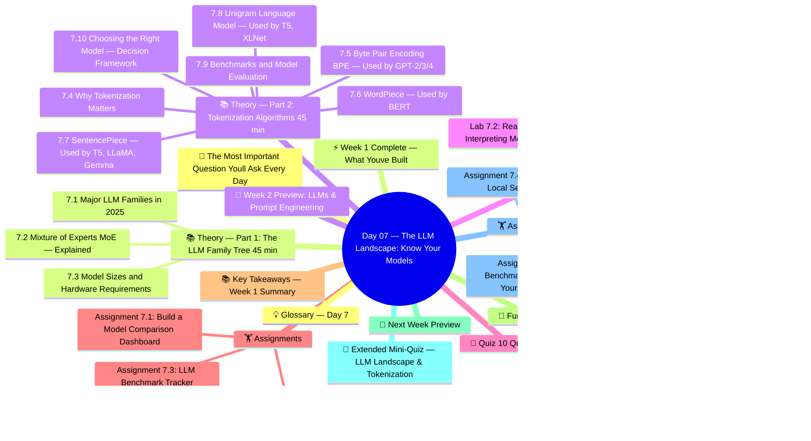

# Day 07 — The LLM Landscape: Know Your Models

> **Week 1 | Foundations** | ⏱️ Estimated Time: 4–5 hours | 🔥 Difficulty: Intermediate

---

## 🤔 The Most Important Question You'll Ask Every Day

Here's a scenario that happens in every GenAI team, every week:

*"We need to add an AI feature. Which LLM should we use?"*

In 2020, this question had an easy answer: GPT-3. There were maybe 5 serious options.

In 2025, there are over **120 production-ready LLMs** with meaningfully different characteristics. The choice matters enormously:
- Wrong model for your context length = silent truncation and wrong answers
- Wrong model for your latency needs = users waiting 30 seconds per query
- Wrong model for your safety requirements = PR disaster
- Wrong model for your budget = 10× higher costs than necessary

The stakes are real. A startup I know switched from GPT-4 to Gemini Flash + LLAMA 3.1 70B for lower-stakes queries and reduced their monthly AI inference cost from $22,000 to $4,000 — without measurable quality loss.

Another team chose GPT-4o-mini for a legal document review system. The model hallucinated cited cases. They should have used Claude 3.5 Sonnet with its 200K context window to process full documents. A costly mistake.

**Model selection is a first-class engineering skill.** Today, you build the framework and practical intuition to make these decisions confidently.

We also tackle **tokenization algorithms** — the unglamorous but surprisingly interesting plumbing that converts text into model-readable integers. Why do emojis cost more tokens? Why does `python` tokenize differently from `Python`? Why does the same sentence cost more in BERT than GPT? All of this today.

---

## 🧠 Concept Map




---

## 🎯 Learning Objectives

By the end of today you will:

- [ ] Describe each major LLM family (GPT, Claude, Gemini, LLaMA, Mistral, Phi, DeepSeek, Qwen) and their key differentiators
- [ ] Explain how Mixture of Experts (MoE) enables Mixtral to be efficient
- [ ] Understand quantization formats (FP16, INT8, Q4_K_M) and calculate VRAM requirements
- [ ] Explain BPE, WordPiece, SentencePiece, and Unigram LM tokenization algorithms
- [ ] Read benchmark leaderboards (MMLU, HumanEval, HELM) and understand their limitations
- [ ] Use a model selection decision framework for any given use case
- [ ] Run a local model with no API key using Ollama

---

## 📚 Theory — Part 1: The LLM Family Tree (45 min)

### 7.1 Major LLM Families in 2025

The LLM landscape has evolved from a handful of proprietary models to a rich ecosystem of open and closed models.

#### 🔷 OpenAI — GPT Family

| Model | Params | Context | Key Strength | Best For |
|---|---|---|---|---|
| **GPT-4o** | ~200B (est) | 128K | Multimodal, fastest | General tasks, vision |
| **GPT-4o mini** | ~8B (est) | 128K | Speed + cost | High-volume apps |
| **o1** | Unknown | 128K | Deep reasoning | Math, code, logic |
| **o3-mini** | Unknown | 200K | Efficient reasoning | Coding tasks |
| **GPT-3.5 Turbo** | 175B | 16K | Legacy, cheap | Simple tasks |

**Key GPT Features:**
- Tool/function calling with parallel execution
- Vision (image understanding) in GPT-4o
- JSON mode for structured outputs
- Fine-tuning support (GPT-4o-mini, GPT-3.5)
- Assistants API with thread management

---

#### 🟣 Anthropic — Claude Family

| Model | Context | Key Strength |
|---|---|---|
| **Claude 3.5 Sonnet** | 200K | Best coding, instruction following |
| **Claude 3.5 Haiku** | 200K | Fastest Claude, low cost |
| **Claude 3 Opus** | 200K | Most capable (older) |

**Key Claude Features:**
- 200K context window — best for very long documents
- Constitutional AI training — very safe, refuses harmful tasks
- Excellent at following complex multi-step instructions
- Computer Use (beta) — can control computers
- Strong at reasoning, coding, and analysis

**Claude's "Constitutional AI":**
Unlike RLHF (human feedback), Anthropic uses an AI-generated "constitution" of values to guide model behavior. This leads to more consistent harmlessness.

---

#### 🔵 Google — Gemini Family

| Model | Context | Key Strength |
|---|---|---|
| **Gemini 1.5 Pro** | 1M | Best context window, multimodal |
| **Gemini 1.5 Flash** | 1M | Fast, cheap |
| **Gemini 2.0 Flash** | 1M | Enhanced, agentic |
| **Gemma 2 27B** | 8K | Open weights |
| **Gemma 2 9B / 2B** | 8K | On-device capabilities |

**Key Gemini Features:**
- 1M token context — can process entire books, codebases
- Natively multimodal (text, image, audio, video, code)
- Google Search integration via Grounding
- Gemma models: open-weight, Apache 2.0 licensed

---

#### 🦙 Meta — LLaMA Family (Open Source)

| Model | Params | Context | License |
|---|---|---|---|
| **LLaMA 3.1 405B** | 405B | 128K | Custom (open) |
| **LLaMA 3.1 70B** | 70B | 128K | Custom (open) |
| **LLaMA 3.1 8B** | 8B | 128K | Custom (open) |
| **LLaMA 3.2 11B Vision** | 11B | 128K | Custom (open) |
| **Code LLaMA 70B** | 70B | 100K | Custom (open) |

**Why LLaMA matters:**
- Completely open weights — run locally with Ollama, llama.cpp
- Foundation for 100s of fine-tuned models (Mistral, OpenHermes, etc.)
- No per-token API costs — unlimited local inference
- Active research community, constant new variants

---

#### ⚡ Mistral AI — Efficient Models

| Model | Params | Architecture | Key Feature |
|---|---|---|---|
| **Mistral Large 2** | ~70B | Dense | Best-in-class at size |
| **Mistral 7B** | 7B | Dense | Best 7B model (GQA, SWA) |
| **Mixtral 8×7B** | 47B active/141B total | MoE | Fast inference, ~70B quality |
| **Mixtral 8×22B** | 141B active/390B | MoE | Best open MoE |
| **Codestral** | 22B | Dense | Code generation |

**Mistral's Innovations:**
- Grouped Query Attention (GQA) for efficient inference
- Sliding Window Attention (SWA) for long contexts
- Mixture of Experts (MoE) architecture (Mixtral)

---

#### 🏭 Other Notable Models

| Model | Company | Highlight |
|---|---|---|
| **Qwen 2.5 72B** | Alibaba | Excellent multilingual, open |
| **Phi-3 / Phi-4** | Microsoft | Small but powerful (3.8B-14B) |
| **Falcon 180B** | TII (UAE) | Large open model |
| **Command R+** | Cohere | RAG-optimized, 128K |
| **DBRX** | Databricks | MoE, 132B, fully open |
| **Yi-34B** | 01.AI | Strong multilingual |
| **DeepSeek V3** | DeepSeek | 671B MoE, competitive with GPT-4o |

---

### 7.2 Mixture of Experts (MoE) — Explained

Standard (dense) models activate ALL parameters for every token.

**MoE Models (Mixtral, GPT-4 reportedly, Gemini 1.5):**
```
Dense 7B:    Every token activates 7B parameters
MoE 8×7B:   Every token activates only 2 of 8 "experts" (each is 7B)
             = 14B active parameters but 56B total stored
```

**Architecture:**
```
Input Token
    ↓
Router Network (trained)
    ↓ selects top-K experts (usually K=2)
Expert 1 (FFN) │ Expert 2 (FFN) │ ... Expert N (FFN)
    ↓                ↓
Weighted Combination
    ↓
Output
```

**Benefits:**
- Same inference cost as a much smaller dense model
- Stores and leverages knowledge from all experts
- Different tokens can specialize to different experts

**Challenges:**
- Expert load balancing (all tokens going to same expert = waste)
- More total memory needed (all experts must be in VRAM)
- Communication overhead in distributed settings

---

### 7.3 Model Sizes and Hardware Requirements

Understanding model quantization is essential for deploying open models.

**Quantization Formats:**

| Format | Bits per weight | Quality vs FP32 | VRAM for 7B |
|---|---|---|---|
| FP32 | 32 | Baseline | 28 GB |
| FP16 / BF16 | 16 | ~100% | 14 GB |
| INT8 | 8 | ~99% | 7 GB |
| Q8_0 | 8 | ~99% | 7 GB |
| Q5_K_M | ~5.5 | ~97% | 5 GB |
| Q4_K_M | ~4.5 | ~95% | 4 GB |
| Q3_K_M | ~3.5 | ~90% | 3 GB |
| Q2_K | 2.6 | ~75% | 2.5 GB |

**GPU VRAM Required (FP16):**

| Model | VRAM Needed | GPU Options |
|---|---|---|
| 7B | ~14 GB | RTX 4090 (24GB), A100 40GB |
| 13B | ~26 GB | A100 40GB (tight), 2×RTX 4090 |
| 34B | ~68 GB | A100 80GB, 2×A40 |
| 70B | ~140 GB | 2×A100 80GB |
| 405B | ~810 GB | 8×A100 80GB |

**Quantized (Q4_K_M) VRAM:**
- 7B: 4.1 GB — runs on RTX 3060 12GB!
- 13B: 7.9 GB
- 70B: 39 GB — runs on RTX 4090 with offloading

---

## 📚 Theory — Part 2: Tokenization Algorithms (45 min)

### 7.4 Why Tokenization Matters

Before text enters an LLM, it must be converted to integers (token IDs). The choice of tokenization algorithm affects:
- **Vocabulary efficiency**: How many tokens for a given text
- **Cross-lingual support**: How well it handles non-English
- **Context utilization**: Fewer tokens = more text fits in context window
- **Cost**: More tokens = more API cost

---

### 7.5 Byte Pair Encoding (BPE) — Used by GPT-2/3/4

**BPE Algorithm:**
1. Start with character-level vocabulary
2. Count all pairs of adjacent tokens in training corpus
3. Merge the most frequent pair into a new token
4. Repeat until vocabulary size is reached

**Example walkthrough:**

Initial corpus: `"low low low lower lowest"`

```
Step 0 (characters):
  l o w  →  l o w (3 tokens each)
  l o w e r  →  5 tokens
  l o w e s t  →  6 tokens

Step 1: Most frequent pair = ('l', 'o') → merge to 'lo'
  lo w lo w lo w lo w e r lo w e s t

Step 2: Most frequent pair = ('lo', 'w') → merge to 'low'
  low low low low e r low e s t

Step 3: Most frequent pair = ('low', 'e') → merge to 'lowe'
  ...
```

**GPT-4's tokenizer (cl100k_base):** 100,277 tokens, byte-level BPE.

---

### 7.6 WordPiece — Used by BERT

Similar to BPE but merges based on **likelihood increase** rather than frequency.

**Formula for merge score:**
```
score(a, b) = frequency(ab) / (frequency(a) × frequency(b))
```

Prefers merges that most improve the language model probability.

**Characteristic:** Unknown words are split with `##` prefix:
```
"unimaginable" → ['un', '##ima', '##gin', '##able']
```

---

### 7.7 SentencePiece — Used by T5, LLaMA, Gemma

Unlike BPE/WordPiece which work on pre-tokenized words, SentencePiece treats the entire sentence as a raw stream of characters (including spaces).

**Key properties:**
- **Language-agnostic**: Works on any language without pre-tokenization
- **Lossless tokenization**: Can always reconstruct exact original text
- **Two algorithms**: BPE or Unigram LM (both supported)
- Treats spaces as part of tokens (▁ prefix marks word-start)

**LLaMA example:**
```
"Hello, world!" → ['▁Hello', ',', '▁world', '!']
```

---

### 7.8 Unigram Language Model — Used by T5, XLNet

Starts with a large vocabulary and iteratively **removes** tokens that minimize language model performance.

**Key differences from BPE:**
- BPE: greedy, builds up vocabulary
- Unigram: probabilistic, prunes vocabulary
- Can output multiple tokenizations with different probabilities
- Used with SentencePiece framework

---

### 7.9 Benchmarks and Model Evaluation

#### Key Benchmarks

**General Intelligence:**
| Benchmark | What It Measures |
|---|---|
| **MMLU** | 57 academic subjects (math, law, medicine, etc.) |
| **HELM** | Comprehensive language understanding (20+ scenarios) |
| **BIG-Bench** | Diverse challenging tasks beyond standard NLP |
| **ARC** | Grade-school science questions |

**Reasoning:**
| Benchmark | What It Measures |
|---|---|
| **GSM8K** | Grade school math word problems |
| **MATH** | Competition-level math (harder than GSM8K) |
| **HellaSwag** | Common sense reasoning / story completion |
| **WinoGrande** | Winograd schema — pronoun disambiguation |

**Coding:**
| Benchmark | What It Measures |
|---|---|
| **HumanEval** | Python programming problems (OpenAI's benchmark) |
| **MBPP** | Mostly basic Python programming tasks |
| **SWE-bench** | Real GitHub issue resolution (very hard) |

**Safety:**
| Benchmark | What It Measures |
|---|---|
| **TruthfulQA** | Avoidance of common human misconceptions |
| **BBQ** | Bias and stereotype evaluation |

#### Where to Check Current Rankings

- [LMSYS Chatbot Arena](https://chat.lmsys.org/) — Elo-based human preference ranking
- [Open LLM Leaderboard](https://huggingface.co/spaces/HuggingFaceH4/open_llm_leaderboard) — Open models
- [Papers with Code NLP Benchmarks](https://paperswithcode.com/sota/language-modelling-on-penn-treebank-word)
- [Scale AI HELM](https://crfm.stanford.edu/helm/)

---

### 7.10 Choosing the Right Model — Decision Framework

```
Decision Tree: Which LLM to Use?

1. Does it need to run locally/offline?
   YES → LLaMA 3, Mistral, Phi-3 (use Ollama)
   NO  → Continue ↓

2. What's the primary task?
   └─ Coding          → GPT-4o, Claude 3.5 Sonnet, Codestral
   └─ Long documents  → Claude 3.5 Sonnet (200K), Gemini 1.5 Pro (1M)
   └─ Images/Vision   → GPT-4o, Gemini 1.5 Pro
   └─ Speed critical  → GPT-4o-mini, Gemini Flash, Claude Haiku
   └─ Budget critical → GPT-4o-mini, Gemini Flash
   └─ Safety critical → Claude (Constitutional AI)
   └─ General         → GPT-4o, Claude 3.5 Sonnet

3. What's the context requirement?
   >200K  → Gemini 1.5 Pro (1M context)
   ~128K  → GPT-4o, LLaMA 3.1
   ~200K  → Claude 3.5 Sonnet
   <16K   → Any model (all cover this)

4. Cost budget per 1M tokens (approx 2025)?
   <$1    → Gemini Flash, GPT-4o-mini
   $1-5   → GPT-4o-mini, Claude Haiku
   $5-15  → GPT-4o, Claude 3.5 Sonnet
   $15+   → GPT-4o, Claude 3.5 Opus (for hardest tasks)
```

---

## 💻 Labs (90 min)

### Lab 7.1: Tokenizer Deep Dive

```python
# lab_07_01_tokenizer_deep_dive.py
"""
Deep dive into different tokenization algorithms.
Compare BPE (GPT), WordPiece (BERT), and SentencePiece (LLaMA/T5).
"""
import tiktoken
from transformers import (
    GPT2Tokenizer, BertTokenizer, T5Tokenizer, AutoTokenizer
)

print("=" * 70)
print("Tokenizer Comparison — BPE vs WordPiece vs SentencePiece")
print("=" * 70)

# Load tokenizers
gpt4_enc = tiktoken.get_encoding("cl100k_base")       # GPT-4's tokenizer
gpt2_tok = GPT2Tokenizer.from_pretrained("gpt2")      # BPE (GPT-2)
bert_tok = BertTokenizer.from_pretrained("bert-base-uncased")   # WordPiece
t5_tok = T5Tokenizer.from_pretrained("t5-small")      # SentencePiece

def compare_tokenizers(text):
    """Compare how 4 tokenizers handle the same text."""
    print(f"\nInput: '{text}'")
    print("-" * 60)

    # GPT-4 tokenizer
    gpt4_tokens = gpt4_enc.encode(text)
    gpt4_token_strs = [gpt4_enc.decode([t]) for t in gpt4_tokens]
    print(f"GPT-4 (cl100k):    {len(gpt4_tokens):3d} tokens | {gpt4_token_strs}")

    # GPT-2 tokenizer
    gpt2_tokens = gpt2_tok.tokenize(text)
    print(f"GPT-2 (BPE):       {len(gpt2_tokens):3d} tokens | {gpt2_tokens}")

    # BERT tokenizer
    bert_tokens = bert_tok.tokenize(text.lower())
    print(f"BERT (WordPiece):  {len(bert_tokens):3d} tokens | {bert_tokens}")

    # T5 tokenizer
    t5_tokens = t5_tok.tokenize(text)
    print(f"T5 (SentencePiece):{len(t5_tokens):3d} tokens | {t5_tokens}")

# Test various text types
test_texts = [
    "Hello, World!",
    "The Transformer architecture revolutionized NLP in 2017.",
    "Generative Adversarial Networks (GANs) were introduced by Ian Goodfellow.",
    "def fibonacci(n): return n if n <= 1 else fibonacci(n-1) + fibonacci(n-2)",
    "日本語のテキスト (Japanese text)",
    "Привет мир (Russian: Hello World)",
    "🎉 Emoji support test 🤖 AI is ❤️ amazing!",
    "antidisestablishmentarianism",
    "  spaces   and\ttabs\nnewlines  ",
    "https://huggingface.co/models?sort=downloads&search=llama",
]

for text in test_texts:
    compare_tokenizers(text)

# Efficiency analysis
print("\n" + "=" * 70)
print("Tokenization Efficiency Analysis")
print("=" * 70)

import requests
# Load a Wikipedia article
wiki_text = """
Artificial intelligence (AI) is intelligence—perceiving, synthesizing,
and inferring information—demonstrated by machines, as opposed to the
intelligence displayed by animals and humans. Example tasks in which this
is done include speech recognition, computer vision, translation between
languages, as well as other mappings of inputs. AI applications include
advanced web search engines, recommendation systems, understanding human
speech, self-driving cars, and competing at the highest level in strategic
game systems.
"""

gpt4_count = len(gpt4_enc.encode(wiki_text))
gpt2_count = len(gpt2_tok.tokenize(wiki_text))
bert_count = len(bert_tok.tokenize(wiki_text.lower()))
t5_count = len(t5_tok.tokenize(wiki_text))
word_count = len(wiki_text.split())

print(f"\nSample text: {word_count} words, {len(wiki_text)} characters")
print(f"GPT-4:   {gpt4_count} tokens  ({gpt4_count/word_count:.2f} tokens/word)")
print(f"GPT-2:   {gpt2_count} tokens  ({gpt2_count/word_count:.2f} tokens/word)")
print(f"BERT:    {bert_count} tokens  ({bert_count/word_count:.2f} tokens/word)")
print(f"T5:      {t5_count} tokens  ({t5_count/word_count:.2f} tokens/word)")

# Vocabulary comparison
print(f"\nVocabulary sizes:")
print(f"  GPT-4 (cl100k): {gpt4_enc.n_vocab:,} tokens")
print(f"  GPT-2:          {len(gpt2_tok.get_vocab()):,} tokens")
print(f"  BERT:           {len(bert_tok.get_vocab()):,} tokens")
print(f"  T5:             {len(t5_tok.get_vocab()):,} tokens")

print("\n✅ Tokenizer analysis complete!")
```

### Lab 7.2: Reading and Interpreting Model Cards

```python
# lab_07_02_model_cards_and_benchmarks.py
"""
Programmatically access model info, benchmarks, and metadata from Hugging Face Hub.
Learn to evaluate and compare models systematically.
"""
from huggingface_hub import (
    HfApi, model_info, list_models, ModelCard
)
import json

api = HfApi()

print("=" * 70)
print("Model Card Analysis & Benchmark Interpretation")
print("=" * 70)

# ---- 1. Explore Model Metadata ----
print("\n1. Top Downloaded Open-Source LLMs")
print("-" * 50)

# Get top models by task
top_models = list(list_models(
    task="text-generation",
    sort="downloads",
    direction=-1,
    limit=15
))

print(f"{'Model':<45} {'Downloads':>12}")
print("-" * 60)
for model in top_models:
    print(f"{model.id:<45} {model.downloads:>12,}")

# ---- 2. Detailed Model Information ----
print("\n2. Detailed Model Info — LLaMA 3.1 8B")
print("-" * 50)

try:
    meta_llama = model_info("meta-llama/Llama-3.1-8B-Instruct")
    print(f"Model ID:      {meta_llama.id}")
    print(f"Author:        {meta_llama.author}")
    print(f"Downloads/mo:  {meta_llama.downloads:,}")
    print(f"Likes:         {meta_llama.likes:,}")
    print(f"Library:       {meta_llama.library_name}")
    print(f"Tags:          {', '.join(meta_llama.tags[:10])}")
    if hasattr(meta_llama, 'model_index'):
        print(f"Benchmarks:    {meta_llama.model_index}")
except Exception as e:
    print(f"  (Note: {e})")

# ---- 3. Benchmark Scorecard ----
print("\n3. LLM Benchmark Scorecard (2025 Data)")
print("-" * 50)

# Representative benchmark scores from public leaderboards
benchmark_data = {
    "Model": [
        "GPT-4o",
        "Claude 3.5 Sonnet",
        "Gemini 1.5 Pro",
        "LLaMA 3.1 405B",
        "LLaMA 3.1 70B",
        "Mixtral 8×22B",
        "LLaMA 3.1 8B",
        "Mistral 7B",
        "Phi-3 Medium (14B)",
        "Gemma 2 9B",
    ],
    "MMLU (%)": [88.7, 88.3, 85.9, 87.3, 83.6, 77.8, 73.0, 64.2, 78.0, 71.3],
    "HumanEval (%)": [90.2, 92.0, 84.1, 89.0, 80.5, 75.1, 72.6, 34.1, 77.8, 68.9],
    "GSM8K (%)": [92.9, 96.4, 90.8, 93.7, 91.4, 88.9, 84.5, 52.2, 88.0, 78.3],
    "Approx Cost ($/1M in)": [5.0, 3.0, 3.5, 3.0, 0.9, 0.6, 0.1, 0.1, "Local", "Local"],
}

import pandas as pd
df = pd.DataFrame(benchmark_data)
df = df.set_index("Model")
print(df.to_string())

print("""
Key Observations:
  - GPT-4o and Claude 3.5 Sonnet lead on coding (HumanEval)
  - LLaMA 3.1 405B is near GPT-4o quality — impressive open model
  - Phi-3 Medium (14B) punches far above its weight class
  - Cost gap: 8B models are 50x cheaper than frontier models
  - Open models enable zero marginal cost at scale
""")

# ---- 4. Model Selection for Common Use Cases ----
print("4. Model Recommendation Engine")
print("-" * 50)

def recommend_model(
    task: str,
    context_len: int,
    budget: str,  # "free", "cheap", "medium", "unlimited"
    needs_local: bool,
    needs_vision: bool
):
    """Recommend the best model for given requirements."""
    recommendations = []

    if needs_local:
        if task == "code":
            recommendations = ["LLaMA 3.1 8B/70B (Ollama)", "Codestral (local)", "DeepSeek Coder"]
        else:
            recommendations = ["LLaMA 3.1 8B (Ollama)", "Mistral 7B", "Phi-3 Mini"]

    elif needs_vision:
        recommendations = ["GPT-4o", "Gemini 1.5 Pro", "Claude 3.5 Sonnet"]

    elif context_len > 200000:
        recommendations = ["Gemini 1.5 Pro (1M context)", "Claude 3.5 Sonnet (200K)"]

    elif budget == "free":
        recommendations = ["Gemini 1.5 Flash (free tier)", "GPT-4o-mini (cheap)", "LLaMA via Groq"]

    elif task == "code":
        if budget in ["medium", "unlimited"]:
            recommendations = ["GPT-4o", "Claude 3.5 Sonnet", "Codestral API"]
        else:
            recommendations = ["GPT-4o-mini", "DeepSeek Coder V2"]

    elif task == "summarization" and context_len > 50000:
        recommendations = ["Gemini 1.5 Pro", "Claude 3.5 Sonnet"]

    elif budget == "cheap":
        recommendations = ["GPT-4o-mini", "Gemini 1.5 Flash", "Claude 3.5 Haiku"]

    else:
        recommendations = ["GPT-4o", "Claude 3.5 Sonnet", "Gemini 1.5 Pro"]

    return recommendations


# Test the recommender
scenarios = [
    {"task": "code", "context_len": 4096, "budget": "cheap", "needs_local": False, "needs_vision": False},
    {"task": "summarization", "context_len": 500000, "budget": "medium", "needs_local": False, "needs_vision": False},
    {"task": "general", "context_len": 4096, "budget": "free", "needs_local": False, "needs_vision": False},
    {"task": "general", "context_len": 4096, "budget": "free", "needs_local": True, "needs_vision": False},
    {"task": "vision", "context_len": 4096, "budget": "unlimited", "needs_local": False, "needs_vision": True},
]

for s in scenarios:
    recs = recommend_model(**s)
    print(f"\n  Task={s['task']}, Context={s['context_len']}, Budget={s['budget']}, "
          f"Local={s['needs_local']}, Vision={s['needs_vision']}")
    print(f"  → Recommended: {', '.join(recs[:2])}")

print("\n✅ Model landscape analysis complete!")
```

### Lab 7.3: Running Models Locally with Ollama

```python
# lab_07_03_ollama_local_models.py
"""
Run LLMs completely locally using Ollama.
No API key, no cost, complete privacy.
Requires: https://ollama.ai installed and models pulled.
"""
import requests
import json
import time

OLLAMA_BASE = "http://localhost:11434"

def check_ollama_running():
    """Check if Ollama server is running."""
    try:
        response = requests.get(f"{OLLAMA_BASE}/", timeout=5)
        return response.status_code == 200
    except requests.ConnectionError:
        return False

def list_local_models():
    """List all locally available models."""
    response = requests.get(f"{OLLAMA_BASE}/api/tags")
    return response.json().get("models", [])

def generate(model: str, prompt: str, stream: bool = False, **options):
    """Generate text with a local model via Ollama API."""
    payload = {
        "model": model,
        "prompt": prompt,
        "stream": stream,
        "options": {
            "temperature": options.get("temperature", 0.7),
            "top_k": options.get("top_k", 40),
            "top_p": options.get("top_p", 0.9),
            "num_predict": options.get("max_tokens", 512),
        }
    }
    response = requests.post(f"{OLLAMA_BASE}/api/generate", json=payload)
    result = response.json()
    return result.get("response", "")

def chat(model: str, messages: list, **options):
    """Chat with a local model using the chat API."""
    payload = {
        "model": model,
        "messages": messages,
        "stream": False,
        "options": options
    }
    response = requests.post(f"{OLLAMA_BASE}/api/chat", json=payload)
    return response.json()["message"]["content"]

def stream_generate(model: str, prompt: str):
    """Stream token-by-token generation."""
    payload = {"model": model, "prompt": prompt, "stream": True}
    with requests.post(f"{OLLAMA_BASE}/api/generate", json=payload, stream=True) as resp:
        for line in resp.iter_lines():
            if line:
                chunk = json.loads(line)
                if not chunk.get("done"):
                    yield chunk.get("response", "")

def benchmark_model(model: str, prompt: str):
    """Benchmark generation speed (tokens/sec)."""
    payload = {"model": model, "prompt": prompt, "stream": False}
    start = time.time()
    response = requests.post(f"{OLLAMA_BASE}/api/generate", json=payload)
    elapsed = time.time() - start
    result = response.json()
    tokens = result.get("eval_count", 0)
    return tokens, elapsed, tokens / elapsed if elapsed > 0 else 0


if __name__ == "__main__":
    print("=" * 60)
    print("Ollama Local LLM Runner")
    print("=" * 60)

    if not check_ollama_running():
        print("\n⚠️  Ollama is not running!")
        print("Install from: https://ollama.ai")
        print("Then pull models:")
        print("  ollama pull llama3.2")
        print("  ollama pull mistral")
        print("  ollama pull phi3")
        print("  ollama pull nomic-embed-text  # for embeddings")
    else:
        print("\n✅ Ollama is running!")

        models = list_local_models()
        print(f"\nAvailable local models ({len(models)}):")
        for m in models:
            size_gb = m.get("size", 0) / (1024**3)
            print(f"  {m['name']:<40} {size_gb:.1f} GB")

        if models:
            model_name = models[0]["name"]
            print(f"\nTesting with: {model_name}")

            # Basic generation
            print("\n1. Basic Generation:")
            response = generate(
                model_name,
                "What is Generative AI? Answer in exactly 3 bullet points.",
                temperature=0.3
            )
            print(response)

            # Chat mode
            print("\n2. Multi-turn Chat:")
            conversation = [
                {"role": "user", "content": "What is LangChain?"},
            ]
            reply1 = chat(model_name, conversation)
            print(f"Assistant: {reply1[:200]}...")

            conversation.append({"role": "assistant", "content": reply1})
            conversation.append({"role": "user", "content": "Give me a code example."})
            reply2 = chat(model_name, conversation)
            print(f"\nAssistant (follow-up): {reply2[:200]}...")

            # Streaming
            print("\n3. Streaming output:")
            print("Response: ", end="", flush=True)
            for token in stream_generate(model_name, "Count from 1 to 5 and explain each number."):
                print(token, end="", flush=True)
            print()

            # Benchmark
            print("\n4. Speed Benchmark:")
            prompt = "Write a Python function to compute Fibonacci numbers and explain how it works."
            tokens, elapsed, tps = benchmark_model(model_name, prompt)
            print(f"  Generated {tokens} tokens in {elapsed:.1f}s = {tps:.1f} tokens/sec")

    print("\n✅ Ollama lab complete!")
```

### Lab 7.4: Comparing 3 LLMs on the Same Task

```python
# lab_07_04_model_comparison.py
"""
Systematically compare OpenAI, Anthropic, and Google models on the same tasks.
Useful for model selection and evaluation.
"""
import os
import time
from openai import OpenAI
import anthropic
import google.generativeai as genai
from dotenv import load_dotenv

load_dotenv()

openai_client = OpenAI(api_key=os.getenv("OPENAI_API_KEY"))
anthropic_client = anthropic.Anthropic(api_key=os.getenv("ANTHROPIC_API_KEY"))
genai.configure(api_key=os.getenv("GOOGLE_API_KEY"))
gemini_model = genai.GenerativeModel("gemini-1.5-flash")

def call_openai(prompt, model="gpt-4o-mini"):
    start = time.time()
    resp = openai_client.chat.completions.create(
        model=model,
        messages=[{"role": "user", "content": prompt}],
        max_tokens=512
    )
    return resp.choices[0].message.content, time.time() - start, resp.usage.total_tokens

def call_claude(prompt, model="claude-3-haiku-20240307"):
    start = time.time()
    resp = anthropic_client.messages.create(
        model=model, max_tokens=512,
        messages=[{"role": "user", "content": prompt}]
    )
    return resp.content[0].text, time.time() - start, resp.usage.input_tokens + resp.usage.output_tokens

def call_gemini(prompt):
    start = time.time()
    resp = gemini_model.generate_content(prompt)
    return resp.text, time.time() - start, -1  # Gemini doesn't always return token count

TASKS = {
    "reasoning": """
    A farmer has 17 sheep. All but 9 die. How many are left?
    Show your reasoning step by step.
    """,

    "coding": """
    Write a Python function that implements binary search.
    Include docstring, type hints, and a test with 5 examples.
    """,

    "creative": """
    Write a 4-line poem about Generative AI from the perspective of
    a confused software developer learning about Transformers.
    """,

    "summarization": """
    Summarize the key idea of the Transformer architecture in exactly 2 sentences.
    Target audience: a high school student.
    """,

    "instruction_following": """
    List exactly 5 open-source LLMs released after 2023.
    Format: numbered list, model name in bold, one key feature per line.
    Do not include any other text. Just the 5 items.
    """
}

print("=" * 80)
print("Multi-Model Comparison Benchmark")
print("=" * 80)

results = {}
for task_name, prompt in TASKS.items():
    print(f"\n{'='*80}")
    print(f"TASK: {task_name.upper()}")
    print(f"Prompt: {prompt.strip()[:100]}...")
    print("=" * 80)

    task_results = {}

    # OpenAI
    try:
        text, latency, tokens = call_openai(prompt)
        task_results["GPT-4o-mini"] = {"response": text, "latency": latency, "tokens": tokens}
        print(f"\n[GPT-4o-mini] ({latency:.2f}s, {tokens} tokens):")
        print(text[:300])
    except Exception as e:
        print(f"[GPT-4o-mini] Error: {e}")

    # Claude
    try:
        text, latency, tokens = call_claude(prompt)
        task_results["Claude Haiku"] = {"response": text, "latency": latency, "tokens": tokens}
        print(f"\n[Claude Haiku] ({latency:.2f}s, {tokens} tokens):")
        print(text[:300])
    except Exception as e:
        print(f"[Claude Haiku] Error: {e}")

    # Gemini
    try:
        text, latency, tokens = call_gemini(prompt)
        task_results["Gemini Flash"] = {"response": text, "latency": latency, "tokens": tokens}
        print(f"\n[Gemini Flash] ({latency:.2f}s):")
        print(text[:300])
    except Exception as e:
        print(f"[Gemini Flash] Error: {e}")

    results[task_name] = task_results

# Summary table
print("\n\n" + "=" * 80)
print("PERFORMANCE SUMMARY (Latency in seconds)")
print("=" * 80)
print(f"{'Task':<25} {'GPT-4o-mini':>12} {'Claude Haiku':>14} {'Gemini Flash':>14}")
print("-" * 65)
for task, task_res in results.items():
    gpt_lat = f"{task_res.get('GPT-4o-mini', {}).get('latency', -1):.1f}s"
    claude_lat = f"{task_res.get('Claude Haiku', {}).get('latency', -1):.1f}s"
    gemini_lat = f"{task_res.get('Gemini Flash', {}).get('latency', -1):.1f}s"
    print(f"{task:<25} {gpt_lat:>12} {claude_lat:>14} {gemini_lat:>14}")

print("\n✅ Multi-model comparison complete!")
```

---

## 🎯 Quiz (10 Questions)

1. What is the main difference between BPE, WordPiece, and SentencePiece tokenization?
2. Why does the same English text have different token counts in GPT-4 vs BERT?
3. What is a Mixture of Experts (MoE) model? What is the benefit during inference?
4. How much VRAM do you approximately need to run LLaMA 3 8B in full fp16 precision?
5. What does Q4_K_M quantization mean, and how does it reduce memory usage?
6. What is the MMLU benchmark measuring? What score would be considered "human expert" level?
7. What is the key difference between LMSYS Chatbot Arena and the Open LLM Leaderboard?
8. Why does Claude have a 200K context window while GPT-3.5 had only 4K? What changed architecturally?
9. What is "Constitutional AI" used by Anthropic and how does it differ from RLHF?
10. What does `TruthfulQA` measure? Why is it important for production LLM applications?

---

## 🏋️ Assignments

### Assignment 7.1: Build a Model Comparison Dashboard
Create a Streamlit app that:
- Takes any text prompt as input
- Sends it to GPT-4o-mini, Claude Haiku, and Gemini Flash simultaneously (using asyncio)
- Displays responses side by side with latency and token count
- Allows the user to "vote" which response is best
- Logs votes to a CSV file for analysis

### Assignment 7.2: Tokenization Cost Calculator
Build a tool that:
- Takes any text file as input
- Reports token counts for GPT-4o, Claude, and Gemini tokenizers
- Estimates API costs based on current pricing
- Identifies the most "token-efficient" model for that specific content type
- Creates a cost projection for 1K, 10K, 100K document queries

### Assignment 7.3: LLM Benchmark Tracker
Using the Hugging Face Hub API:
- Track the top 20 open-source models on MMLU, HumanEval, and GSM8K
- Create a pandas DataFrame with all benchmark scores
- Plot radar charts comparing model capabilities
- Identify which model is the "best value" (Score / VRAM_required)

---

## 📚 Key Takeaways — Week 1 Summary

You've now completed Week 1! Here's what you've mastered:

| Day | Topic | Key Skill Gained |
|---|---|---|
| 1 | AI & GenAI Intro | Understanding the landscape |
| 2 | Deep Learning | Neural networks, backprop |
| 3 | CNN/RNN/LSTM | Sequential model history |
| 4 | Transformers | Full from-scratch implementation |
| 5 | Attention Deep Dive | FlashAttention, KV cache, GQA |
| 6 | Python for GenAI | PyTorch, HuggingFace, OpenAI SDK |
| 7 | LLM Landscape | Choosing and comparing models |

**Week 2 Preview**: We dive into LLM APIs, prompt engineering (from zero-shot to advanced chain-of-thought), LangChain, and build your first real multi-turn chatbot!

---

## 📖 Further Reading

### Model Documentation
- [OpenAI Models Overview](https://platform.openai.com/docs/models)
- [Anthropic Model Guide](https://docs.anthropic.com/claude/docs/models-overview)
- [Google Gemini API docs](https://ai.google.dev/gemini-api/docs/models/gemini)
- [Meta LLaMA 3 Model Card](https://huggingface.co/meta-llama/Meta-Llama-3.1-8B)

### Tokenization Papers
- [BPE: Neural Machine Translation with Rare Words (Sennrich et al., 2016)](https://arxiv.org/abs/1508.07909)
- [SentencePiece: A simple and language independent subword tokenizer (Kudo, 2018)](https://arxiv.org/abs/1808.06226)

### Benchmark Resources
- [MMLU Paper](https://arxiv.org/abs/2009.03300)
- [HELM Report](https://crfm.stanford.edu/helm/)
- [Open LLM Leaderboard](https://huggingface.co/spaces/HuggingFaceH4/open_llm_leaderboard)

---

## 🔗 Next Week Preview

---

## 🎯 Extended Mini-Quiz — LLM Landscape & Tokenization

1. You have a 250,000-token legal document to analyze. You need to find all references to a specific clause and summarize them. Which model(s) could handle this? What's the minimum context window required, and which model(s) in 2025 meet this threshold?

2. Mixtral 8×7B has 47B *active* parameters. A user argues it's "just a 47B model." Why is this comparison misleading? What's the full parameter count, and how does it affect inference vs training memory costs?

3. BPE and WordPiece look similar on the surface but differ in one key way. Describe that difference concisely. Which algorithm would produce MORE tokens for a rare word not seen during training?

4. Why does the text `"Python"` often tokenize to fewer tokens than `"python"` in BPE tokenizers? What does this reveal about training corpus characteristics?

5. A model trained on sequences up to 4096 tokens is asked to process a 6000-token document. What are THREE different things that could happen (depending on implementation), and which is most common in production APIs?

6. **VRAM calculation**: You want to run LLaMA 3.1 70B in INT8 quantization. How many GB of VRAM do you need minimum? Which GPU configurations could host this? (Show calculation)

7. MMLU measures performance across 57 academic subjects. Explain TWO reasons why a model's MMLU score might NOT predict its performance on your specific production use case.

8. Constitutional AI (used by Anthropic for Claude) vs RLHF (used by OpenAI for GPT). What is the key philosophical difference? How does this affect Claude's behavior in edge cases?

9. You are evaluating `Phi-3 Medium (14B)` vs `LLaMA 3.1 70B` for a code generation task. Phi-3 scores 77.8% on MMLU vs LLaMA's 83.6%. A team member argues you should always pick the higher MMLU score. Counter this argument with specific reasoning.

10. **Strategic question**: Your startup needs to build a multi-lingual customer support bot (English, Japanese, Arabic, Portuguese). Rank these models in terms of multilingual capability and justify your ranking: `GPT-4o`, `Qwen 2.5 72B`, `LLaMA 3.1 70B`, `Mistral Large 2`.

---

## 🏋️ Assignments

### Assignment 7.1: Build a Model Selection Tool
Create a Python CLI that:
1. Asks the user 5 questions: task type, context length needed, budget ($/month), latency requirement, and whether local deployment is needed
2. Based on answers, recommends top 3 models with justification for each
3. Shows estimated monthly cost for each recommendation
4. Validate: run it on 3 realistic scenarios and check if recommendations make sense

### Assignment 7.2: Tokenizer Forensics
1. Find a sentence in a non-English language of your choice
2. Tokenize it with GPT-4's `cl100k_base`, BERT's WordPiece, and T5's SentencePiece
3. Count tokens per language and per tokenizer
4. Which tokenizer is most efficient for that language? Why might different tokenizers handle different languages differently?
5. Find an example where emojis are particularly expensive — how many tokens does `🤘🤘🤘` cost in each?

### Assignment 7.3: Benchmark a Model on Your Own Data
1. Choose a task relevant to something you care about (e.g., code generation, creative writing, factual QA)
2. Create a test set of 20 input-output pairs
3. Run the same inputs through 3 different models (can use free tiers)
4. Score manually or with an LLM-as-judge approach
5. Compare: which model "wins" on your data? Does this match their public benchmark rankings?

### Assignment 7.4: Ollama Local Setup
1. Install Ollama from https://ollama.ai
2. Pull three models: `llama3.2`, `mistral`, and `phi3`
3. Run the same 5 prompts through each model locally
4. Measure and compare: tokens/second generation speed
5. Calculate: if you ran 10,000 prompts/day locally vs via API, how much would you save monthly?

---

## 💡 Glossary — Day 7

| Term | Definition |
|---|---|
| **LLM** | Large Language Model — Transformer trained to predict next tokens at massive scale |
| **BPE** | Byte Pair Encoding — merges most frequent character pairs iteratively |
| **WordPiece** | BERT's tokenizer — merges based on likelihood increase, uses `##` for suffixes |
| **SentencePiece** | Language-agnostic tokenizer treating raw byte stream (LLaMA, T5, Gemma) |
| **Unigram LM** | Probabilistic tokenizer that prunes vocabulary to maximize likelihood |
| **Vocabulary** | Set of all tokens a model can produce; GPT-4 = 100K, BERT = 30K |
| **Quantization** | Reducing model weight precision (FP32 → INT8 → Q4) to reduce memory |
| **GGUF** | File format for quantized models used by llama.cpp and Ollama |
| **Q4_K_M** | 4-bit quantization scheme with ~95% quality retention vs FP32 |
| **VRAM** | GPU memory — models must fit in VRAM to run on GPU |
| **MoE** | Mixture of Experts — only a subset of model parameters active per token |
| **Expert** | Specialized FFN sublayer in a MoE model |
| **Router** | Learned function that determines which experts to activate per token |
| **Load Balancing** | Ensuring all experts are used roughly equally in MoE training |
| **Constitutional AI** | Anthropic's training approach using an AI-generated "constitution" of values |
| **RLHF** | Reinforcement Learning from Human Feedback — trains models on human preferences |
| **MMLU** | Massive Multitask Language Understanding — 57-subject academic benchmark |
| **HumanEval** | OpenAI's code benchmark — function completion tasks in Python |
| **GSM8K** | Grade school math word problems — tests step-by-step reasoning |
| **TruthfulQA** | Benchmark for measuring whether models avoid common human misconceptions |
| **HELM** | Holistic Evaluation of LMs — Stanford's comprehensive multi-scenario benchmark |
| **Chatbot Arena** | LMSYS human-preference Elo-based ranking of LLMs |
| **Context Window** | Maximum tokens a model can process in one call (input + output) |
| **Ollama** | Tool for running quantized LLMs locally with a simple API |
| **Model Card** | Documentation sheet describing a model's training, capabilities, and limitations |
| **Open Source** | Models with publicly available weights (LLaMA, Mistral, Gemma, Phi) |
| **Proprietary** | Models with private weights accessed only via API (GPT-4, Claude, Gemini Pro) |

---

## ⚡ Week 1 Complete — What You've Built

Congratulations. You just completed Week 1: Foundations. Let's take stock:

```
Day 1: You understood what GenAI is and made your first API calls
Day 2: You implemented neural networks from scratch — backprop and all
Day 3: You built CNNs, RNNs, and LSTMs — and know why each was invented
Day 4: You traced a complete Transformer architecture, component by component
Day 5: You understand attention engineering at a production level
Day 6: Your toolbox is complete: NumPy, PyTorch, HuggingFace, OpenAI SDK
Day 7: You can navigate the LLM ecosystem and make informed model choices
```

You now have a stronger theoretical and practical foundation in Generative AI than most people who call themselves "AI practitioners." That's not hyperbole — most practitioners are API consumers, not foundation-understanders.

**The difference matters.** When something goes wrong (and it will), you'll know *why* it went wrong. When someone proposes a solution that sounds clever but violates basic principles, you'll catch it. When a new model is released, you'll be able to evaluate its claims against your mental model.

---

## 🚀 Week 2 Preview: LLMs & Prompt Engineering

Now that you understand the foundation, we start *building*.

Week 2 is about using LLMs effectively in production:
- **Day 8**: LLM APIs at scale — batching, parallelism, cost optimization
- **Day 9**: Prompt engineering fundamentals — system prompts, few-shot, format control
- **Day 10**: Advanced prompting — Chain-of-Thought, Tree-of-Thought, ReAct
- **Day 11**: LangChain framework — chains, agents, memory
- **Day 12**: Conversation memory management — sliding windows, summarization, vector memory
- **Day 13**: Structured outputs — JSON mode, Pydantic, function calling
- **Day 14**: Week 2 Project — a fully functional multi-turn AI assistant

> 💬 *"The beginning of wisdom is the definition of terms."* — Socrates  
> (You've defined your terms. Now let's build with them.)

See you in Week 2. 🚀

---
*Day 7 of 30 | Week 1: Foundations | GenAI Mastery Course*
