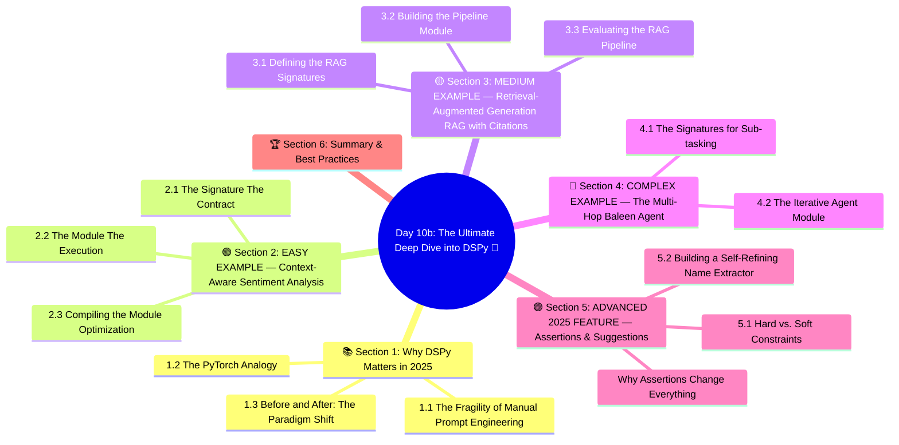

# Day 10b: The Ultimate Deep Dive into DSPy 🧐
### Week 2 — Large Language Models & Prompting

---

## 🧠 Concept Map




---

## 🎯 Learning Objectives

By the end of this deep dive, you will be able to:
1.  **Understand the DSPy Paradigm:** Shift your mental model from "writing prompts" to "programming language architectures."
2.  **Master Signatures & Modules:** Build reusable LLM components with strict inputs and outputs.
3.  **Implement Real-World DSPy Pipelines:** Progress from easy text classification to complex multi-hop retrieval agents.
4.  **Evaluate and Compile:** Create datasets, write metrics, and use DSPy teleprompters (optimizers) to mathematically improve your pipeline's accuracy.
5.  **Enforce Constraints:** Utilize `dspy.Assert` and `dspy.Suggest` to build self-refining, hallucination-resistant LLM loops.

**Estimated Time to Complete:** 4-5 Hours

---

## 📚 Section 1: Why DSPy Matters in 2025

Before we write code, we must understand the fundamental problem that DSPy solves. 

### 1.1 The Fragility of Manual Prompt Engineering

Traditional prompt engineering is incredibly fragile. If you write a complex 500-word system prompt for GPT-4 to extract financial data, and next month your company forces you to switch to a cheaper, local Llama-3 model, your prompt will likely break entirely. 

Different models require different prompt structures, different XML tags, and different formatting of few-shot examples to achieve the same result. Modifying string prompts is a game of "whack-a-mole." You tweak the prompt to fix a hallucination, and suddenly the LLM forgets how to output valid JSON. You add an instruction to ensure JSON, and it stops extracting all the required entities.

### 1.2 The PyTorch Analogy

**DSPy (Declarative Self-Improving Language Programs)** fixes this by treating Large Language Models exactly how PyTorch treats neural networks. 

*   In PyTorch, you define the architecture (layers), and an **optimizer** finds the mathematical weights. You don't calculate the weights by hand.
*   In DSPy, you define the architecture (Signatures) and the data flow (Modules), and a **Teleprompter (Compiler)** automatically discovers the best prompt instructions and few-shot examples for whatever specific model you are using. You don't write the prompt strings by hand.

### 1.3 Before and After: The Paradigm Shift
*   **Before (LangChain/OpenAI):** `prompt_string = f"You are an expert. Summarize {text} in format {schema}. Do not lie."`
*   **After (DSPy):** `class Summarize(dspy.Signature): text = dspy.InputField(); summary = dspy.OutputField()`

By moving from linguistic string manipulation to structural programming, developers can finally build enterprise-grade, deterministic LLM systems.

---

## 🟢 Section 2: EASY EXAMPLE — Context-Aware Sentiment Analysis

Let's start with a foundational example. We want an LLM to read a customer support ticket and classify its sentiment and urgency.

In LangChain or raw OpenAI, you'd write a massive prompt string to instruct the LLM on exactly how to behave. In DSPy, we declare the datatypes using a **Signature**.

### 2.1 The Signature (The Contract)

A Signature defines *what* goes in and *what* comes out. It is devoid of conversational filler.

```python
import dspy

# 1. Configure the Language Model to use locally or via API
# We configure a primary LM (the one making the predictions)
lm = dspy.LM('ollama/llama3', api_base='http://localhost:11434', temperature=0.1)
dspy.configure(lm=lm)

# 2. Define the Signature
class SupportTicketRouting(dspy.Signature):
    """Analyze a customer support ticket and extract routing information."""
    
    # What data are we feeding the model?
    user_message: str = dspy.InputField(desc="The message sent by the customer.")
    
    # What specific data do we want back?
    sentiment: str = dspy.OutputField(desc="Must be Exactly: Angry, Frustrated, Neutral, or Happy")
    requires_human: bool = dspy.OutputField(desc="True if the user is threatening to cancel or demanding a manager, False otherwise")
    department: str = dspy.OutputField(desc="Billing, Technical Support, or General Inquiry")
```

### 2.2 The Module (The Execution)

Now we instantiate a Module to execute this signature. We will use `dspy.ChainOfThought`, which automatically gives the LLM a hidden "scratchpad" to reason about the ticket before outputting the final fields.

```python
# Create the executor Module
router = dspy.ChainOfThought(SupportTicketRouting)

# Run a zero-shot test case immediately
ticket_text = "I've been charged twice this month for my premium subscription and my app keeps crashing when I try to open the settings! I want a refund NOW or I'm leaving!"

# Call the module just like a Python function
result = router(user_message=ticket_text)

print("--- EXECUTING ZERO-SHOT ---")
print(f"Reasoning Scratchpad: {result.reasoning}")
print(f"Sentiment: {result.sentiment}")
print(f"Requires Human: {result.requires_human}")
```

### 2.3 Compiling the Module (Optimization)

The zero-shot execution above is nice, but it's not the DSPy way. The magic of DSPy is **compiling**. If the zero-shot performance is only 60% accurate, we compile it with a dataset to push it to 95%.

```python
from dspy.teleprompt import BootstrapFewShot

# 1. Define a tiny dataset (Examples of what good looks like)
trainset = [
    dspy.Example(
        user_message="How do I reset my password?", 
        sentiment="Neutral", requires_human=False, department="Technical Support"
    ).with_inputs("user_message"),
    
    dspy.Example(
        user_message="I HATE THIS APP. YOU STOLE MY MONEY. I WANT TO SPEAK TO THE CEO.", 
        sentiment="Angry", requires_human=True, department="Billing"
    ).with_inputs("user_message")
]

# 2. Define a metric to evaluate success (Does it match our expectations?)
def routing_metric(example, prediction, trace=None):
    return (example.sentiment == prediction.sentiment) and (example.requires_human == prediction.requires_human)

# 3. Setup the Optimizer (Teleprompter)
optimizer = BootstrapFewShot(metric=routing_metric, max_bootstrapped_demos=2)

# 4. Compile! DSPy simulates the pipeline, scores it, and discovers the best prompt.
print("Compiling the Router module...")
compiled_router = optimizer.compile(student=router, trainset=trainset)

# 5. Use the highly-optimized compiled module in production
compiled_result = compiled_router(user_message="I love the new update, but my invoice looks wrong.")
```

**Why this is revolutionary:** We never wrote a prompt. The `BootstrapFewShot` optimizer automatically extracted the reasoning paths from our training set and built an incredibly robust prompt under the hood specifically tailored for our underlying Llama 3 model.

---

## 🟡 Section 3: MEDIUM EXAMPLE — Retrieval-Augmented Generation (RAG) with Citations

Let's move to intermediate complexity. A standard RAG system fetches documents and answers a question. But enterprise RAG systems must also **cite their sources** mathematically so we don't accidentally hallucinate facts based on pre-training data.

### 3.1 Defining the RAG Signatures

We need a signature that takes a question and a list of retrieved documents, and outputs an answer *plus* the specific document IDs used.

```python
class GenerateCitedAnswer(dspy.Signature):
    """Answer the user's question. You must base your answer strictly on the provided context. If the answer is not in the context, output 'Insufficient Information'."""
    
    context: list[str] = dspy.InputField(desc="List of retrieved documents containing facts")
    question: str = dspy.InputField()
    
    answer: str = dspy.OutputField(desc="A detailed, factual answer.")
    sources_used: list[int] = dspy.OutputField(desc="A Python list of the indices of the context documents that actually contained the answer.")
```

### 3.2 Building the Pipeline Module

In DSPy, we build complex pipelines by subclassing `dspy.Module`. This allows us to connect Retrievers to Generators elegantly.

```python
class CitedRAG(dspy.Module):
    def __init__(self, num_passages=3):
        super().__init__()
        # Initialize our Retriever (e.g., ColBERT, ChromaDB, Pinecone)
        self.retrieve = dspy.Retrieve(k=num_passages)
        
        # Initialize our Generator
        self.generate = dspy.ChainOfThought(GenerateCitedAnswer)

    def forward(self, question):
        # 1. Retrieve the top K passages based on the raw question
        retrieved_results = self.retrieve(question).passages
        
        # 2. Generate the answer using the retrieved context
        prediction = self.generate(context=retrieved_results, question=question)
        
        # 3. Return the exact state in a Prediction object
        return dspy.Prediction(
            context=retrieved_results,
            answer=prediction.answer,
            sources_used=prediction.sources_used,
            reasoning=prediction.reasoning
        )
```

### 3.3 Evaluating the RAG Pipeline

In DSPy, we evaluate mathematically using a Metric function.

```python
# A DSPy metric takes the Ground Truth (example) and the LLM Output (pred)
def validate_citations(example, pred, trace=None):
    # Check 1: Did the LLM actually output a list for sources?
    if not isinstance(pred.sources_used, list):
        return 0.0
        
    # Check 2: Are the sources cited actually valid indices in the retrieved context?
    valid_indices = range(len(pred.context))
    for source_idx in pred.sources_used:
        if source_idx not in valid_indices:
            return 0.0 # Failed constraint: The LLM hallucinated a source index!
            
    # Check 3: Is the answer factually correct? 
    # (In reality, we would use an LLM-as-a-judge here instead of string matching)
    if example.answer.lower() not in pred.answer.lower():
        return 0.0
        
    return 1.0 # Perfect pass
```

By defining rigorous metrics, we remove "vibes-based development" and transition GenAI into a true software engineering discipline.

---

## 🔴 Section 4: COMPLEX EXAMPLE — The Multi-Hop "Baleen" Agent

Now for an advanced, production-grade architecture. 

Standard RAG searches fail on "Multi-Hop" queries. 
**Query:** *"Who is the CEO of the company that acquired WhatsApp?"*

A standard vector database search for this exact string will likely return nothing, because answering the question requires two independent hops of logical deduction:
1.  **Hop 1:** Find out who acquired WhatsApp. (Answer: Meta/Facebook)
2.  **Hop 2:** Use the answer from Hop 1 to query: Who is the CEO of Meta? (Answer: Mark Zuckerberg)

We will build an iterative loop in DSPy—an architecture called "Baleen"—that generates a search query, reads the results, generates a *new* search query based on what it learned, and then finally synthesizes the final answer.

### 4.1 The Signatures for Sub-tasking

We break the big task into two smaller Signatures.

```python
class GenerateSearchQuery(dspy.Signature):
    """Take a complex question and the context gathered so far, and write a simple 2-4 word search query to find the next missing piece of information."""
    context_gathered = dspy.InputField(desc="Information we already know")
    original_question = dspy.InputField(desc="The ultimate goal")
    next_search_query = dspy.OutputField(desc="A short keyword search query")

# We recycle our GenerateCitedAnswer signature from Section 3!
```

### 4.2 The Iterative Agent Module

Notice how clean the Python logic is. We use standard `for` loops and array extensions to manage the contextual state.

```python
class BaleenAgent(dspy.Module):
    def __init__(self, max_hops=2, passages_per_hop=2):
        super().__init__()
        self.max_hops = max_hops
        
        # We create a UNIQUE query generator for each hop!
        # This is critical: It allows DSPy's compiler to learn entirely different 
        # prompts for Hop 1 (broad search) vs Hop 2 (narrow search based on context).
        self.query_generators = [dspy.ChainOfThought(GenerateSearchQuery) for _ in range(max_hops)]
        
        self.retrieve = dspy.Retrieve(k=passages_per_hop)
        self.final_generator = dspy.ChainOfThought(GenerateCitedAnswer)

    def forward(self, question):
        # We start with an empty context array
        cumulative_context = []
        
        # The Reasoning/Acting Multi-Hop Loop
        for hop in range(self.max_hops):
            # 1. Ask the LLM: "Based on what we know so far, what should we search for next?"
            query_pred = self.query_generators[hop](
                context_gathered=cumulative_context, 
                original_question=question
            )
            
            # 2. Execute the sub-search against our vector database
            new_passages = self.retrieve(query_pred.next_search_query).passages
            
            # 3. Add the new findings to our global knowledge base for this session
            cumulative_context.extend(new_passages)
            
            # (Best Practice: Deduplicate cumulative_context here to save token costs)

        # 4. Now that we have completed all hops, generate the final synthesized answer
        final_answer = self.final_generator(
            context=cumulative_context, 
            question=question
        )
        
        return dspy.Prediction(
            final_answer=final_answer.answer,
            total_context_used=cumulative_context,
            hop_queries=[hq.next_search_query for hq in self.query_generators]
        )
```

The magic of DSPy is that if this complex `BaleenAgent` fails zero-shot (e.g. the LLM gets confused on Hop 2), we don't fix it by manually rewriting prompts. We **Compile** it over a dataset of 50 multi-hop questions using `BootstrapFewShot`. DSPy will mathematically discover the optimal prompts to make the multi-hop loop successful.

---

## 🟣 Section 5: ADVANCED 2025 FEATURE — Assertions & Suggestions

If you've followed the examples above, you might wonder: *What happens if the LLM output doesn't match my exact requirements during runtime? What if it hallucinates?*

In traditional environments, a bad LLM output breaks your system and throws a 500 error. In 2024–2025, DSPy introduced a monumental feature called **Computational Constraints** (`dspy.Assert` and `dspy.Suggest`). 

These features allow your DSPy module to mathematically check its own output. If the constraint fails, DSPy **automatically backtracks**, modifies the internal prompt to include the exact error message, and forces the LLM to self-refine and try again!

### 5.1 Hard vs. Soft Constraints
*   `dspy.Assert`: A **Hard Constraint**. If the condition is false, DSPy forces the LLM to retry. If it reaches the maximum number of retries (default 3) and still fails, the program halts and throws an `AssertionError`. Use this for critical schema validation.
*   `dspy.Suggest`: A **Soft Constraint**. If the condition is false, DSPy forces the LLM to retry. However, if it reaches max retries, it simply logs a warning and allows the program to continue with the flawed output. Use this for stylistic guidelines or length preferences.

### 5.2 Building a Self-Refining Name Extractor

Let's build a programmatic module that extracts human names but mathematically enforces two rules via Assert and Suggest.

```python
import dspy

class ExtractNames(dspy.Signature):
    """Extract human names from the text."""
    text = dspy.InputField()
    names = dspy.OutputField(desc="A comma-separated list of names")

class VerifiedExtractor(dspy.Module):
    def __init__(self):
        super().__init__()
        self.extractor = dspy.ChainOfThought(ExtractNames)

    def forward(self, text):
        # 1. Generate the initial prediction
        pred = self.extractor(text=text)
        
        # 2. Hard Constraint (dspy.Assert)
        # Corporate Policy: Never extract the CEO's name (Sam Altman).
        # If "Sam Altman" is in the output, this assertion fails. DSPy intercepts 
        # the failure and forces the LLM to re-evaluate its answer with the 'msg'.
        dspy.Assert(
            "Sam Altman" not in pred.names,
            msg="CRITICAL: You illegally extracted 'Sam Altman'. You must remove him from the list of names."
        )
        
        # 3. Soft Constraint (dspy.Suggest)
        # Preference: We prefer the output to be strictly less than 50 characters.
        # If it fails 3 times, we will just accept it anyway.
        dspy.Suggest(
            len(pred.names) < 50,
            msg="STYLISTIC: The list is a bit too long. Try to truncate it or include only the most important names."
        )
        
        # 4. Return the verified, self-refined output
        return pred

# --- Execution ---
module = VerifiedExtractor()

# Crucially, you must explicitly activate assertions on the module before running it
module = module.activate_assertions(max_backtracking_attempts=3)

# Run the module
result = module(text="The meeting was attended by Sam Altman, Greg Brockman, and Ilya Sutskever.")

print(result.names) 
# The initial LLM run will output: "Sam Altman, Greg Brockman, Ilya Sutskever"
# The Assertion will FIRE. The LLM will backtrack and self-correct.
# The FINAL output will be: "Greg Brockman, Ilya Sutskever"
```

### Why Assertions Change Everything
With `dspy.Assert`, you no longer write massive "guardrail" prompt rules hoping the LLM obeys them. You write Python validation logic. If the LLM breaks the rules, DSPy creates an immediate feedback loop that forces the LLM to learn from its immediate mistake. This **self-refinement** is the cornerstone of reliable agentic systems.

---

## 🏆 Section 6: Summary & Best Practices

1. **Stop Hacking Strings:** If your Python file contains `f"Prompt: {variable}"`, you are accruing technical debt. Transition entirely to `dspy.Signature`.
2. **Use ChainOfThought:** Unless execution latency is your strictest bottleneck, wrapping your Signatures in `dspy.ChainOfThought` drastically improves LLM accuracy by forcing the model to plan its output in a scratchpad before generating the final fields.
3. **Build Datasets Early:** DSPy's optimizers require data. In the DSPy paradigm, you should spend your time collecting 100 perfectly formatted Examples (`question`, `answer`) instead of spending 3 hours tweaking a system prompt string.
4. **Compile for Portability:** When new models drop (e.g., Llama-4, GPT-5), you don't rewrite application code. You simply swap the `dspy.LM()` configuration object and click "Compile". DSPy will discover the new model's quirks and syntax requirements automatically.
5. **Enforce Constraints Programmatically:** Don't beg the LLM to output valid JSON in the prompt. Parse the output in Python, and use `dspy.Assert` to automatically retry the generation if the parsing fails.

---

*Day 10b Complete | You are now thinking like a true 2025 GenAI System Engineer.*
*Next: Return to standard Day 11 — LangChain Intro*
