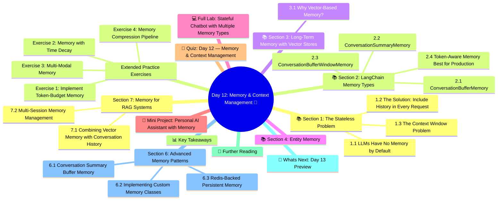

# Day 12: Memory & Context Management 🧠
### Week 2 — Large Language Models & Prompting

---

## 🧠 Concept Map




---

## 🎯 Learning Objectives

By the end of today, you will:
- Understand why LLMs are stateless by default
- Implement multiple types of conversation memory
- Manage context windows efficiently
- Use vector-store based long-term memory
- Build a fully stateful chatbot with persistent memory

**Estimated Time:** 3.5–4 hours  
**Difficulty:** ⭐⭐⭐ Intermediate  
**Prerequisites:** Days 9–11

---

## 📚 Section 1: The Stateless Problem

### 1.1 LLMs Have No Memory by Default

Every time you call an LLM API, it processes the messages you send — and nothing else. It has no recollection of previous conversations. The model itself is stateless.

This creates a practical problem:

```
Turn 1: User: "My name is Alice and I'm a data scientist."
         AI:  "Hello Alice! Nice to meet you."
         
Turn 2: User: "What's my name?"
         AI:  "I don't know your name."  ← Because Turn 1 isn't in the context!
```

### 1.2 The Solution: Include History in Every Request

The simplest memory approach: send the entire conversation history with every API call.

```python
# The naive approach — manual history management
import os
from openai import OpenAI
from dotenv import load_dotenv

load_dotenv()
client = OpenAI(api_key=os.getenv("OPENAI_API_KEY"))

conversation_history = [
    {"role": "system", "content": "You are a helpful assistant."}
]

def chat_with_memory(user_message: str) -> str:
    # Add user message to history
    conversation_history.append({
        "role": "user",
        "content": user_message
    })
    
    # Send FULL history every time
    response = client.chat.completions.create(
        model="gpt-4o-mini",
        messages=conversation_history,
        temperature=0.7
    )
    
    assistant_message = response.choices[0].message.content
    
    # Add AI response to history
    conversation_history.append({
        "role": "assistant",
        "content": assistant_message
    })
    
    return assistant_message

# Demonstrate memory
print(chat_with_memory("My name is Alice and I'm a data scientist at TechCorp."))
print(chat_with_memory("I'm working on a customer churn prediction model."))
print(chat_with_memory("What do you know about me so far?"))  # Tests memory
```

### 1.3 The Context Window Problem

The naive approach works until conversations get long. With a 128K token context window and an average of 150 words/turn, you can fit ~850 turns. But:
- Cost grows linearly with conversation length
- Very long contexts can hurt model performance
- Memory efficiency matters for production systems

We need smarter memory strategies.

---

## 📚 Section 2: LangChain Memory Types

### 2.1 ConversationBufferMemory

Stores all messages verbatim — simplest form:

```python
from langchain.memory import ConversationBufferMemory
from langchain_openai import ChatOpenAI
from langchain_core.prompts import ChatPromptTemplate, MessagesPlaceholder
from langchain_core.runnables.history import RunnableWithMessageHistory
from langchain_community.chat_message_histories import ChatMessageHistory
from dotenv import load_dotenv
import os

load_dotenv()

# Store for sessions
session_store = {}

def get_session_history(session_id: str):
    """Get or create message history for a session"""
    if session_id not in session_store:
        session_store[session_id] = ChatMessageHistory()
    return session_store[session_id]

# Model and prompt with message history placeholder
model = ChatOpenAI(model="gpt-4o-mini", temperature=0.7)

prompt = ChatPromptTemplate.from_messages([
    ("system", "You are a helpful assistant. Remember everything the user tells you."),
    MessagesPlaceholder(variable_name="history"),  # Message history goes here
    ("human", "{input}")
])

# Create the base chain
chain = prompt | model

# Wrap with message history
chain_with_history = RunnableWithMessageHistory(
    chain,
    get_session_history,
    input_messages_key="input",
    history_messages_key="history"
)

def chat(session_id: str, user_message: str) -> str:
    response = chain_with_history.invoke(
        {"input": user_message},
        config={"configurable": {"session_id": session_id}}
    )
    return response.content

# Demo — session 1
print("=== SESSION 1: Alice ===")
print("AI:", chat("alice_session", "Hi! I'm Alice, a machine learning engineer."))
print("AI:", chat("alice_session", "I specialize in computer vision at a healthcare startup."))
print("AI:", chat("alice_session", "What do you remember about me?"))

# Demo — different session (separate memory!)
print("\n=== SESSION 2: Bob (separate memory) ===")
print("AI:", chat("bob_session", "Hey, I'm Bob, a backend developer."))
print("AI:", chat("bob_session", "What do you know about me?"))

# Alice should still remember everything
print("\n=== Back to SESSION 1: Alice ===")
print("AI:", chat("alice_session", "What field do I work in?"))
```

### 2.2 ConversationSummaryMemory

Summarizes old conversation to save tokens:

```python
from langchain.memory import ConversationSummaryMemory
from langchain_openai import ChatOpenAI

model = ChatOpenAI(model="gpt-4o-mini", temperature=0)

# This memory auto-summarizes when it gets long
summary_memory = ConversationSummaryMemory(
    llm=model,
    max_token_limit=200,  # When context > 200 tokens, summarize!
    return_messages=True
)

# Manually add messages to see how summarization works
from langchain_core.messages import HumanMessage, AIMessage

summary_memory.save_context(
    {"input": "My name is Carlos. I'm from Spain."},
    {"output": "Nice to meet you Carlos! How can I help you today?"}
)

summary_memory.save_context(
    {"input": "I'm building an e-commerce platform for artisan crafts."},
    {"output": "That sounds like a wonderful project! Artisan crafts have great market potential."}
)

summary_memory.save_context(
    {"input": "I'm using React for frontend and FastAPI for backend."},
    {"output": "Great stack choices! React with FastAPI is very popular for modern web apps."}
)

summary_memory.save_context(
    {"input": "My main challenge is implementing search with filters for 10,000+ products."},
    {"output": "For large-scale product search, I'd recommend Elasticsearch or Typesense."}
)

# Check what was preserved
print("SUMMARY MEMORY CONTENTS:")
memory_vars = summary_memory.load_memory_variables({})
print(memory_vars)
print(f"\nMoving Window Summary: {summary_memory.moving_summary_buffer}")
```

### 2.3 ConversationBufferWindowMemory

Keeps only the last N interactions:

```python
from langchain.memory import ConversationBufferWindowMemory

# Keep only last 5 turns (10 messages = 5 user + 5 AI)
window_memory = ConversationBufferWindowMemory(
    k=5,  # Number of TURN PAIRS to remember
    return_messages=True
)

# Simulate a long conversation
for i in range(10):
    window_memory.save_context(
        {"input": f"Message {i+1} from user"},
        {"output": f"Response {i+1} from AI"}  
    )

vars = window_memory.load_memory_variables({})
print("Window memory (last 5 turns):")
for msg in vars["history"]:
    print(f"  {msg.type}: {msg.content}")
```

### 2.4 Token-Aware Memory (Best for Production)

```python
from langchain.memory import ConversationTokenBufferMemory
from langchain_openai import ChatOpenAI
import tiktoken

model = ChatOpenAI(model="gpt-4o-mini")

# Keep recent messages that fit within token budget
token_memory = ConversationTokenBufferMemory(
    llm=model,
    max_token_limit=2000,  # Max tokens to keep in memory
    return_messages=True
)

# This will automatically drop oldest messages when over budget
messages = [
    ("Tell me about transformer architecture", "Transformers use self-attention mechanisms..."),
    ("What are the key components?", "The main components are: encoder, decoder, attention heads..."),
    # ... more messages
]

for human, ai in messages:
    token_memory.save_context({"input": human}, {"output": ai})

print("Token-aware memory keeps only what fits in budget:")
print(token_memory.load_memory_variables({}))
```

---

## 📚 Section 3: Long-Term Memory with Vector Stores

### 3.1 Why Vector-Based Memory?

All the memory types above are "in-context memory" — they simply stuff messages into the context window. For truly long conversations (100s of turns), you need **external memory** that can be searched semantically.

**Vector-store memory approach:**
1. Store each conversation turn as an embedding in a vector database
2. For each new query, retrieve the K most semantically relevant past messages
3. Include only those relevant memories in the context

This allows effectively unlimited conversation history!

```python
from langchain_community.vectorstores import Chroma
from langchain_openai import OpenAIEmbeddings, ChatOpenAI
from langchain.memory import VectorStoreRetrieverMemory
from langchain_core.prompts import ChatPromptTemplate
from langchain_core.output_parsers import StrOutputParser
import os
from dotenv import load_dotenv

load_dotenv()

# Setup vector store for memory
embeddings = OpenAIEmbeddings()
vectorstore = Chroma(
    collection_name="conversation_memory",
    embedding_function=embeddings,
    persist_directory="./memory_store"
)

retriever = vectorstore.as_retriever(search_kwargs={"k": 5})  # Get top 5 relevant memories

# Vector store memory
memory = VectorStoreRetrieverMemory(
    retriever=retriever,
    memory_key="relevant_history",
    return_docs=False
)

model = ChatOpenAI(model="gpt-4o-mini", temperature=0.7)
parser = StrOutputParser()

# Store past conversations
past_facts = [
    ("What's your name?", "I'm Ana, a software engineer from Brazil."),
    ("What do you work on?", "I work on distributed systems at a fintech company."),
    ("Do you have any pets?", "Yes! I have two cats named Pixel and Byte."),
    ("What programming languages do you use?", "I mainly use Go and Python. Rust is my hobby language."),
    ("What are you working on now?", "Building a real-time fraud detection system using Kafka and Redis."),
    ("What is your educational background?", "Computer Science degree from USP São Paulo."),
    ("Do you have any side projects?", "Yes, I'm building an open-source CLI tool for database migrations."),
]

print("Loading past conversations into vector memory...")
for human, ai in past_facts:
    memory.save_context({"input": human}, {"output": ai})

def chat_with_vector_memory(question: str) -> str:
    # Retrieve relevant memories
    relevant_history = memory.load_memory_variables({"input": question})
    
    prompt_text = f"""You are a helpful assistant. You have some relevant memories from past conversations.

Relevant memories:
{relevant_history.get('relevant_history', 'No relevant memories found.')}

Current question from user: {question}

Answer naturally, using the relevant context you have about this person."""
    
    response = model.invoke(prompt_text)
    
    # Save this exchange too
    memory.save_context({"input": question}, {"output": response.content})
    
    return response.content

# Test retrieval — these should retrieve relevant memories
print("\n=== TESTING SEMANTIC MEMORY RETRIEVAL ===")
questions = [
    "What does the user do for a living?",         # → fintech, distributed systems
    "Does the user have any animals at home?",      # → Pixel and Byte
    "What coding project is the user currently doing?",  # → fraud detection
    "What languages does the user code in?",        # → Go, Python, Rust
]

for q in questions:
    print(f"\n❓ {q}")
    answer = chat_with_vector_memory(q)
    print(f"🤖 {answer[:300]}")
```

---

## 📚 Section 4: Entity Memory

Track specific entities (people, projects, concepts) throughout a conversation:

```python
from langchain.memory import ConversationEntityMemory
from langchain_openai import ChatOpenAI
from langchain.chains import ConversationChain

model = ChatOpenAI(model="gpt-4o", temperature=0.5)

entity_memory = ConversationEntityMemory(
    llm=model,
    entity_extraction_prompt=None  # Uses default
)

chain = ConversationChain(
    llm=model,
    memory=entity_memory,
    verbose=False
)

# Have a conversation with entities
exchanges = [
    "Sarah is my boss at Nexa Corp. She's been there for 10 years.",
    "My project, called Athena, is a real-time analytics dashboard.",
    "Sarah wants Athena to be ready by March 15th.",
    "My teammate David is handling the backend API for Athena.",
    "What are the key milestones for Athena and who owns them?",  # Tests entity tracking
]

print("=== ENTITY MEMORY DEMO ===")
for msg in exchanges:
    print(f"\nUser: {msg}")
    response = chain.predict(input=msg)
    print(f"AI: {response[:300]}")

print("\n\n=== STORED ENTITIES ===")
entities = entity_memory.entity_store.store
for entity, info in entities.items():
    print(f"\n[{entity.upper()}]")
    print(info[:300])
```

---

## 💻 Full Lab: Stateful Chatbot with Multiple Memory Types

```python
# lab_day12_stateful_chatbot.py
"""
Day 12 Lab — Build a production-ready stateful chatbot
with configurable memory strategies and persistence.
"""

import os, json, sqlite3
from datetime import datetime
from pathlib import Path
from langchain_openai import ChatOpenAI
from langchain_core.prompts import ChatPromptTemplate, MessagesPlaceholder
from langchain_core.runnables.history import RunnableWithMessageHistory
from langchain_community.chat_message_histories import (
    ChatMessageHistory,
    SQLChatMessageHistory  # Persists to SQLite
)
from langchain_core.output_parsers import StrOutputParser
from dotenv import load_dotenv

load_dotenv()

class StatefulChatbot:
    """
    A production-ready chatbot with:
    - Session management
    - Persistent message history (SQLite)  
    - Token-aware context trimming
    - Conversation export
    """
    
    def __init__(self, model_name: str = "gpt-4o-mini", db_path: str = "chat_history.db"):
        self.model = ChatOpenAI(model=model_name, temperature=0.7)
        self.db_path = db_path
        self.parser = StrOutputParser()
        
        # Build the chain
        self.prompt = ChatPromptTemplate.from_messages([
            ("system", """You are a smart personal assistant. 
You remember everything from our conversation and use that context to provide helpful, personalized responses.
Today's date: {date}
"""),
            MessagesPlaceholder(variable_name="history"),
            ("human", "{input}")
        ])
        
        base_chain = self.prompt | self.model | self.parser
        
        # Wrap with persistent SQLite history
        self.chain = RunnableWithMessageHistory(
            base_chain,
            self._get_session_history,
            input_messages_key="input",
            history_messages_key="history"
        )
    
    def _get_session_history(self, session_id: str) -> SQLChatMessageHistory:
        """Get SQLite-backed message history for a session"""
        return SQLChatMessageHistory(
            session_id=session_id,
            connection_string=f"sqlite:///{self.db_path}"
        )
    
    def chat(self, session_id: str, message: str) -> str:
        """Send a message and get a response"""
        response = self.chain.invoke(
            {
                "input": message,
                "date": datetime.now().strftime("%B %d, %Y")
            },
            config={"configurable": {"session_id": session_id}}
        )
        return response
    
    def get_history(self, session_id: str) -> list:
        """Retrieve full conversation history"""
        history = self._get_session_history(session_id)
        return history.messages
    
    def export_conversation(self, session_id: str, output_path: str = None) -> str:
        """Export conversation to markdown format"""
        messages = self.get_history(session_id)
        
        lines = [f"# Conversation Export", 
                 f"**Session:** {session_id}",
                 f"**Exported:** {datetime.now().isoformat()}",
                 f"**Total Messages:** {len(messages)}",
                 "---\n"]
        
        for msg in messages:
            role = "👤 **You**" if msg.type == "human" else "🤖 **Assistant**"
            lines.append(f"{role}:\n{msg.content}\n")
        
        content = "\n".join(lines)
        
        if output_path:
            Path(output_path).write_text(content, encoding="utf-8")
            print(f"💾 Exported to {output_path}")
        
        return content
    
    def clear_session(self, session_id: str) -> None:
        """Clear all messages for a session"""
        history = self._get_session_history(session_id)
        history.clear()
        print(f"🗑️ Cleared session: {session_id}")
    
    def list_sessions(self) -> list:
        """List all session IDs in the database"""
        try:
            conn = sqlite3.connect(self.db_path)
            cursor = conn.execute(
                "SELECT DISTINCT session_id FROM message_store ORDER BY session_id"
            )
            sessions = [row[0] for row in cursor.fetchall()]
            conn.close()
            return sessions
        except Exception:
            return []
    
    def run_interactive(self, session_id: str):
        """Interactive chat loop"""
        print(f"\n🤖 Chatbot | Session: {session_id}")
        print("Commands: 'history' | 'export' | 'clear' | 'quit'")
        print("=" * 55)
        
        while True:
            user_input = input("\nYou: ").strip()
            
            if not user_input:
                continue
            elif user_input.lower() == "quit":
                print("Goodbye! 👋")
                break
            elif user_input.lower() == "history":
                messages = self.get_history(session_id)
                print(f"\n📜 History ({len(messages)} messages):")
                for msg in messages[-10:]:  # Show last 10
                    prefix = "You" if msg.type == "human" else "AI"
                    print(f"  {prefix}: {msg.content[:80]}...")
            elif user_input.lower() == "export":
                filename = f"conversation_{session_id}_{datetime.now().strftime('%Y%m%d_%H%M')}.md"
                self.export_conversation(session_id, filename)
            elif user_input.lower() == "clear":
                confirm = input("Clear all history? (yes/no): ")
                if confirm.lower() == "yes":
                    self.clear_session(session_id)
            else:
                response = self.chat(session_id, user_input)
                print(f"\n🤖 {response}")


# ── Context Window Management ─────────────────────────────

def trim_messages_to_token_limit(messages: list, max_tokens: int = 4000, 
                                  model: str = "gpt-4o-mini") -> list:
    """
    Trim message list to fit within token budget.
    Always preserves the system message and trims from the oldest messages.
    """
    import tiktoken
    
    enc = tiktoken.encoding_for_model(model)
    
    def count_tokens(text: str) -> int:
        return len(enc.encode(text))
    
    # Separate system message
    system_messages = [m for m in messages if m.get("role") == "system"]
    conv_messages = [m for m in messages if m.get("role") != "system"]
    
    # Count system token usage  
    system_tokens = sum(count_tokens(m["content"]) for m in system_messages)
    available_tokens = max_tokens - system_tokens
    
    # Add messages from newest to oldest until budget is full
    selected_messages = []
    token_count = 0
    
    for msg in reversed(conv_messages):
        msg_tokens = count_tokens(msg["content"]) + 4  # +4 for role/formatting
        if token_count + msg_tokens <= available_tokens:
            selected_messages.insert(0, msg)
            token_count += msg_tokens
        else:
            break  # Budget exceeded — stop adding older messages
    
    print(f"📊 Token Management: Kept {len(selected_messages)}/{len(conv_messages)} messages "
          f"({token_count}/{available_tokens} tokens used)")
    
    return system_messages + selected_messages


# ── Demo ─────────────────────────────────────────────────
if __name__ == "__main__":
    # Initialize chatbot
    bot = StatefulChatbot(model_name="gpt-4o-mini")
    
    # Simulated conversation to demo memory
    session_id = "demo_user_001"
    
    print("=" * 55)
    print("DEMO: Stateful Chatbot with Persistent Memory")
    print("=" * 55)
    
    test_exchanges = [
        "Hello! I'm Priya, a ML engineer working on recommender systems.",
        "I'm using PyTorch and Hugging Face Transformers in my current project.",
        "My biggest challenge is cold-start problem for new users in our recommendation engine.",
        "What are some approaches to handle my challenge?",
        "Thanks! Also, what tech stack did I mention I use?",  # Tests memory
    ]
    
    for msg in test_exchanges:
        print(f"\n👤 You: {msg}")
        response = bot.chat(session_id, msg)
        print(f"🤖 AI: {response[:350]}")
    
    # Show conversation history
    print(f"\n📜 Total messages in history: {len(bot.get_history(session_id))}")
    
    # Export conversation
    exported = bot.export_conversation(session_id)
    print("\n📄 CONVERSATION EXPORT PREVIEW:")
    print(exported[:600])
    
    print("\n✅ Day 12 Lab Complete!")
    
    # Optional: Start interactive mode
    # bot.run_interactive("my_session")
```

---

## 🎯 Mini Project: Personal AI Assistant with Memory

Build a personal AI assistant that:
1. Learns your preferences over time
2. Maintains separate memory streams for: work, personal, learning topics
3. Retrieves relevant memories based on context
4. Generates a weekly "what I know about you" summary
5. Stores all history in SQLite for persistence across application restarts

---

## 🧠 Quiz: Day 12 — Memory & Context Management

**Q1:** Why are LLMs "stateless" by default?
- A) They have no CPU cache
- B) **They have no mechanism to remember previous API calls ✅**
- C) They delete memory after each response
- D) Python garbage collection removes history

**Q2:** `ConversationSummaryMemory` saves tokens by:
- A) Deleting all old messages
- B) **Summarizing old conversation portions to compress them ✅**
- C) Storing only user messages
- D) Using a compressed file format

**Q3:** In `ConversationBufferWindowMemory(k=5)`, what does `k=5` mean?
- A) Keep 5 total messages
- B) Keep 5 user messages only
- C) **Keep the last 5 conversation turns (pairs) ✅**
- D) Summarize every 5 messages

**Q4:** What is the main advantage of vector-store based memory?
- A) It's faster than in-context memory
- B) It doesn't require embeddings
- C) **It allows effectively unlimited history with semantic search ✅**
- D) It is free to use

**Q5:** `MessagesPlaceholder` in a ChatPromptTemplate is used for:
- A) Adding system messages
- B) Formatting output
- C) **Inserting conversation history into the prompt ✅**
- D) Placeholder text for UI

**Q6:** Which memory type is BEST for a 1-hour technical support conversation where you need complete context?
- A) ConversationBufferWindowMemory(k=3)
- B) ConversationSummaryMemory
- C) **ConversationBufferMemory (keep everything) ✅**
- D) No memory needed

**Q7:** What is `SQLChatMessageHistory` used for?
- A) Generating SQL queries using LLMs
- B) **Persisting conversation history to a relational database ✅**
- C) Querying databases with natural language
- D) SQL-optimized prompt templates

**Q8:** Why is token-aware memory trimming better than message-count-based trimming?
- A) It's simpler to implement
- B) **Message lengths vary significantly — token counting is more accurate ✅**
- C) Tokens are cheaper than messages
- D) It requires fewer API calls

---

## 📊 Key Takeaways

| Memory Type | Best For | Token Usage |
|-------------|---------|-------------|
| **BufferMemory** | Short conversations, need full context | High |
| **WindowMemory(k)** | Fixed recent context, predictable cost | Medium |
| **SummaryMemory** | Long convos, approximate context OK | Low |
| **TokenBufferMemory** | Production, precise token budgeting | Configurable |
| **VectorStoreMemory** | Very long history, semantic retrieval | Very Low (per turn) |
| **EntityMemory** | Track specific people/projects/concepts | Medium |

---

## 📖 Further Reading

- [LangChain Memory Concepts](https://python.langchain.com/docs/concepts/memory/)
- [How to add memory to chatbots](https://python.langchain.com/docs/how_to/chatbots_memory/)
- ["Cognitive Architectures for Language Agents" (CoALA)](https://arxiv.org/abs/2309.02427) — Academic paper on LLM memory systems
- [MemGPT: Towards LLMs as Operating Systems](https://arxiv.org/abs/2310.08560) — Hierarchical memory research

---

## 🔄 What's Next: Day 13 Preview

Tomorrow: **Output Parsing & Structured Data Extraction** — teach your LLMs to return perfectly formatted, validated data instead of free-form text:
- Pydantic models for output validation
- JSON mode and function calling
- Error handling and retry logic
- Building a structured data extraction pipeline

---

*Day 12 Complete ✅ | GenAI Course — Week 2 | Next: Day 13 — Output Parsing & Structured Data*

---

##  Section 6: Advanced Memory Patterns

### 6.1 Conversation Summary Buffer Memory

This hybrid approach keeps recent messages verbatim AND maintains a running summary of older conversation:

```python
from langchain.memory import ConversationSummaryBufferMemory
from langchain_openai import ChatOpenAI
from langchain.chains import ConversationChain

llm = ChatOpenAI(model="gpt-4o-mini", temperature=0.7)

# Keeps last 500 tokens verbatim, summarizes everything older
memory = ConversationSummaryBufferMemory(
    llm=llm,
    max_token_limit=500,   # Recent tokens to keep verbatim
    return_messages=True    # Return as message list
)

conversation = ConversationChain(
    llm=llm,
    memory=memory,
    verbose=False
)

# Have a long conversation
exchanges = [
    "My name is Alex and I am learning machine learning.",
    "I'm particularly interested in natural language processing.",
    "I have 3 years of Python experience but NLP is new to me.",
    "What should I learn first: embeddings or transformers?",
    "Can you recommend some hands-on projects for a beginner like me?",
    "Which of those projects could I build in Python in a weekend?",
    "What libraries would I need for the sentiment analyzer project?",
    "Do you remember my name and what I said I was interested in?",
]

for msg in exchanges:
    response = conversation.predict(input=msg)
    print(f"User: {msg}")
    print(f"AI:   {response[:150]}...\n")

# Inspect the memory state
print("\n=== MEMORY BUFFER STATE ===")
print(f"Messages in buffer: {len(memory.buffer)}")
print(f"Running summary: {memory.moving_summary_buffer[:300] if memory.moving_summary_buffer else 'None yet'}")
```

### 6.2 Implementing Custom Memory Classes

Build your own memory that stores facts about the user:

```python
from langchain.memory.chat_memory import BaseChatMemory
from langchain_core.messages import BaseMessage, HumanMessage, AIMessage
from langchain_openai import ChatOpenAI
from typing import Any
import re

class UserProfileMemory(BaseChatMemory):
    """
    A custom memory that extracts and maintains a user profile.
    Learned facts persist even when old conversations are forgotten.
    """
    
    user_facts: dict = {}            # Extracted facts about the user
    recent_messages: list = []       # Last N messages  
    max_messages: int = 10           # Messages to retain
    memory_key: str = "history"
    
    def save_context(self, inputs: dict, outputs: dict) -> None:
        """Save conversation turn and extract user facts"""
        human_msg = inputs.get("input", "")
        ai_msg = outputs.get("output", "")
        
        self.recent_messages.append(("human", human_msg))
        self.recent_messages.append(("ai", ai_msg))
        
        # Trim to max
        if len(self.recent_messages) > self.max_messages * 2:
            self.recent_messages = self.recent_messages[-self.max_messages * 2:]
        
        # Extract facts from human messages
        self._extract_facts(human_msg)
    
    def _extract_facts(self, text: str):
        """Simple pattern-based fact extraction"""
        patterns = {
            "name": [r"my name is (\w+)", r"i'?m (\w+)", r"call me (\w+)"],
            "job": [r"i (?:am|work as) (?:a |an )?(.+?)(?:\.|,|$)", r"my job is (.+?)(?:\.|,|$)"],
            "location": [r"i live in (.+?)(?:\.|,|$)", r"i'?m from (.+?)(?:\.|,|$)"],
            "interest": [r"i (?:love|like|enjoy|am interested in) (.+?)(?:\.|,|$)"],
        }
        
        text_lower = text.lower()
        for fact_type, fact_patterns in patterns.items():
            for pattern in fact_patterns:
                match = re.search(pattern, text_lower)
                if match:
                    self.user_facts[fact_type] = match.group(1).strip()
                    break
    
    def load_memory_variables(self, inputs: dict) -> dict:
        """Format memory for injection into prompt"""
        history_msgs = []
        for role, content in self.recent_messages[-10:]:
            if role == "human":
                history_msgs.append(f"Human: {content}")
            else:
                history_msgs.append(f"AI: {content}")
        
        profile_str = ""
        if self.user_facts:
            facts = [f"{k}: {v}" for k, v in self.user_facts.items()]
            profile_str = f"\n[User Profile: {', '.join(facts)}]"
        
        return {self.memory_key: "\n".join(history_msgs) + profile_str}
    
    def clear(self):
        self.recent_messages = []
        self.user_facts = {}
    
    @property
    def memory_variables(self) -> list[str]:
        return [self.memory_key]
```

### 6.3 Redis-Backed Persistent Memory

For production, use Redis to persist conversation history across server restarts:

```python
# Requires: pip install redis langchain-community
from langchain_community.chat_message_histories import RedisChatMessageHistory
from langchain_core.prompts import ChatPromptTemplate, MessagesPlaceholder
from langchain_openai import ChatOpenAI
from langchain_core.runnables.history import RunnableWithMessageHistory
from langchain_core.output_parsers import StrOutputParser

# Redis connection (local or cloud Redis)
def get_redis_history(session_id: str) -> RedisChatMessageHistory:
    return RedisChatMessageHistory(
        session_id=session_id,
        url="redis://localhost:6379",
        ttl=86400  # Expire after 24 hours
    )

llm = ChatOpenAI(model="gpt-4o-mini", temperature=0.7)

prompt = ChatPromptTemplate.from_messages([
    ("system", "You are a helpful assistant. Use conversation history for context."),
    MessagesPlaceholder(variable_name="history"),
    ("human", "{input}")
])

chain = prompt | llm | StrOutputParser()

# Wrap with Redis-backed history (persists across server restarts!)
chain_with_redis_memory = RunnableWithMessageHistory(
    chain,
    get_redis_history,
    input_messages_key="input",
    history_messages_key="history"
)

# Session-based conversations (persistent)
session_a = "user_alice_session_001"
session_b = "user_bob_session_001"

# Alice's conversation
print("[Alice's session]")
r1 = chain_with_redis_memory.invoke(
    {"input": "I'm building a Pokémon card cataloguing app in Python."},
    config={"configurable": {"session_id": session_a}}
)
print(f"AI: {r1[:150]}")

r2 = chain_with_redis_memory.invoke(
    {"input": "What database should I use for it?"},
    config={"configurable": {"session_id": session_a}}
)
print(f"AI: {r2[:150]}")  # References the Pokémon app context

# Bob's separate conversation (different session, no cross-contamination)
print("\n[Bob's session]")
r3 = chain_with_redis_memory.invoke(
    {"input": "I'm working on a recipe recommendation system."},
    config={"configurable": {"session_id": session_b}}
)
print(f"AI: {r3[:150]}")
```

---

##  Section 7: Memory for RAG Systems

### 7.1 Combining Vector Memory with Conversation History

```python
from langchain_community.vectorstores import Chroma
from langchain_openai import OpenAIEmbeddings, ChatOpenAI
from langchain.memory import VectorStoreRetrieverMemory
from langchain_core.prompts import ChatPromptTemplate, MessagesPlaceholder
from langchain_core.output_parsers import StrOutputParser
from langchain_core.runnables import RunnablePassthrough

# Vector store for semantic memory
embeddings = OpenAIEmbeddings()
vecstore = Chroma(embedding_function=embeddings, collection_name="conversation_memory")

# VectorStore-backed memory retrieves semantically relevant past messages
retriever_memory = VectorStoreRetrieverMemory(
    retriever=vecstore.as_retriever(search_kwargs={"k": 3}),
    memory_key="relevant_history"
)

# Save some context
retriever_memory.save_context(
    {"input": "I'm working on a time-series forecasting problem using LSTM networks."},
    {"output": "LSTMs are great for time-series. Consider also trying Transformers for this."}
)
retriever_memory.save_context(
    {"input": "My dataset has 5 years of daily stock prices."},
    {"output": "With 5 years of daily data, you have ~1825 samples. Consider train/val/test splits."}
)
retriever_memory.save_context(
    {"input": "I prefer PyTorch over TensorFlow."},
    {"output": "PyTorch's dynamic computation graph is great for research and experimentation."}
)

# Query: semantically retrieves relevant past context
relevant = retriever_memory.load_memory_variables({"input": "How should I normalize my stock data?"})
print("Semantically retrieved context:")
print(relevant["relevant_history"])
```

### 7.2 Multi-Session Memory Management

```python
from langchain_community.chat_message_histories import ChatMessageHistory
from langchain_core.runnables.history import RunnableWithMessageHistory
from langchain_core.prompts import ChatPromptTemplate, MessagesPlaceholder
from langchain_openai import ChatOpenAI
from langchain_core.output_parsers import StrOutputParser
from collections import defaultdict
from datetime import datetime

class SessionMemoryManager:
    """
    Manages multiple user sessions with:
    - Session isolation (users don't share context)
    - Session metadata (created_at, message_count)
    - Memory limits per session
    - Session export
    """
    
    def __init__(self, max_messages_per_session: int = 50):
        self._sessions: dict[str, ChatMessageHistory] = {}
        self._metadata: dict[str, dict] = {}
        self.max_messages = max_messages_per_session
        
        llm = ChatOpenAI(model="gpt-4o-mini", temperature=0.7)
        prompt = ChatPromptTemplate.from_messages([
            ("system", "You are a helpful AI assistant."),
            MessagesPlaceholder(variable_name="chat_history"),
            ("human", "{input}")
        ])
        chain = prompt | llm | StrOutputParser()
        
        self.chain = RunnableWithMessageHistory(
            chain,
            self._get_session_history,
            input_messages_key="input",
            history_messages_key="chat_history"
        )
    
    def _get_session_history(self, session_id: str) -> ChatMessageHistory:
        if session_id not in self._sessions:
            self._sessions[session_id] = ChatMessageHistory()
            self._metadata[session_id] = {
                "created_at": datetime.now().isoformat(),
                "message_count": 0
            }
        return self._sessions[session_id]
    
    def chat(self, session_id: str, message: str) -> str:
        self._metadata[session_id]["message_count"] = self._metadata.get(
            session_id, {}
        ).get("message_count", 0) + 1
        
        return self.chain.invoke(
            {"input": message},
            config={"configurable": {"session_id": session_id}}
        )
    
    def get_session_stats(self, session_id: str) -> dict:
        meta = self._metadata.get(session_id, {})
        history = self._sessions.get(session_id)
        return {
            **meta,
            "messages_in_memory": len(history.messages) if history else 0,
            "session_id": session_id
        }
    
    def export_session(self, session_id: str) -> list[dict]:
        history = self._sessions.get(session_id)
        if not history:
            return []
        return [
            {"role": msg.type, "content": msg.content}
            for msg in history.messages
        ]
    
    def list_sessions(self) -> list[str]:
        return list(self._sessions.keys())
    
    def clear_session(self, session_id: str):
        if session_id in self._sessions:
            self._sessions[session_id].clear()
            print(f"Cleared session: {session_id}")

# Demo
manager = SessionMemoryManager()

# Simulate two concurrent users
print("=== Multi-Session Demo ===")

manager.chat("user_alice", "Hi! I am working on a recommendation system.")
manager.chat("user_bob", "Hello! I am trying to learn deep learning.")
manager.chat("user_alice", "I am using collaborative filtering.")
manager.chat("user_bob", "I don't know where to start.")

r_alice = manager.chat("user_alice", "What algorithm did I say I'm using?")
r_bob = manager.chat("user_bob", "What did I say I wanted to learn?")

print(f"Alice's AI: {r_alice[:150]}")
print(f"Bob's AI:   {r_bob[:150]}")

# Stats
for sid in manager.list_sessions():
    print(f"\n{sid}: {manager.get_session_stats(sid)}")
```

---

##  Extended Practice Exercises

### Exercise 1: Implement Token-Budget Memory
Create a memory class that counts tokens (using `tiktoken`) and evicts oldest messages when the budget is exceeded.

### Exercise 2: Memory with Time Decay
Implement memory where older messages have reduced weight during retrieval  recent context matters more.

### Exercise 3: Multi-Modal Memory
Extend `ChatMessageHistory` to store image analysis results alongside text, so the agent can remember what images contained.

### Exercise 4: Memory Compression Pipeline
Build a pipeline that:
1. Detects when conversation history exceeds 2000 tokens
2. Automatically compresses the oldest 50% of messages into a summary
3. Replaces the original messages with the summary

```python
# Starter template for Exercise 4
import tiktoken
from langchain_openai import ChatOpenAI
from langchain.memory import ConversationBufferMemory
from langchain_core.prompts import ChatPromptTemplate
from langchain_core.output_parsers import StrOutputParser

def count_tokens(text: str, model: str = "gpt-4o-mini") -> int:
    enc = tiktoken.encoding_for_model(model)
    return len(enc.encode(text))

class AutoCompressMemory:
    def __init__(self, token_limit: int = 2000):
        self.messages = []
        self.token_limit = token_limit
        self.llm = ChatOpenAI(model="gpt-4o-mini", temperature=0)
    
    def _total_tokens(self) -> int:
        return sum(count_tokens(m["content"]) for m in self.messages)
    
    def _compress_oldest_half(self):
        n = len(self.messages) // 2
        old_msgs = self.messages[:n]
        self.messages = self.messages[n:]
        
        old_text = "\n".join(f"{m['role']}: {m['content']}" for m in old_msgs)
        summary = (
            ChatPromptTemplate.from_template("Summarize this conversation briefly:\n{text}")
            | self.llm
            | StrOutputParser()
        ).invoke({"text": old_text})
        
        self.messages.insert(0, {"role": "system", "content": f"[Earlier conversation summary: {summary}]"})
        print(f"    Compressed {n} messages into 1 summary")
    
    def add(self, role: str, content: str):
        self.messages.append({"role": role, "content": content})
        if self._total_tokens() > self.token_limit:
            self._compress_oldest_half()
    
    def get_messages(self) -> list[dict]:
        return self.messages.copy()
```

---
