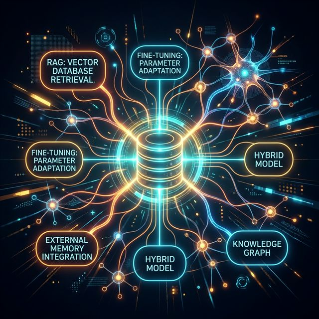

# 📚 Week 3: Giving AI a Memory (RAG & Fine-Tuning)

A model frozen in time is a model that becomes obsolete the day it finishes training. If an LLM doesn't know about yesterday's news, your private company codebase, or the secret recipe you invented this morning... how is it truly useful?

This week, we solve the hallucination problem once and for all. We dissect two massive paradigm shifts that make AI enterprise-ready: 
1. **Retrieval-Augmented Generation (RAG)**: Giving a model an infinite, real-time search engine to look up facts before it speaks.
2. **Fine-Tuning**: Surgically altering the synaptic weights of a model to teach it a new dialect, tone, or highly specialized skill.

Are you ready to give your AI a permanent, expandable memory?

---

## 🗺️ The Expedition Log (Days 15-21)

| Day | The Mystery We Solve | The Technical Revelation |
|---|---|---|
| **15** | [Embeddings and Vector Databases](day-15-embeddings-and-vector-dbs.md) | **The Architecture of Meaning:** How do we turn human concepts into coordinates? Welcome to the high-dimensional space where `"King" - "Man" + "Woman" = "Queen"`. |
| **16** | [RAG Fundamentals](day-16-rag-fundamentals.md) | **Beating Hallucinations:** The ultimate trick to ground an AI in reality. How do we retrieve external context and inject it into the prompt window milliseconds before the model answers? |
| **17** | [Advanced RAG Architectures](day-17-advanced-rag.md) | **Next-Gen Retrieval:** Naive keyword searches aren't enough. We dive deep into semantic routing, multi-query generation, and sophisticated reranking algorithms. |
| **18** | [Fine-Tuning Basics](day-18-finetuning-basics.md) | **Brain Surgery:** When prompting fails to capture nuance, we open the model weights. How do we surgically teach an open-source model a completely new subject? |
| **19** | [LoRA and Parameter-Efficient Fine-Tuning (PEFT)](day-19-lora-and-peft.md) | **The Cheat Code:** Fine-tuning a 70 Billion parameter model used to cost millions of dollars. How does LoRA mathematically allow us to do it on a single GPU over the weekend? |
| **20** | [Evaluation and Benchmarks](day-20-evaluation-and-benchmarks.md) | **The Empirical Proof:** "Vibes" aren't a metric, and "looks good to me" doesn't scale. How do you mathematically prove that your customized model is actually better than the original? |
| **21** | [The Week 3 Artifact](day-21-week3-project.md) | **The Crucible:** The rubber meets the road. Build, evaluate, and deploy a fully functional RAG pipeline against a custom, complex dataset. |

---

### 🔥 The Spark

The intelligence of a model is no longer bounded by its training run; it is bounded only by the quality of the data you feed it and the architectures you enclose it in. What archives will you unlock for your AI today?
