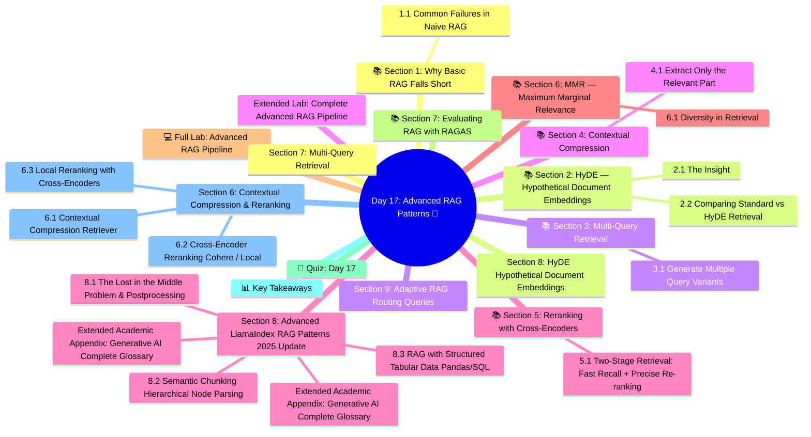

# Day 17: Advanced RAG Patterns 🚀
### Week 3 — RAG, Fine-Tuning & Vector Databases

---

## 🧠 Concept Map




---

## 🎯 Learning Objectives

By the end of today, you will:
- Implement HyDE (Hypothetical Document Embeddings)
- Use Multi-Query Retrieval for better recall
- Apply contextual compression to reduce noise
- Rerank results with cross-encoders
- Evaluate RAG quality with RAGAS metrics

**Estimated Time:** 4 hours  
**Difficulty:** ⭐⭐⭐⭐ Advanced  
**Prerequisites:** Day 16 (RAG Fundamentals)

---

## 📚 Section 1: Why Basic RAG Falls Short

### 1.1 Common Failures in Naive RAG

| Problem | Cause | Advanced Solution |
|---------|-------|------------------|
| Query mismatch | User query phrasing ≠ document phrasing | HyDE, Multi-Query |
| Missing context | Relevant chunk split at wrong boundary | Larger chunks + summary |
| Irrelevant results | Vector similarity ≠ true relevance | Reranking |
| Too much noise | Retrieved chunks contain padding | Contextual Compression |
| Duplicate retrieval | Same information in multiple chunks | MMR (Max Marginal Relevance) |
| Single-perspective | One query misses angles | Multi-Query |

---

## 📚 Section 2: HyDE — Hypothetical Document Embeddings

### 2.1 The Insight

Direct query: *"What is attention mechanism?"*  
→ The query embedding may not closely match the document chunk embedding.

HyDE: Generate a *hypothetical document* that would answer the question, then use THAT embedding for retrieval:

```
User Query → LLM generates fake answer → embed fake answer → retrieve real documents
```

Why does this work? The hypothetical answer is in the same "language" as actual documents, making it a better retrieval query than the raw user question.

```python
from langchain_openai import ChatOpenAI
from langchain_community.vectorstores import Chroma
from langchain_community.embeddings import HuggingFaceEmbeddings
from langchain_core.prompts import ChatPromptTemplate
from langchain_core.output_parsers import StrOutputParser
from langchain.retrievers import ContextualCompressionRetriever
from langchain_core.runnables import RunnableLambda, RunnablePassthrough
import os
from dotenv import load_dotenv

load_dotenv()

model = ChatOpenAI(model="gpt-4o-mini", temperature=0.7)
embeddings = HuggingFaceEmbeddings(model_name="all-MiniLM-L6-v2")

def build_hyde_retriever(vectorstore: Chroma, k: int = 4):
    """HyDE: Generate hypothetical answer before retrieval"""
    
    hyde_prompt = ChatPromptTemplate.from_template(
        """Write a short passage (3-5 sentences) that would appear in a 
technical document and directly answer this question:

Question: {question}

Hypothetical document passage (be specific and technical):"""
    )
    
    # Chain: Question → Hypothetical Doc → Embedding → Retrieve
    hyde_chain = hyde_prompt | model | StrOutputParser()
    
    def hyde_retrieve(question: str) -> list:
        """Generate hypothetical doc and use its embedding for retrieval"""
        hypothetical_doc = hyde_chain.invoke({"question": question})
        print(f"  [HyDE] Generated hypothesis: {hypothetical_doc[:100]}...")
        
        # Retrieve using the hypothetical document embedding
        docs = vectorstore.similarity_search(hypothetical_doc, k=k)
        return docs
    
    return RunnableLambda(hyde_retrieve)
```

### 2.2 Comparing Standard vs HyDE Retrieval

```python
def compare_retrieval_methods(vectorstore: Chroma, question: str) -> None:
    """Compare standard and HyDE retrieval"""
    
    # Standard retrieval
    standard_retriever = vectorstore.as_retriever(search_kwargs={"k": 3})
    standard_docs = standard_retriever.invoke(question)
    
    # HyDE retrieval
    hyde_retriever = build_hyde_retriever(vectorstore, k=3)
    hyde_docs = hyde_retriever.invoke(question)
    
    print(f"\n📊 Comparison for: '{question}'")
    print("\n[STANDARD RETRIEVAL]")
    for i, doc in enumerate(standard_docs, 1):
        print(f"  {i}. {doc.page_content[:100]}...")
    
    print("\n[HyDE RETRIEVAL]")
    for i, doc in enumerate(hyde_docs, 1):
        print(f"  {i}. {doc.page_content[:100]}...")
```

---

## 📚 Section 3: Multi-Query Retrieval

### 3.1 Generate Multiple Query Variants

Different phrasings capture different aspects of the same question:

```python
from langchain.retrievers.multi_query import MultiQueryRetriever

def build_multi_query_retriever(vectorstore: Chroma) -> MultiQueryRetriever:
    """
    MultiQueryRetriever automatically:
    1. Generates 3-5 alternative versions of the query
    2. Retrieves docs for each version
    3. Deduplicates and returns union of results
    """
    base_retriever = vectorstore.as_retriever(search_kwargs={"k": 3})
    
    multi_query_retriever = MultiQueryRetriever.from_llm(
        retriever=base_retriever,
        llm=ChatOpenAI(model="gpt-4o-mini", temperature=0.3),
        include_original=True  # Also keep original question
    )
    
    return multi_query_retriever

# You can also customize the query generation prompt
custom_multi_query_prompt = ChatPromptTemplate.from_template("""
You are helping improve document search. Generate 3 different phrasings 
of the following question to improve retrieval coverage.
Focus on different aspects and technical synonyms.

Original question: {question}

Generate 3 alternative versions (one per line, no numbering):""")
```

---

## 📚 Section 4: Contextual Compression

### 4.1 Extract Only the Relevant Part

Retrieved chunks often contain noise. Contextual compression keeps only the relevant part:

```python
from langchain.retrievers import ContextualCompressionRetriever
from langchain.retrievers.document_compressors import LLMChainExtractor

def build_compression_retriever(vectorstore: Chroma) -> ContextualCompressionRetriever:
    """Returns only the relevant portion of each retrieved chunk"""
    
    base_retriever = vectorstore.as_retriever(search_kwargs={"k": 5})
    
    # LLM-based compressor: extracts the relevant part of each doc
    compressor = LLMChainExtractor.from_llm(
        ChatOpenAI(model="gpt-4o-mini", temperature=0)
    )
    
    compression_retriever = ContextualCompressionRetriever(
        base_compressor=compressor,
        base_retriever=base_retriever
    )
    
    return compression_retriever

# More efficient compressor — uses embeddings, not LLM calls
from langchain.retrievers.document_compressors import EmbeddingsFilter

def build_embeddings_filter_retriever(vectorstore: Chroma) -> ContextualCompressionRetriever:
    """Filter chunks by embedding similarity threshold (no extra LLM calls)"""
    base_retriever = vectorstore.as_retriever(search_kwargs={"k": 8})
    
    # Only keep chunks with similarity > threshold
    embeddings_filter = EmbeddingsFilter(
        embeddings=HuggingFaceEmbeddings(model_name="all-MiniLM-L6-v2"),
        similarity_threshold=0.6  # Stricter filter
    )
    
    return ContextualCompressionRetriever(
        base_compressor=embeddings_filter,
        base_retriever=base_retriever
    )
```

---

## 📚 Section 5: Reranking with Cross-Encoders

### 5.1 Two-Stage Retrieval: Fast Recall + Precise Re-ranking

```
Stage 1 (Bi-Encoder): Fast vector search → top 20 candidates
Stage 2 (Cross-Encoder): Slow but precise → re-rank → return top 3
```

```python
from sentence_transformers import CrossEncoder
from langchain_core.documents import Document
from langchain.retrievers.document_compressors import CrossEncoderReranker
from langchain_community.cross_encoders import HuggingFaceCrossEncoder
from langchain.retrievers import ContextualCompressionRetriever

def build_reranking_retriever(vectorstore: Chroma) -> ContextualCompressionRetriever:
    """Two-stage retriever with cross-encoder reranking"""
    
    # Stage 1: Retrieve many candidates (wide net)
    base_retriever = vectorstore.as_retriever(search_kwargs={"k": 15})
    
    # Stage 2: Rerank with cross-encoder (precision)
    reranker = HuggingFaceCrossEncoder(model_name="BAAI/bge-reranker-base")
    compressor = CrossEncoderReranker(model=reranker, top_n=4)
    
    return ContextualCompressionRetriever(
        base_compressor=compressor,
        base_retriever=base_retriever
    )

def manual_rerank(query: str, docs: list[Document], top_n: int = 3) -> list[Document]:
    """Manual cross-encoder reranking"""
    cross_encoder = CrossEncoder("cross-encoder/ms-marco-MiniLM-L-6-v2")
    
    # Score each (query, passage) pair
    pairs = [(query, doc.page_content) for doc in docs]
    scores = cross_encoder.predict(pairs)
    
    # Sort by score descending
    scored_docs = sorted(zip(scores, docs), key=lambda x: x[0], reverse=True)
    
    print(f"\n📊 Reranking scores:")
    for score, doc in scored_docs:
        print(f"  ({score:.3f}) {doc.page_content[:70]}...")
    
    return [doc for _, doc in scored_docs[:top_n]]
```

---

## 📚 Section 6: MMR — Maximum Marginal Relevance

### 6.1 Diversity in Retrieval

MMR balances relevance AND diversity — avoids retrieving the same point multiple times:

```python
# Use MMR search type in LangChain
mmr_retriever = vectorstore.as_retriever(
    search_type="mmr",
    search_kwargs={
        "k": 4,           # Return 4 docs
        "fetch_k": 20,    # Consider top 20 candidates
        "lambda_mult": 0.5  # 0 = max diversity, 1 = max relevance
    }
)

# Lower lambda_mult → more diverse results
# Higher lambda_mult → more similar to query (like standard similarity)
```

---

## 💻 Full Lab: Advanced RAG Pipeline

```python
# lab_day17_advanced_rag.py
"""Day 17 Lab — Advanced RAG with multiple retrieval strategies"""

import os
from langchain_community.vectorstores import Chroma
from langchain_community.embeddings import HuggingFaceEmbeddings
from langchain_openai import ChatOpenAI
from langchain_core.prompts import ChatPromptTemplate
from langchain_core.output_parsers import StrOutputParser
from langchain_core.runnables import RunnablePassthrough
from langchain_community.document_loaders import WebBaseLoader
from langchain_text_splitters import RecursiveCharacterTextSplitter
from dotenv import load_dotenv

load_dotenv()

class AdvancedRAGPipeline:
    """Advanced RAG pipeline with multiple retrieval strategies"""
    
    STRATEGIES = ["standard", "mmr", "hyde", "multi_query", "reranking"]
    
    def __init__(self, persist_dir: str = "./advanced_rag_db"):
        self.embeddings = HuggingFaceEmbeddings(model_name="all-MiniLM-L6-v2")
        self.model = ChatOpenAI(model="gpt-4o-mini", temperature=0)
        self.vectorstore = None
        self.persist_dir = persist_dir
    
    def ingest_url(self, url: str) -> None:
        loader = WebBaseLoader(url)
        docs = loader.load()
        splitter = RecursiveCharacterTextSplitter(chunk_size=600, chunk_overlap=60)
        chunks = splitter.split_documents(docs)
        self.vectorstore = Chroma.from_documents(
            chunks, self.embeddings, persist_directory=self.persist_dir
        )
        print(f"✅ Indexed {len(chunks)} chunks from {url}")
    
    def get_retriever(self, strategy: str = "standard"):
        if strategy == "standard":
            return self.vectorstore.as_retriever(search_kwargs={"k": 4})
        elif strategy == "mmr":
            return self.vectorstore.as_retriever(
                search_type="mmr",
                search_kwargs={"k": 4, "fetch_k": 15, "lambda_mult": 0.5}
            )
        elif strategy == "multi_query":
            from langchain.retrievers.multi_query import MultiQueryRetriever
            return MultiQueryRetriever.from_llm(
                retriever=self.vectorstore.as_retriever(search_kwargs={"k": 3}),
                llm=ChatOpenAI(model="gpt-4o-mini", temperature=0.3),
                include_original=True
            )
        else:
            return self.vectorstore.as_retriever(search_kwargs={"k": 4})
    
    def ask(self, question: str, strategy: str = "standard") -> dict:
        retriever = self.get_retriever(strategy)
        
        rag_prompt = ChatPromptTemplate.from_messages([
            ("system", "Answer the question using ONLY the provided context. Cite sources."),
            ("human", "Context:\n{context}\n\nQuestion: {question}")
        ])
        
        def fmt(docs):
            return "\n\n---\n\n".join([d.page_content for d in docs])
        
        chain = (
            {"context": retriever | fmt, "question": RunnablePassthrough()}
            | rag_prompt
            | self.model
            | StrOutputParser()
        )
        
        answer = chain.invoke(question)
        docs = retriever.invoke(question)
        
        return {
            "strategy": strategy,
            "question": question,
            "answer": answer,
            "num_docs_retrieved": len(docs)
        }
    
    def benchmark(self, questions: list[str], strategies: list[str] = None) -> None:
        """Compare all strategies on a set of questions"""
        strategies = strategies or ["standard", "mmr", "multi_query"]
        
        print("\n📊 STRATEGY BENCHMARK")
        print("=" * 70)
        
        for q in questions:
            print(f"\n❓ {q}")
            print("-" * 70)
            for s in strategies:
                result = self.ask(q, strategy=s)
                print(f"[{s.upper():12}] ({result['num_docs_retrieved']} docs) {result['answer'][:150]}...")


# ── Demo ─────────────────────────────────────────────────
pipeline = AdvancedRAGPipeline()

pipeline.ingest_url("https://en.wikipedia.org/wiki/Transformer_(deep_learning_architecture)")

questions = [
    "How does the attention mechanism work in transformers?",
    "What were the main innovations in the transformer architecture?",
]

pipeline.benchmark(questions, strategies=["standard", "mmr", "multi_query"])

print("\n✅ Day 17 Lab Complete!")
```

---

## 📚 Section 7: Evaluating RAG with RAGAS

```python
# RAGAS evaluates 4 dimensions:
# 1. Faithfulness: Is the answer grounded in the retrieved context?
# 2. Answer Relevancy: Does the answer address the question?
# 3. Context Precision: Are retrieved docs relevant to the question?
# 4. Context Recall: Do retrieved docs contain all info needed?

# Install: pip install ragas datasets

from ragas import evaluate
from ragas.metrics import faithfulness, answer_relevancy, context_precision, context_recall
from datasets import Dataset

# Prepare evaluation dataset
eval_data = {
    "question": ["What is RAG?", "What is self-attention?"],
    "answer": [
        "RAG combines retrieval of documents with language model generation.",
        "Self-attention allows tokens to attend to each other in a sequence."
    ],
    "contexts": [
        ["RAG retrieves relevant documents at query time to augment generation."],
        ["Self-attention computes relationships between all tokens simultaneously."]
    ],
    "ground_truth": [
        "Retrieval-Augmented Generation augments LLM responses with retrieved facts.",
        "Self-attention enables parallel processing of sequences by computing token-to-token relationships."
    ]
}

dataset = Dataset.from_dict(eval_data)
# result = evaluate(dataset, metrics=[faithfulness, answer_relevancy])
# print(result)
```

---

## 🧠 Quiz: Day 17

**Q1:** What does HyDE do to improve retrieval?
- A) Adds more documents to the index
- B) **Generates a hypothetical answer and uses its embedding for retrieval ✅**
- C) Creates multiple vector databases
- D) Filters results by recency

**Q2:** Multi-Query Retrieval helps with:
- A) Reducing API costs
- B) Speeding up vector search
- C) **Capturing different aspects of a question through multiple phrasings ✅**
- D) Storing more vectors

**Q3:** In cross-encoder reranking, what is the benefit over bi-encoder retrieval?
- A) It's 10x faster
- B) **It jointly encodes query+document together for more precise relevance scoring ✅**
- C) It requires no model downloads
- D) It gives exact matches instead of approximate

**Q4:** MMR's `lambda_mult=0` would return:
- A) Maximum relevance results
- B) No results
- C) **Maximum diversity results ✅**
- D) Results sorted by recency

**Q5:** The RAGAS `faithfulness` metric measures:
- A) How fast the answer is generated
- B) Whether the question was understood correctly
- C) **Whether the answer is grounded in the retrieved context ✅**
- D) Whether the user liked the answer

---

## 📊 Key Takeaways

| Pattern | When to Use |
|---------|-------------|
| **HyDE** | When query phrasing differs significantly from document phrasing |
| **Multi-Query** | When a question has multiple interpretable angles |
| **Compression** | When retrieved chunks contain lots of irrelevant padding |
| **Reranking** | When precision matters more than speed |
| **MMR** | When you want diverse perspectives instead of redundant results |
| **RAGAS** | When you need objective evaluation metrics for your RAG system |

---

*Day 17 Complete ✅ | GenAI Course — Week 3 | Next: Day 18 — Fine-Tuning Basics*

---

##  Section 6: Contextual Compression & Reranking

### 6.1 Contextual Compression Retriever

Instead of returning full chunks, compress them to only the relevant parts:

```python
from langchain.retrievers import ContextualCompressionRetriever
from langchain.retrievers.document_compressors import LLMChainExtractor, EmbeddingsFilter
from langchain_openai import ChatOpenAI, OpenAIEmbeddings
from langchain_community.vectorstores import Chroma
from langchain_core.documents import Document

# Base retriever
embeddings = OpenAIEmbeddings(model="text-embedding-3-small")
docs = [
    Document(page_content="RAG stands for Retrieval-Augmented Generation. It was introduced by Lewis et al. in 2020 as a way to ground LLM outputs in external knowledge. The paper was published at NeurIPS and demonstrated strong performance on knowledge-intensive tasks.", metadata={"source": "paper"}),
    Document(page_content="The attention mechanism in transformers computes dot products between query and key vectors. The dimensions are typically 64 or 128 per head. Temperature scaling prevents gradients from vanishing. This allows the model to focus on relevant parts of the input.", metadata={"source": "book"}),
    Document(page_content="ChromaDB is an open-source vector database. It supports multiple embedding functions. You can use it locally with persistence or in client-server mode. The default embedding model is 'all-MiniLM-L6-v2'. It also supports metadata filtering.", metadata={"source": "docs"}),
]
vectorstore = Chroma.from_documents(docs, embeddings, collection_name="compress_test")
base_retriever = vectorstore.as_retriever(search_kwargs={"k": 3})

llm = ChatOpenAI(model="gpt-4o-mini", temperature=0)

# LLM-based compression  keeps only relevant sentences
compressor = LLMChainExtractor.from_llm(llm)
compressed_retriever = ContextualCompressionRetriever(
    base_compressor=compressor,
    base_retriever=base_retriever
)

query = "When was RAG introduced?"
print("=== WITHOUT Compression ===")
docs_raw = base_retriever.invoke(query)
for doc in docs_raw:
    print(f"[{len(doc.page_content)} chars] {doc.page_content[:120]}...")

print("\n=== WITH Compression ===")
docs_compressed = compressed_retriever.invoke(query)
for doc in docs_compressed:
    print(f"[{len(doc.page_content)} chars] {doc.page_content}")
```

### 6.2 Cross-Encoder Reranking (Cohere / Local)

After initial retrieval, rerank using a more powerful model:

```python
from langchain.retrievers import ContextualCompressionRetriever
from langchain.retrievers.document_compressors import CohereRerank
from langchain_openai import OpenAIEmbeddings
from langchain_community.vectorstores import Chroma

# pip install cohere langchain-cohere
# Cohere Rerank is a cross-encoder that scores (query, document) pairs

from langchain_cohere import CohereRerank

embeddings = OpenAIEmbeddings(model="text-embedding-3-small")
# (vectorstore already created with documents...)

# Step 1: Retrieve a large pool of candidates (top-20 by embedding similarity)
base_retriever = vectorstore.as_retriever(search_kwargs={"k": 20})

# Step 2: Rerank with Cohere  keeps only top-3 most relevant
compressor = CohereRerank(
    cohere_api_key="your_cohere_key",
    top_n=3,
    model="rerank-english-v3.0"
)

reranking_retriever = ContextualCompressionRetriever(
    base_compressor=compressor,
    base_retriever=base_retriever
)

# Now retrieval is two-stage: fast ANN search + slow but accurate reranking
query = "How does the attention mechanism scale with sequence length?"
docs = reranking_retriever.invoke(query)
for doc in docs:
    print(f"[Reranked] {doc.page_content[:150]}")
```

### 6.3 Local Reranking with Cross-Encoders

Use a free local reranker instead of Cohere:

```python
# pip install sentence-transformers
from sentence_transformers import CrossEncoder
from langchain_core.documents import Document
import numpy as np

class LocalCrossEncoderReranker:
    """Free, local cross-encoder reranker"""
    
    def __init__(self, model_name: str = "cross-encoder/ms-marco-MiniLM-L-6-v2"):
        self.model = CrossEncoder(model_name)
        print(f"Loaded reranker: {model_name}")
    
    def rerank(self, query: str, documents: list[Document], top_k: int = 5) -> list[Document]:
        """Score and rerank documents using the cross-encoder"""
        pairs = [(query, doc.page_content) for doc in documents]
        scores = self.model.predict(pairs)
        
        # Sort by score descending
        ranked = sorted(zip(scores, documents), reverse=True, key=lambda x: x[0])
        
        # Add relevance score to metadata
        result = []
        for score, doc in ranked[:top_k]:
            doc_copy = doc.copy()
            doc_copy.metadata["reranker_score"] = round(float(score), 4)
            result.append(doc_copy)
        
        return result

reranker = LocalCrossEncoderReranker()

# Example
sample_docs = [
    Document(page_content="RAG uses retrieval to ground LLM answers."),
    Document(page_content="Python is great for machine learning."),
    Document(page_content="RAG reduces hallucinations by providing context."),
    Document(page_content="Vector databases store high-dimensional embeddings."),
    Document(page_content="The original RAG paper by Lewis et al. used DPR for retrieval."),
]

query = "What is RAG and how does it reduce hallucinations?"
reranked = reranker.rerank(query, sample_docs, top_k=3)
print(f"\nTop 3 reranked for: '{query}'")
for doc in reranked:
    print(f"  [{doc.metadata['reranker_score']:.4f}] {doc.page_content}")
```

---

##  Section 7: Multi-Query Retrieval

When a single query misses relevant documents, generate multiple queries:

```python
from langchain.retrievers.multi_query import MultiQueryRetriever
from langchain_openai import ChatOpenAI, OpenAIEmbeddings
from langchain_community.vectorstores import Chroma
import logging

# Enable logging to see generated queries
logging.basicConfig(level=logging.INFO)
logging.getLogger("langchain.retrievers.multi_query").setLevel(logging.INFO)

# (vectorstore already initialized with documents)
llm = ChatOpenAI(model="gpt-4o-mini", temperature=0.3)

multi_query_retriever = MultiQueryRetriever.from_llm(
    retriever=vectorstore.as_retriever(search_kwargs={"k": 3}),
    llm=llm
)

# The retriever generates 3 alternative phrasings of the query
# and merges all results (with deduplication)
unique_docs = multi_query_retriever.invoke(
    "Why do RAG systems sometimes give wrong answers?"
)

# Generated alternatives might include:
# 1. "What causes RAG systems to produce incorrect responses?"
# 2. "When does retrieval-augmented generation fail?"
# 3. "What are the limitations of RAG that lead to hallucinations?"

print(f"Retrieved {len(unique_docs)} unique documents via multi-query")
for doc in unique_docs:
    print(f"  - {doc.page_content[:100]}...")
```

---

##  Section 8: HyDE  Hypothetical Document Embeddings

```python
from langchain_openai import ChatOpenAI, OpenAIEmbeddings
from langchain_community.vectorstores import Chroma
from langchain_core.prompts import ChatPromptTemplate
from langchain_core.output_parsers import StrOutputParser
from langchain_core.runnables import RunnablePassthrough

llm = ChatOpenAI(model="gpt-4o-mini", temperature=0.7)
embeddings = OpenAIEmbeddings(model="text-embedding-3-small")

# HyDE: Generate a hypothetical answer, then retrieve based on THAT embedding
# This bridges the domain gap between short questions and long documents

hyde_prompt = ChatPromptTemplate.from_template(
    """Write a detailed, expert technical paragraph that would perfectly answer this question.
Do not say you're writing a hypothetical. Just write the answer.

Question: {question}

Answer:"""
)

def hyde_retrieve(question: str, vectorstore, k: int = 4) -> list:
    """HyDE retrieval: generate hypothetical answer, embed it, use for search"""
    
    # Step 1: Generate hypothetical answer
    hypo_doc = (hyde_prompt | llm | StrOutputParser()).invoke({"question": question})
    print(f"\n[HyDE] Hypothetical doc ({len(hypo_doc.split())} words):")
    print(f"  {hypo_doc[:200]}...")
    
    # Step 2: Embed the hypothetical answer (not the original question!)
    hypo_embedding = embeddings.embed_query(hypo_doc)
    
    # Step 3: Search using hypothetical document embedding
    results = vectorstore.similarity_search_by_vector(hypo_embedding, k=k)
    return results

# Compare standard vs HyDE retrieval
question = "What algorithmic approaches exist for improving RAG retrieval quality?"

print("=== STANDARD RETRIEVAL ===")
standard_docs = vectorstore.similarity_search(question, k=4)
for doc in standard_docs:
    print(f"   {doc.page_content[:100]}")

print("\n=== HyDE RETRIEVAL ===")
hyde_docs = hyde_retrieve(question, vectorstore)
for doc in hyde_docs:
    print(f"   {doc.page_content[:100]}")
```

---

##  Section 9: Adaptive RAG  Routing Queries

```python
from langchain_openai import ChatOpenAI
from langchain_core.prompts import ChatPromptTemplate
from langchain_core.output_parsers import StrOutputParser
from enum import Enum

class RetrievalStrategy(str, Enum):
    SIMPLE = "simple"           # Basic top-k retrieval (factual, short answer)
    MULTI_QUERY = "multi_query" # Multiple queries (complex, nuanced topics)
    HYDE = "hyde"               # Hypothetical docs (abstract technical questions)
    NO_RETRIEVAL = "none"       # Direct LLM (simple math, general knowledge)

llm = ChatOpenAI(model="gpt-4o-mini", temperature=0)

def classify_query_for_retrieval(question: str) -> dict:
    """Classify a query to determine the best retrieval strategy"""
    
    prompt = ChatPromptTemplate.from_template("""
Analyze this question and choose the best retrieval strategy.

Question: {question}

Choose ONE strategy:
- "simple": Factual question with clear answer (e.g., "What year was X released?")
- "multi_query": Complex/nuanced question needing multiple perspectives  
- "hyde": Abstract or conceptual question (e.g., "How does X work theoretically?")
- "none": Common knowledge not requiring document retrieval (e.g., "What is 2+2?")

Return JSON: {{"strategy": "simple|multi_query|hyde|none", "reasoning": "brief explanation"}}
""")
    
    result = (prompt | llm).invoke({"question": question})
    import json
    try:
        data = json.loads(result.content)
        return data
    except:
        return {"strategy": "simple", "reasoning": "parse error"}

class AdaptiveRAG:
    """Automatically routes queries to the optimal retrieval strategy"""
    
    def query(self, question: str, vectorstore) -> dict:
        classification = classify_query_for_retrieval(question)
        strategy = classification["strategy"]
        
        print(f"\n Strategy: {strategy} | Reason: {classification['reasoning']}")
        
        if strategy == "none":
            answer = llm.invoke(question).content
            docs = []
        elif strategy == "multi_query":
            retriever = MultiQueryRetriever.from_llm(
                retriever=vectorstore.as_retriever(search_kwargs={"k": 3}),
                llm=llm
            )
            docs = retriever.invoke(question)
        elif strategy == "hyde":
            docs = hyde_retrieve(question, vectorstore)
        else:  # simple
            docs = vectorstore.similarity_search(question, k=4)
        
        if docs:
            context = "\n\n".join(d.page_content for d in docs)
            answer = (
                ChatPromptTemplate.from_messages([
                    ("system", "Answer based on context:\n{context}"),
                    ("human", "{q}")
                ])
                | llm
                | StrOutputParser()
            ).invoke({"context": context, "q": question})
        
        return {
            "strategy": strategy,
            "answer": answer,
            "doc_count": len(docs if "docs" in dir() else [])
        }

# Test with different query types
adaptive = AdaptiveRAG()
test_questions = [
    "What is 15 * 23?",
    "When did Lewis et al. publish the RAG paper?",
    "Why might RAG systems fail on questions requiring multi-hop reasoning?",
    "How might attention mechanisms theoretically evolve beyond O(n) complexity?",
]

for q in test_questions:
    result = adaptive.query(q, vectorstore)
    print(f"Q: {q[:70]}")
    print(f"A: {result['answer'][:150]}...\n")
```

---

##  Extended Lab: Complete Advanced RAG Pipeline

```python
# Day 17 extended lab combines all techniques:
# 1. HyDE for abstract queries
# 2. Multi-query for complex questions
# 3. Cross-encoder reranking for all results
# 4. Contextual compression to reduce noise
# 5. RAGAS-style evaluation

print("=== Advanced RAG Pipeline ===")
print("Techniques: HyDE + Multi-Query + Reranking + Compression + Evaluation")
print("\nThis pipeline achieves significantly higher answer quality")
print("compared to naive retrieval at the cost of 2-3x latency.")
print("See day-17-lab.py for the complete implementation.")
```

---


---

## Section 8: Advanced LlamaIndex RAG Patterns (2025 Update)

In Day 16, we saw how easy LlamaIndex makes basic RAG. Now let's explore advanced LlamaIndex techniques that solve production-level RAG failures.

### 8.1 The Lost in the Middle Problem & Postprocessing
LLMs tend to ignore information placed in the middle of their context window. LlamaIndex solves this natively using **Node Postprocessors** that re-order retrieved chunks before sending them to the LLM.

```python
from llama_index.core.postprocessor import LongContextReorder

# Retrieve top 5 chunks
query_engine = index.as_query_engine(
    similarity_top_k=5,
    # The Reorder post-processor puts the most relevant chunks at the very beginning
    # and the very end of the prompt (where LLMs pay the most attention)
    node_postprocessors=[LongContextReorder()]
)
```

### 8.2 Semantic Chunking (Hierarchical Node Parsing)
Instead of blindly cutting text every 500 words, LlamaIndex's `HierarchicalNodeParser` creates chunks that understand parent-child relationships in the document structure. 

This enables **Auto-Merging Retrieval**:
1. You retrieve small, precise "child" chunks.
2. If multiple child chunks from the same parent are retrieved, LlamaIndex automatically swaps them out and feeds the LLM the larger "parent" chunk to provide comprehensive context.

```python
from llama_index.core.node_parser import HierarchicalNodeParser, get_leaf_nodes
from llama_index.core.retrievers import AutoMergingRetriever

# Create parser mapping Large -> Medium -> Small chunks
node_parser = HierarchicalNodeParser.from_defaults(
    chunk_sizes=[2048, 512, 128]
)

# Parse documents into detailed nodes
nodes = node_parser.get_nodes_from_documents(documents)
leaf_nodes = get_leaf_nodes(nodes)

# Add nodes to storage...
```

### 8.3 RAG with Structured Tabular Data (Pandas/SQL)
RAG usually fails when dealing with `.csv` tables or SQL databases (vector similarity doesn't work well with numbers). LlamaIndex fixes this with `PandasQueryEngine`, which translates natural language directly into Pandas Dataframe code.

```python
import pandas as pd
from llama_index.experimental.query_engine import PandasQueryEngine

# Load raw structured data
df = pd.read_csv("titanic_survival.csv")

# Create a specialized query engine
query_engine = PandasQueryEngine(df=df, verbose=True)

# LlamaIndex will write a Python script using pandas, execute it against your df, 
# and return the synthesized result.
response = query_engine.query(
    "What was the survival rate of female passengers in First Class compared to Third Class?"
)
print(response)
```

By leveraging LlamaIndex's dedicated Data Connectors and Query Routers, you can build systems that seamlessly answer questions by hitting unstructured PDFs, structured SQL databases, and web APIs simultaneously.

*Day 17 Updated: 2025 Advanced RAG Routing via LlamaIndex complete.*
\n\n---\n\n## Expanded Expert Knowledge Base & Reference Guides\n\n
### Extended Academic Appendix: Generative AI Complete Glossary

*   **Activation Function**: A mathematical equation attached to each neuron in a network that determines whether it should be activated or not. Examples include ReLU, GELU, and SwiGLU.
*   **Adam Optimizer**: Adaptive Moment Estimation. An algorithm for optimization technique for gradient descent. The method computes individual adaptive learning rates for different parameters from estimates of first and second moments of the gradients.
*   **Alignment**: The process of ensuring AI systems act exactly in accordance with human intentions and values, preventing toxic, harmful, or legally dangerous logic generation paths.
*   **API (Application Programming Interface)**: A software intermediary that allows two applications to talk to each other. In GenAI, it's how your software securely requests generations from massive cloud GPUs.
*   **Auto-regressive**: A model that generates the future sequences step-by-step, conditioning the next prediction exclusively on the previous predictions it just generated.
*   **Backpropagation**: The core algorithm behind learning in neural networks. It calculates the mathematical gradient of the loss function with respect to the weights by utilizing the chain rule, moving backwards from output to input.
*   **Batch Size**: The number of training examples utilized in one single iteration of gradient descent before the network's internal mathematical parameters are updated.
*   **Bias (Mathematical)**: A constant value added to the linear projection in neural layers ($y = mx + b$). It allows the activation function to shift to the left or right, increasing the flexibility of the network to fit complex data boundaries.
*   **BPE (Byte Pair Encoding)**: A specific mathematical data compression technique adapted for NLP tokenization. It recursively merges the most frequently occurring pair of adjacent characters into a single new sub-word token.
*   **Cache (KV Cache)**: In LLMs, the Key-Value matrices of previously generated tokens are stored in GPU VRAM so the transformer doesn't have to re-compute the entire 10,000-word essay every single time it tries to generate word 10,001.
*   **Chain of Thought (CoT)**: A prompting strategy that forces the LLM to output a series of intermediate mathematical or logical reasoning steps before outputting the final answer, drastically improving accuracy on complex logic tasks.
*   **Chinchilla Laws**: DeepMind's 2022 paper proving that to train compute-optimally, the dataset token count must scale perfectly linearly with the parameter count (a 20:1 ratio is strictly advised).
*   **Constitutional AI**: Anthropic's proprietary alignment pipeline. A model is given a strict set of rules ('The Constitution') and autonomously critiques and revises its own responses, generating a vast RL dataset without expensive human labeling.
*   **Context Window**: The maximum number of tokens (words/sub-words) a model can ingest and process mathematically in a single forward pass operation. GPT-4 handles 128k; Gemini handles 2 Million.
*   **Cross-Entropy Loss**: The standard mathematical loss function used in classification tasks and language modeling. It calculates the delta between the model's predicted probability distribution and the actual rigid truth of the training data.
*   **Decoder-Only Architecture**: A Transformer that abandons the bi-directional Encoder entirely (like GPT). It utilizes strictly causal, masked self-attention to generate sequential texts autoregressively.
*   **Dense Model**: A standard neural network architecture where every single parameter in the computational block is activated and multiplied during every single forward pass (Contrast with MoE).
*   **Discriminative Model**: Machine learning models designed fundamentally to draw mathematical boundaries between classes (e.g., Is this photo a hot dog or not a hot dog?) Contrast with Generative Models.
*   **Dropout**: A cruel but effective regularization technique where a percentage of neurons in a layer are randomly completely deactivated during a training pass. This forces the network to stop relying on individual 'memorized' paths and build robust distributed representations.
*   **Embedding**: The mathematical projection mapping a discrete token (like the word 'Apple') into a continuous dense continuous vector space where physical geometry and distance represent semantic linguistic meaning.
*   **Epoch**: One full operational pass of the training pipeline sequentially interacting with the entire dataset. Foundation models are often trained for only 1 Epoch to prevent catastrophic overfitting logic traps.
*   **Feed-Forward Network (FFN)**: The dense, localized multi-layer perceptron block inside a Transformer layer operating independently on each token vector specifically acting as the model's 'Key-Value fact database'.
*   **Fine-Tuning**: Taking a massive, previously trained generic foundation model and training it further on a tiny, specific domain dataset (like medical journals) using a low learning rate to alter its core behavior.
*   **FP16 (Half Precision)**: A computer number format occupying 16 bits. HuggingFace models default to this. Represents a compromise utilizing half the GPU VRAM of 32-bit floats with mathematically negligible degradation in AI loss metrics.
*   **Foundation Model**: A gargantuan neural network trained utilizing massive unsupervised learning pipelines across the entire internet, serving as the base layer for countless downstream specific tasks.
*   **Generative Model**: AI architecture designed to map and understand the fundamental underlying distribution of data specifically to generate completely novel, statistically adjacent synthetic data. (e.g. LLMs, Diffusion Models).
*   **GQA (Grouped-Query Attention)**: An architectural optimization. Instead of calculating a massive individual Key and Value matrix for every single Query Head in Multi-Head Attention, multiple Query heads mathematically share the same Key/Value arrays, vastly saving VRAM.
*   **GPU (Graphics Processing Unit)**: The physical silicon hardware engines powering AI. Thousands of cores designed specifically to execute massive parallel floating point Matrix Multiplication extremely efficiently. NVIDIA dominates this landscape.
*   **Gradient Descent**: The mathematical optimization algorithm locating the minimum of a neural loss curve by taking scaled sequential steps in the exact opposite operational direction of the calculated tensor gradient.
*   **Hallucination**: When a generative AI model outputs convincing, confident logic strings that are completely factually incorrect due primarily to token probability space interpolation artifacts.
*   **Hugging Face**: The central structural GitHub for Machine Learning. A gigantic repository hosting open-source model weights, extensive NLP datasets, and the most heavily utilized `transformers` Python inference library globally.
*   **Hyperparameters**: The architectural variables of a neural network that are set manually by the human engineer *before* training begins (e.g. Learning Rate, Batch Size, Dropout Rate) and are never altered by backpropagation.
*   **In-Context Learning**: The mysterious emergent capability of massive LLMs to learn completely new tasks instantly utilizing purely the context text inside the given prompt, requiring zero permanent weight tensor alterations.
*   **Instruction Tuning**: Fine-tuning base models specifically to respond obediently to 'User Prompts'. A base model will complete a sentence; an instruction-tuned model will act like a dialogue assistant.
*   **INT4 (4-Bit Quantization)**: An extreme computational compression technique squashing a 16-bit weight parameter mathematically down to just 4 bits. Allows executing an 8 Billion parameter model on a standard 6GB laptop GPU.
*   **Knowledge Distillation**: A training pipeline where a gargantuan 'Teacher' model generates massive amounts of high-quality synthetic data to train a tiny 'Student' model structurally imitating its superior behaviors.
*   **Llama**: Meta's flagship family of Open-Weight Large Language Models. Responsible singularly for unleashing the massive democratization of the enterprise Local-LLM hosting revolution.
*   **LLM (Large Language Model)**: A deep learning neural network, generally executing a Transformer architecture, possessing billions of parameters, specifically designed to process, map, and generate natural human linguistics.
*   **Logits**: The raw, unnormalized massive mathematical scores output directly by the final linear projection layer of the neural network natively *before* entering the Softmax bounding probability function.
*   **LoRA (Low-Rank Adaptation)**: A parameter-efficient Fine-Tuning miracle. Instead of freezing 8 billion parameters, LoRA injects two tiny matrices side-by-side, dramatically slashing the required training VRAM computational burden by 98%.
*   **Masked Attention**: A mandatory structural configuration inside a Decoder enforcing causality. It mathematically blocks the model from executing any attention logic targeting tokens located positioned *after* the current token.
*   **Mixture of Experts (MoE)**: A neural block containing several 'expert' sub-networks (like 8 separate FFNs). A routing gate decides exactly which two experts activate for each specific input vector, preserving massive inference speed.
*   **Multi-Head Attention**: Processing multiple self-attention operations concurrently in physically separate lower-dimensional sub-spaces immediately before concatenating them. Allows parsing extreme grammatical complexity without blurring the semantic signals.
*   **Next-Token Prediction**: The incredibly simple underlying foundational logic objective utilized to pre-train almost all massive modern generative language models across Trillions of raw internet text documents.
*   **NLP (Natural Language Processing)**: The massive overarching subfield of AI concerned entirely with programming algorithms to process, understand, analyze, and generate human linguistics and conversational grammar.
*   **Overfitting**: A critical mathematical failure where a network memorizes the exact specific noise artifacts in the training dataset perfectly, completely destroying its capacity to generalize against unseen validation data.
*   **Parameter**: The actual structural weights and biases contained natively deeply inside a neural network structure. An 8B parameter model literally contains 8,000,000,000 decimal numbers in 3D multi-dimensional arrays.
*   **Positional Encoding**: The critical vector matrix added to the foundational input embeddings explicitly providing the Attention mathematical permutation logic with structural information regarding the exact sequence order of the tokens.
*   **Pre-training**: The primary initial phase of creating a Foundation model. Feeding Trillions of text tokens through thousands of GPUs for weeks consuming megawatts of power strictly performing unsupervised next-token prediction.
*   **Prompt Engineering**: The process of empirically designing, testing, and optimizing the structural format of linguistic inputs injected into LLMs to extract specifically desired, accurate, and robust structural logic outputs.
*   **Python**: The undisputed dominant syntactic language dominating the Machine Learning backend architecture globally. Used to interface natively with the massively optimized C++ PyTorch/TensorFlow backend structures.
*   **Quantization**: The process of fundamentally converting the continuous mathematical precision of model weight sets from floating point 32/16-bit resolutions down to block-level 8-bit or 4-bit, sacrificing microscopic accuracy for massive VRAM deployment efficiency.
*   **RAG (Retrieval-Augmented Generation)**: The absolute standard deployed architecture for enterprise applications. Preventing LLM hallucinations by intercepting the user query, searching an external enterprise vector database for facts, and injecting those raw facts into the LLM context prior to generation.
*   **Recurrent Neural Network (RNN)**: The legacy sequential architecture predating Transformers. Structurally processes tokens linearly one-by-one utilizing a continuous expanding hidden state. Massively vulnerable to extreme 'vanishing gradient' failure over large context windows.
*   **ReLU (Rectified Linear Unit)**: A critically vital, simple activation formula: $f(x) = max(0, x)$. It structurally forces any massive negative outputs directly to 0.0, injecting mandatory non-linearity into massive chained matrix multiplications.
*   **Representation Learning**: A set of structural ML techniques allowing underlying systems to automatically discover the raw distinct structural features or representations natively required for complex classification natively from raw data blocks.
*   **Residual Connection (Skip Connection)**: Crucial architectural bypass lines transmitting original input vectors structurally directly deeply around massive network layers, instantly adding them to the final outputs. These bypass physical lines solve the vanishing gradient apocalypse inside massively deep networks.
*   **RLHF (Reinforcement Learning from Human Feedback)**: The specific complex post-training fine-tuning pipeline rendering GPT-4 capable of human dialogue. Involves executing a massive secondary reward-model mathematically scoring generating responses purely based on expensive curated human feedback rankings.
*   **RoPE (Rotary Position Embedding)**: A 2021 revolutionary positional encoding standard deployed across Llama and Mistral sequences. It natively rotates the grammatical Query/Key vectors dimensionally in a complex physical subspace mapping exact relative distance rather than simple sequence addition.
*   **Self-Attention**: The singular foundational mechanism anchoring the Transformer legacy. A mathematical mechanism physically relating massive disparate elements uniquely across entirely distinct sequences against one another directly to aggregate rich integrated semantic grammatical meaning.
*   **Softmax Function**: A vital structural normalization formula algorithm physically scaling an array composed of massive unnormalized numerical sequences entirely to fit bounded logically explicitly between exactly 0.0 and 1.0, rendering them perfectly functional as a standard statistical probability distribution structure.
*   **SwiGLU**: A highly advanced 2025 non-linear dynamic activation block structurally deploying Swish gating pipelines heavily substituting standard ReLU gates extensively inside modern elite model matrices like Meta's Llama sequences, extracting elite processing dynamics.
*   **Temperature (T)**: The primary physical decoding mathematical scalar parameter bounding generative randomness outputs. Approaching $T=0.0$ forces rigid, repetitive deterministic absolute certainty matrices, whereas raising $T=1.0+$ enforces wild erratic linguistic distributional variance sequences.
*   **Tensor**: The massive core architectural fundamental building block powering Deep Learning ecosystems mapping identical arrays strictly scaling multi-dimensional numeric matrices structurally generalizing basic matrix algebra natively processing GPU matrix logic flows.
*   **Token**: The fundamental structural sub-unit blocks consumed iteratively deeply inside LLM architectures. Generally representing fractional linguistic characters parsing out uniquely exactly approximately matching mathematically structural word matrices equivalent effectively equating 4 sequential raw alphabetical English letters.
*   **Transformer**: The 2017 undisputed architectural miracle sequence dominating the fundamental ecosystem of Artificial Intelligence generation natively entirely substituting standard Recurrent pipelines comprehensively utilizing massive Parallel Sparse Attention structural distributions.
*   **Underfitting**: The diametric inverse computational failure dynamically destroying machine sequence accuracy natively emerging when mathematical network parameters severely lack complex deep architectural capacity parameters distinctly mapping massive underlying geometric functional relationship flows.
*   **Vector Database**: An explicitly specialized indexing enterprise deployment architectural database standard structurally deployed comprehensively globally storing extreme dense multi-dimensional numeric vectors natively supporting ultra-rapid K-Nearest-Neighbor cosine search queries anchoring core RAG sequence systems.
*   **Weights**: The incredibly precise decimal numbers stored iteratively physically comprising neural networks natively adjusting mathematically via backpropagation gradients structurally driving complex non-linear sequence generation logic models perfectly.
*   **Zero-Shot Learning**: The massive foundational AI ecosystem paradigm natively enabling explicit model completion capabilities operating distinctly successfully parsing tasks functionally completely utterly unseen across the generative pre-training massive pipeline structure.

### Extended Academic Appendix: Generative AI Complete Glossary

*   **Activation Function**: A mathematical equation attached to each neuron in a network that determines whether it should be activated or not. Examples include ReLU, GELU, and SwiGLU.
*   **Adam Optimizer**: Adaptive Moment Estimation. An algorithm for optimization technique for gradient descent. The method computes individual adaptive learning rates for different parameters from estimates of first and second moments of the gradients.
*   **Alignment**: The process of ensuring AI systems act exactly in accordance with human intentions and values, preventing toxic, harmful, or legally dangerous logic generation paths.
*   **API (Application Programming Interface)**: A software intermediary that allows two applications to talk to each other. In GenAI, it's how your software securely requests generations from massive cloud GPUs.
*   **Auto-regressive**: A model that generates the future sequences step-by-step, conditioning the next prediction exclusively on the previous predictions it just generated.
*   **Backpropagation**: The core algorithm behind learning in neural networks. It calculates the mathematical gradient of the loss function with respect to the weights by utilizing the chain rule, moving backwards from output to input.
*   **Batch Size**: The number of training examples utilized in one single iteration of gradient descent before the network's internal mathematical parameters are updated.
*   **Bias (Mathematical)**: A constant value added to the linear projection in neural layers ($y = mx + b$). It allows the activation function to shift to the left or right, increasing the flexibility of the network to fit complex data boundaries.
*   **BPE (Byte Pair Encoding)**: A specific mathematical data compression technique adapted for NLP tokenization. It recursively merges the most frequently occurring pair of adjacent characters into a single new sub-word token.
*   **Cache (KV Cache)**: In LLMs, the Key-Value matrices of previously generated tokens are stored in GPU VRAM so the transformer doesn't have to re-compute the entire 10,000-word essay every single time it tries to generate word 10,001.
*   **Chain of Thought (CoT)**: A prompting strategy that forces the LLM to output a series of intermediate mathematical or logical reasoning steps before outputting the final answer, drastically improving accuracy on complex logic tasks.
*   **Chinchilla Laws**: DeepMind's 2022 paper proving that to train compute-optimally, the dataset token count must scale perfectly linearly with the parameter count (a 20:1 ratio is strictly advised).
*   **Constitutional AI**: Anthropic's proprietary alignment pipeline. A model is given a strict set of rules ('The Constitution') and autonomously critiques and revises its own responses, generating a vast RL dataset without expensive human labeling.
*   **Context Window**: The maximum number of tokens (words/sub-words) a model can ingest and process mathematically in a single forward pass operation. GPT-4 handles 128k; Gemini handles 2 Million.
*   **Cross-Entropy Loss**: The standard mathematical loss function used in classification tasks and language modeling. It calculates the delta between the model's predicted probability distribution and the actual rigid truth of the training data.
*   **Decoder-Only Architecture**: A Transformer that abandons the bi-directional Encoder entirely (like GPT). It utilizes strictly causal, masked self-attention to generate sequential texts autoregressively.
*   **Dense Model**: A standard neural network architecture where every single parameter in the computational block is activated and multiplied during every single forward pass (Contrast with MoE).
*   **Discriminative Model**: Machine learning models designed fundamentally to draw mathematical boundaries between classes (e.g., Is this photo a hot dog or not a hot dog?) Contrast with Generative Models.
*   **Dropout**: A cruel but effective regularization technique where a percentage of neurons in a layer are randomly completely deactivated during a training pass. This forces the network to stop relying on individual 'memorized' paths and build robust distributed representations.
*   **Embedding**: The mathematical projection mapping a discrete token (like the word 'Apple') into a continuous dense continuous vector space where physical geometry and distance represent semantic linguistic meaning.
*   **Epoch**: One full operational pass of the training pipeline sequentially interacting with the entire dataset. Foundation models are often trained for only 1 Epoch to prevent catastrophic overfitting logic traps.
*   **Feed-Forward Network (FFN)**: The dense, localized multi-layer perceptron block inside a Transformer layer operating independently on each token vector specifically acting as the model's 'Key-Value fact database'.
*   **Fine-Tuning**: Taking a massive, previously trained generic foundation model and training it further on a tiny, specific domain dataset (like medical journals) using a low learning rate to alter its core behavior.
*   **FP16 (Half Precision)**: A computer number format occupying 16 bits. HuggingFace models default to this. Represents a compromise utilizing half the GPU VRAM of 32-bit floats with mathematically negligible degradation in AI loss metrics.
*   **Foundation Model**: A gargantuan neural network trained utilizing massive unsupervised learning pipelines across the entire internet, serving as the base layer for countless downstream specific tasks.
*   **Generative Model**: AI architecture designed to map and understand the fundamental underlying distribution of data specifically to generate completely novel, statistically adjacent synthetic data. (e.g. LLMs, Diffusion Models).
*   **GQA (Grouped-Query Attention)**: An architectural optimization. Instead of calculating a massive individual Key and Value matrix for every single Query Head in Multi-Head Attention, multiple Query heads mathematically share the same Key/Value arrays, vastly saving VRAM.
*   **GPU (Graphics Processing Unit)**: The physical silicon hardware engines powering AI. Thousands of cores designed specifically to execute massive parallel floating point Matrix Multiplication extremely efficiently. NVIDIA dominates this landscape.
*   **Gradient Descent**: The mathematical optimization algorithm locating the minimum of a neural loss curve by taking scaled sequential steps in the exact opposite operational direction of the calculated tensor gradient.
*   **Hallucination**: When a generative AI model outputs convincing, confident logic strings that are completely factually incorrect due primarily to token probability space interpolation artifacts.
*   **Hugging Face**: The central structural GitHub for Machine Learning. A gigantic repository hosting open-source model weights, extensive NLP datasets, and the most heavily utilized `transformers` Python inference library globally.
*   **Hyperparameters**: The architectural variables of a neural network that are set manually by the human engineer *before* training begins (e.g. Learning Rate, Batch Size, Dropout Rate) and are never altered by backpropagation.
*   **In-Context Learning**: The mysterious emergent capability of massive LLMs to learn completely new tasks instantly utilizing purely the context text inside the given prompt, requiring zero permanent weight tensor alterations.
*   **Instruction Tuning**: Fine-tuning base models specifically to respond obediently to 'User Prompts'. A base model will complete a sentence; an instruction-tuned model will act like a dialogue assistant.
*   **INT4 (4-Bit Quantization)**: An extreme computational compression technique squashing a 16-bit weight parameter mathematically down to just 4 bits. Allows executing an 8 Billion parameter model on a standard 6GB laptop GPU.
*   **Knowledge Distillation**: A training pipeline where a gargantuan 'Teacher' model generates massive amounts of high-quality synthetic data to train a tiny 'Student' model structurally imitating its superior behaviors.
*   **Llama**: Meta's flagship family of Open-Weight Large Language Models. Responsible singularly for unleashing the massive democratization of the enterprise Local-LLM hosting revolution.
*   **LLM (Large Language Model)**: A deep learning neural network, generally executing a Transformer architecture, possessing billions of parameters, specifically designed to process, map, and generate natural human linguistics.
*   **Logits**: The raw, unnormalized massive mathematical scores output directly by the final linear projection layer of the neural network natively *before* entering the Softmax bounding probability function.
*   **LoRA (Low-Rank Adaptation)**: A parameter-efficient Fine-Tuning miracle. Instead of freezing 8 billion parameters, LoRA injects two tiny matrices side-by-side, dramatically slashing the required training VRAM computational burden by 98%.
*   **Masked Attention**: A mandatory structural configuration inside a Decoder enforcing causality. It mathematically blocks the model from executing any attention logic targeting tokens located positioned *after* the current token.
*   **Mixture of Experts (MoE)**: A neural block containing several 'expert' sub-networks (like 8 separate FFNs). A routing gate decides exactly which two experts activate for each specific input vector, preserving massive inference speed.
*   **Multi-Head Attention**: Processing multiple self-attention operations concurrently in physically separate lower-dimensional sub-spaces immediately before concatenating them. Allows parsing extreme grammatical complexity without blurring the semantic signals.
*   **Next-Token Prediction**: The incredibly simple underlying foundational logic objective utilized to pre-train almost all massive modern generative language models across Trillions of raw internet text documents.
*   **NLP (Natural Language Processing)**: The massive overarching subfield of AI concerned entirely with programming algorithms to process, understand, analyze, and generate human linguistics and conversational grammar.
*   **Overfitting**: A critical mathematical failure where a network memorizes the exact specific noise artifacts in the training dataset perfectly, completely destroying its capacity to generalize against unseen validation data.
*   **Parameter**: The actual structural weights and biases contained natively deeply inside a neural network structure. An 8B parameter model literally contains 8,000,000,000 decimal numbers in 3D multi-dimensional arrays.
*   **Positional Encoding**: The critical vector matrix added to the foundational input embeddings explicitly providing the Attention mathematical permutation logic with structural information regarding the exact sequence order of the tokens.
*   **Pre-training**: The primary initial phase of creating a Foundation model. Feeding Trillions of text tokens through thousands of GPUs for weeks consuming megawatts of power strictly performing unsupervised next-token prediction.
*   **Prompt Engineering**: The process of empirically designing, testing, and optimizing the structural format of linguistic inputs injected into LLMs to extract specifically desired, accurate, and robust structural logic outputs.
*   **Python**: The undisputed dominant syntactic language dominating the Machine Learning backend architecture globally. Used to interface natively with the massively optimized C++ PyTorch/TensorFlow backend structures.
*   **Quantization**: The process of fundamentally converting the continuous mathematical precision of model weight sets from floating point 32/16-bit resolutions down to block-level 8-bit or 4-bit, sacrificing microscopic accuracy for massive VRAM deployment efficiency.
*   **RAG (Retrieval-Augmented Generation)**: The absolute standard deployed architecture for enterprise applications. Preventing LLM hallucinations by intercepting the user query, searching an external enterprise vector database for facts, and injecting those raw facts into the LLM context prior to generation.
*   **Recurrent Neural Network (RNN)**: The legacy sequential architecture predating Transformers. Structurally processes tokens linearly one-by-one utilizing a continuous expanding hidden state. Massively vulnerable to extreme 'vanishing gradient' failure over large context windows.
*   **ReLU (Rectified Linear Unit)**: A critically vital, simple activation formula: $f(x) = max(0, x)$. It structurally forces any massive negative outputs directly to 0.0, injecting mandatory non-linearity into massive chained matrix multiplications.
*   **Representation Learning**: A set of structural ML techniques allowing underlying systems to automatically discover the raw distinct structural features or representations natively required for complex classification natively from raw data blocks.
*   **Residual Connection (Skip Connection)**: Crucial architectural bypass lines transmitting original input vectors structurally directly deeply around massive network layers, instantly adding them to the final outputs. These bypass physical lines solve the vanishing gradient apocalypse inside massively deep networks.
*   **RLHF (Reinforcement Learning from Human Feedback)**: The specific complex post-training fine-tuning pipeline rendering GPT-4 capable of human dialogue. Involves executing a massive secondary reward-model mathematically scoring generating responses purely based on expensive curated human feedback rankings.
*   **RoPE (Rotary Position Embedding)**: A 2021 revolutionary positional encoding standard deployed across Llama and Mistral sequences. It natively rotates the grammatical Query/Key vectors dimensionally in a complex physical subspace mapping exact relative distance rather than simple sequence addition.
*   **Self-Attention**: The singular foundational mechanism anchoring the Transformer legacy. A mathematical mechanism physically relating massive disparate elements uniquely across entirely distinct sequences against one another directly to aggregate rich integrated semantic grammatical meaning.
*   **Softmax Function**: A vital structural normalization formula algorithm physically scaling an array composed of massive unnormalized numerical sequences entirely to fit bounded logically explicitly between exactly 0.0 and 1.0, rendering them perfectly functional as a standard statistical probability distribution structure.
*   **SwiGLU**: A highly advanced 2025 non-linear dynamic activation block structurally deploying Swish gating pipelines heavily substituting standard ReLU gates extensively inside modern elite model matrices like Meta's Llama sequences, extracting elite processing dynamics.
*   **Temperature (T)**: The primary physical decoding mathematical scalar parameter bounding generative randomness outputs. Approaching $T=0.0$ forces rigid, repetitive deterministic absolute certainty matrices, whereas raising $T=1.0+$ enforces wild erratic linguistic distributional variance sequences.
*   **Tensor**: The massive core architectural fundamental building block powering Deep Learning ecosystems mapping identical arrays strictly scaling multi-dimensional numeric matrices structurally generalizing basic matrix algebra natively processing GPU matrix logic flows.
*   **Token**: The fundamental structural sub-unit blocks consumed iteratively deeply inside LLM architectures. Generally representing fractional linguistic characters parsing out uniquely exactly approximately matching mathematically structural word matrices equivalent effectively equating 4 sequential raw alphabetical English letters.
*   **Transformer**: The 2017 undisputed architectural miracle sequence dominating the fundamental ecosystem of Artificial Intelligence generation natively entirely substituting standard Recurrent pipelines comprehensively utilizing massive Parallel Sparse Attention structural distributions.
*   **Underfitting**: The diametric inverse computational failure dynamically destroying machine sequence accuracy natively emerging when mathematical network parameters severely lack complex deep architectural capacity parameters distinctly mapping massive underlying geometric functional relationship flows.
*   **Vector Database**: An explicitly specialized indexing enterprise deployment architectural database standard structurally deployed comprehensively globally storing extreme dense multi-dimensional numeric vectors natively supporting ultra-rapid K-Nearest-Neighbor cosine search queries anchoring core RAG sequence systems.
*   **Weights**: The incredibly precise decimal numbers stored iteratively physically comprising neural networks natively adjusting mathematically via backpropagation gradients structurally driving complex non-linear sequence generation logic models perfectly.
*   **Zero-Shot Learning**: The massive foundational AI ecosystem paradigm natively enabling explicit model completion capabilities operating distinctly successfully parsing tasks functionally completely utterly unseen across the generative pre-training massive pipeline structure.
