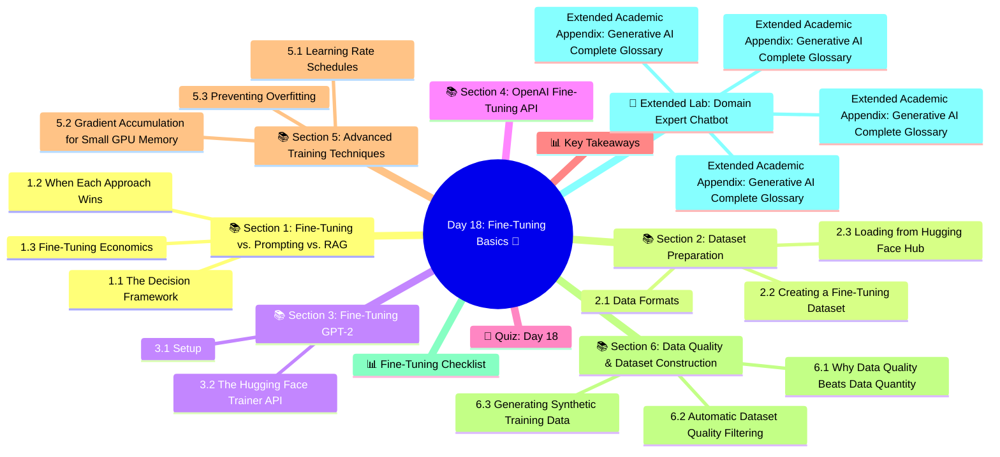

# Day 18: Fine-Tuning Basics 🎯
### Week 3 — RAG, Fine-Tuning & Vector Databases

---

## 🧠 Concept Map




---

## 🎯 Learning Objectives

By the end of today, you will:
- Understand when to fine-tune vs. using RAG or prompting
- Prepare datasets in the right format for fine-tuning
- Use the Hugging Face Trainer API for full fine-tuning
- Fine-tune GPT-2 on custom text data
- Evaluate your fine-tuned model

**Estimated Time:** 4–4.5 hours  
**Difficulty:** ⭐⭐⭐⭐ Advanced  
**Prerequisites:** Days 1–6 (deep learning foundations), Day 3 (transformers)

---

## 📚 Section 1: Fine-Tuning vs. Prompting vs. RAG

### 1.1 The Decision Framework

```
                    ┌─────────────────────────────┐
                    │  Do you need the model to    │
                    │  KNOW something it doesn't?  │
                    └──────────────┬──────────────┘
                                   │
                    ┌──────────────▼──────────────┐
                    │ Is the knowledge in documents│
                    │ you can retrieve at runtime? │
                    └──────┬────────────────┬──────┘
                          YES               NO
                           │                │
                    ┌──────▼──────┐  ┌──────▼──────┐
                    │     RAG     │  │ Fine-Tuning  │
                    │  (cheaper,  │  │ (expensive,  │
                    │  flexible)  │  │  permanent)  │
                    └─────────────┘  └─────────────┘
```

### 1.2 When Each Approach Wins

| Scenario | Best Approach |
|----------|--------------|
| Answer questions about company docs | **RAG** |
| Generate code in custom framework style | **Fine-tuning** |
| Extract structured data from documents | **Prompting** (or fine-tune for volume) |
| Learn proprietary domain vocabulary | **Fine-tuning** |
| Real-time data (news, prices) | **RAG** |
| Always respond in a specific persona | **Fine-tuning** |
| Quick prototype, small budget | **Prompting** |
| High volume, cost-sensitive production | **Fine-tuning** (reduced tokens needed) |

### 1.3 Fine-Tuning Economics

Full fine-tuning a 7B model costs ~$400-800 for a quality dataset on cloud GPUs.
This becomes cost-effective when you're making millions of API calls per month.

---

## 📚 Section 2: Dataset Preparation

### 2.1 Data Formats

Hugging Face models use different formats depending on the task:

**Causal LM (GPT-style):**
```json
{"text": "The quick brown fox jumps over the lazy dog."}
```

**Instruction Fine-tuning (chat format):**
```json
{
  "messages": [
    {"role": "system", "content": "You are a helpful assistant."},
    {"role": "user", "content": "What is machine learning?"},
    {"role": "assistant", "content": "Machine learning is a field of AI..."}
  ]
}
```

**Text classification:**
```json
{"text": "This movie was great!", "label": 1}
```

### 2.2 Creating a Fine-Tuning Dataset

```python
import json
import random
from pathlib import Path

def create_instruction_dataset(
    qa_pairs: list[dict],
    system_prompt: str = "You are a helpful AI assistant.",
    output_path: str = "fine_tune_data.jsonl"
) -> None:
    """
    Create a JSONL dataset from QA pairs for instruction fine-tuning.
    
    qa_pairs: list of {"question": "...", "answer": "..."}
    """
    records = []
    
    for pair in qa_pairs:
        record = {
            "messages": [
                {"role": "system", "content": system_prompt},
                {"role": "user", "content": pair["question"]},
                {"role": "assistant", "content": pair["answer"]}
            ]
        }
        records.append(record)
    
    # Shuffle
    random.shuffle(records)
    
    # Split 90/10 train/validation
    split = int(len(records) * 0.9)
    train_records = records[:split]
    val_records = records[split:]
    
    # Write to JSONL
    base = Path(output_path).stem
    suffix = Path(output_path).suffix
    
    for split_name, split_data in [("train", train_records), ("val", val_records)]:
        filename = f"{base}_{split_name}{suffix}"
        with open(filename, "w") as f:
            for record in split_data:
                f.write(json.dumps(record) + "\n")
        print(f"✅ Wrote {len(split_data)} records to {filename}")


# Example: Create a dataset for a customer service bot
qa_pairs = [
    {
        "question": "How do I reset my password?",
        "answer": "To reset your password: 1) Click 'Forgot Password' on the login page. 2) Enter your email address. 3) Check your email for a reset link. 4) Click the link and set a new password. The link expires in 24 hours."
    },
    {
        "question": "What is your refund policy?",
        "answer": "We offer a 30-day money-back guarantee on all purchases. To request a refund, contact support@company.com with your order number. Refunds are processed within 5-7 business days to your original payment method."
    },
    {
        "question": "How do I cancel my subscription?",
        "answer": "You can cancel your subscription at any time: 1) Log into your account. 2) Go to Settings → Subscription. 3) Click 'Cancel Subscription'. Your access continues until the end of the billing period."
    },
    {
        "question": "Do you offer enterprise pricing?",
        "answer": "Yes! Our enterprise plans start at $500/month for teams of 25+. Enterprise features include: SSO integration, dedicated support, custom SLAs, and volume discounts. Contact sales@company.com for a custom quote."
    },
    # Add 100+ more QA pairs for good results
]

create_instruction_dataset(
    qa_pairs=qa_pairs,
    system_prompt="You are a helpful customer service agent. Provide accurate, friendly responses.",
    output_path="customer_service_data.jsonl"
)
```

### 2.3 Loading from Hugging Face Hub

```python
from datasets import load_dataset

# Many public instruction datasets available
dataset = load_dataset("tatsu-lab/alpaca", split="train[:1000]")  # First 1000 samples
print(dataset.features)
print(dataset[0])

# OpenHermes is an excellent instruction dataset
# dataset = load_dataset("teknium/OpenHermes-2.5", split="train[:5000]")

# Load your local JSONL file
local_dataset = load_dataset(
    "json",
    data_files={"train": "customer_service_data_train.jsonl", "validation": "customer_service_data_val.jsonl"}
)
print(f"Train size: {len(local_dataset['train'])}")
print(f"Val size: {len(local_dataset['validation'])}")
```

---

## 📚 Section 3: Fine-Tuning GPT-2

### 3.1 Setup

```bash
pip install transformers datasets accelerate evaluate torch
```

### 3.2 The Hugging Face Trainer API

```python
# finetune_gpt2.py
"""Fine-tune GPT-2 on a custom text corpus using Hugging Face Trainer"""

import os
from pathlib import Path
import torch
from datasets import Dataset
from transformers import (
    GPT2LMHeadModel,
    GPT2Tokenizer,
    DataCollatorForLanguageModeling,
    TrainingArguments,
    Trainer,
    EarlyStoppingCallback
)

# ── 1. Load Model & Tokenizer ──────────────────────────────
print("Loading GPT-2...")
model_name = "gpt2"  # Options: gpt2, gpt2-medium, gpt2-large, gpt2-xl
tokenizer = GPT2Tokenizer.from_pretrained(model_name)
model = GPT2LMHeadModel.from_pretrained(model_name)

# GPT-2 doesn't have a pad token — use EOS as pad
tokenizer.pad_token = tokenizer.eos_token
model.config.pad_token_id = tokenizer.eos_token_id

print(f"Model parameters: {model.num_parameters():,}")
print(f"Vocabulary size: {tokenizer.vocab_size}")

# ── 2. Prepare Data ───────────────────────────────────────
# For demo: create a small domain-specific corpus
def create_demo_corpus() -> list[str]:
    """Create a small GenAI domain text corpus for fine-tuning demo"""
    texts = [
        "Transformer models revolutionized natural language processing by introducing the attention mechanism. Unlike recurrent networks, transformers process all tokens in parallel, enabling faster training on large datasets.",
        "Retrieval-Augmented Generation (RAG) combines the power of vector search with language model generation. By retrieving relevant documents at inference time, RAG reduces hallucinations and keeps knowledge current.",
        "Large language models are pre-trained on vast text corpora to learn statistical patterns of language. This pre-training serves as a foundation for fine-tuning on specific tasks.",
        "The attention mechanism computes a weighted sum of value vectors, where weights are determined by the similarity between query and key vectors. This allows the model to focus on relevant parts of the input.",
        "Fine-tuning a language model on domain-specific data helps it learn specialized vocabulary, writing styles, and task formats that may not be well-represented in general pre-training data.",
        "Vector embeddings represent text as dense numerical vectors in a high-dimensional space. Semantically similar texts have embeddings that are geometrically close to each other.",
        "Chain-of-thought prompting guides LLMs to reason step-by-step before providing a final answer, significantly improving performance on mathematical and logical reasoning tasks.",
        "The instruction-following capability of modern LLMs emerges from fine-tuning on curated datasets of instructions and high-quality responses, often augmented by reinforcement learning from human feedback.",
    ]
    return texts * 50  # Repeat for demo (real dataset should be much larger)

texts = create_demo_corpus()
print(f"Corpus size: {len(texts)} texts")

# Tokenize
def tokenize_function(examples: dict) -> dict:
    tokenized = tokenizer(
        examples["text"],
        truncation=True,
        max_length=256,           # GPT-2 supports up to 1024
        padding="max_length",
        return_tensors="pt"
    )
    # For causal LM, labels = input_ids (predict next token)
    tokenized["labels"] = tokenized["input_ids"].clone()
    return tokenized

# Create dataset
raw_dataset = Dataset.from_dict({"text": texts})
raw_dataset = raw_dataset.train_test_split(test_size=0.1)

tokenized_train = raw_dataset["train"].map(
    tokenize_function, batched=True, remove_columns=["text"]
)
tokenized_val = raw_dataset["test"].map(
    tokenize_function, batched=True, remove_columns=["text"]
)

print(f"Train samples: {len(tokenized_train)}")
print(f"Val samples: {len(tokenized_val)}")

# ── 3. Data Collator ───────────────────────────────────────
data_collator = DataCollatorForLanguageModeling(
    tokenizer=tokenizer,
    mlm=False    # False = causal LM (GPT-style), True = masked LM (BERT-style)
)

# ── 4. Training Arguments ──────────────────────────────────
training_args = TrainingArguments(
    output_dir="./fine_tuned_gpt2",
    num_train_epochs=3,
    per_device_train_batch_size=4,
    per_device_eval_batch_size=4,
    warmup_steps=100,
    weight_decay=0.01,
    logging_dir="./logs",
    logging_steps=50,
    eval_strategy="epoch",
    save_strategy="epoch",
    load_best_model_at_end=True,
    metric_for_best_model="eval_loss",
    greater_is_better=False,
    fp16=torch.cuda.is_available(),  # Use FP16 if GPU available
    dataloader_num_workers=0,
    report_to=None  # Disable WandB for this demo
)

# ── 5. Trainer ────────────────────────────────────────────
trainer = Trainer(
    model=model,
    args=training_args,
    train_dataset=tokenized_train,
    eval_dataset=tokenized_val,
    data_collator=data_collator,
    callbacks=[EarlyStoppingCallback(early_stopping_patience=2)]
)

# ── 6. Train ───────────────────────────────────────────────
print("\n🚀 Starting fine-tuning...")
trainer.train()

# ── 7. Save & Evaluate ────────────────────────────────────
trainer.save_model("./fine_tuned_gpt2_final")
tokenizer.save_pretrained("./fine_tuned_gpt2_final")
print("✅ Model saved!")

# Evaluate perplexity
eval_results = trainer.evaluate()
perplexity = 2 ** eval_results["eval_loss"]  # Perplexity = 2^cross-entropy
print(f"\nEval Loss: {eval_results['eval_loss']:.4f}")
print(f"Perplexity: {perplexity:.2f}")

# ── 8. Generate with Fine-Tuned Model ─────────────────────
model.eval()

prompts = [
    "Transformer models",
    "RAG systems work by",
    "Fine-tuning a language model",
]

print("\n📝 GENERATION SAMPLES:")
for prompt in prompts:
    inputs = tokenizer(prompt, return_tensors="pt")
    
    with torch.no_grad():
        outputs = model.generate(
            inputs["input_ids"],
            max_new_tokens=80,
            temperature=0.8,
            do_sample=True,
            top_p=0.9,
            pad_token_id=tokenizer.eos_token_id
        )
    
    generated = tokenizer.decode(outputs[0], skip_special_tokens=True)
    print(f"\nPrompt: '{prompt}'")
    print(f"Generated: {generated}")
```

---

## 📚 Section 4: OpenAI Fine-Tuning API

For production use with GPT-3.5-turbo or GPT-4o-mini fine-tuning:

```python
from openai import OpenAI
import os, json, time

client = OpenAI(api_key=os.getenv("OPENAI_API_KEY"))

# Step 1: Upload training file
def upload_training_file(path: str) -> str:
    with open(path, "rb") as f:
        response = client.files.create(file=f, purpose="fine-tune")
    file_id = response.id
    print(f"✅ Uploaded training file: {file_id}")
    return file_id

# Step 2: Create fine-tuning job
def create_fine_tuning_job(training_file_id: str, validation_file_id: str = None):
    kwargs = {
        "training_file": training_file_id,
        "model": "gpt-4o-mini-2024-07-18",  # Base model to fine-tune
        "hyperparameters": {
            "n_epochs": 3,
        }
    }
    if validation_file_id:
        kwargs["validation_file"] = validation_file_id
    
    job = client.fine_tuning.jobs.create(**kwargs)
    print(f"✅ Fine-tuning job created: {job.id}")
    return job.id

# Step 3: Monitor progress
def wait_for_fine_tuning(job_id: str) -> str:
    while True:
        job = client.fine_tuning.jobs.retrieve(job_id)
        status = job.status
        print(f"Status: {status}")
        
        if status == "succeeded":
            fine_tuned_model = job.fine_tuned_model
            print(f"✅ Fine-tuned model ready: {fine_tuned_model}")
            return fine_tuned_model
        elif status in ("failed", "cancelled"):
            print(f"❌ Job {status}: {job.error}")
            return None
        
        time.sleep(30)  # Check every 30 seconds

# Step 4: Use the fine-tuned model
def use_fine_tuned_model(model_id: str, user_message: str) -> str:
    response = client.chat.completions.create(
        model=model_id,
        messages=[
            {"role": "system", "content": "You are a helpful customer service agent."},
            {"role": "user", "content": user_message}
        ]
    )
    return response.choices[0].message.content

# Example workflow (commented out — costs real money!)
# file_id = upload_training_file("customer_service_data_train.jsonl")
# job_id = create_fine_tuning_job(file_id)
# model_id = wait_for_fine_tuning(job_id) 
# print(use_fine_tuned_model(model_id, "How do I cancel my subscription?"))
```

---

## 🧠 Quiz: Day 18

**Q1:** When is fine-tuning preferred over RAG?
- A) When documents change daily
- B) **When you need the model to behave in a specific style/persona across all responses ✅**
- C) When documents fit in the context window
- D) When you have a small budget

**Q2:** In causal language model fine-tuning, labels are set to:
- A) The sentiment class of each text
- B) Randomly sampled tokens
- C) **The same as input_ids — predict the next token ✅**
- D) The masked tokens only

**Q3:** What does perplexity measure in language model evaluation?
- A) How surprised users are by model outputs
- B) **How well the model predicts a sample of text (lower = better) ✅**
- C) The diversity of model outputs
- D) The number of parameters used

**Q4:** The Hugging Face `Trainer` handles:
- A) Only training loop execution
- B) **Training, validation, checkpointing, logging, and early stopping ✅**
- C) Only model deployment
- D) Dataset downloading

**Q5:** Why set `tokenizer.pad_token = tokenizer.eos_token` for GPT-2?
- A) It makes training faster
- B) GPT-2 generates longer outputs with this setting
- C) **GPT-2 lacks a pad token; EOS serves as a substitute for padding ✅**
- D) It improves perplexity scores

**Q6:** OpenAI fine-tuning requires data in what format?
- A) Plain text files
- B) CSV with text and label columns
- C) **JSONL with messages in chat format ✅**
- D) HuggingFace Arrow format

---

## 📊 Key Takeaways

| Concept | Key Point |
|---------|-----------|
| **When to Fine-tune** | Style/persona baking, domain vocabulary, high-volume cost reduction |
| **Dataset Format** | JSONL with instruction-response pairs (chat format) |
| **Causual LM** | Labels = input_ids (predict next token) |
| **Trainer API** | Handles training loop, evaluation, checkpointing automatically |
| **Perplexity** | Primary metric — measures predictive quality (lower = better) |
| **OpenAI Fine-tuning** | API-based, expensive, high quality |
| **HuggingFace Trainer** | Open-source, flexible, runs on local GPU |

---

## 📚 Section 5: Advanced Training Techniques

### 5.1 Learning Rate Schedules

The learning rate schedule is one of the most important hyperparameters in fine-tuning:

```python
from transformers import (
    AutoModelForCausalLM,
    AutoTokenizer,
    TrainingArguments,
    Trainer,
    get_linear_schedule_with_warmup,
    get_cosine_schedule_with_warmup,
    get_cosine_with_hard_restarts_schedule_with_warmup
)
import matplotlib.pyplot as plt
import numpy as np

def visualize_lr_schedules():
    """Compare popular learning rate schedules"""
    n_steps = 1000
    warmup_steps = 100
    base_lr = 5e-5
    
    schedules = {
        "Linear with Warmup": [],
        "Cosine with Warmup": [],
        "Constant with Warmup": [],
    }
    
    for step in range(n_steps):
        # Linear: ramps up, then decays linearly
        if step < warmup_steps:
            linear_lr = base_lr * (step / warmup_steps)
        else:
            linear_lr = base_lr * (1 - (step - warmup_steps) / (n_steps - warmup_steps))
        
        # Cosine: ramps up, then decays along cosine curve
        if step < warmup_steps:
            cosine_lr = base_lr * (step / warmup_steps)
        else:
            progress = (step - warmup_steps) / (n_steps - warmup_steps)
            cosine_lr = base_lr * 0.5 * (1 + np.cos(np.pi * progress))
        
        # Constant: ramps up, then stays constant
        const_lr = min(base_lr, base_lr * step / warmup_steps)
        
        schedules["Linear with Warmup"].append(linear_lr)
        schedules["Cosine with Warmup"].append(cosine_lr)
        schedules["Constant with Warmup"].append(const_lr)
    
    print("Learning Rate Schedule Comparison:")
    print(f"  Warmup steps: {warmup_steps}")
    print(f"  Total steps:  {n_steps}")
    print(f"  Peak LR:      {base_lr:.2e}")
    for name, lrs in schedules.items():
        print(f"\n  {name}:")
        print(f"    Step 0:   {lrs[0]:.2e}")
        print(f"    Step 100: {lrs[100]:.2e}")
        print(f"    Step 500: {lrs[500]:.2e}")
        print(f"    Step 999: {lrs[999]:.2e}")

visualize_lr_schedules()
```

**Rule of thumb for fine-tuning learning rates:**
- **Full fine-tuning**: 1e-5 to 5e-5 (lower than pre-training)
- **LoRA fine-tuning**: 1e-4 to 3e-4 (higher, since only adapters are trained)
- **Linear classifiers on frozen base**: 1e-3 to 5e-3

### 5.2 Gradient Accumulation for Small GPU Memory

```python
# If you only have 8GB VRAM, you can't fit batch_size=16
# Use gradient accumulation to simulate larger batches

training_args = TrainingArguments(
    output_dir="./model_output",
    
    # Only 2 examples per GPU forward pass
    per_device_train_batch_size=2,
    
    # But accumulate gradients for 8 steps before updating
    gradient_accumulation_steps=8,
    # Effective batch size = 2 * 8 = 16 (same as batch_size=16)
    
    # Enable gradient checkpointing — trades compute for memory
    # Saves ~30% VRAM at cost of ~20% slower training
    gradient_checkpointing=True,
    
    # Mixed precision for further memory reduction
    fp16=True,           # FP16 on NVIDIA GPUs
    # bf16=True,         # BF16 on Ampere+ GPUs (more stable)
    
    num_train_epochs=3,
    learning_rate=2e-5,
    
    # Optimizer: AdamW with 8-bit quantization (saves more memory)
    # Requires: pip install bitsandbytes
    # optim="adamw_bnb_8bit",
)

print("Memory-efficient training config:")
print(f"  Per-device batch size: {training_args.per_device_train_batch_size}")
print(f"  Gradient accumulation: {training_args.gradient_accumulation_steps}")
print(f"  Effective batch size:  {training_args.per_device_train_batch_size * training_args.gradient_accumulation_steps}")
print(f"  Gradient checkpointing: {training_args.gradient_checkpointing}")
```

### 5.3 Preventing Overfitting

Common fine-tuning failure mode — the model "memorizes" training examples:

```python
from transformers import TrainingArguments, TrainerCallback

class OverfittingDetector(TrainerCallback):
    """Callback that detects and warns about overfitting"""
    
    def __init__(self, threshold: float = 0.15):
        self.threshold = threshold  # Max acceptable gap between train/eval loss
        self.train_losses = []
        self.eval_losses = []
    
    def on_log(self, args, state, control, logs=None, **kwargs):
        if logs:
            if "loss" in logs:
                self.train_losses.append(logs["loss"])
            if "eval_loss" in logs:
                self.eval_losses.append(logs["eval_loss"])
                
                if self.train_losses and self.eval_losses:
                    gap = self.eval_losses[-1] - self.train_losses[-1]
                    if gap > self.threshold:
                        print(f"\n⚠️  Overfitting detected! Train loss: {self.train_losses[-1]:.4f}, Eval loss: {self.eval_losses[-1]:.4f}, Gap: {gap:.4f}")
                        print("   Consider: reducing epochs, adding dropout, or using more data")

# Anti-overfitting hyperparameters
anti_overfit_args = TrainingArguments(
    output_dir="./model_output",
    num_train_epochs=3,           # Never fine-tune too many epochs
    weight_decay=0.01,            # L2 regularization penalizes large weights
    max_grad_norm=1.0,            # Gradient clipping prevents explosive updates
    warmup_ratio=0.06,            # 6% of training as warmup
    lr_scheduler_type="cosine",   # Cosine decay is gentler than linear
    per_device_train_batch_size=8,
    load_best_model_at_end=True,  # Keep the best checkpoint, not the last
    metric_for_best_model="eval_loss",
    evaluation_strategy="epoch",
    save_strategy="epoch",
)
```

---

## 📚 Section 6: Data Quality & Dataset Construction

### 6.1 Why Data Quality Beats Data Quantity

The famous **"Alpaca → ORCA" progression** illustrates this:
- Alpaca: 52,000 GPT-3.5 generated examples → mediocre results
- Dolly: 15,000 human-written examples → better than Alpaca
- ORCA: 1M examples from GPT-4 with reasoning traces → much better

**Quality principles:**
1. **Diversity** — cover all task variants, edge cases, and domains
2. **Accuracy** — wrong answers in training data are worse than no data
3. **Appropriate length** — match the expected output length at inference
4. **Format consistency** — same structure every time

### 6.2 Automatic Dataset Quality Filtering

```python
from datasets import load_dataset, Dataset
from langchain_openai import ChatOpenAI
from langchain_core.prompts import ChatPromptTemplate
from langchain_core.output_parsers import JsonOutputParser
import json

llm = ChatOpenAI(model="gpt-4o-mini", temperature=0)

def score_training_example(question: str, answer: str) -> dict:
    """Use GPT-4o-mini to score training example quality"""
    
    chain = (
        ChatPromptTemplate.from_template("""
Score this training example for instruction fine-tuning.

QUESTION: {question}
ANSWER: {answer}

Score on three criteria (0-10 each):
1. accuracy: Is the answer factually correct?
2. completeness: Does it fully address the question?  
3. clarity: Is it well-written and easy to understand?

Return JSON: {{"accuracy": n, "completeness": n, "clarity": n, "keep": true/false}}
Keep=true if average score >= 7.
""")
        | llm
        | JsonOutputParser()
    )
    
    return chain.invoke({"question": question, "answer": answer})

def filter_dataset_by_quality(examples: list[dict], min_avg_score: float = 7.0) -> list[dict]:
    """Filter dataset — only keep high-quality examples"""
    high_quality = []
    
    for ex in examples:
        try:
            scores = score_training_example(ex["question"], ex["answer"])
            avg = (scores["accuracy"] + scores["completeness"] + scores["clarity"]) / 3
            
            if avg >= min_avg_score and scores.get("keep", True):
                ex["quality_score"] = avg
                high_quality.append(ex)
            else:
                print(f"  ❌ Rejected (avg={avg:.1f}): {ex['question'][:50]}...")
        except Exception as e:
            print(f"  ⚠️  Score failed: {e}")
    
    print(f"\nFiltered: {len(high_quality)}/{len(examples)} examples kept ({len(high_quality)/len(examples)*100:.0f}%)")
    return high_quality

# Sample examples
sample_data = [
    {"question": "What is 2+2?", "answer": "The answer is 4. This is basic addition."},
    {"question": "Explain transformers.", "answer": "idk lol"},  # Bad example
    {"question": "How do I center a div in CSS?", "answer": "Use `display: flex; align-items: center; justify-content: center;` on the parent container."},
]

# filtered = filter_dataset_by_quality(sample_data)
# print(f"Kept {len(filtered)} high-quality examples")
```

### 6.3 Generating Synthetic Training Data

```python
from langchain_openai import ChatOpenAI
from langchain_core.prompts import ChatPromptTemplate
from langchain_core.output_parsers import JsonOutputParser
import json

llm = ChatOpenAI(model="gpt-4o-mini", temperature=0.8)

def generate_training_pairs(topic: str, n: int = 10) -> list[dict]:
    """Generate synthetic instruction-following training data on any topic"""
    
    chain = (
        ChatPromptTemplate.from_template("""
Generate {n} diverse instruction-response pairs for fine-tuning a specialized AI assistant.
Topic: {topic}

Requirements:
- Vary difficulty from beginner to advanced
- Include different question types: factual, how-to, explain, compare, troubleshoot
- Responses should be thorough (3-8 sentences each)
- Vary the question phrasing

Return JSON array:
[
  {{"instruction": "user question", "response": "detailed answer"}},
  ...
]
""")
        | llm
        | JsonOutputParser()
    )
    
    result = chain.invoke({"topic": topic, "n": n})
    return result if isinstance(result, list) else []

def build_domain_dataset(domains: list[str], examples_per_domain: int = 20) -> list[dict]:
    """Build a multi-domain training dataset"""
    all_examples = []
    
    for domain in domains:
        print(f"Generating {examples_per_domain} examples for: {domain}...")
        examples = generate_training_pairs(domain, examples_per_domain)
        
        # Add domain metadata
        for ex in examples:
            ex["domain"] = domain
        
        all_examples.extend(examples)
        print(f"  → Generated {len(examples)} examples")
    
    return all_examples

# Generate a sample dataset
domains = ["Python error handling", "SQL query optimization", "Git workflows"]
# dataset = build_domain_dataset(domains, examples_per_domain=5)
# print(f"\nTotal examples: {len(dataset)}")
# for ex in dataset[:2]:
#     print(f"\n[{ex['domain']}]")
#     print(f"Q: {ex['instruction']}")
#     print(f"A: {ex['response'][:150]}...")
```

---

## 📊 Fine-Tuning Checklist

Before starting a fine-tuning run, verify:

| Item | Check |
|------|-------|
| ≥ 50 high-quality examples | ☐ |
| 90/10 train/val split | ☐ |
| No duplicate examples | ☐ |
| Data format validated (JSONL) | ☐ |
| System prompt consistent | ☐ |
| Baseline prompt engineering tried first | ☐ |
| GPU/compute budget estimated | ☐ |
| Evaluation metrics defined | ☐ |
| Logging/tracking setup | ☐ |
| Save path and checkpoints configured | ☐ |

---

## 🎯 Extended Lab: Domain Expert Chatbot

Build a fine-tuned customer service chatbot end-to-end:

1. Generate 100 QA pairs using `build_domain_dataset()`
2. Filter with `filter_dataset_by_quality()` (keep quality ≥ 7)
3. Format as JSONL and upload to OpenAI
4. Create fine-tuning job (`gpt-4o-mini`)
5. Test: compare base gpt-4o-mini vs fine-tuned model on 10 test questions
6. Measure: response latency, token usage, answer quality

```python
print("=== Domain Expert Chatbot Fine-tuning ===")
print("Pipeline: Generate → Filter → Format → Train → Evaluate")
print("Estimated cost: ~$0.10-0.50 for 100 examples × 3 epochs")
print("See day-18-lab.py for the full implementation.")
```

---

*Day 18 Complete ✅ | GenAI Course — Week 3 | Next: Day 19 — LoRA & PEFT*
\n\n---\n\n## Expanded Expert Knowledge Base & Reference Guides\n\n
### Extended Academic Appendix: Generative AI Complete Glossary

*   **Activation Function**: A mathematical equation attached to each neuron in a network that determines whether it should be activated or not. Examples include ReLU, GELU, and SwiGLU.
*   **Adam Optimizer**: Adaptive Moment Estimation. An algorithm for optimization technique for gradient descent. The method computes individual adaptive learning rates for different parameters from estimates of first and second moments of the gradients.
*   **Alignment**: The process of ensuring AI systems act exactly in accordance with human intentions and values, preventing toxic, harmful, or legally dangerous logic generation paths.
*   **API (Application Programming Interface)**: A software intermediary that allows two applications to talk to each other. In GenAI, it's how your software securely requests generations from massive cloud GPUs.
*   **Auto-regressive**: A model that generates the future sequences step-by-step, conditioning the next prediction exclusively on the previous predictions it just generated.
*   **Backpropagation**: The core algorithm behind learning in neural networks. It calculates the mathematical gradient of the loss function with respect to the weights by utilizing the chain rule, moving backwards from output to input.
*   **Batch Size**: The number of training examples utilized in one single iteration of gradient descent before the network's internal mathematical parameters are updated.
*   **Bias (Mathematical)**: A constant value added to the linear projection in neural layers ($y = mx + b$). It allows the activation function to shift to the left or right, increasing the flexibility of the network to fit complex data boundaries.
*   **BPE (Byte Pair Encoding)**: A specific mathematical data compression technique adapted for NLP tokenization. It recursively merges the most frequently occurring pair of adjacent characters into a single new sub-word token.
*   **Cache (KV Cache)**: In LLMs, the Key-Value matrices of previously generated tokens are stored in GPU VRAM so the transformer doesn't have to re-compute the entire 10,000-word essay every single time it tries to generate word 10,001.
*   **Chain of Thought (CoT)**: A prompting strategy that forces the LLM to output a series of intermediate mathematical or logical reasoning steps before outputting the final answer, drastically improving accuracy on complex logic tasks.
*   **Chinchilla Laws**: DeepMind's 2022 paper proving that to train compute-optimally, the dataset token count must scale perfectly linearly with the parameter count (a 20:1 ratio is strictly advised).
*   **Constitutional AI**: Anthropic's proprietary alignment pipeline. A model is given a strict set of rules ('The Constitution') and autonomously critiques and revises its own responses, generating a vast RL dataset without expensive human labeling.
*   **Context Window**: The maximum number of tokens (words/sub-words) a model can ingest and process mathematically in a single forward pass operation. GPT-4 handles 128k; Gemini handles 2 Million.
*   **Cross-Entropy Loss**: The standard mathematical loss function used in classification tasks and language modeling. It calculates the delta between the model's predicted probability distribution and the actual rigid truth of the training data.
*   **Decoder-Only Architecture**: A Transformer that abandons the bi-directional Encoder entirely (like GPT). It utilizes strictly causal, masked self-attention to generate sequential texts autoregressively.
*   **Dense Model**: A standard neural network architecture where every single parameter in the computational block is activated and multiplied during every single forward pass (Contrast with MoE).
*   **Discriminative Model**: Machine learning models designed fundamentally to draw mathematical boundaries between classes (e.g., Is this photo a hot dog or not a hot dog?) Contrast with Generative Models.
*   **Dropout**: A cruel but effective regularization technique where a percentage of neurons in a layer are randomly completely deactivated during a training pass. This forces the network to stop relying on individual 'memorized' paths and build robust distributed representations.
*   **Embedding**: The mathematical projection mapping a discrete token (like the word 'Apple') into a continuous dense continuous vector space where physical geometry and distance represent semantic linguistic meaning.
*   **Epoch**: One full operational pass of the training pipeline sequentially interacting with the entire dataset. Foundation models are often trained for only 1 Epoch to prevent catastrophic overfitting logic traps.
*   **Feed-Forward Network (FFN)**: The dense, localized multi-layer perceptron block inside a Transformer layer operating independently on each token vector specifically acting as the model's 'Key-Value fact database'.
*   **Fine-Tuning**: Taking a massive, previously trained generic foundation model and training it further on a tiny, specific domain dataset (like medical journals) using a low learning rate to alter its core behavior.
*   **FP16 (Half Precision)**: A computer number format occupying 16 bits. HuggingFace models default to this. Represents a compromise utilizing half the GPU VRAM of 32-bit floats with mathematically negligible degradation in AI loss metrics.
*   **Foundation Model**: A gargantuan neural network trained utilizing massive unsupervised learning pipelines across the entire internet, serving as the base layer for countless downstream specific tasks.
*   **Generative Model**: AI architecture designed to map and understand the fundamental underlying distribution of data specifically to generate completely novel, statistically adjacent synthetic data. (e.g. LLMs, Diffusion Models).
*   **GQA (Grouped-Query Attention)**: An architectural optimization. Instead of calculating a massive individual Key and Value matrix for every single Query Head in Multi-Head Attention, multiple Query heads mathematically share the same Key/Value arrays, vastly saving VRAM.
*   **GPU (Graphics Processing Unit)**: The physical silicon hardware engines powering AI. Thousands of cores designed specifically to execute massive parallel floating point Matrix Multiplication extremely efficiently. NVIDIA dominates this landscape.
*   **Gradient Descent**: The mathematical optimization algorithm locating the minimum of a neural loss curve by taking scaled sequential steps in the exact opposite operational direction of the calculated tensor gradient.
*   **Hallucination**: When a generative AI model outputs convincing, confident logic strings that are completely factually incorrect due primarily to token probability space interpolation artifacts.
*   **Hugging Face**: The central structural GitHub for Machine Learning. A gigantic repository hosting open-source model weights, extensive NLP datasets, and the most heavily utilized `transformers` Python inference library globally.
*   **Hyperparameters**: The architectural variables of a neural network that are set manually by the human engineer *before* training begins (e.g. Learning Rate, Batch Size, Dropout Rate) and are never altered by backpropagation.
*   **In-Context Learning**: The mysterious emergent capability of massive LLMs to learn completely new tasks instantly utilizing purely the context text inside the given prompt, requiring zero permanent weight tensor alterations.
*   **Instruction Tuning**: Fine-tuning base models specifically to respond obediently to 'User Prompts'. A base model will complete a sentence; an instruction-tuned model will act like a dialogue assistant.
*   **INT4 (4-Bit Quantization)**: An extreme computational compression technique squashing a 16-bit weight parameter mathematically down to just 4 bits. Allows executing an 8 Billion parameter model on a standard 6GB laptop GPU.
*   **Knowledge Distillation**: A training pipeline where a gargantuan 'Teacher' model generates massive amounts of high-quality synthetic data to train a tiny 'Student' model structurally imitating its superior behaviors.
*   **Llama**: Meta's flagship family of Open-Weight Large Language Models. Responsible singularly for unleashing the massive democratization of the enterprise Local-LLM hosting revolution.
*   **LLM (Large Language Model)**: A deep learning neural network, generally executing a Transformer architecture, possessing billions of parameters, specifically designed to process, map, and generate natural human linguistics.
*   **Logits**: The raw, unnormalized massive mathematical scores output directly by the final linear projection layer of the neural network natively *before* entering the Softmax bounding probability function.
*   **LoRA (Low-Rank Adaptation)**: A parameter-efficient Fine-Tuning miracle. Instead of freezing 8 billion parameters, LoRA injects two tiny matrices side-by-side, dramatically slashing the required training VRAM computational burden by 98%.
*   **Masked Attention**: A mandatory structural configuration inside a Decoder enforcing causality. It mathematically blocks the model from executing any attention logic targeting tokens located positioned *after* the current token.
*   **Mixture of Experts (MoE)**: A neural block containing several 'expert' sub-networks (like 8 separate FFNs). A routing gate decides exactly which two experts activate for each specific input vector, preserving massive inference speed.
*   **Multi-Head Attention**: Processing multiple self-attention operations concurrently in physically separate lower-dimensional sub-spaces immediately before concatenating them. Allows parsing extreme grammatical complexity without blurring the semantic signals.
*   **Next-Token Prediction**: The incredibly simple underlying foundational logic objective utilized to pre-train almost all massive modern generative language models across Trillions of raw internet text documents.
*   **NLP (Natural Language Processing)**: The massive overarching subfield of AI concerned entirely with programming algorithms to process, understand, analyze, and generate human linguistics and conversational grammar.
*   **Overfitting**: A critical mathematical failure where a network memorizes the exact specific noise artifacts in the training dataset perfectly, completely destroying its capacity to generalize against unseen validation data.
*   **Parameter**: The actual structural weights and biases contained natively deeply inside a neural network structure. An 8B parameter model literally contains 8,000,000,000 decimal numbers in 3D multi-dimensional arrays.
*   **Positional Encoding**: The critical vector matrix added to the foundational input embeddings explicitly providing the Attention mathematical permutation logic with structural information regarding the exact sequence order of the tokens.
*   **Pre-training**: The primary initial phase of creating a Foundation model. Feeding Trillions of text tokens through thousands of GPUs for weeks consuming megawatts of power strictly performing unsupervised next-token prediction.
*   **Prompt Engineering**: The process of empirically designing, testing, and optimizing the structural format of linguistic inputs injected into LLMs to extract specifically desired, accurate, and robust structural logic outputs.
*   **Python**: The undisputed dominant syntactic language dominating the Machine Learning backend architecture globally. Used to interface natively with the massively optimized C++ PyTorch/TensorFlow backend structures.
*   **Quantization**: The process of fundamentally converting the continuous mathematical precision of model weight sets from floating point 32/16-bit resolutions down to block-level 8-bit or 4-bit, sacrificing microscopic accuracy for massive VRAM deployment efficiency.
*   **RAG (Retrieval-Augmented Generation)**: The absolute standard deployed architecture for enterprise applications. Preventing LLM hallucinations by intercepting the user query, searching an external enterprise vector database for facts, and injecting those raw facts into the LLM context prior to generation.
*   **Recurrent Neural Network (RNN)**: The legacy sequential architecture predating Transformers. Structurally processes tokens linearly one-by-one utilizing a continuous expanding hidden state. Massively vulnerable to extreme 'vanishing gradient' failure over large context windows.
*   **ReLU (Rectified Linear Unit)**: A critically vital, simple activation formula: $f(x) = max(0, x)$. It structurally forces any massive negative outputs directly to 0.0, injecting mandatory non-linearity into massive chained matrix multiplications.
*   **Representation Learning**: A set of structural ML techniques allowing underlying systems to automatically discover the raw distinct structural features or representations natively required for complex classification natively from raw data blocks.
*   **Residual Connection (Skip Connection)**: Crucial architectural bypass lines transmitting original input vectors structurally directly deeply around massive network layers, instantly adding them to the final outputs. These bypass physical lines solve the vanishing gradient apocalypse inside massively deep networks.
*   **RLHF (Reinforcement Learning from Human Feedback)**: The specific complex post-training fine-tuning pipeline rendering GPT-4 capable of human dialogue. Involves executing a massive secondary reward-model mathematically scoring generating responses purely based on expensive curated human feedback rankings.
*   **RoPE (Rotary Position Embedding)**: A 2021 revolutionary positional encoding standard deployed across Llama and Mistral sequences. It natively rotates the grammatical Query/Key vectors dimensionally in a complex physical subspace mapping exact relative distance rather than simple sequence addition.
*   **Self-Attention**: The singular foundational mechanism anchoring the Transformer legacy. A mathematical mechanism physically relating massive disparate elements uniquely across entirely distinct sequences against one another directly to aggregate rich integrated semantic grammatical meaning.
*   **Softmax Function**: A vital structural normalization formula algorithm physically scaling an array composed of massive unnormalized numerical sequences entirely to fit bounded logically explicitly between exactly 0.0 and 1.0, rendering them perfectly functional as a standard statistical probability distribution structure.
*   **SwiGLU**: A highly advanced 2025 non-linear dynamic activation block structurally deploying Swish gating pipelines heavily substituting standard ReLU gates extensively inside modern elite model matrices like Meta's Llama sequences, extracting elite processing dynamics.
*   **Temperature (T)**: The primary physical decoding mathematical scalar parameter bounding generative randomness outputs. Approaching $T=0.0$ forces rigid, repetitive deterministic absolute certainty matrices, whereas raising $T=1.0+$ enforces wild erratic linguistic distributional variance sequences.
*   **Tensor**: The massive core architectural fundamental building block powering Deep Learning ecosystems mapping identical arrays strictly scaling multi-dimensional numeric matrices structurally generalizing basic matrix algebra natively processing GPU matrix logic flows.
*   **Token**: The fundamental structural sub-unit blocks consumed iteratively deeply inside LLM architectures. Generally representing fractional linguistic characters parsing out uniquely exactly approximately matching mathematically structural word matrices equivalent effectively equating 4 sequential raw alphabetical English letters.
*   **Transformer**: The 2017 undisputed architectural miracle sequence dominating the fundamental ecosystem of Artificial Intelligence generation natively entirely substituting standard Recurrent pipelines comprehensively utilizing massive Parallel Sparse Attention structural distributions.
*   **Underfitting**: The diametric inverse computational failure dynamically destroying machine sequence accuracy natively emerging when mathematical network parameters severely lack complex deep architectural capacity parameters distinctly mapping massive underlying geometric functional relationship flows.
*   **Vector Database**: An explicitly specialized indexing enterprise deployment architectural database standard structurally deployed comprehensively globally storing extreme dense multi-dimensional numeric vectors natively supporting ultra-rapid K-Nearest-Neighbor cosine search queries anchoring core RAG sequence systems.
*   **Weights**: The incredibly precise decimal numbers stored iteratively physically comprising neural networks natively adjusting mathematically via backpropagation gradients structurally driving complex non-linear sequence generation logic models perfectly.
*   **Zero-Shot Learning**: The massive foundational AI ecosystem paradigm natively enabling explicit model completion capabilities operating distinctly successfully parsing tasks functionally completely utterly unseen across the generative pre-training massive pipeline structure.

### Extended Academic Appendix: Generative AI Complete Glossary

*   **Activation Function**: A mathematical equation attached to each neuron in a network that determines whether it should be activated or not. Examples include ReLU, GELU, and SwiGLU.
*   **Adam Optimizer**: Adaptive Moment Estimation. An algorithm for optimization technique for gradient descent. The method computes individual adaptive learning rates for different parameters from estimates of first and second moments of the gradients.
*   **Alignment**: The process of ensuring AI systems act exactly in accordance with human intentions and values, preventing toxic, harmful, or legally dangerous logic generation paths.
*   **API (Application Programming Interface)**: A software intermediary that allows two applications to talk to each other. In GenAI, it's how your software securely requests generations from massive cloud GPUs.
*   **Auto-regressive**: A model that generates the future sequences step-by-step, conditioning the next prediction exclusively on the previous predictions it just generated.
*   **Backpropagation**: The core algorithm behind learning in neural networks. It calculates the mathematical gradient of the loss function with respect to the weights by utilizing the chain rule, moving backwards from output to input.
*   **Batch Size**: The number of training examples utilized in one single iteration of gradient descent before the network's internal mathematical parameters are updated.
*   **Bias (Mathematical)**: A constant value added to the linear projection in neural layers ($y = mx + b$). It allows the activation function to shift to the left or right, increasing the flexibility of the network to fit complex data boundaries.
*   **BPE (Byte Pair Encoding)**: A specific mathematical data compression technique adapted for NLP tokenization. It recursively merges the most frequently occurring pair of adjacent characters into a single new sub-word token.
*   **Cache (KV Cache)**: In LLMs, the Key-Value matrices of previously generated tokens are stored in GPU VRAM so the transformer doesn't have to re-compute the entire 10,000-word essay every single time it tries to generate word 10,001.
*   **Chain of Thought (CoT)**: A prompting strategy that forces the LLM to output a series of intermediate mathematical or logical reasoning steps before outputting the final answer, drastically improving accuracy on complex logic tasks.
*   **Chinchilla Laws**: DeepMind's 2022 paper proving that to train compute-optimally, the dataset token count must scale perfectly linearly with the parameter count (a 20:1 ratio is strictly advised).
*   **Constitutional AI**: Anthropic's proprietary alignment pipeline. A model is given a strict set of rules ('The Constitution') and autonomously critiques and revises its own responses, generating a vast RL dataset without expensive human labeling.
*   **Context Window**: The maximum number of tokens (words/sub-words) a model can ingest and process mathematically in a single forward pass operation. GPT-4 handles 128k; Gemini handles 2 Million.
*   **Cross-Entropy Loss**: The standard mathematical loss function used in classification tasks and language modeling. It calculates the delta between the model's predicted probability distribution and the actual rigid truth of the training data.
*   **Decoder-Only Architecture**: A Transformer that abandons the bi-directional Encoder entirely (like GPT). It utilizes strictly causal, masked self-attention to generate sequential texts autoregressively.
*   **Dense Model**: A standard neural network architecture where every single parameter in the computational block is activated and multiplied during every single forward pass (Contrast with MoE).
*   **Discriminative Model**: Machine learning models designed fundamentally to draw mathematical boundaries between classes (e.g., Is this photo a hot dog or not a hot dog?) Contrast with Generative Models.
*   **Dropout**: A cruel but effective regularization technique where a percentage of neurons in a layer are randomly completely deactivated during a training pass. This forces the network to stop relying on individual 'memorized' paths and build robust distributed representations.
*   **Embedding**: The mathematical projection mapping a discrete token (like the word 'Apple') into a continuous dense continuous vector space where physical geometry and distance represent semantic linguistic meaning.
*   **Epoch**: One full operational pass of the training pipeline sequentially interacting with the entire dataset. Foundation models are often trained for only 1 Epoch to prevent catastrophic overfitting logic traps.
*   **Feed-Forward Network (FFN)**: The dense, localized multi-layer perceptron block inside a Transformer layer operating independently on each token vector specifically acting as the model's 'Key-Value fact database'.
*   **Fine-Tuning**: Taking a massive, previously trained generic foundation model and training it further on a tiny, specific domain dataset (like medical journals) using a low learning rate to alter its core behavior.
*   **FP16 (Half Precision)**: A computer number format occupying 16 bits. HuggingFace models default to this. Represents a compromise utilizing half the GPU VRAM of 32-bit floats with mathematically negligible degradation in AI loss metrics.
*   **Foundation Model**: A gargantuan neural network trained utilizing massive unsupervised learning pipelines across the entire internet, serving as the base layer for countless downstream specific tasks.
*   **Generative Model**: AI architecture designed to map and understand the fundamental underlying distribution of data specifically to generate completely novel, statistically adjacent synthetic data. (e.g. LLMs, Diffusion Models).
*   **GQA (Grouped-Query Attention)**: An architectural optimization. Instead of calculating a massive individual Key and Value matrix for every single Query Head in Multi-Head Attention, multiple Query heads mathematically share the same Key/Value arrays, vastly saving VRAM.
*   **GPU (Graphics Processing Unit)**: The physical silicon hardware engines powering AI. Thousands of cores designed specifically to execute massive parallel floating point Matrix Multiplication extremely efficiently. NVIDIA dominates this landscape.
*   **Gradient Descent**: The mathematical optimization algorithm locating the minimum of a neural loss curve by taking scaled sequential steps in the exact opposite operational direction of the calculated tensor gradient.
*   **Hallucination**: When a generative AI model outputs convincing, confident logic strings that are completely factually incorrect due primarily to token probability space interpolation artifacts.
*   **Hugging Face**: The central structural GitHub for Machine Learning. A gigantic repository hosting open-source model weights, extensive NLP datasets, and the most heavily utilized `transformers` Python inference library globally.
*   **Hyperparameters**: The architectural variables of a neural network that are set manually by the human engineer *before* training begins (e.g. Learning Rate, Batch Size, Dropout Rate) and are never altered by backpropagation.
*   **In-Context Learning**: The mysterious emergent capability of massive LLMs to learn completely new tasks instantly utilizing purely the context text inside the given prompt, requiring zero permanent weight tensor alterations.
*   **Instruction Tuning**: Fine-tuning base models specifically to respond obediently to 'User Prompts'. A base model will complete a sentence; an instruction-tuned model will act like a dialogue assistant.
*   **INT4 (4-Bit Quantization)**: An extreme computational compression technique squashing a 16-bit weight parameter mathematically down to just 4 bits. Allows executing an 8 Billion parameter model on a standard 6GB laptop GPU.
*   **Knowledge Distillation**: A training pipeline where a gargantuan 'Teacher' model generates massive amounts of high-quality synthetic data to train a tiny 'Student' model structurally imitating its superior behaviors.
*   **Llama**: Meta's flagship family of Open-Weight Large Language Models. Responsible singularly for unleashing the massive democratization of the enterprise Local-LLM hosting revolution.
*   **LLM (Large Language Model)**: A deep learning neural network, generally executing a Transformer architecture, possessing billions of parameters, specifically designed to process, map, and generate natural human linguistics.
*   **Logits**: The raw, unnormalized massive mathematical scores output directly by the final linear projection layer of the neural network natively *before* entering the Softmax bounding probability function.
*   **LoRA (Low-Rank Adaptation)**: A parameter-efficient Fine-Tuning miracle. Instead of freezing 8 billion parameters, LoRA injects two tiny matrices side-by-side, dramatically slashing the required training VRAM computational burden by 98%.
*   **Masked Attention**: A mandatory structural configuration inside a Decoder enforcing causality. It mathematically blocks the model from executing any attention logic targeting tokens located positioned *after* the current token.
*   **Mixture of Experts (MoE)**: A neural block containing several 'expert' sub-networks (like 8 separate FFNs). A routing gate decides exactly which two experts activate for each specific input vector, preserving massive inference speed.
*   **Multi-Head Attention**: Processing multiple self-attention operations concurrently in physically separate lower-dimensional sub-spaces immediately before concatenating them. Allows parsing extreme grammatical complexity without blurring the semantic signals.
*   **Next-Token Prediction**: The incredibly simple underlying foundational logic objective utilized to pre-train almost all massive modern generative language models across Trillions of raw internet text documents.
*   **NLP (Natural Language Processing)**: The massive overarching subfield of AI concerned entirely with programming algorithms to process, understand, analyze, and generate human linguistics and conversational grammar.
*   **Overfitting**: A critical mathematical failure where a network memorizes the exact specific noise artifacts in the training dataset perfectly, completely destroying its capacity to generalize against unseen validation data.
*   **Parameter**: The actual structural weights and biases contained natively deeply inside a neural network structure. An 8B parameter model literally contains 8,000,000,000 decimal numbers in 3D multi-dimensional arrays.
*   **Positional Encoding**: The critical vector matrix added to the foundational input embeddings explicitly providing the Attention mathematical permutation logic with structural information regarding the exact sequence order of the tokens.
*   **Pre-training**: The primary initial phase of creating a Foundation model. Feeding Trillions of text tokens through thousands of GPUs for weeks consuming megawatts of power strictly performing unsupervised next-token prediction.
*   **Prompt Engineering**: The process of empirically designing, testing, and optimizing the structural format of linguistic inputs injected into LLMs to extract specifically desired, accurate, and robust structural logic outputs.
*   **Python**: The undisputed dominant syntactic language dominating the Machine Learning backend architecture globally. Used to interface natively with the massively optimized C++ PyTorch/TensorFlow backend structures.
*   **Quantization**: The process of fundamentally converting the continuous mathematical precision of model weight sets from floating point 32/16-bit resolutions down to block-level 8-bit or 4-bit, sacrificing microscopic accuracy for massive VRAM deployment efficiency.
*   **RAG (Retrieval-Augmented Generation)**: The absolute standard deployed architecture for enterprise applications. Preventing LLM hallucinations by intercepting the user query, searching an external enterprise vector database for facts, and injecting those raw facts into the LLM context prior to generation.
*   **Recurrent Neural Network (RNN)**: The legacy sequential architecture predating Transformers. Structurally processes tokens linearly one-by-one utilizing a continuous expanding hidden state. Massively vulnerable to extreme 'vanishing gradient' failure over large context windows.
*   **ReLU (Rectified Linear Unit)**: A critically vital, simple activation formula: $f(x) = max(0, x)$. It structurally forces any massive negative outputs directly to 0.0, injecting mandatory non-linearity into massive chained matrix multiplications.
*   **Representation Learning**: A set of structural ML techniques allowing underlying systems to automatically discover the raw distinct structural features or representations natively required for complex classification natively from raw data blocks.
*   **Residual Connection (Skip Connection)**: Crucial architectural bypass lines transmitting original input vectors structurally directly deeply around massive network layers, instantly adding them to the final outputs. These bypass physical lines solve the vanishing gradient apocalypse inside massively deep networks.
*   **RLHF (Reinforcement Learning from Human Feedback)**: The specific complex post-training fine-tuning pipeline rendering GPT-4 capable of human dialogue. Involves executing a massive secondary reward-model mathematically scoring generating responses purely based on expensive curated human feedback rankings.
*   **RoPE (Rotary Position Embedding)**: A 2021 revolutionary positional encoding standard deployed across Llama and Mistral sequences. It natively rotates the grammatical Query/Key vectors dimensionally in a complex physical subspace mapping exact relative distance rather than simple sequence addition.
*   **Self-Attention**: The singular foundational mechanism anchoring the Transformer legacy. A mathematical mechanism physically relating massive disparate elements uniquely across entirely distinct sequences against one another directly to aggregate rich integrated semantic grammatical meaning.
*   **Softmax Function**: A vital structural normalization formula algorithm physically scaling an array composed of massive unnormalized numerical sequences entirely to fit bounded logically explicitly between exactly 0.0 and 1.0, rendering them perfectly functional as a standard statistical probability distribution structure.
*   **SwiGLU**: A highly advanced 2025 non-linear dynamic activation block structurally deploying Swish gating pipelines heavily substituting standard ReLU gates extensively inside modern elite model matrices like Meta's Llama sequences, extracting elite processing dynamics.
*   **Temperature (T)**: The primary physical decoding mathematical scalar parameter bounding generative randomness outputs. Approaching $T=0.0$ forces rigid, repetitive deterministic absolute certainty matrices, whereas raising $T=1.0+$ enforces wild erratic linguistic distributional variance sequences.
*   **Tensor**: The massive core architectural fundamental building block powering Deep Learning ecosystems mapping identical arrays strictly scaling multi-dimensional numeric matrices structurally generalizing basic matrix algebra natively processing GPU matrix logic flows.
*   **Token**: The fundamental structural sub-unit blocks consumed iteratively deeply inside LLM architectures. Generally representing fractional linguistic characters parsing out uniquely exactly approximately matching mathematically structural word matrices equivalent effectively equating 4 sequential raw alphabetical English letters.
*   **Transformer**: The 2017 undisputed architectural miracle sequence dominating the fundamental ecosystem of Artificial Intelligence generation natively entirely substituting standard Recurrent pipelines comprehensively utilizing massive Parallel Sparse Attention structural distributions.
*   **Underfitting**: The diametric inverse computational failure dynamically destroying machine sequence accuracy natively emerging when mathematical network parameters severely lack complex deep architectural capacity parameters distinctly mapping massive underlying geometric functional relationship flows.
*   **Vector Database**: An explicitly specialized indexing enterprise deployment architectural database standard structurally deployed comprehensively globally storing extreme dense multi-dimensional numeric vectors natively supporting ultra-rapid K-Nearest-Neighbor cosine search queries anchoring core RAG sequence systems.
*   **Weights**: The incredibly precise decimal numbers stored iteratively physically comprising neural networks natively adjusting mathematically via backpropagation gradients structurally driving complex non-linear sequence generation logic models perfectly.
*   **Zero-Shot Learning**: The massive foundational AI ecosystem paradigm natively enabling explicit model completion capabilities operating distinctly successfully parsing tasks functionally completely utterly unseen across the generative pre-training massive pipeline structure.

### Extended Academic Appendix: Generative AI Complete Glossary

*   **Activation Function**: A mathematical equation attached to each neuron in a network that determines whether it should be activated or not. Examples include ReLU, GELU, and SwiGLU.
*   **Adam Optimizer**: Adaptive Moment Estimation. An algorithm for optimization technique for gradient descent. The method computes individual adaptive learning rates for different parameters from estimates of first and second moments of the gradients.
*   **Alignment**: The process of ensuring AI systems act exactly in accordance with human intentions and values, preventing toxic, harmful, or legally dangerous logic generation paths.
*   **API (Application Programming Interface)**: A software intermediary that allows two applications to talk to each other. In GenAI, it's how your software securely requests generations from massive cloud GPUs.
*   **Auto-regressive**: A model that generates the future sequences step-by-step, conditioning the next prediction exclusively on the previous predictions it just generated.
*   **Backpropagation**: The core algorithm behind learning in neural networks. It calculates the mathematical gradient of the loss function with respect to the weights by utilizing the chain rule, moving backwards from output to input.
*   **Batch Size**: The number of training examples utilized in one single iteration of gradient descent before the network's internal mathematical parameters are updated.
*   **Bias (Mathematical)**: A constant value added to the linear projection in neural layers ($y = mx + b$). It allows the activation function to shift to the left or right, increasing the flexibility of the network to fit complex data boundaries.
*   **BPE (Byte Pair Encoding)**: A specific mathematical data compression technique adapted for NLP tokenization. It recursively merges the most frequently occurring pair of adjacent characters into a single new sub-word token.
*   **Cache (KV Cache)**: In LLMs, the Key-Value matrices of previously generated tokens are stored in GPU VRAM so the transformer doesn't have to re-compute the entire 10,000-word essay every single time it tries to generate word 10,001.
*   **Chain of Thought (CoT)**: A prompting strategy that forces the LLM to output a series of intermediate mathematical or logical reasoning steps before outputting the final answer, drastically improving accuracy on complex logic tasks.
*   **Chinchilla Laws**: DeepMind's 2022 paper proving that to train compute-optimally, the dataset token count must scale perfectly linearly with the parameter count (a 20:1 ratio is strictly advised).
*   **Constitutional AI**: Anthropic's proprietary alignment pipeline. A model is given a strict set of rules ('The Constitution') and autonomously critiques and revises its own responses, generating a vast RL dataset without expensive human labeling.
*   **Context Window**: The maximum number of tokens (words/sub-words) a model can ingest and process mathematically in a single forward pass operation. GPT-4 handles 128k; Gemini handles 2 Million.
*   **Cross-Entropy Loss**: The standard mathematical loss function used in classification tasks and language modeling. It calculates the delta between the model's predicted probability distribution and the actual rigid truth of the training data.
*   **Decoder-Only Architecture**: A Transformer that abandons the bi-directional Encoder entirely (like GPT). It utilizes strictly causal, masked self-attention to generate sequential texts autoregressively.
*   **Dense Model**: A standard neural network architecture where every single parameter in the computational block is activated and multiplied during every single forward pass (Contrast with MoE).
*   **Discriminative Model**: Machine learning models designed fundamentally to draw mathematical boundaries between classes (e.g., Is this photo a hot dog or not a hot dog?) Contrast with Generative Models.
*   **Dropout**: A cruel but effective regularization technique where a percentage of neurons in a layer are randomly completely deactivated during a training pass. This forces the network to stop relying on individual 'memorized' paths and build robust distributed representations.
*   **Embedding**: The mathematical projection mapping a discrete token (like the word 'Apple') into a continuous dense continuous vector space where physical geometry and distance represent semantic linguistic meaning.
*   **Epoch**: One full operational pass of the training pipeline sequentially interacting with the entire dataset. Foundation models are often trained for only 1 Epoch to prevent catastrophic overfitting logic traps.
*   **Feed-Forward Network (FFN)**: The dense, localized multi-layer perceptron block inside a Transformer layer operating independently on each token vector specifically acting as the model's 'Key-Value fact database'.
*   **Fine-Tuning**: Taking a massive, previously trained generic foundation model and training it further on a tiny, specific domain dataset (like medical journals) using a low learning rate to alter its core behavior.
*   **FP16 (Half Precision)**: A computer number format occupying 16 bits. HuggingFace models default to this. Represents a compromise utilizing half the GPU VRAM of 32-bit floats with mathematically negligible degradation in AI loss metrics.
*   **Foundation Model**: A gargantuan neural network trained utilizing massive unsupervised learning pipelines across the entire internet, serving as the base layer for countless downstream specific tasks.
*   **Generative Model**: AI architecture designed to map and understand the fundamental underlying distribution of data specifically to generate completely novel, statistically adjacent synthetic data. (e.g. LLMs, Diffusion Models).
*   **GQA (Grouped-Query Attention)**: An architectural optimization. Instead of calculating a massive individual Key and Value matrix for every single Query Head in Multi-Head Attention, multiple Query heads mathematically share the same Key/Value arrays, vastly saving VRAM.
*   **GPU (Graphics Processing Unit)**: The physical silicon hardware engines powering AI. Thousands of cores designed specifically to execute massive parallel floating point Matrix Multiplication extremely efficiently. NVIDIA dominates this landscape.
*   **Gradient Descent**: The mathematical optimization algorithm locating the minimum of a neural loss curve by taking scaled sequential steps in the exact opposite operational direction of the calculated tensor gradient.
*   **Hallucination**: When a generative AI model outputs convincing, confident logic strings that are completely factually incorrect due primarily to token probability space interpolation artifacts.
*   **Hugging Face**: The central structural GitHub for Machine Learning. A gigantic repository hosting open-source model weights, extensive NLP datasets, and the most heavily utilized `transformers` Python inference library globally.
*   **Hyperparameters**: The architectural variables of a neural network that are set manually by the human engineer *before* training begins (e.g. Learning Rate, Batch Size, Dropout Rate) and are never altered by backpropagation.
*   **In-Context Learning**: The mysterious emergent capability of massive LLMs to learn completely new tasks instantly utilizing purely the context text inside the given prompt, requiring zero permanent weight tensor alterations.
*   **Instruction Tuning**: Fine-tuning base models specifically to respond obediently to 'User Prompts'. A base model will complete a sentence; an instruction-tuned model will act like a dialogue assistant.
*   **INT4 (4-Bit Quantization)**: An extreme computational compression technique squashing a 16-bit weight parameter mathematically down to just 4 bits. Allows executing an 8 Billion parameter model on a standard 6GB laptop GPU.
*   **Knowledge Distillation**: A training pipeline where a gargantuan 'Teacher' model generates massive amounts of high-quality synthetic data to train a tiny 'Student' model structurally imitating its superior behaviors.
*   **Llama**: Meta's flagship family of Open-Weight Large Language Models. Responsible singularly for unleashing the massive democratization of the enterprise Local-LLM hosting revolution.
*   **LLM (Large Language Model)**: A deep learning neural network, generally executing a Transformer architecture, possessing billions of parameters, specifically designed to process, map, and generate natural human linguistics.
*   **Logits**: The raw, unnormalized massive mathematical scores output directly by the final linear projection layer of the neural network natively *before* entering the Softmax bounding probability function.
*   **LoRA (Low-Rank Adaptation)**: A parameter-efficient Fine-Tuning miracle. Instead of freezing 8 billion parameters, LoRA injects two tiny matrices side-by-side, dramatically slashing the required training VRAM computational burden by 98%.
*   **Masked Attention**: A mandatory structural configuration inside a Decoder enforcing causality. It mathematically blocks the model from executing any attention logic targeting tokens located positioned *after* the current token.
*   **Mixture of Experts (MoE)**: A neural block containing several 'expert' sub-networks (like 8 separate FFNs). A routing gate decides exactly which two experts activate for each specific input vector, preserving massive inference speed.
*   **Multi-Head Attention**: Processing multiple self-attention operations concurrently in physically separate lower-dimensional sub-spaces immediately before concatenating them. Allows parsing extreme grammatical complexity without blurring the semantic signals.
*   **Next-Token Prediction**: The incredibly simple underlying foundational logic objective utilized to pre-train almost all massive modern generative language models across Trillions of raw internet text documents.
*   **NLP (Natural Language Processing)**: The massive overarching subfield of AI concerned entirely with programming algorithms to process, understand, analyze, and generate human linguistics and conversational grammar.
*   **Overfitting**: A critical mathematical failure where a network memorizes the exact specific noise artifacts in the training dataset perfectly, completely destroying its capacity to generalize against unseen validation data.
*   **Parameter**: The actual structural weights and biases contained natively deeply inside a neural network structure. An 8B parameter model literally contains 8,000,000,000 decimal numbers in 3D multi-dimensional arrays.
*   **Positional Encoding**: The critical vector matrix added to the foundational input embeddings explicitly providing the Attention mathematical permutation logic with structural information regarding the exact sequence order of the tokens.
*   **Pre-training**: The primary initial phase of creating a Foundation model. Feeding Trillions of text tokens through thousands of GPUs for weeks consuming megawatts of power strictly performing unsupervised next-token prediction.
*   **Prompt Engineering**: The process of empirically designing, testing, and optimizing the structural format of linguistic inputs injected into LLMs to extract specifically desired, accurate, and robust structural logic outputs.
*   **Python**: The undisputed dominant syntactic language dominating the Machine Learning backend architecture globally. Used to interface natively with the massively optimized C++ PyTorch/TensorFlow backend structures.
*   **Quantization**: The process of fundamentally converting the continuous mathematical precision of model weight sets from floating point 32/16-bit resolutions down to block-level 8-bit or 4-bit, sacrificing microscopic accuracy for massive VRAM deployment efficiency.
*   **RAG (Retrieval-Augmented Generation)**: The absolute standard deployed architecture for enterprise applications. Preventing LLM hallucinations by intercepting the user query, searching an external enterprise vector database for facts, and injecting those raw facts into the LLM context prior to generation.
*   **Recurrent Neural Network (RNN)**: The legacy sequential architecture predating Transformers. Structurally processes tokens linearly one-by-one utilizing a continuous expanding hidden state. Massively vulnerable to extreme 'vanishing gradient' failure over large context windows.
*   **ReLU (Rectified Linear Unit)**: A critically vital, simple activation formula: $f(x) = max(0, x)$. It structurally forces any massive negative outputs directly to 0.0, injecting mandatory non-linearity into massive chained matrix multiplications.
*   **Representation Learning**: A set of structural ML techniques allowing underlying systems to automatically discover the raw distinct structural features or representations natively required for complex classification natively from raw data blocks.
*   **Residual Connection (Skip Connection)**: Crucial architectural bypass lines transmitting original input vectors structurally directly deeply around massive network layers, instantly adding them to the final outputs. These bypass physical lines solve the vanishing gradient apocalypse inside massively deep networks.
*   **RLHF (Reinforcement Learning from Human Feedback)**: The specific complex post-training fine-tuning pipeline rendering GPT-4 capable of human dialogue. Involves executing a massive secondary reward-model mathematically scoring generating responses purely based on expensive curated human feedback rankings.
*   **RoPE (Rotary Position Embedding)**: A 2021 revolutionary positional encoding standard deployed across Llama and Mistral sequences. It natively rotates the grammatical Query/Key vectors dimensionally in a complex physical subspace mapping exact relative distance rather than simple sequence addition.
*   **Self-Attention**: The singular foundational mechanism anchoring the Transformer legacy. A mathematical mechanism physically relating massive disparate elements uniquely across entirely distinct sequences against one another directly to aggregate rich integrated semantic grammatical meaning.
*   **Softmax Function**: A vital structural normalization formula algorithm physically scaling an array composed of massive unnormalized numerical sequences entirely to fit bounded logically explicitly between exactly 0.0 and 1.0, rendering them perfectly functional as a standard statistical probability distribution structure.
*   **SwiGLU**: A highly advanced 2025 non-linear dynamic activation block structurally deploying Swish gating pipelines heavily substituting standard ReLU gates extensively inside modern elite model matrices like Meta's Llama sequences, extracting elite processing dynamics.
*   **Temperature (T)**: The primary physical decoding mathematical scalar parameter bounding generative randomness outputs. Approaching $T=0.0$ forces rigid, repetitive deterministic absolute certainty matrices, whereas raising $T=1.0+$ enforces wild erratic linguistic distributional variance sequences.
*   **Tensor**: The massive core architectural fundamental building block powering Deep Learning ecosystems mapping identical arrays strictly scaling multi-dimensional numeric matrices structurally generalizing basic matrix algebra natively processing GPU matrix logic flows.
*   **Token**: The fundamental structural sub-unit blocks consumed iteratively deeply inside LLM architectures. Generally representing fractional linguistic characters parsing out uniquely exactly approximately matching mathematically structural word matrices equivalent effectively equating 4 sequential raw alphabetical English letters.
*   **Transformer**: The 2017 undisputed architectural miracle sequence dominating the fundamental ecosystem of Artificial Intelligence generation natively entirely substituting standard Recurrent pipelines comprehensively utilizing massive Parallel Sparse Attention structural distributions.
*   **Underfitting**: The diametric inverse computational failure dynamically destroying machine sequence accuracy natively emerging when mathematical network parameters severely lack complex deep architectural capacity parameters distinctly mapping massive underlying geometric functional relationship flows.
*   **Vector Database**: An explicitly specialized indexing enterprise deployment architectural database standard structurally deployed comprehensively globally storing extreme dense multi-dimensional numeric vectors natively supporting ultra-rapid K-Nearest-Neighbor cosine search queries anchoring core RAG sequence systems.
*   **Weights**: The incredibly precise decimal numbers stored iteratively physically comprising neural networks natively adjusting mathematically via backpropagation gradients structurally driving complex non-linear sequence generation logic models perfectly.
*   **Zero-Shot Learning**: The massive foundational AI ecosystem paradigm natively enabling explicit model completion capabilities operating distinctly successfully parsing tasks functionally completely utterly unseen across the generative pre-training massive pipeline structure.

### Extended Academic Appendix: Generative AI Complete Glossary

*   **Activation Function**: A mathematical equation attached to each neuron in a network that determines whether it should be activated or not. Examples include ReLU, GELU, and SwiGLU.
*   **Adam Optimizer**: Adaptive Moment Estimation. An algorithm for optimization technique for gradient descent. The method computes individual adaptive learning rates for different parameters from estimates of first and second moments of the gradients.
*   **Alignment**: The process of ensuring AI systems act exactly in accordance with human intentions and values, preventing toxic, harmful, or legally dangerous logic generation paths.
*   **API (Application Programming Interface)**: A software intermediary that allows two applications to talk to each other. In GenAI, it's how your software securely requests generations from massive cloud GPUs.
*   **Auto-regressive**: A model that generates the future sequences step-by-step, conditioning the next prediction exclusively on the previous predictions it just generated.
*   **Backpropagation**: The core algorithm behind learning in neural networks. It calculates the mathematical gradient of the loss function with respect to the weights by utilizing the chain rule, moving backwards from output to input.
*   **Batch Size**: The number of training examples utilized in one single iteration of gradient descent before the network's internal mathematical parameters are updated.
*   **Bias (Mathematical)**: A constant value added to the linear projection in neural layers ($y = mx + b$). It allows the activation function to shift to the left or right, increasing the flexibility of the network to fit complex data boundaries.
*   **BPE (Byte Pair Encoding)**: A specific mathematical data compression technique adapted for NLP tokenization. It recursively merges the most frequently occurring pair of adjacent characters into a single new sub-word token.
*   **Cache (KV Cache)**: In LLMs, the Key-Value matrices of previously generated tokens are stored in GPU VRAM so the transformer doesn't have to re-compute the entire 10,000-word essay every single time it tries to generate word 10,001.
*   **Chain of Thought (CoT)**: A prompting strategy that forces the LLM to output a series of intermediate mathematical or logical reasoning steps before outputting the final answer, drastically improving accuracy on complex logic tasks.
*   **Chinchilla Laws**: DeepMind's 2022 paper proving that to train compute-optimally, the dataset token count must scale perfectly linearly with the parameter count (a 20:1 ratio is strictly advised).
*   **Constitutional AI**: Anthropic's proprietary alignment pipeline. A model is given a strict set of rules ('The Constitution') and autonomously critiques and revises its own responses, generating a vast RL dataset without expensive human labeling.
*   **Context Window**: The maximum number of tokens (words/sub-words) a model can ingest and process mathematically in a single forward pass operation. GPT-4 handles 128k; Gemini handles 2 Million.
*   **Cross-Entropy Loss**: The standard mathematical loss function used in classification tasks and language modeling. It calculates the delta between the model's predicted probability distribution and the actual rigid truth of the training data.
*   **Decoder-Only Architecture**: A Transformer that abandons the bi-directional Encoder entirely (like GPT). It utilizes strictly causal, masked self-attention to generate sequential texts autoregressively.
*   **Dense Model**: A standard neural network architecture where every single parameter in the computational block is activated and multiplied during every single forward pass (Contrast with MoE).
*   **Discriminative Model**: Machine learning models designed fundamentally to draw mathematical boundaries between classes (e.g., Is this photo a hot dog or not a hot dog?) Contrast with Generative Models.
*   **Dropout**: A cruel but effective regularization technique where a percentage of neurons in a layer are randomly completely deactivated during a training pass. This forces the network to stop relying on individual 'memorized' paths and build robust distributed representations.
*   **Embedding**: The mathematical projection mapping a discrete token (like the word 'Apple') into a continuous dense continuous vector space where physical geometry and distance represent semantic linguistic meaning.
*   **Epoch**: One full operational pass of the training pipeline sequentially interacting with the entire dataset. Foundation models are often trained for only 1 Epoch to prevent catastrophic overfitting logic traps.
*   **Feed-Forward Network (FFN)**: The dense, localized multi-layer perceptron block inside a Transformer layer operating independently on each token vector specifically acting as the model's 'Key-Value fact database'.
*   **Fine-Tuning**: Taking a massive, previously trained generic foundation model and training it further on a tiny, specific domain dataset (like medical journals) using a low learning rate to alter its core behavior.
*   **FP16 (Half Precision)**: A computer number format occupying 16 bits. HuggingFace models default to this. Represents a compromise utilizing half the GPU VRAM of 32-bit floats with mathematically negligible degradation in AI loss metrics.
*   **Foundation Model**: A gargantuan neural network trained utilizing massive unsupervised learning pipelines across the entire internet, serving as the base layer for countless downstream specific tasks.
*   **Generative Model**: AI architecture designed to map and understand the fundamental underlying distribution of data specifically to generate completely novel, statistically adjacent synthetic data. (e.g. LLMs, Diffusion Models).
*   **GQA (Grouped-Query Attention)**: An architectural optimization. Instead of calculating a massive individual Key and Value matrix for every single Query Head in Multi-Head Attention, multiple Query heads mathematically share the same Key/Value arrays, vastly saving VRAM.
*   **GPU (Graphics Processing Unit)**: The physical silicon hardware engines powering AI. Thousands of cores designed specifically to execute massive parallel floating point Matrix Multiplication extremely efficiently. NVIDIA dominates this landscape.
*   **Gradient Descent**: The mathematical optimization algorithm locating the minimum of a neural loss curve by taking scaled sequential steps in the exact opposite operational direction of the calculated tensor gradient.
*   **Hallucination**: When a generative AI model outputs convincing, confident logic strings that are completely factually incorrect due primarily to token probability space interpolation artifacts.
*   **Hugging Face**: The central structural GitHub for Machine Learning. A gigantic repository hosting open-source model weights, extensive NLP datasets, and the most heavily utilized `transformers` Python inference library globally.
*   **Hyperparameters**: The architectural variables of a neural network that are set manually by the human engineer *before* training begins (e.g. Learning Rate, Batch Size, Dropout Rate) and are never altered by backpropagation.
*   **In-Context Learning**: The mysterious emergent capability of massive LLMs to learn completely new tasks instantly utilizing purely the context text inside the given prompt, requiring zero permanent weight tensor alterations.
*   **Instruction Tuning**: Fine-tuning base models specifically to respond obediently to 'User Prompts'. A base model will complete a sentence; an instruction-tuned model will act like a dialogue assistant.
*   **INT4 (4-Bit Quantization)**: An extreme computational compression technique squashing a 16-bit weight parameter mathematically down to just 4 bits. Allows executing an 8 Billion parameter model on a standard 6GB laptop GPU.
*   **Knowledge Distillation**: A training pipeline where a gargantuan 'Teacher' model generates massive amounts of high-quality synthetic data to train a tiny 'Student' model structurally imitating its superior behaviors.
*   **Llama**: Meta's flagship family of Open-Weight Large Language Models. Responsible singularly for unleashing the massive democratization of the enterprise Local-LLM hosting revolution.
*   **LLM (Large Language Model)**: A deep learning neural network, generally executing a Transformer architecture, possessing billions of parameters, specifically designed to process, map, and generate natural human linguistics.
*   **Logits**: The raw, unnormalized massive mathematical scores output directly by the final linear projection layer of the neural network natively *before* entering the Softmax bounding probability function.
*   **LoRA (Low-Rank Adaptation)**: A parameter-efficient Fine-Tuning miracle. Instead of freezing 8 billion parameters, LoRA injects two tiny matrices side-by-side, dramatically slashing the required training VRAM computational burden by 98%.
*   **Masked Attention**: A mandatory structural configuration inside a Decoder enforcing causality. It mathematically blocks the model from executing any attention logic targeting tokens located positioned *after* the current token.
*   **Mixture of Experts (MoE)**: A neural block containing several 'expert' sub-networks (like 8 separate FFNs). A routing gate decides exactly which two experts activate for each specific input vector, preserving massive inference speed.
*   **Multi-Head Attention**: Processing multiple self-attention operations concurrently in physically separate lower-dimensional sub-spaces immediately before concatenating them. Allows parsing extreme grammatical complexity without blurring the semantic signals.
*   **Next-Token Prediction**: The incredibly simple underlying foundational logic objective utilized to pre-train almost all massive modern generative language models across Trillions of raw internet text documents.
*   **NLP (Natural Language Processing)**: The massive overarching subfield of AI concerned entirely with programming algorithms to process, understand, analyze, and generate human linguistics and conversational grammar.
*   **Overfitting**: A critical mathematical failure where a network memorizes the exact specific noise artifacts in the training dataset perfectly, completely destroying its capacity to generalize against unseen validation data.
*   **Parameter**: The actual structural weights and biases contained natively deeply inside a neural network structure. An 8B parameter model literally contains 8,000,000,000 decimal numbers in 3D multi-dimensional arrays.
*   **Positional Encoding**: The critical vector matrix added to the foundational input embeddings explicitly providing the Attention mathematical permutation logic with structural information regarding the exact sequence order of the tokens.
*   **Pre-training**: The primary initial phase of creating a Foundation model. Feeding Trillions of text tokens through thousands of GPUs for weeks consuming megawatts of power strictly performing unsupervised next-token prediction.
*   **Prompt Engineering**: The process of empirically designing, testing, and optimizing the structural format of linguistic inputs injected into LLMs to extract specifically desired, accurate, and robust structural logic outputs.
*   **Python**: The undisputed dominant syntactic language dominating the Machine Learning backend architecture globally. Used to interface natively with the massively optimized C++ PyTorch/TensorFlow backend structures.
*   **Quantization**: The process of fundamentally converting the continuous mathematical precision of model weight sets from floating point 32/16-bit resolutions down to block-level 8-bit or 4-bit, sacrificing microscopic accuracy for massive VRAM deployment efficiency.
*   **RAG (Retrieval-Augmented Generation)**: The absolute standard deployed architecture for enterprise applications. Preventing LLM hallucinations by intercepting the user query, searching an external enterprise vector database for facts, and injecting those raw facts into the LLM context prior to generation.
*   **Recurrent Neural Network (RNN)**: The legacy sequential architecture predating Transformers. Structurally processes tokens linearly one-by-one utilizing a continuous expanding hidden state. Massively vulnerable to extreme 'vanishing gradient' failure over large context windows.
*   **ReLU (Rectified Linear Unit)**: A critically vital, simple activation formula: $f(x) = max(0, x)$. It structurally forces any massive negative outputs directly to 0.0, injecting mandatory non-linearity into massive chained matrix multiplications.
*   **Representation Learning**: A set of structural ML techniques allowing underlying systems to automatically discover the raw distinct structural features or representations natively required for complex classification natively from raw data blocks.
*   **Residual Connection (Skip Connection)**: Crucial architectural bypass lines transmitting original input vectors structurally directly deeply around massive network layers, instantly adding them to the final outputs. These bypass physical lines solve the vanishing gradient apocalypse inside massively deep networks.
*   **RLHF (Reinforcement Learning from Human Feedback)**: The specific complex post-training fine-tuning pipeline rendering GPT-4 capable of human dialogue. Involves executing a massive secondary reward-model mathematically scoring generating responses purely based on expensive curated human feedback rankings.
*   **RoPE (Rotary Position Embedding)**: A 2021 revolutionary positional encoding standard deployed across Llama and Mistral sequences. It natively rotates the grammatical Query/Key vectors dimensionally in a complex physical subspace mapping exact relative distance rather than simple sequence addition.
*   **Self-Attention**: The singular foundational mechanism anchoring the Transformer legacy. A mathematical mechanism physically relating massive disparate elements uniquely across entirely distinct sequences against one another directly to aggregate rich integrated semantic grammatical meaning.
*   **Softmax Function**: A vital structural normalization formula algorithm physically scaling an array composed of massive unnormalized numerical sequences entirely to fit bounded logically explicitly between exactly 0.0 and 1.0, rendering them perfectly functional as a standard statistical probability distribution structure.
*   **SwiGLU**: A highly advanced 2025 non-linear dynamic activation block structurally deploying Swish gating pipelines heavily substituting standard ReLU gates extensively inside modern elite model matrices like Meta's Llama sequences, extracting elite processing dynamics.
*   **Temperature (T)**: The primary physical decoding mathematical scalar parameter bounding generative randomness outputs. Approaching $T=0.0$ forces rigid, repetitive deterministic absolute certainty matrices, whereas raising $T=1.0+$ enforces wild erratic linguistic distributional variance sequences.
*   **Tensor**: The massive core architectural fundamental building block powering Deep Learning ecosystems mapping identical arrays strictly scaling multi-dimensional numeric matrices structurally generalizing basic matrix algebra natively processing GPU matrix logic flows.
*   **Token**: The fundamental structural sub-unit blocks consumed iteratively deeply inside LLM architectures. Generally representing fractional linguistic characters parsing out uniquely exactly approximately matching mathematically structural word matrices equivalent effectively equating 4 sequential raw alphabetical English letters.
*   **Transformer**: The 2017 undisputed architectural miracle sequence dominating the fundamental ecosystem of Artificial Intelligence generation natively entirely substituting standard Recurrent pipelines comprehensively utilizing massive Parallel Sparse Attention structural distributions.
*   **Underfitting**: The diametric inverse computational failure dynamically destroying machine sequence accuracy natively emerging when mathematical network parameters severely lack complex deep architectural capacity parameters distinctly mapping massive underlying geometric functional relationship flows.
*   **Vector Database**: An explicitly specialized indexing enterprise deployment architectural database standard structurally deployed comprehensively globally storing extreme dense multi-dimensional numeric vectors natively supporting ultra-rapid K-Nearest-Neighbor cosine search queries anchoring core RAG sequence systems.
*   **Weights**: The incredibly precise decimal numbers stored iteratively physically comprising neural networks natively adjusting mathematically via backpropagation gradients structurally driving complex non-linear sequence generation logic models perfectly.
*   **Zero-Shot Learning**: The massive foundational AI ecosystem paradigm natively enabling explicit model completion capabilities operating distinctly successfully parsing tasks functionally completely utterly unseen across the generative pre-training massive pipeline structure.
