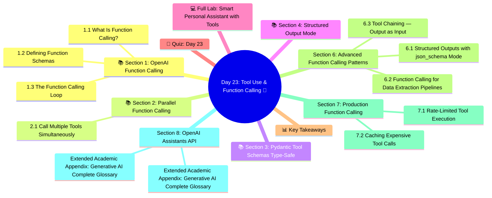

# Day 23: Tool Use & Function Calling 🔧
### Week 4 — AI Agents & Production Systems

---

## 🧠 Concept Map




---

## 🎯 Learning Objectives

By the end of today, you will:
- Understand OpenAI's native Function Calling API
- Build structured tool schemas with type validation
- Create parallel function calls for speed
- Implement a multi-tool agent with error handling
- Build a real-world API integration agent

**Estimated Time:** 3.5–4 hours  
**Difficulty:** ⭐⭐⭐⭐ Advanced  
**Prerequisites:** Day 22 (AI Agents Introduction)

---

## 📚 Section 1: OpenAI Function Calling

### 1.1 What Is Function Calling?

OpenAI Function Calling allows you to define functions in a structured schema. The model decides *when* and *how* to call them — returning a structured JSON call instead of freeform text.

**Without function calling:**
```
User: "What's the weather in Tokyo?"
LLM:  "The weather in Tokyo is currently... " (hallucinated)
```

**With function calling:**
```
User: "What's the weather in Tokyo?"
LLM:  → calls get_weather(city="Tokyo")
Tool: → returns {"temp": "18°C", "condition": "Partly cloudy"}
LLM:  "The weather in Tokyo is 18°C and partly cloudy."
```

### 1.2 Defining Function Schemas

```python
import json
import requests
import os
from openai import OpenAI
from dotenv import load_dotenv

load_dotenv()
client = OpenAI(api_key=os.getenv("OPENAI_API_KEY"))

# ── Function Schemas (JSON Schema format) ─────────────────
functions = [
    {
        "name": "get_weather",
        "description": "Get the current weather for a specific location. Use this when the user asks about weather conditions.",
        "parameters": {
            "type": "object",
            "properties": {
                "city": {
                    "type": "string",
                    "description": "The city name, e.g., 'Tokyo', 'New York', 'London'"
                },
                "units": {
                    "type": "string",
                    "enum": ["celsius", "fahrenheit"],
                    "description": "Temperature units. Default: celsius"
                }
            },
            "required": ["city"]
        }
    },
    {
        "name": "search_web",
        "description": "Search the web for current information on any topic.",
        "parameters": {
            "type": "object",
            "properties": {
                "query": {
                    "type": "string",
                    "description": "The search query"
                },
                "num_results": {
                    "type": "integer",
                    "description": "Number of results to return (1-10). Default: 3",
                    "minimum": 1,
                    "maximum": 10
                }
            },
            "required": ["query"]
        }
    },
    {
        "name": "create_calendar_event",
        "description": "Create a calendar event or meeting.",
        "parameters": {
            "type": "object",
            "properties": {
                "title": {"type": "string", "description": "Event title"},
                "date": {"type": "string", "description": "Date in YYYY-MM-DD format"},
                "time": {"type": "string", "description": "Time in HH:MM format (24h)"},
                "duration_minutes": {"type": "integer", "description": "Duration in minutes"},
                "attendees": {
                    "type": "array",
                    "items": {"type": "string"},
                    "description": "List of email addresses"
                }
            },
            "required": ["title", "date", "time"]
        }
    }
]

# ── Tool Implementations ───────────────────────────────────
def get_weather(city: str, units: str = "celsius") -> dict:
    """Real implementation of weather lookup"""
    try:
        url = f"https://wttr.in/{city}?format=j1"
        response = requests.get(url, timeout=5)
        data = response.json()
        current = data["current_condition"][0]
        temp = current["temp_C"] if units == "celsius" else current["temp_F"]
        unit_symbol = "°C" if units == "celsius" else "°F"
        return {
            "city": city,
            "temperature": f"{temp}{unit_symbol}",
            "condition": current["weatherDesc"][0]["value"],
            "humidity": f"{current['humidity']}%",
            "wind_speed": f"{current['windspeedKmph']} km/h"
        }
    except Exception as e:
        return {"error": str(e), "city": city}

def search_web(query: str, num_results: int = 3) -> dict:
    """Simplified web search (returns mock results for demo)"""
    return {
        "query": query,
        "results": [
            f"Result {i}: Information about {query} from source {i}" 
            for i in range(1, num_results + 1)
        ]
    }

def create_calendar_event(
    title: str, date: str, time: str,
    duration_minutes: int = 60, attendees: list = None
) -> dict:
    """Mock calendar event creation"""
    return {
        "status": "created",
        "event_id": f"evt_{hash(title + date + time) % 100000:05d}",
        "title": title,
        "date": date,
        "time": time,
        "duration_minutes": duration_minutes,
        "attendees": attendees or []
    }

# Map function names to implementations
tool_map = {
    "get_weather": get_weather,
    "search_web": search_web,
    "create_calendar_event": create_calendar_event
}
```

### 1.3 The Function Calling Loop

```python
def run_with_functions(user_message: str, verbose: bool = True) -> str:
    """
    Complete function calling loop:
    User message → LLM → function call → execute → LLM → final answer
    """
    messages = [{"role": "user", "content": user_message}]
    
    if verbose:
        print(f"\n{'='*60}")
        print(f"👤 User: {user_message}")
    
    while True:
        # Step 1: Call LLM
        response = client.chat.completions.create(
            model="gpt-4o-mini",
            messages=messages,
            functions=functions,
            function_call="auto"  # Let model decide when to call
        )
        
        message = response.choices[0].message
        messages.append(message)
        
        # Step 2: Check if model wants to call a function
        if message.function_call:
            func_name = message.function_call.name
            func_args = json.loads(message.function_call.arguments)
            
            if verbose:
                print(f"\n🔧 Tool: {func_name}({func_args})")
            
            # Step 3: Execute the function
            if func_name in tool_map:
                result = tool_map[func_name](**func_args)
            else:
                result = {"error": f"Function {func_name} not found"}
            
            if verbose:
                print(f"📊 Result: {json.dumps(result, indent=2)[:200]}")
            
            # Step 4: Add function result to messages
            messages.append({
                "role": "function",
                "name": func_name,
                "content": json.dumps(result)
            })
            # Loop back — model may want to call another function
            
        else:
            # No more function calls — return final answer
            final_answer = message.content
            if verbose:
                print(f"\n💡 Answer: {final_answer}")
            return final_answer

# Test
queries = [
    "What's the weather in Tokyo and Paris right now?",
    "Schedule a team standup meeting for 2024-03-15 at 09:00 AM for 30 minutes with alice@company.com and bob@company.com",
    "Research the latest AI developments and create a summary meeting for tomorrow at 14:00",
]

for q in queries:
    run_with_functions(q)
```

---

## 📚 Section 2: Parallel Function Calling

### 2.1 Call Multiple Tools Simultaneously

Modern models support calling multiple functions in a *single* LLM pass — huge speed improvement:

```python
def run_with_parallel_functions(user_message: str) -> str:
    """
    Handle parallel function calls — model returns multiple tool calls at once.
    Supported by GPT-4o and GPT-4o-mini.
    """
    messages = [{"role": "user", "content": user_message}]
    
    print(f"\n{'='*60}")
    print(f"👤 User: {user_message}")
    
    while True:
        # Use 'tools' format (newer API — supports parallel calls)
        tools_schema = [{"type": "function", "function": fn} for fn in functions]
        
        response = client.chat.completions.create(
            model="gpt-4o-mini",
            messages=messages,
            tools=tools_schema,
            tool_choice="auto"
        )
        
        message = response.choices[0].message
        messages.append(message)
        
        tool_calls = message.tool_calls
        
        if tool_calls:
            print(f"\n🔧 Parallel tool calls: {len(tool_calls)}")
            
            # Execute all tool calls (could be done in parallel with asyncio)
            for tool_call in tool_calls:
                func_name = tool_call.function.name
                func_args = json.loads(tool_call.function.arguments)
                
                print(f"  → {func_name}({func_args})")
                
                if func_name in tool_map:
                    result = tool_map[func_name](**func_args)
                else:
                    result = {"error": "Unknown function"}
                
                messages.append({
                    "role": "tool",
                    "tool_call_id": tool_call.id,
                    "content": json.dumps(result)
                })
        else:
            final = message.content
            print(f"\n💡 Answer: {final}")
            return final

# Parallel call demo — should call weather for BOTH cities in one pass
run_with_parallel_functions(
    "What's the weather in Tokyo AND London right now? Compare them."
)
```

---

## 📚 Section 3: Pydantic Tool Schemas (Type-Safe)

```python
from pydantic import BaseModel, Field
from typing import Optional, Literal
import json
from openai import OpenAI

# ── Pydantic models as function schemas ───────────────────
class StockLookup(BaseModel):
    """Look up real-time stock price and basic financial metrics."""
    ticker: str = Field(..., description="Stock ticker symbol, e.g., 'AAPL', 'GOOGL'")
    metrics: list[Literal["price", "pe_ratio", "market_cap", "volume"]] = Field(
        default=["price"],
        description="Which metrics to retrieve"
    )

class EmailDraft(BaseModel):
    """Draft a professional email with the given parameters."""
    recipient: str = Field(..., description="Recipient email or name")
    subject: str = Field(..., description="Email subject line")
    tone: Literal["formal", "friendly", "urgent"] = Field(
        default="formal",
        description="Tone of the email"
    )
    key_points: list[str] = Field(..., description="Main points to cover in the email")
    include_cta: bool = Field(default=True, description="Include a call-to-action")

def pydantic_to_function_schema(model: type[BaseModel]) -> dict:
    """Convert a Pydantic model to OpenAI function schema"""
    schema = model.model_json_schema()
    return {
        "name": model.__name__,
        "description": model.__doc__,
        "parameters": schema
    }

# Auto-generate schemas from Pydantic models
type_safe_functions = [
    pydantic_to_function_schema(StockLookup),
    pydantic_to_function_schema(EmailDraft),
]
```

---

## 📚 Section 4: Structured Output Mode

```python
from openai import OpenAI
from pydantic import BaseModel

client = OpenAI()

class TravelPlan(BaseModel):
    destination: str
    duration_days: int
    activities: list[str]
    estimated_budget_usd: float
    best_time_to_visit: str
    accommodation_recommendation: str

# Structured output — guaranteed schema compliance
response = client.beta.chat.completions.parse(
    model="gpt-4o-mini",
    messages=[
        {"role": "user", "content": "Create a 5-day travel plan for Kyoto, Japan."}
    ],
    response_format=TravelPlan
)

plan = response.choices[0].message.parsed
print(f"Destination: {plan.destination}")
print(f"Duration: {plan.duration_days} days")
print(f"Activities: {', '.join(plan.activities)}")
print(f"Budget: ${plan.estimated_budget_usd:,.0f}")
print(f"Best time: {plan.best_time_to_visit}")
print(f"Stay: {plan.accommodation_recommendation}")
```

---

## 💻 Full Lab: Smart Personal Assistant with Tools

```python
# lab_day23_smart_assistant.py
"""A smart personal assistant with multiple integrated tools"""

import json, os, random
from datetime import datetime, timedelta
from openai import OpenAI
from pydantic import BaseModel, Field
from typing import Optional
from dotenv import load_dotenv

load_dotenv()
client = OpenAI(api_key=os.getenv("OPENAI_API_KEY"))

# ── Tool Definitions ───────────────────────────────────────
tools_schema = [
    {
        "type": "function",
        "function": {
            "name": "get_current_datetime",
            "description": "Get the current date and time.",
            "parameters": {"type": "object", "properties": {}, "required": []}
        }
    },
    {
        "type": "function",
        "function": {
            "name": "calculate",
            "description": "Perform mathematical calculations.",
            "parameters": {
                "type": "object",
                "properties": {
                    "expression": {
                        "type": "string",
                        "description": "Mathematical expression to evaluate, e.g., '2 ** 10 + 500'"
                    }
                },
                "required": ["expression"]
            }
        }
    },
    {
        "type": "function",
        "function": {
            "name": "set_reminder",
            "description": "Set a reminder for a future time.",
            "parameters": {
                "type": "object",
                "properties": {
                    "task": {"type": "string", "description": "What to be reminded about"},
                    "minutes_from_now": {"type": "number", "description": "Minutes from now"}
                },
                "required": ["task", "minutes_from_now"]
            }
        }
    },
    {
        "type": "function",
        "function": {
            "name": "look_up_fact",
            "description": "Look up a fact from the knowledge base.",
            "parameters": {
                "type": "object",
                "properties": {
                    "topic": {"type": "string", "description": "Topic to look up"}
                },
                "required": ["topic"]
            }
        }
    }
]

# ── Tool Implementations ───────────────────────────────────
def get_current_datetime() -> dict:
    now = datetime.now()
    return {
        "datetime": now.strftime("%Y-%m-%d %H:%M:%S"),
        "day": now.strftime("%A"),
        "timezone": "Local"
    }

def calculate(expression: str) -> dict:
    try:
        result = eval(expression, {"__builtins__": {}, "abs": abs, "round": round, "pow": pow})
        return {"expression": expression, "result": result}
    except Exception as e:
        return {"error": str(e)}

def set_reminder(task: str, minutes_from_now: float) -> dict:
    reminder_time = datetime.now() + timedelta(minutes=minutes_from_now)
    # In a real app, you'd schedule this
    return {
        "status": "scheduled",
        "task": task,
        "reminder_at": reminder_time.strftime("%H:%M on %A, %B %d")
    }

def look_up_fact(topic: str) -> dict:
    facts = {
        "python": "Python was created by Guido van Rossum in 1991. Named after Monty Python.",
        "openai": "OpenAI was founded in 2015. Created GPT-4, DALL·E, and Whisper.",
        "transformer": "Transformer architecture introduced in 'Attention Is All You Need' (2017).",
        "rag": "RAG (Retrieval-Augmented Generation) combines retrieval with generation for factual LLM answers.",
    }
    topic_lower = topic.lower()
    for key, fact in facts.items():
        if key in topic_lower:
            return {"topic": topic, "fact": fact}
    return {"topic": topic, "fact": f"No specific fact found for '{topic}'."}

tool_implementations = {
    "get_current_datetime": get_current_datetime,
    "calculate": calculate,
    "set_reminder": set_reminder,
    "look_up_fact": look_up_fact
}

class SmartAssistant:
    def __init__(self):
        self.conversation_history = []
        self.system_prompt = """You are a smart personal assistant with access to tools.
Always use tools when appropriate: for math, time, reminders, or fact lookups.
Be concise, helpful, and proactive about using the right tool."""
    
    def chat(self, user_message: str) -> str:
        self.conversation_history.append({"role": "user", "content": user_message})
        
        messages = [
            {"role": "system", "content": self.system_prompt},
            *self.conversation_history
        ]
        
        while True:
            response = client.chat.completions.create(
                model="gpt-4o-mini",
                messages=messages,
                tools=tools_schema,
                tool_choice="auto",
                temperature=0
            )
            
            message = response.choices[0].message
            messages.append(message)
            
            if message.tool_calls:
                for tool_call in message.tool_calls:
                    func_name = tool_call.function.name
                    func_args = json.loads(tool_call.function.arguments)
                    result = tool_implementations.get(func_name, lambda **_: {"error": "Unknown tool"})(**func_args)
                    messages.append({
                        "role": "tool",
                        "tool_call_id": tool_call.id,
                        "content": json.dumps(result)
                    })
            else:
                answer = message.content
                self.conversation_history.append({"role": "assistant", "content": answer})
                return answer

# ── Demo ─────────────────────────────────────────────────
assistant = SmartAssistant()

conversations = [
    "What time is it right now?",
    "If I invest $10,000 at 7% annual interest for 10 years, what's the final amount? Use compound interest: 10000 * (1.07 ** 10)",
    "Remind me to review the fine-tuning results in 30 minutes.",
    "What can you tell me about RAG?",
    "Can you do all of these at once: what's the time, calculate 15% of $349.99, and look up a fact about transformers?"
]

print("🤖 Smart Assistant Demo")
print("=" * 50)
for message in conversations:
    print(f"\n👤 User: {message}")
    response = assistant.chat(message)
    print(f"🤖 Assistant: {response}")

print("\n✅ Day 23 Lab Complete!")
```

---

## 🧠 Quiz: Day 23

**Q1:** What does `function_call="auto"` tell the OpenAI API?
- A) Always call a function
- B) **Let the model decide whether to call a function ✅**
- C) Never call a function
- D) Call all available functions

**Q2:** Parallel function calling reduces latency by:
- A) Using faster servers
- B) Caching results
- C) **Returning multiple tool calls in one LLM pass instead of sequential calls ✅**
- D) Compressing the response

**Q3:** The `tool_call_id` in a tool response message is needed to:
- A) Identify the user session
- B) Bill the correct API usage
- C) **Match the tool output back to the specific tool call the model made ✅**
- D) Set the retry count

**Q4:** OpenAI Structured Output (`.parse()`) guarantees:
- A) Faster API response
- B) **The response always matches the specified Pydantic schema ✅**
- C) Lower token usage
- D) Access to advanced models

**Q5:** The function `description` field in a tool schema is:
- A) Only for documentation
- B) **Read by the LLM to decide when to use this tool ✅**
- C) Enforced by the API
- D) Used to auto-generate unit tests

---

## 📊 Key Takeaways

| Concept | Key Point |
|---------|-----------|
| **Function Calling** | LLM returns structured JSON → you execute → LLM synthesizes result |
| **Parallel Calls** | Model can call multiple tools in one pass → 2–5x speedup |
| **Tool Schema** | Name + description + JSON schema parameters |
| **Pydantic Integration** | Type-safe schemas auto-generated from Pydantic models |
| **Structured Output** | `.parse()` guarantees schema compliance without prompt engineering |
| **tool_call_id** | Must be included in tool responses to link results to calls |

---

*Day 23 Complete ✅ | GenAI Course — Week 4 | Next: Day 24 — Multi-Agent Systems*


---

## Section 6: Advanced Function Calling Patterns

### 6.1 Structured Outputs with json_schema Mode

```python
from openai import OpenAI
from pydantic import BaseModel
from typing import Literal
import json

client = OpenAI()

class DatabaseQuery(BaseModel):
    """Generate a safe database query from natural language"""
    table: Literal["users", "orders", "products", "inventory"]
    operation: Literal["SELECT", "COUNT", "SUM", "AVG"]
    columns: list[str]
    where_clause: str | None = None
    limit: int = 100
    order_by: str | None = None

def natural_language_to_query(nl_query: str) -> DatabaseQuery:
    """Convert natural language to a structured DB query"""
    response = client.beta.chat.completions.parse(
        model="gpt-4o-mini",
        messages=[
            {"role": "system", "content": "Convert natural language queries to structured database queries. Only use the available tables."},
            {"role": "user", "content": nl_query}
        ],
        response_format=DatabaseQuery
    )
    return response.choices[0].message.parsed

# Test queries
nl_queries = [
    "Show me the top 10 customers by total order value",
    "How many products do we have in the electronics category?",
    "What is the average order value for last month?",
]

for query in nl_queries:
    result = natural_language_to_query(query)
    print(f"\nQuery: {query}")
    print(f"  Table: {result.table}")
    print(f"  Operation: {result.operation} {result.columns}")
    if result.where_clause:
        print(f"  WHERE: {result.where_clause}")
    print(f"  LIMIT: {result.limit}")
```

### 6.2 Function Calling for Data Extraction Pipelines

```python
from openai import OpenAI
import json
from pydantic import BaseModel
from typing import Optional

client = OpenAI()

def extract_financial_data(text: str) -> dict:
    """Extract structured financial data from unstructured text"""
    
    tools = [
        {
            "type": "function",
            "function": {
                "name": "record_financial_data",
                "description": "Record extracted financial metrics from the text",
                "parameters": {
                    "type": "object",
                    "properties": {
                        "company_name": {"type": "string"},
                        "fiscal_period": {"type": "string", "description": "e.g. Q3 2024, FY2023"},
                        "revenue": {"type": "number", "description": "Revenue in millions USD"},
                        "revenue_growth_yoy": {"type": "number", "description": "YoY growth percentage"},
                        "net_income": {"type": "number", "description": "Net income in millions USD"},
                        "ebitda": {"type": "number", "description": "EBITDA in millions USD"},
                        "gross_margin": {"type": "number", "description": "Gross margin percentage"},
                        "guidance_raised": {"type": "boolean", "description": "Did company raise guidance?"},
                        "key_highlights": {"type": "array", "items": {"type": "string"}, "maxItems": 5},
                    },
                    "required": ["company_name", "fiscal_period"]
                }
            }
        }
    ]
    
    response = client.chat.completions.create(
        model="gpt-4o-mini",
        messages=[
            {"role": "system", "content": "Extract financial data accurately from the text. If a metric is not mentioned, omit it."},
            {"role": "user", "content": f"Extract financial data from this earnings report:\n\n{text}"}
        ],
        tools=tools,
        tool_choice={"type": "function", "function": {"name": "record_financial_data"}}
    )
    
    tool_call = response.choices[0].message.tool_calls[0]
    return json.loads(tool_call.function.arguments)

# Test
earnings_text = """
ACME Corp Q3 2024 Earnings Results

ACME Corporation reported Q3 2024 revenue of $2.4 billion, up 23% year-over-year. 
Net income came in at $380 million, with EBITDA of $612 million.
Gross margins improved to 67.3% from 64.1% in the prior year period.
The company raised full-year guidance and expects FY2024 revenue of $9.2-9.4 billion.

Key Highlights:
- AI products grew 145% YoY, now 28% of total revenue
- International revenue exceeded North America for the first time
- Operating expenses decreased 8% despite revenue growth
"""

data = extract_financial_data(earnings_text)
print(json.dumps(data, indent=2))
```

### 6.3 Tool Chaining — Output as Input

```python
from openai import OpenAI
import json

client = OpenAI()

def chain_tools_for_research(topic: str) -> dict:
    """
    Multi-step tool use: search → summarize → cite
    Step 1: Search for sources
    Step 2: Read and summarize each source
    Step 3: Synthesize with citations
    """
    
    # Mock implementations
    def search_papers(query: str, n: int = 3) -> list[dict]:
        return [
            {"id": i, "title": f"Paper {i} on {query}", "abstract": f"This paper studies {query} using novel approaches. Key findings include..."}
            for i in range(1, n+1)
        ]
    
    def summarize_paper(paper_id: int, focus: str) -> str:
        return f"Paper {paper_id} summary focused on '{focus}': The research demonstrates significant improvements over baselines."
    
    def synthesize_findings(summaries: list[str], topic: str) -> str:
        return f"Synthesis on '{topic}': Based on {len(summaries)} sources, current research shows consensus on..."
    
    # Execute chain
    papers = search_papers(topic)
    summaries = [summarize_paper(p["id"], topic) for p in papers]
    synthesis = synthesize_findings(summaries, topic)
    
    return {
        "topic": topic,
        "sources_found": len(papers),
        "synthesis": synthesis,
        "papers": papers
    }

result = chain_tools_for_research("LoRA fine-tuning efficiency")
print(f"Topic: {result['topic']}")
print(f"Sources: {result['sources_found']}")
print(f"Synthesis: {result['synthesis']}")
```

---

## Section 7: Production Function Calling

### 7.1 Rate-Limited Tool Execution

```python
import asyncio
import time
from functools import wraps
from collections import deque
from langchain_core.tools import tool

class RateLimiter:
    """Token bucket rate limiter for tools"""
    
    def __init__(self, calls_per_second: float = 2.0):
        self.calls_per_second = calls_per_second
        self.min_interval = 1.0 / calls_per_second
        self.last_call = 0.0
    
    def wait_if_needed(self):
        now = time.monotonic()
        elapsed = now - self.last_call
        if elapsed < self.min_interval:
            time.sleep(self.min_interval - elapsed)
        self.last_call = time.monotonic()

search_limiter = RateLimiter(calls_per_second=1.0)
api_limiter = RateLimiter(calls_per_second=5.0)

@tool
def rate_limited_search(query: str) -> str:
    """Search with automatic rate limiting"""
    search_limiter.wait_if_needed()
    return f"Search results for: {query}"

@tool
def rate_limited_api_call(endpoint: str, params: dict = None) -> str:
    """API call with rate limiting"""
    api_limiter.wait_if_needed()
    return f"API response from {endpoint}: data here"
```

### 7.2 Caching Expensive Tool Calls

```python
import hashlib, json, time
from functools import wraps
from typing import Callable, Any

def cached_tool(ttl_seconds: int = 300):
    """Decorator that caches tool results to avoid redundant calls"""
    cache = {}
    
    def decorator(func: Callable) -> Callable:
        @wraps(func)
        def wrapper(*args, **kwargs):
            # Create cache key from arguments
            key_data = json.dumps({"args": args, "kwargs": kwargs}, sort_keys=True, default=str)
            cache_key = hashlib.md5(key_data.encode()).hexdigest()
            
            # Check cache
            if cache_key in cache:
                result, timestamp = cache[cache_key]
                if time.time() - timestamp < ttl_seconds:
                    print(f"  [CACHE HIT] {func.__name__}")
                    return result
            
            # Execute and cache
            result = func(*args, **kwargs)
            cache[cache_key] = (result, time.time())
            print(f"  [CACHE MISS] {func.__name__} — result cached for {ttl_seconds}s")
            return result
        
        return wrapper
    return decorator

@tool
@cached_tool(ttl_seconds=60)
def expensive_database_query(query_id: str) -> str:
    """Expensive query that benefits from caching"""
    time.sleep(0.1)  # Simulate DB cost
    return f"Result for query {query_id}: [data]"

# First call: executes query
r1 = expensive_database_query("q001")
# Second call (within 60s): returns cached result instantly
r2 = expensive_database_query("q001")
```

---

## Section 8: OpenAI Assistants API

```python
from openai import OpenAI
import time, json

client = OpenAI()

def create_research_assistant() -> str:
    """Create an OpenAI Assistant with custom tools"""
    assistant = client.beta.assistants.create(
        name="Research Assistant",
        instructions="""You are an expert research assistant. When users ask questions:
1. Break down complex questions into sub-questions
2. Search for relevant information using available tools
3. Synthesize findings into comprehensive answers with citations
Always provide structured, well-organized responses.""",
        model="gpt-4o-mini",
        tools=[
            {"type": "code_interpreter"},
            {"type": "file_search"},
        ]
    )
    return assistant.id

def run_assistant(assistant_id: str, message: str) -> str:
    """Create a thread, add message, run assistant, get response"""
    
    # Create thread
    thread = client.beta.threads.create()
    
    # Add user message
    client.beta.threads.messages.create(
        thread_id=thread.id,
        role="user",
        content=message
    )
    
    # Run assistant
    run = client.beta.threads.runs.create(
        thread_id=thread.id,
        assistant_id=assistant_id
    )
    
    # Poll for completion
    while run.status in ["queued", "in_progress"]:
        time.sleep(1)
        run = client.beta.threads.runs.retrieve(run_id=run.id, thread_id=thread.id)
    
    if run.status == "completed":
        messages = client.beta.threads.messages.list(thread_id=thread.id)
        return messages.data[0].content[0].text.value
    else:
        return f"Run failed with status: {run.status}"

# Usage example (requires API key and actual assistant creation)
# assistant_id = create_research_assistant()
# answer = run_assistant(assistant_id, "What are the key differences between LoRA and full fine-tuning?")
# print(answer)
```

---

*Day 23 Extended Complete — Advanced function calling, tool chaining, caching, and OpenAI Assistants*
\n\n---\n\n## Expanded Expert Knowledge Base & Reference Guides\n\n
### Extended Academic Appendix: Generative AI Complete Glossary

*   **Activation Function**: A mathematical equation attached to each neuron in a network that determines whether it should be activated or not. Examples include ReLU, GELU, and SwiGLU.
*   **Adam Optimizer**: Adaptive Moment Estimation. An algorithm for optimization technique for gradient descent. The method computes individual adaptive learning rates for different parameters from estimates of first and second moments of the gradients.
*   **Alignment**: The process of ensuring AI systems act exactly in accordance with human intentions and values, preventing toxic, harmful, or legally dangerous logic generation paths.
*   **API (Application Programming Interface)**: A software intermediary that allows two applications to talk to each other. In GenAI, it's how your software securely requests generations from massive cloud GPUs.
*   **Auto-regressive**: A model that generates the future sequences step-by-step, conditioning the next prediction exclusively on the previous predictions it just generated.
*   **Backpropagation**: The core algorithm behind learning in neural networks. It calculates the mathematical gradient of the loss function with respect to the weights by utilizing the chain rule, moving backwards from output to input.
*   **Batch Size**: The number of training examples utilized in one single iteration of gradient descent before the network's internal mathematical parameters are updated.
*   **Bias (Mathematical)**: A constant value added to the linear projection in neural layers ($y = mx + b$). It allows the activation function to shift to the left or right, increasing the flexibility of the network to fit complex data boundaries.
*   **BPE (Byte Pair Encoding)**: A specific mathematical data compression technique adapted for NLP tokenization. It recursively merges the most frequently occurring pair of adjacent characters into a single new sub-word token.
*   **Cache (KV Cache)**: In LLMs, the Key-Value matrices of previously generated tokens are stored in GPU VRAM so the transformer doesn't have to re-compute the entire 10,000-word essay every single time it tries to generate word 10,001.
*   **Chain of Thought (CoT)**: A prompting strategy that forces the LLM to output a series of intermediate mathematical or logical reasoning steps before outputting the final answer, drastically improving accuracy on complex logic tasks.
*   **Chinchilla Laws**: DeepMind's 2022 paper proving that to train compute-optimally, the dataset token count must scale perfectly linearly with the parameter count (a 20:1 ratio is strictly advised).
*   **Constitutional AI**: Anthropic's proprietary alignment pipeline. A model is given a strict set of rules ('The Constitution') and autonomously critiques and revises its own responses, generating a vast RL dataset without expensive human labeling.
*   **Context Window**: The maximum number of tokens (words/sub-words) a model can ingest and process mathematically in a single forward pass operation. GPT-4 handles 128k; Gemini handles 2 Million.
*   **Cross-Entropy Loss**: The standard mathematical loss function used in classification tasks and language modeling. It calculates the delta between the model's predicted probability distribution and the actual rigid truth of the training data.
*   **Decoder-Only Architecture**: A Transformer that abandons the bi-directional Encoder entirely (like GPT). It utilizes strictly causal, masked self-attention to generate sequential texts autoregressively.
*   **Dense Model**: A standard neural network architecture where every single parameter in the computational block is activated and multiplied during every single forward pass (Contrast with MoE).
*   **Discriminative Model**: Machine learning models designed fundamentally to draw mathematical boundaries between classes (e.g., Is this photo a hot dog or not a hot dog?) Contrast with Generative Models.
*   **Dropout**: A cruel but effective regularization technique where a percentage of neurons in a layer are randomly completely deactivated during a training pass. This forces the network to stop relying on individual 'memorized' paths and build robust distributed representations.
*   **Embedding**: The mathematical projection mapping a discrete token (like the word 'Apple') into a continuous dense continuous vector space where physical geometry and distance represent semantic linguistic meaning.
*   **Epoch**: One full operational pass of the training pipeline sequentially interacting with the entire dataset. Foundation models are often trained for only 1 Epoch to prevent catastrophic overfitting logic traps.
*   **Feed-Forward Network (FFN)**: The dense, localized multi-layer perceptron block inside a Transformer layer operating independently on each token vector specifically acting as the model's 'Key-Value fact database'.
*   **Fine-Tuning**: Taking a massive, previously trained generic foundation model and training it further on a tiny, specific domain dataset (like medical journals) using a low learning rate to alter its core behavior.
*   **FP16 (Half Precision)**: A computer number format occupying 16 bits. HuggingFace models default to this. Represents a compromise utilizing half the GPU VRAM of 32-bit floats with mathematically negligible degradation in AI loss metrics.
*   **Foundation Model**: A gargantuan neural network trained utilizing massive unsupervised learning pipelines across the entire internet, serving as the base layer for countless downstream specific tasks.
*   **Generative Model**: AI architecture designed to map and understand the fundamental underlying distribution of data specifically to generate completely novel, statistically adjacent synthetic data. (e.g. LLMs, Diffusion Models).
*   **GQA (Grouped-Query Attention)**: An architectural optimization. Instead of calculating a massive individual Key and Value matrix for every single Query Head in Multi-Head Attention, multiple Query heads mathematically share the same Key/Value arrays, vastly saving VRAM.
*   **GPU (Graphics Processing Unit)**: The physical silicon hardware engines powering AI. Thousands of cores designed specifically to execute massive parallel floating point Matrix Multiplication extremely efficiently. NVIDIA dominates this landscape.
*   **Gradient Descent**: The mathematical optimization algorithm locating the minimum of a neural loss curve by taking scaled sequential steps in the exact opposite operational direction of the calculated tensor gradient.
*   **Hallucination**: When a generative AI model outputs convincing, confident logic strings that are completely factually incorrect due primarily to token probability space interpolation artifacts.
*   **Hugging Face**: The central structural GitHub for Machine Learning. A gigantic repository hosting open-source model weights, extensive NLP datasets, and the most heavily utilized `transformers` Python inference library globally.
*   **Hyperparameters**: The architectural variables of a neural network that are set manually by the human engineer *before* training begins (e.g. Learning Rate, Batch Size, Dropout Rate) and are never altered by backpropagation.
*   **In-Context Learning**: The mysterious emergent capability of massive LLMs to learn completely new tasks instantly utilizing purely the context text inside the given prompt, requiring zero permanent weight tensor alterations.
*   **Instruction Tuning**: Fine-tuning base models specifically to respond obediently to 'User Prompts'. A base model will complete a sentence; an instruction-tuned model will act like a dialogue assistant.
*   **INT4 (4-Bit Quantization)**: An extreme computational compression technique squashing a 16-bit weight parameter mathematically down to just 4 bits. Allows executing an 8 Billion parameter model on a standard 6GB laptop GPU.
*   **Knowledge Distillation**: A training pipeline where a gargantuan 'Teacher' model generates massive amounts of high-quality synthetic data to train a tiny 'Student' model structurally imitating its superior behaviors.
*   **Llama**: Meta's flagship family of Open-Weight Large Language Models. Responsible singularly for unleashing the massive democratization of the enterprise Local-LLM hosting revolution.
*   **LLM (Large Language Model)**: A deep learning neural network, generally executing a Transformer architecture, possessing billions of parameters, specifically designed to process, map, and generate natural human linguistics.
*   **Logits**: The raw, unnormalized massive mathematical scores output directly by the final linear projection layer of the neural network natively *before* entering the Softmax bounding probability function.
*   **LoRA (Low-Rank Adaptation)**: A parameter-efficient Fine-Tuning miracle. Instead of freezing 8 billion parameters, LoRA injects two tiny matrices side-by-side, dramatically slashing the required training VRAM computational burden by 98%.
*   **Masked Attention**: A mandatory structural configuration inside a Decoder enforcing causality. It mathematically blocks the model from executing any attention logic targeting tokens located positioned *after* the current token.
*   **Mixture of Experts (MoE)**: A neural block containing several 'expert' sub-networks (like 8 separate FFNs). A routing gate decides exactly which two experts activate for each specific input vector, preserving massive inference speed.
*   **Multi-Head Attention**: Processing multiple self-attention operations concurrently in physically separate lower-dimensional sub-spaces immediately before concatenating them. Allows parsing extreme grammatical complexity without blurring the semantic signals.
*   **Next-Token Prediction**: The incredibly simple underlying foundational logic objective utilized to pre-train almost all massive modern generative language models across Trillions of raw internet text documents.
*   **NLP (Natural Language Processing)**: The massive overarching subfield of AI concerned entirely with programming algorithms to process, understand, analyze, and generate human linguistics and conversational grammar.
*   **Overfitting**: A critical mathematical failure where a network memorizes the exact specific noise artifacts in the training dataset perfectly, completely destroying its capacity to generalize against unseen validation data.
*   **Parameter**: The actual structural weights and biases contained natively deeply inside a neural network structure. An 8B parameter model literally contains 8,000,000,000 decimal numbers in 3D multi-dimensional arrays.
*   **Positional Encoding**: The critical vector matrix added to the foundational input embeddings explicitly providing the Attention mathematical permutation logic with structural information regarding the exact sequence order of the tokens.
*   **Pre-training**: The primary initial phase of creating a Foundation model. Feeding Trillions of text tokens through thousands of GPUs for weeks consuming megawatts of power strictly performing unsupervised next-token prediction.
*   **Prompt Engineering**: The process of empirically designing, testing, and optimizing the structural format of linguistic inputs injected into LLMs to extract specifically desired, accurate, and robust structural logic outputs.
*   **Python**: The undisputed dominant syntactic language dominating the Machine Learning backend architecture globally. Used to interface natively with the massively optimized C++ PyTorch/TensorFlow backend structures.
*   **Quantization**: The process of fundamentally converting the continuous mathematical precision of model weight sets from floating point 32/16-bit resolutions down to block-level 8-bit or 4-bit, sacrificing microscopic accuracy for massive VRAM deployment efficiency.
*   **RAG (Retrieval-Augmented Generation)**: The absolute standard deployed architecture for enterprise applications. Preventing LLM hallucinations by intercepting the user query, searching an external enterprise vector database for facts, and injecting those raw facts into the LLM context prior to generation.
*   **Recurrent Neural Network (RNN)**: The legacy sequential architecture predating Transformers. Structurally processes tokens linearly one-by-one utilizing a continuous expanding hidden state. Massively vulnerable to extreme 'vanishing gradient' failure over large context windows.
*   **ReLU (Rectified Linear Unit)**: A critically vital, simple activation formula: $f(x) = max(0, x)$. It structurally forces any massive negative outputs directly to 0.0, injecting mandatory non-linearity into massive chained matrix multiplications.
*   **Representation Learning**: A set of structural ML techniques allowing underlying systems to automatically discover the raw distinct structural features or representations natively required for complex classification natively from raw data blocks.
*   **Residual Connection (Skip Connection)**: Crucial architectural bypass lines transmitting original input vectors structurally directly deeply around massive network layers, instantly adding them to the final outputs. These bypass physical lines solve the vanishing gradient apocalypse inside massively deep networks.
*   **RLHF (Reinforcement Learning from Human Feedback)**: The specific complex post-training fine-tuning pipeline rendering GPT-4 capable of human dialogue. Involves executing a massive secondary reward-model mathematically scoring generating responses purely based on expensive curated human feedback rankings.
*   **RoPE (Rotary Position Embedding)**: A 2021 revolutionary positional encoding standard deployed across Llama and Mistral sequences. It natively rotates the grammatical Query/Key vectors dimensionally in a complex physical subspace mapping exact relative distance rather than simple sequence addition.
*   **Self-Attention**: The singular foundational mechanism anchoring the Transformer legacy. A mathematical mechanism physically relating massive disparate elements uniquely across entirely distinct sequences against one another directly to aggregate rich integrated semantic grammatical meaning.
*   **Softmax Function**: A vital structural normalization formula algorithm physically scaling an array composed of massive unnormalized numerical sequences entirely to fit bounded logically explicitly between exactly 0.0 and 1.0, rendering them perfectly functional as a standard statistical probability distribution structure.
*   **SwiGLU**: A highly advanced 2025 non-linear dynamic activation block structurally deploying Swish gating pipelines heavily substituting standard ReLU gates extensively inside modern elite model matrices like Meta's Llama sequences, extracting elite processing dynamics.
*   **Temperature (T)**: The primary physical decoding mathematical scalar parameter bounding generative randomness outputs. Approaching $T=0.0$ forces rigid, repetitive deterministic absolute certainty matrices, whereas raising $T=1.0+$ enforces wild erratic linguistic distributional variance sequences.
*   **Tensor**: The massive core architectural fundamental building block powering Deep Learning ecosystems mapping identical arrays strictly scaling multi-dimensional numeric matrices structurally generalizing basic matrix algebra natively processing GPU matrix logic flows.
*   **Token**: The fundamental structural sub-unit blocks consumed iteratively deeply inside LLM architectures. Generally representing fractional linguistic characters parsing out uniquely exactly approximately matching mathematically structural word matrices equivalent effectively equating 4 sequential raw alphabetical English letters.
*   **Transformer**: The 2017 undisputed architectural miracle sequence dominating the fundamental ecosystem of Artificial Intelligence generation natively entirely substituting standard Recurrent pipelines comprehensively utilizing massive Parallel Sparse Attention structural distributions.
*   **Underfitting**: The diametric inverse computational failure dynamically destroying machine sequence accuracy natively emerging when mathematical network parameters severely lack complex deep architectural capacity parameters distinctly mapping massive underlying geometric functional relationship flows.
*   **Vector Database**: An explicitly specialized indexing enterprise deployment architectural database standard structurally deployed comprehensively globally storing extreme dense multi-dimensional numeric vectors natively supporting ultra-rapid K-Nearest-Neighbor cosine search queries anchoring core RAG sequence systems.
*   **Weights**: The incredibly precise decimal numbers stored iteratively physically comprising neural networks natively adjusting mathematically via backpropagation gradients structurally driving complex non-linear sequence generation logic models perfectly.
*   **Zero-Shot Learning**: The massive foundational AI ecosystem paradigm natively enabling explicit model completion capabilities operating distinctly successfully parsing tasks functionally completely utterly unseen across the generative pre-training massive pipeline structure.

### Extended Academic Appendix: Generative AI Complete Glossary

*   **Activation Function**: A mathematical equation attached to each neuron in a network that determines whether it should be activated or not. Examples include ReLU, GELU, and SwiGLU.
*   **Adam Optimizer**: Adaptive Moment Estimation. An algorithm for optimization technique for gradient descent. The method computes individual adaptive learning rates for different parameters from estimates of first and second moments of the gradients.
*   **Alignment**: The process of ensuring AI systems act exactly in accordance with human intentions and values, preventing toxic, harmful, or legally dangerous logic generation paths.
*   **API (Application Programming Interface)**: A software intermediary that allows two applications to talk to each other. In GenAI, it's how your software securely requests generations from massive cloud GPUs.
*   **Auto-regressive**: A model that generates the future sequences step-by-step, conditioning the next prediction exclusively on the previous predictions it just generated.
*   **Backpropagation**: The core algorithm behind learning in neural networks. It calculates the mathematical gradient of the loss function with respect to the weights by utilizing the chain rule, moving backwards from output to input.
*   **Batch Size**: The number of training examples utilized in one single iteration of gradient descent before the network's internal mathematical parameters are updated.
*   **Bias (Mathematical)**: A constant value added to the linear projection in neural layers ($y = mx + b$). It allows the activation function to shift to the left or right, increasing the flexibility of the network to fit complex data boundaries.
*   **BPE (Byte Pair Encoding)**: A specific mathematical data compression technique adapted for NLP tokenization. It recursively merges the most frequently occurring pair of adjacent characters into a single new sub-word token.
*   **Cache (KV Cache)**: In LLMs, the Key-Value matrices of previously generated tokens are stored in GPU VRAM so the transformer doesn't have to re-compute the entire 10,000-word essay every single time it tries to generate word 10,001.
*   **Chain of Thought (CoT)**: A prompting strategy that forces the LLM to output a series of intermediate mathematical or logical reasoning steps before outputting the final answer, drastically improving accuracy on complex logic tasks.
*   **Chinchilla Laws**: DeepMind's 2022 paper proving that to train compute-optimally, the dataset token count must scale perfectly linearly with the parameter count (a 20:1 ratio is strictly advised).
*   **Constitutional AI**: Anthropic's proprietary alignment pipeline. A model is given a strict set of rules ('The Constitution') and autonomously critiques and revises its own responses, generating a vast RL dataset without expensive human labeling.
*   **Context Window**: The maximum number of tokens (words/sub-words) a model can ingest and process mathematically in a single forward pass operation. GPT-4 handles 128k; Gemini handles 2 Million.
*   **Cross-Entropy Loss**: The standard mathematical loss function used in classification tasks and language modeling. It calculates the delta between the model's predicted probability distribution and the actual rigid truth of the training data.
*   **Decoder-Only Architecture**: A Transformer that abandons the bi-directional Encoder entirely (like GPT). It utilizes strictly causal, masked self-attention to generate sequential texts autoregressively.
*   **Dense Model**: A standard neural network architecture where every single parameter in the computational block is activated and multiplied during every single forward pass (Contrast with MoE).
*   **Discriminative Model**: Machine learning models designed fundamentally to draw mathematical boundaries between classes (e.g., Is this photo a hot dog or not a hot dog?) Contrast with Generative Models.
*   **Dropout**: A cruel but effective regularization technique where a percentage of neurons in a layer are randomly completely deactivated during a training pass. This forces the network to stop relying on individual 'memorized' paths and build robust distributed representations.
*   **Embedding**: The mathematical projection mapping a discrete token (like the word 'Apple') into a continuous dense continuous vector space where physical geometry and distance represent semantic linguistic meaning.
*   **Epoch**: One full operational pass of the training pipeline sequentially interacting with the entire dataset. Foundation models are often trained for only 1 Epoch to prevent catastrophic overfitting logic traps.
*   **Feed-Forward Network (FFN)**: The dense, localized multi-layer perceptron block inside a Transformer layer operating independently on each token vector specifically acting as the model's 'Key-Value fact database'.
*   **Fine-Tuning**: Taking a massive, previously trained generic foundation model and training it further on a tiny, specific domain dataset (like medical journals) using a low learning rate to alter its core behavior.
*   **FP16 (Half Precision)**: A computer number format occupying 16 bits. HuggingFace models default to this. Represents a compromise utilizing half the GPU VRAM of 32-bit floats with mathematically negligible degradation in AI loss metrics.
*   **Foundation Model**: A gargantuan neural network trained utilizing massive unsupervised learning pipelines across the entire internet, serving as the base layer for countless downstream specific tasks.
*   **Generative Model**: AI architecture designed to map and understand the fundamental underlying distribution of data specifically to generate completely novel, statistically adjacent synthetic data. (e.g. LLMs, Diffusion Models).
*   **GQA (Grouped-Query Attention)**: An architectural optimization. Instead of calculating a massive individual Key and Value matrix for every single Query Head in Multi-Head Attention, multiple Query heads mathematically share the same Key/Value arrays, vastly saving VRAM.
*   **GPU (Graphics Processing Unit)**: The physical silicon hardware engines powering AI. Thousands of cores designed specifically to execute massive parallel floating point Matrix Multiplication extremely efficiently. NVIDIA dominates this landscape.
*   **Gradient Descent**: The mathematical optimization algorithm locating the minimum of a neural loss curve by taking scaled sequential steps in the exact opposite operational direction of the calculated tensor gradient.
*   **Hallucination**: When a generative AI model outputs convincing, confident logic strings that are completely factually incorrect due primarily to token probability space interpolation artifacts.
*   **Hugging Face**: The central structural GitHub for Machine Learning. A gigantic repository hosting open-source model weights, extensive NLP datasets, and the most heavily utilized `transformers` Python inference library globally.
*   **Hyperparameters**: The architectural variables of a neural network that are set manually by the human engineer *before* training begins (e.g. Learning Rate, Batch Size, Dropout Rate) and are never altered by backpropagation.
*   **In-Context Learning**: The mysterious emergent capability of massive LLMs to learn completely new tasks instantly utilizing purely the context text inside the given prompt, requiring zero permanent weight tensor alterations.
*   **Instruction Tuning**: Fine-tuning base models specifically to respond obediently to 'User Prompts'. A base model will complete a sentence; an instruction-tuned model will act like a dialogue assistant.
*   **INT4 (4-Bit Quantization)**: An extreme computational compression technique squashing a 16-bit weight parameter mathematically down to just 4 bits. Allows executing an 8 Billion parameter model on a standard 6GB laptop GPU.
*   **Knowledge Distillation**: A training pipeline where a gargantuan 'Teacher' model generates massive amounts of high-quality synthetic data to train a tiny 'Student' model structurally imitating its superior behaviors.
*   **Llama**: Meta's flagship family of Open-Weight Large Language Models. Responsible singularly for unleashing the massive democratization of the enterprise Local-LLM hosting revolution.
*   **LLM (Large Language Model)**: A deep learning neural network, generally executing a Transformer architecture, possessing billions of parameters, specifically designed to process, map, and generate natural human linguistics.
*   **Logits**: The raw, unnormalized massive mathematical scores output directly by the final linear projection layer of the neural network natively *before* entering the Softmax bounding probability function.
*   **LoRA (Low-Rank Adaptation)**: A parameter-efficient Fine-Tuning miracle. Instead of freezing 8 billion parameters, LoRA injects two tiny matrices side-by-side, dramatically slashing the required training VRAM computational burden by 98%.
*   **Masked Attention**: A mandatory structural configuration inside a Decoder enforcing causality. It mathematically blocks the model from executing any attention logic targeting tokens located positioned *after* the current token.
*   **Mixture of Experts (MoE)**: A neural block containing several 'expert' sub-networks (like 8 separate FFNs). A routing gate decides exactly which two experts activate for each specific input vector, preserving massive inference speed.
*   **Multi-Head Attention**: Processing multiple self-attention operations concurrently in physically separate lower-dimensional sub-spaces immediately before concatenating them. Allows parsing extreme grammatical complexity without blurring the semantic signals.
*   **Next-Token Prediction**: The incredibly simple underlying foundational logic objective utilized to pre-train almost all massive modern generative language models across Trillions of raw internet text documents.
*   **NLP (Natural Language Processing)**: The massive overarching subfield of AI concerned entirely with programming algorithms to process, understand, analyze, and generate human linguistics and conversational grammar.
*   **Overfitting**: A critical mathematical failure where a network memorizes the exact specific noise artifacts in the training dataset perfectly, completely destroying its capacity to generalize against unseen validation data.
*   **Parameter**: The actual structural weights and biases contained natively deeply inside a neural network structure. An 8B parameter model literally contains 8,000,000,000 decimal numbers in 3D multi-dimensional arrays.
*   **Positional Encoding**: The critical vector matrix added to the foundational input embeddings explicitly providing the Attention mathematical permutation logic with structural information regarding the exact sequence order of the tokens.
*   **Pre-training**: The primary initial phase of creating a Foundation model. Feeding Trillions of text tokens through thousands of GPUs for weeks consuming megawatts of power strictly performing unsupervised next-token prediction.
*   **Prompt Engineering**: The process of empirically designing, testing, and optimizing the structural format of linguistic inputs injected into LLMs to extract specifically desired, accurate, and robust structural logic outputs.
*   **Python**: The undisputed dominant syntactic language dominating the Machine Learning backend architecture globally. Used to interface natively with the massively optimized C++ PyTorch/TensorFlow backend structures.
*   **Quantization**: The process of fundamentally converting the continuous mathematical precision of model weight sets from floating point 32/16-bit resolutions down to block-level 8-bit or 4-bit, sacrificing microscopic accuracy for massive VRAM deployment efficiency.
*   **RAG (Retrieval-Augmented Generation)**: The absolute standard deployed architecture for enterprise applications. Preventing LLM hallucinations by intercepting the user query, searching an external enterprise vector database for facts, and injecting those raw facts into the LLM context prior to generation.
*   **Recurrent Neural Network (RNN)**: The legacy sequential architecture predating Transformers. Structurally processes tokens linearly one-by-one utilizing a continuous expanding hidden state. Massively vulnerable to extreme 'vanishing gradient' failure over large context windows.
*   **ReLU (Rectified Linear Unit)**: A critically vital, simple activation formula: $f(x) = max(0, x)$. It structurally forces any massive negative outputs directly to 0.0, injecting mandatory non-linearity into massive chained matrix multiplications.
*   **Representation Learning**: A set of structural ML techniques allowing underlying systems to automatically discover the raw distinct structural features or representations natively required for complex classification natively from raw data blocks.
*   **Residual Connection (Skip Connection)**: Crucial architectural bypass lines transmitting original input vectors structurally directly deeply around massive network layers, instantly adding them to the final outputs. These bypass physical lines solve the vanishing gradient apocalypse inside massively deep networks.
*   **RLHF (Reinforcement Learning from Human Feedback)**: The specific complex post-training fine-tuning pipeline rendering GPT-4 capable of human dialogue. Involves executing a massive secondary reward-model mathematically scoring generating responses purely based on expensive curated human feedback rankings.
*   **RoPE (Rotary Position Embedding)**: A 2021 revolutionary positional encoding standard deployed across Llama and Mistral sequences. It natively rotates the grammatical Query/Key vectors dimensionally in a complex physical subspace mapping exact relative distance rather than simple sequence addition.
*   **Self-Attention**: The singular foundational mechanism anchoring the Transformer legacy. A mathematical mechanism physically relating massive disparate elements uniquely across entirely distinct sequences against one another directly to aggregate rich integrated semantic grammatical meaning.
*   **Softmax Function**: A vital structural normalization formula algorithm physically scaling an array composed of massive unnormalized numerical sequences entirely to fit bounded logically explicitly between exactly 0.0 and 1.0, rendering them perfectly functional as a standard statistical probability distribution structure.
*   **SwiGLU**: A highly advanced 2025 non-linear dynamic activation block structurally deploying Swish gating pipelines heavily substituting standard ReLU gates extensively inside modern elite model matrices like Meta's Llama sequences, extracting elite processing dynamics.
*   **Temperature (T)**: The primary physical decoding mathematical scalar parameter bounding generative randomness outputs. Approaching $T=0.0$ forces rigid, repetitive deterministic absolute certainty matrices, whereas raising $T=1.0+$ enforces wild erratic linguistic distributional variance sequences.
*   **Tensor**: The massive core architectural fundamental building block powering Deep Learning ecosystems mapping identical arrays strictly scaling multi-dimensional numeric matrices structurally generalizing basic matrix algebra natively processing GPU matrix logic flows.
*   **Token**: The fundamental structural sub-unit blocks consumed iteratively deeply inside LLM architectures. Generally representing fractional linguistic characters parsing out uniquely exactly approximately matching mathematically structural word matrices equivalent effectively equating 4 sequential raw alphabetical English letters.
*   **Transformer**: The 2017 undisputed architectural miracle sequence dominating the fundamental ecosystem of Artificial Intelligence generation natively entirely substituting standard Recurrent pipelines comprehensively utilizing massive Parallel Sparse Attention structural distributions.
*   **Underfitting**: The diametric inverse computational failure dynamically destroying machine sequence accuracy natively emerging when mathematical network parameters severely lack complex deep architectural capacity parameters distinctly mapping massive underlying geometric functional relationship flows.
*   **Vector Database**: An explicitly specialized indexing enterprise deployment architectural database standard structurally deployed comprehensively globally storing extreme dense multi-dimensional numeric vectors natively supporting ultra-rapid K-Nearest-Neighbor cosine search queries anchoring core RAG sequence systems.
*   **Weights**: The incredibly precise decimal numbers stored iteratively physically comprising neural networks natively adjusting mathematically via backpropagation gradients structurally driving complex non-linear sequence generation logic models perfectly.
*   **Zero-Shot Learning**: The massive foundational AI ecosystem paradigm natively enabling explicit model completion capabilities operating distinctly successfully parsing tasks functionally completely utterly unseen across the generative pre-training massive pipeline structure.
