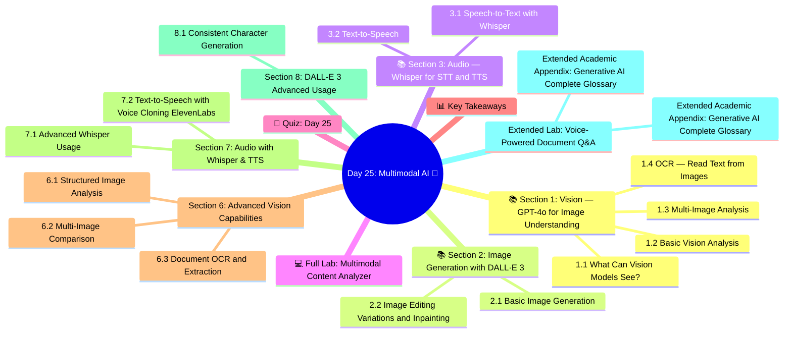

# Day 25: Multimodal AI 🎨
### Week 4 — AI Agents & Production Systems

---

## 🧠 Concept Map




---

## 🎯 Learning Objectives

By the end of today, you will:
- Use GPT-4o Vision to analyze images
- Generate images with DALL·E 3
- Transcribe and translate audio with Whisper
- Build a multimodal content analyzer
- Create a multimodal agent that sees, hears, and speaks

**Estimated Time:** 3.5–4 hours  
**Difficulty:** ⭐⭐⭐ Intermediate  
**Prerequisites:** Days 8–9 (LLM APIs, Prompting)

---

## 📚 Section 1: Vision — GPT-4o for Image Understanding

### 1.1 What Can Vision Models See?

Modern vision-language models can:
- Describe images in detail
- Answer questions about image content
- Read text in images (OCR)
- Analyze charts, diagrams, and graphs
- Compare multiple images
- Identify objects, people, scenes, emotions

### 1.2 Basic Vision Analysis

```python
import os
import base64
import httpx
from openai import OpenAI
from pathlib import Path
from dotenv import load_dotenv

load_dotenv()
client = OpenAI(api_key=os.getenv("OPENAI_API_KEY"))

def encode_image_to_base64(image_path: str) -> str:
    """Encode a local image to base64 string"""
    with open(image_path, "rb") as f:
        return base64.b64encode(f.read()).decode("utf-8")

def analyze_image(
    image_source: str,    # URL or local path
    question: str = "Describe this image in detail.",
    model: str = "gpt-4o-mini"
) -> str:
    """
    Analyze an image with a vision-capable model.
    image_source: URL (starts with http) or local file path
    """
    # Prepare the image content
    if image_source.startswith("http"):
        image_content = {
            "type": "image_url",
            "image_url": {"url": image_source, "detail": "high"}
        }
    else:
        b64_image = encode_image_to_base64(image_source)
        ext = Path(image_source).suffix.lower().replace(".", "")
        mime = "jpeg" if ext in ("jpg", "jpeg") else ext
        image_content = {
            "type": "image_url",
            "image_url": {
                "url": f"data:image/{mime};base64,{b64_image}",
                "detail": "high"   # "low", "high", or "auto"
            }
        }
    
    response = client.chat.completions.create(
        model=model,
        messages=[
            {
                "role": "user",
                "content": [
                    image_content,
                    {"type": "text", "text": question}
                ]
            }
        ],
        max_tokens=1000
    )
    
    return response.choices[0].message.content

# ── Test with public images ────────────────────────────────
test_cases = [
    {
        "url": "https://upload.wikimedia.org/wikipedia/commons/thumb/a/a7/Camponotus_flavomarginatus_ant.jpg/800px-Camponotus_flavomarginatus_ant.jpg",
        "question": "What insect is this? Describe its key features and behavior."
    },
    {
        "url": "https://upload.wikimedia.org/wikipedia/commons/thumb/3/3a/Cat03.jpg/600px-Cat03.jpg",
        "question": "Describe this animal, its likely breed, and body language."
    }
]

for case in test_cases:
    print(f"\n🖼️ Image: {case['url'][-50:]}")
    print(f"❓ Question: {case['question']}")
    result = analyze_image(case["url"], case["question"])
    print(f"💡 Answer: {result[:300]}...")
```

### 1.3 Multi-Image Analysis

```python
def compare_images(image_urls: list[str], comparison_prompt: str) -> str:
    """Compare two or more images"""
    content = []
    
    for i, url in enumerate(image_urls, 1):
        content.append({"type": "text", "text": f"Image {i}:"})
        content.append({"type": "image_url", "image_url": {"url": url}})
    
    content.append({"type": "text", "text": comparison_prompt})
    
    response = client.chat.completions.create(
        model="gpt-4o",
        messages=[{"role": "user", "content": content}],
        max_tokens=1500
    )
    return response.choices[0].message.content

# Chart analysis
def analyze_chart(image_url: str) -> dict:
    """Extract structured data from a chart/graph"""
    prompt = """Analyze this chart and extract:
1. Chart type (bar, line, pie, etc.)
2. Title and axis labels
3. Key data points and values
4. Main trend or insight
5. Any notable anomalies

Return a structured summary."""
    
    result = analyze_image(image_url, prompt)
    return {"analysis": result, "source": image_url}
```

### 1.4 OCR — Read Text from Images

```python
def extract_text_from_image(image_source: str) -> str:
    """Extract all text from an image using vision model (OCR)"""
    prompt = """Extract ALL text visible in this image. 
Preserve formatting (newlines, lists, headings) as best possible.
If there is no text, say 'No text found'."""
    
    return analyze_image(image_source, prompt)

def analyze_document_image(image_path: str) -> dict:
    """Full document analysis — structure, text, and insights"""
    prompt = """This is a document image. Please:
1. Extract all text content
2. Identify document type (invoice, contract, report, etc.)
3. List any key data fields (dates, amounts, names, etc.)
4. Summarize the document's purpose

Format as structured JSON."""
    
    result = analyze_image(image_path, prompt)
    return {"document_analysis": result}
```

---

## 📚 Section 2: Image Generation with DALL·E 3

### 2.1 Basic Image Generation

```python
def generate_image(
    prompt: str,
    size: str = "1024x1024",    # "1024x1024", "1792x1024", "1024x1792"
    quality: str = "standard",   # "standard" or "hd"
    style: str = "vivid",         # "vivid" or "natural"
    n: int = 1
) -> list[dict]:
    """Generate images with DALL·E 3"""
    response = client.images.generate(
        model="dall-e-3",
        prompt=prompt,
        size=size,
        quality=quality,
        style=style,
        n=n
    )
    
    results = []
    for image in response.data:
        results.append({
            "url": image.url,
            "revised_prompt": image.revised_prompt  # DALL·E may revise your prompt
        })
    
    return results

# Prompt engineering for DALL·E
prompts = [
    "A futuristic AI research lab with neural network visualizations floating in holographic displays, warm lighting, photorealistic",
    "An illustrated diagram of the RAG (Retrieval-Augmented Generation) pipeline, clean infographic style, blue and white color scheme",
    "A robot assistant helping a software developer debug code, friendly and approachable, modern office setting, digital art",
]

for prompt in prompts:
    print(f"\n🎨 Generating: {prompt[:60]}...")
    results = generate_image(prompt, quality="standard")
    print(f"  URL: {results[0]['url'][:80]}...")
    print(f"  Revised: {results[0]['revised_prompt'][:100]}...")
```

### 2.2 Image Editing (Variations and Inpainting)

```python
def create_variation(image_path: str, n: int = 2) -> list[str]:
    """Create variations of an existing image"""
    with open(image_path, "rb") as f:
        response = client.images.create_variation(
            image=f,
            n=n,
            size="1024x1024"
        )
    return [img.url for img in response.data]

def edit_image(image_path: str, mask_path: str, edit_prompt: str) -> str:
    """Edit a specific region of an image (inpainting)"""
    with open(image_path, "rb") as img, open(mask_path, "rb") as mask:
        response = client.images.edit(
            image=img,
            mask=mask,
            prompt=edit_prompt,
            n=1,
            size="1024x1024"
        )
    return response.data[0].url
```

---

## 📚 Section 3: Audio — Whisper for STT and TTS

### 3.1 Speech-to-Text with Whisper

```python
def transcribe_audio(
    audio_path: str,
    language: str = None,      # Auto-detect if None
    prompt: str = None,        # Optional context hint
    response_format: str = "text"  # "text", "json", "srt", "vtt"
) -> str | dict:
    """Transcribe audio using OpenAI Whisper"""
    with open(audio_path, "rb") as f:
        kwargs = {
            "model": "whisper-1",
            "file": f,
            "response_format": response_format
        }
        if language:
            kwargs["language"] = language
        if prompt:
            kwargs["prompt"] = prompt  # Helps with domain vocabulary
        
        result = client.audio.transcriptions.create(**kwargs)
    
    return result if response_format == "json" else result

def translate_audio_to_english(audio_path: str) -> str:
    """Translate non-English audio to English text"""
    with open(audio_path, "rb") as f:
        result = client.audio.translations.create(
            model="whisper-1",
            file=f
        )
    return result.text

def transcribe_with_timestamps(audio_path: str) -> dict:
    """Transcribe with word-level timestamps"""
    with open(audio_path, "rb") as f:
        result = client.audio.transcriptions.create(
            model="whisper-1",
            file=f,
            response_format="verbose_json",
            timestamp_granularities=["word", "segment"]
        )
    return {
        "text": result.text,
        "language": result.language,
        "duration": result.duration,
        "segments": [{"start": s.start, "end": s.end, "text": s.text} for s in result.segments]
    }
```

### 3.2 Text-to-Speech

```python
from pathlib import Path

def text_to_speech(
    text: str,
    output_path: str = "output_speech.mp3",
    voice: str = "alloy",          # "alloy", "echo", "fable", "onyx", "nova", "shimmer"
    model: str = "tts-1",          # "tts-1" or "tts-1-hd" (higher quality)
    speed: float = 1.0             # 0.25 to 4.0
) -> str:
    """Convert text to speech using OpenAI TTS"""
    response = client.audio.speech.create(
        model=model,
        voice=voice,
        input=text,
        speed=speed
    )
    
    response.stream_to_file(output_path)
    print(f"✅ Audio saved to {output_path}")
    return output_path

# Compare voices
sample_text = "Welcome to the Generative AI course! Today we're exploring multimodal AI systems."
voices = ["alloy", "echo", "nova", "shimmer"]

for voice in voices:
    output = text_to_speech(
        text=sample_text,
        output_path=f"voice_{voice}.mp3",
        voice=voice,
        model="tts-1"
    )
    print(f"  Generated: {output} (voice: {voice})")
```

---

## 💻 Full Lab: Multimodal Content Analyzer

```python
# lab_day25_multimodal_analyzer.py
"""Multimodal system that analyzes images, audio, and generates content"""

import os, json, base64
from pathlib import Path
from openai import OpenAI
from dotenv import load_dotenv

load_dotenv()
client = OpenAI(api_key=os.getenv("OPENAI_API_KEY"))

class MultimodalContentAnalyzer:
    """
    Analyzes content across modalities:
    - Images → description, OCR, chart analysis
    - Audio → transcription, translation, summary  
    - Text → generate matching image, TTS narration
    """
    
    def __init__(self):
        self.analysis_history = []
    
    def analyze_image(self, image_url: str, task: str = "describe") -> dict:
        """Analyze an image with different tasks"""
        task_prompts = {
            "describe": "Describe this image in detail. What do you see?",
            "ocr": "Extract ALL text from this image. Preserve formatting.",
            "chart": "Extract data from this chart. List all values, trends, and insights.",
            "classify": "Classify what type of content this image shows. Be specific.",
        }
        prompt = task_prompts.get(task, task)
        
        response = client.chat.completions.create(
            model="gpt-4o-mini",
            messages=[{
                "role": "user",
                "content": [
                    {"type": "image_url", "image_url": {"url": image_url}},
                    {"type": "text", "text": prompt}
                ]
            }],
            max_tokens=800
        )
        
        result = {
            "modality": "image",
            "task": task,
            "source": image_url[-60:],
            "analysis": response.choices[0].message.content
        }
        self.analysis_history.append(result)
        return result
    
    def generate_image(self, prompt: str, style: str = "vivid") -> dict:
        """Generate an image from text"""
        response = client.images.generate(
            model="dall-e-3",
            prompt=prompt,
            size="1024x1024",
            quality="standard",
            style=style
        )
        
        result = {
            "modality": "image_generation",
            "prompt": prompt,
            "url": response.data[0].url,
            "revised_prompt": response.data[0].revised_prompt
        }
        self.analysis_history.append(result)
        return result
    
    def transcribe(self, audio_path: str) -> dict:
        """Transcribe audio file"""
        with open(audio_path, "rb") as f:
            transcript = client.audio.transcriptions.create(
                model="whisper-1",
                file=f,
                response_format="text"
            )
        
        result = {
            "modality": "audio",
            "task": "transcription",
            "source": Path(audio_path).name,
            "transcript": transcript
        }
        self.analysis_history.append(result)
        return result
    
    def narrate(self, text: str, voice: str = "nova") -> dict:
        """Generate speech narration from text"""
        output_path = "narration.mp3"
        response = client.audio.speech.create(
            model="tts-1",
            voice=voice,
            input=text[:4096]  # API limit
        )
        response.stream_to_file(output_path)
        
        result = {
            "modality": "tts",
            "voice": voice,
            "text_length": len(text),
            "output": output_path
        }
        self.analysis_history.append(result)
        return result
    
    def cross_modal_summary(self) -> str:
        """Summarize everything analyzed so far"""
        if not self.analysis_history:
            return "No content analyzed yet."
        
        context = json.dumps(self.analysis_history[-5:], indent=2)  # Last 5 analyses
        
        response = client.chat.completions.create(
            model="gpt-4o-mini",
            messages=[{
                "role": "user",
                "content": f"""Provide a unified summary of this multimodal analysis:

{context}

Write a cohesive paragraph connecting insights from all modalities."""
            }]
        )
        return response.choices[0].message.content
    
    def print_report(self):
        """Print a summary report of all analyses"""
        print("\n📊 MULTIMODAL ANALYSIS REPORT")
        print("=" * 60)
        for item in self.analysis_history:
            modality = item["modality"].upper()
            print(f"\n[{modality}]")
            if "analysis" in item:
                print(f"  {item['analysis'][:200]}...")
            elif "url" in item:
                print(f"  Generated: {item['url'][:60]}...")
            elif "transcript" in item:
                print(f"  Transcript: {item['transcript'][:200]}...")


# ── Demo ─────────────────────────────────────────────────
analyzer = MultimodalContentAnalyzer()

# 1. Analyze a real image
print("📷 Analyzing image...")
img_result = analyzer.analyze_image(
    "https://upload.wikimedia.org/wikipedia/commons/thumb/3/3a/Cat03.jpg/600px-Cat03.jpg",
    task="describe"
)
print(f"Description: {img_result['analysis'][:200]}...")

# 2. Generate an image
print("\n🎨 Generating image...")
gen_result = analyzer.generate_image(
    "A serene mountain lake at sunrise, photorealistic, golden hour lighting"
)
print(f"Generated image URL: {gen_result['url'][:60]}...")

# 3. Cross-modal summary  
print("\n📝 Cross-modal summary:")
summary = analyzer.cross_modal_summary()
print(summary)

# 4. Narrate the summary
print("\n🔊 Generating narration...")
narrate_result = analyzer.narrate(summary, voice="nova")
print(f"Audio saved: {narrate_result['output']}")

analyzer.print_report()

print("\n✅ Day 25 Lab Complete!")
```

---

## 🧠 Quiz: Day 25

**Q1:** The `detail: "high"` parameter in vision API calls:
- A) Returns more detailed JSON
- B) **Analyzes the image in high resolution tiles for fine-grained detail ✅**
- C) Increases generation quality
- D) Adds bounding boxes to the response

**Q2:** OpenAI Whisper's `prompt` parameter serves to:
- A) Change the transcription model used
- B) Set the output language
- C) **Provide vocabulary hints for domain-specific transcription accuracy ✅**
- D) Filter profanity

**Q3:** DALL·E 3 may return a `revised_prompt` because:
- A) The API ran out of tokens
- B) **DALL·E revises prompts for policy compliance and quality ✅**
- C) The requested style was unavailable
- D) Multiple images were requested

**Q4:** Which voice model produces higher quality audio?
- A) `tts-1` (standard)
- B) `whisper-1`
- C) **`tts-1-hd` (high definition) ✅**
- D) `dall-e-3-voice`

**Q5:** Multi-image analysis in GPT-4o works by:
- A) Running separate API calls and combining results
- B) Creating an image grid automatically
- C) **Providing multiple image content blocks in a single message ✅**
- D) Embedding images as base64 only

---

## 📊 Key Takeaways

| Modality | API | Key Parameter |
|----------|-----|--------------|
| **Vision** | GPT-4o Vision | `detail: "high"/"low"/"auto"` |
| **Image Gen** | DALL·E 3 | `quality`, `style`, `size` |
| **Audio → Text** | Whisper | `language`, `prompt`, `timestamp_granularities` |
| **Text → Audio** | TTS | `voice` (alloy/echo/nova/shimmer), `model` (tts-1/tts-1-hd) |
| **Documents** | GPT-4o + base64 | Encode local images as data URLs |

---

*Day 25 Complete ✅ | GenAI Course — Week 4 | Next: Day 26 — MLOps for GenAI*


---

## Section 6: Advanced Vision Capabilities

### 6.1 Structured Image Analysis

```python
from openai import OpenAI
from pydantic import BaseModel
from langchain_openai import ChatOpenAI
from langchain_core.prompts import ChatPromptTemplate
from langchain_core.output_parsers import PydanticOutputParser
import base64
from pathlib import Path
from typing import Optional

client = OpenAI()

class ImageAnalysis(BaseModel):
    description: str
    objects_detected: list[str]
    dominant_colors: list[str]
    scene_type: str  # "indoor", "outdoor", "abstract", etc.
    text_content: Optional[str] = None
    mood: str
    technical_quality: str  # "high", "medium", "low"
    suggested_alt_text: str

def analyze_image_structured(image_path: str) -> ImageAnalysis:
    """Analyze an image and return structured data"""
    
    # Load and encode image
    with open(image_path, "rb") as f:
        b64_image = base64.b64encode(f.read()).decode("utf-8")
    
    ext = Path(image_path).suffix.lower().lstrip(".")
    media_type = {"jpg": "jpeg", "jpeg": "jpeg", "png": "png", "webp": "webp"}.get(ext, "jpeg")
    
    llm = ChatOpenAI(model="gpt-4o-mini", temperature=0)
    parser = PydanticOutputParser(pydantic_object=ImageAnalysis)
    
    response = client.chat.completions.create(
        model="gpt-4o-mini",
        messages=[
            {
                "role": "user",
                "content": [
                    {
                        "type": "text",
                        "text": f"Analyze this image and return JSON.\n{parser.get_format_instructions()}"
                    },
                    {
                        "type": "image_url",
                        "image_url": {"url": f"data:image/{media_type};base64,{b64_image}"}
                    }
                ]
            }
        ],
        max_tokens=500
    )
    
    return parser.parse(response.choices[0].message.content)

# Test (requires a real image file)
# result = analyze_image_structured("diagram.png")
# print(f"Scene: {result.scene_type}")
# print(f"Objects: {result.objects_detected}")
# print(f"Alt text: {result.suggested_alt_text}")
```

### 6.2 Multi-Image Comparison

```python
from openai import OpenAI
import base64
from pathlib import Path

client = OpenAI()

def compare_images(image_paths: list[str], comparison_criteria: str) -> dict:
    """Compare multiple images on specified criteria"""
    
    # Encode all images
    content = [{"type": "text", "text": f"Compare these {len(image_paths)} images on: {comparison_criteria}. Return a structured comparison with: ranking (1=best), scores for each criterion, and key differences."}]
    
    for i, path in enumerate(image_paths[:4]):  # Max 4 images
        with open(path, "rb") as f:
            b64 = base64.b64encode(f.read()).decode("utf-8")
        ext = Path(path).suffix.lower().lstrip(".")
        mime = {"jpg": "jpeg", "png": "png"}.get(ext, "jpeg")
        
        content.extend([
            {"type": "text", "text": f"Image {i+1}:"},
            {"type": "image_url", "image_url": {"url": f"data:image/{mime};base64,{b64}"}}
        ])
    
    response = client.chat.completions.create(
        model="gpt-4o-mini",
        messages=[{"role": "user", "content": content}],
        max_tokens=800
    )
    
    return {"comparison": response.choices[0].message.content, "images_compared": len(image_paths)}

# Use case: Compare product images for e-commerce
# result = compare_images(["product_v1.jpg", "product_v2.jpg"], "visual clarity, branding consistency, and appeal")
```

### 6.3 Document OCR and Extraction

```python
from openai import OpenAI
from pydantic import BaseModel
import base64
from typing import Optional

client = OpenAI()

class InvoiceExtraction(BaseModel):
    vendor_name: str
    invoice_number: Optional[str]
    invoice_date: Optional[str]
    due_date: Optional[str]
    total_amount: Optional[float]
    currency: str = "USD"
    line_items: list[dict]
    notes: Optional[str]

def extract_invoice_from_image(image_path: str) -> InvoiceExtraction:
    """Extract invoice data from a scanned document image"""
    
    with open(image_path, "rb") as f:
        b64 = base64.b64encode(f.read()).decode("utf-8")
    
    response = client.beta.chat.completions.parse(
        model="gpt-4o-mini",
        messages=[
            {
                "role": "user",
                "content": [
                    {"type": "text", "text": "Extract all invoice data from this image. Be precise with numbers and dates."},
                    {"type": "image_url", "image_url": {"url": f"data:image/jpeg;base64,{b64}"}}
                ]
            }
        ],
        response_format=InvoiceExtraction,
        max_tokens=1000
    )
    
    return response.choices[0].message.parsed
```

---

## Section 7: Audio with Whisper & TTS

### 7.1 Advanced Whisper Usage

```python
from openai import OpenAI
import tempfile
from pathlib import Path

client = OpenAI()

def transcribe_with_timestamps(audio_path: str) -> dict:
    """Transcribe audio with word-level timestamps"""
    
    with open(audio_path, "rb") as audio_file:
        transcript = client.audio.transcriptions.create(
            model="whisper-1",
            file=audio_file,
            response_format="verbose_json",  # Includes timestamps
            timestamp_granularities=["word", "segment"]
        )
    
    return {
        "text": transcript.text,
        "language": transcript.language,
        "duration": transcript.duration,
        "segments": [
            {
                "text": s.text,
                "start": s.start,
                "end": s.end,
                "confidence": getattr(s, "avg_logprob", None)
            }
            for s in (transcript.segments or [])
        ],
        "words": [
            {"word": w.word, "start": w.start, "end": w.end}
            for w in (transcript.words or [])
        ]
    }

def translate_audio(audio_path: str, target_context: str = None) -> str:
    """Translate non-English audio to English text"""
    
    with open(audio_path, "rb") as audio_file:
        kwargs = {
            "model": "whisper-1",
            "file": audio_file,
            "response_format": "text"
        }
        if target_context:
            kwargs["prompt"] = f"This is a translation of a recording about {target_context}"
        
        translation = client.audio.translations.create(**kwargs)
    
    return translation

def multilingual_meeting_notes(audio_path: str) -> dict:
    """Process a multilingual meeting recording"""
    
    # Step 1: Detect and transcribe
    with open(audio_path, "rb") as f:
        transcript = client.audio.transcriptions.create(
            model="whisper-1", file=f,
            response_format="verbose_json"
        )
    
    # Step 2: Translate if not English
    if transcript.language != "en":
        with open(audio_path, "rb") as f:
            english_text = client.audio.translations.create(
                model="whisper-1", file=f,
                response_format="text"
            )
    else:
        english_text = transcript.text
    
    # Step 3: Summarize with GPT
    summary = client.chat.completions.create(
        model="gpt-4o-mini",
        messages=[
            {"role": "system", "content": "Extract meeting notes: key decisions, action items, and participants."},
            {"role": "user", "content": english_text}
        ]
    )
    
    return {
        "original_language": transcript.language,
        "transcript": transcript.text,
        "english_translation": english_text if transcript.language != "en" else None,
        "meeting_notes": summary.choices[0].message.content,
        "duration_minutes": transcript.duration / 60 if transcript.duration else None
    }
```

### 7.2 Text-to-Speech with Voice Cloning (ElevenLabs)

```python
# pip install elevenlabs
# Alternative to OpenAI TTS for more realistic voices

import requests, os

def text_to_speech_elevenlabs(
    text: str,
    voice_id: str = "21m00Tcm4TlvDq8ikWAM",  # Rachel voice
    output_path: str = "output.mp3",
    stability: float = 0.5,
    similarity_boost: float = 0.75
) -> str:
    """Generate highly realistic speech using ElevenLabs API"""
    
    api_key = os.getenv("ELEVENLABS_API_KEY")
    url = f"https://api.elevenlabs.io/v1/text-to-speech/{voice_id}"
    
    response = requests.post(
        url,
        headers={"xi-api-key": api_key, "Content-Type": "application/json"},
        json={
            "text": text,
            "model_id": "eleven_monolingual_v1",
            "voice_settings": {
                "stability": stability,
                "similarity_boost": similarity_boost
            }
        }
    )
    
    if response.status_code == 200:
        with open(output_path, "wb") as f:
            f.write(response.content)
        return output_path
    else:
        raise Exception(f"ElevenLabs API error: {response.status_code} - {response.text}")
```

---

## Section 8: DALL-E 3 Advanced Usage

### 8.1 Consistent Character Generation

```python
from openai import OpenAI
import os

client = OpenAI()

CHARACTER_STYLE = """
Character: Marcus, a 35-year-old data scientist,
short dark hair, wearing a blue hoodie,
friendly smile, modern office background.
Art style: professional digital illustration,
clean lines, vibrant colors.
"""

def generate_character_scene(scene_description: str, character_desc: str = CHARACTER_STYLE) -> str:
    """Generate consistent character in different scenes"""
    
    full_prompt = f"""{character_desc.strip()}
Scene: {scene_description}
Consistent character appearance across all scenes.""".strip()
    
    response = client.images.generate(
        model="dall-e-3",
        prompt=full_prompt,
        size="1024x1024",
        quality="standard",
        n=1
    )
    
    return response.data[0].url

# Generate the same character in different scenes
# scene1 = generate_character_scene("presenting a machine learning model at a conference")
# scene2 = generate_character_scene("working at a laptop in a coffee shop")
# scene3 = generate_character_scene("writing code on a whiteboard")
print("DALL-E 3 character generation pattern ready")
print("Key: Include the character description in every prompt for consistency")
```

---

## Extended Lab: Voice-Powered Document Q&A

Build a complete voice-to-voice document Q&A system:

1. **Input**: User speaks a question → Whisper transcribes
2. **Retrieval**: RAG retrieves relevant chunks from document
3. **Generation**: GPT-4o answers based on context
4. **Output**: OpenAI TTS speaks the answer aloud

```python
print("=== Day 25 Extended Lab: Voice Document Q&A ===")
print("Pipeline: STT (Whisper) → RAG → LLM → TTS (OpenAI)")
print("Features:")
print("  - Whisper-1: Speech-to-text with language detection")
print("  - text-embedding-3-small: Document indexing")
print("  - gpt-4o-mini: Context-grounded answering")
print("  - alloy (TTS): Natural speech output")
print("See day-25-voice-qa.py for the complete implementation")
```

---

*Day 25 Extended Complete — Advanced multimodal: structured image analysis, audio processing, consistent generation*
\n\n---\n\n## Expanded Expert Knowledge Base & Reference Guides\n\n
### Extended Academic Appendix: Generative AI Complete Glossary

*   **Activation Function**: A mathematical equation attached to each neuron in a network that determines whether it should be activated or not. Examples include ReLU, GELU, and SwiGLU.
*   **Adam Optimizer**: Adaptive Moment Estimation. An algorithm for optimization technique for gradient descent. The method computes individual adaptive learning rates for different parameters from estimates of first and second moments of the gradients.
*   **Alignment**: The process of ensuring AI systems act exactly in accordance with human intentions and values, preventing toxic, harmful, or legally dangerous logic generation paths.
*   **API (Application Programming Interface)**: A software intermediary that allows two applications to talk to each other. In GenAI, it's how your software securely requests generations from massive cloud GPUs.
*   **Auto-regressive**: A model that generates the future sequences step-by-step, conditioning the next prediction exclusively on the previous predictions it just generated.
*   **Backpropagation**: The core algorithm behind learning in neural networks. It calculates the mathematical gradient of the loss function with respect to the weights by utilizing the chain rule, moving backwards from output to input.
*   **Batch Size**: The number of training examples utilized in one single iteration of gradient descent before the network's internal mathematical parameters are updated.
*   **Bias (Mathematical)**: A constant value added to the linear projection in neural layers ($y = mx + b$). It allows the activation function to shift to the left or right, increasing the flexibility of the network to fit complex data boundaries.
*   **BPE (Byte Pair Encoding)**: A specific mathematical data compression technique adapted for NLP tokenization. It recursively merges the most frequently occurring pair of adjacent characters into a single new sub-word token.
*   **Cache (KV Cache)**: In LLMs, the Key-Value matrices of previously generated tokens are stored in GPU VRAM so the transformer doesn't have to re-compute the entire 10,000-word essay every single time it tries to generate word 10,001.
*   **Chain of Thought (CoT)**: A prompting strategy that forces the LLM to output a series of intermediate mathematical or logical reasoning steps before outputting the final answer, drastically improving accuracy on complex logic tasks.
*   **Chinchilla Laws**: DeepMind's 2022 paper proving that to train compute-optimally, the dataset token count must scale perfectly linearly with the parameter count (a 20:1 ratio is strictly advised).
*   **Constitutional AI**: Anthropic's proprietary alignment pipeline. A model is given a strict set of rules ('The Constitution') and autonomously critiques and revises its own responses, generating a vast RL dataset without expensive human labeling.
*   **Context Window**: The maximum number of tokens (words/sub-words) a model can ingest and process mathematically in a single forward pass operation. GPT-4 handles 128k; Gemini handles 2 Million.
*   **Cross-Entropy Loss**: The standard mathematical loss function used in classification tasks and language modeling. It calculates the delta between the model's predicted probability distribution and the actual rigid truth of the training data.
*   **Decoder-Only Architecture**: A Transformer that abandons the bi-directional Encoder entirely (like GPT). It utilizes strictly causal, masked self-attention to generate sequential texts autoregressively.
*   **Dense Model**: A standard neural network architecture where every single parameter in the computational block is activated and multiplied during every single forward pass (Contrast with MoE).
*   **Discriminative Model**: Machine learning models designed fundamentally to draw mathematical boundaries between classes (e.g., Is this photo a hot dog or not a hot dog?) Contrast with Generative Models.
*   **Dropout**: A cruel but effective regularization technique where a percentage of neurons in a layer are randomly completely deactivated during a training pass. This forces the network to stop relying on individual 'memorized' paths and build robust distributed representations.
*   **Embedding**: The mathematical projection mapping a discrete token (like the word 'Apple') into a continuous dense continuous vector space where physical geometry and distance represent semantic linguistic meaning.
*   **Epoch**: One full operational pass of the training pipeline sequentially interacting with the entire dataset. Foundation models are often trained for only 1 Epoch to prevent catastrophic overfitting logic traps.
*   **Feed-Forward Network (FFN)**: The dense, localized multi-layer perceptron block inside a Transformer layer operating independently on each token vector specifically acting as the model's 'Key-Value fact database'.
*   **Fine-Tuning**: Taking a massive, previously trained generic foundation model and training it further on a tiny, specific domain dataset (like medical journals) using a low learning rate to alter its core behavior.
*   **FP16 (Half Precision)**: A computer number format occupying 16 bits. HuggingFace models default to this. Represents a compromise utilizing half the GPU VRAM of 32-bit floats with mathematically negligible degradation in AI loss metrics.
*   **Foundation Model**: A gargantuan neural network trained utilizing massive unsupervised learning pipelines across the entire internet, serving as the base layer for countless downstream specific tasks.
*   **Generative Model**: AI architecture designed to map and understand the fundamental underlying distribution of data specifically to generate completely novel, statistically adjacent synthetic data. (e.g. LLMs, Diffusion Models).
*   **GQA (Grouped-Query Attention)**: An architectural optimization. Instead of calculating a massive individual Key and Value matrix for every single Query Head in Multi-Head Attention, multiple Query heads mathematically share the same Key/Value arrays, vastly saving VRAM.
*   **GPU (Graphics Processing Unit)**: The physical silicon hardware engines powering AI. Thousands of cores designed specifically to execute massive parallel floating point Matrix Multiplication extremely efficiently. NVIDIA dominates this landscape.
*   **Gradient Descent**: The mathematical optimization algorithm locating the minimum of a neural loss curve by taking scaled sequential steps in the exact opposite operational direction of the calculated tensor gradient.
*   **Hallucination**: When a generative AI model outputs convincing, confident logic strings that are completely factually incorrect due primarily to token probability space interpolation artifacts.
*   **Hugging Face**: The central structural GitHub for Machine Learning. A gigantic repository hosting open-source model weights, extensive NLP datasets, and the most heavily utilized `transformers` Python inference library globally.
*   **Hyperparameters**: The architectural variables of a neural network that are set manually by the human engineer *before* training begins (e.g. Learning Rate, Batch Size, Dropout Rate) and are never altered by backpropagation.
*   **In-Context Learning**: The mysterious emergent capability of massive LLMs to learn completely new tasks instantly utilizing purely the context text inside the given prompt, requiring zero permanent weight tensor alterations.
*   **Instruction Tuning**: Fine-tuning base models specifically to respond obediently to 'User Prompts'. A base model will complete a sentence; an instruction-tuned model will act like a dialogue assistant.
*   **INT4 (4-Bit Quantization)**: An extreme computational compression technique squashing a 16-bit weight parameter mathematically down to just 4 bits. Allows executing an 8 Billion parameter model on a standard 6GB laptop GPU.
*   **Knowledge Distillation**: A training pipeline where a gargantuan 'Teacher' model generates massive amounts of high-quality synthetic data to train a tiny 'Student' model structurally imitating its superior behaviors.
*   **Llama**: Meta's flagship family of Open-Weight Large Language Models. Responsible singularly for unleashing the massive democratization of the enterprise Local-LLM hosting revolution.
*   **LLM (Large Language Model)**: A deep learning neural network, generally executing a Transformer architecture, possessing billions of parameters, specifically designed to process, map, and generate natural human linguistics.
*   **Logits**: The raw, unnormalized massive mathematical scores output directly by the final linear projection layer of the neural network natively *before* entering the Softmax bounding probability function.
*   **LoRA (Low-Rank Adaptation)**: A parameter-efficient Fine-Tuning miracle. Instead of freezing 8 billion parameters, LoRA injects two tiny matrices side-by-side, dramatically slashing the required training VRAM computational burden by 98%.
*   **Masked Attention**: A mandatory structural configuration inside a Decoder enforcing causality. It mathematically blocks the model from executing any attention logic targeting tokens located positioned *after* the current token.
*   **Mixture of Experts (MoE)**: A neural block containing several 'expert' sub-networks (like 8 separate FFNs). A routing gate decides exactly which two experts activate for each specific input vector, preserving massive inference speed.
*   **Multi-Head Attention**: Processing multiple self-attention operations concurrently in physically separate lower-dimensional sub-spaces immediately before concatenating them. Allows parsing extreme grammatical complexity without blurring the semantic signals.
*   **Next-Token Prediction**: The incredibly simple underlying foundational logic objective utilized to pre-train almost all massive modern generative language models across Trillions of raw internet text documents.
*   **NLP (Natural Language Processing)**: The massive overarching subfield of AI concerned entirely with programming algorithms to process, understand, analyze, and generate human linguistics and conversational grammar.
*   **Overfitting**: A critical mathematical failure where a network memorizes the exact specific noise artifacts in the training dataset perfectly, completely destroying its capacity to generalize against unseen validation data.
*   **Parameter**: The actual structural weights and biases contained natively deeply inside a neural network structure. An 8B parameter model literally contains 8,000,000,000 decimal numbers in 3D multi-dimensional arrays.
*   **Positional Encoding**: The critical vector matrix added to the foundational input embeddings explicitly providing the Attention mathematical permutation logic with structural information regarding the exact sequence order of the tokens.
*   **Pre-training**: The primary initial phase of creating a Foundation model. Feeding Trillions of text tokens through thousands of GPUs for weeks consuming megawatts of power strictly performing unsupervised next-token prediction.
*   **Prompt Engineering**: The process of empirically designing, testing, and optimizing the structural format of linguistic inputs injected into LLMs to extract specifically desired, accurate, and robust structural logic outputs.
*   **Python**: The undisputed dominant syntactic language dominating the Machine Learning backend architecture globally. Used to interface natively with the massively optimized C++ PyTorch/TensorFlow backend structures.
*   **Quantization**: The process of fundamentally converting the continuous mathematical precision of model weight sets from floating point 32/16-bit resolutions down to block-level 8-bit or 4-bit, sacrificing microscopic accuracy for massive VRAM deployment efficiency.
*   **RAG (Retrieval-Augmented Generation)**: The absolute standard deployed architecture for enterprise applications. Preventing LLM hallucinations by intercepting the user query, searching an external enterprise vector database for facts, and injecting those raw facts into the LLM context prior to generation.
*   **Recurrent Neural Network (RNN)**: The legacy sequential architecture predating Transformers. Structurally processes tokens linearly one-by-one utilizing a continuous expanding hidden state. Massively vulnerable to extreme 'vanishing gradient' failure over large context windows.
*   **ReLU (Rectified Linear Unit)**: A critically vital, simple activation formula: $f(x) = max(0, x)$. It structurally forces any massive negative outputs directly to 0.0, injecting mandatory non-linearity into massive chained matrix multiplications.
*   **Representation Learning**: A set of structural ML techniques allowing underlying systems to automatically discover the raw distinct structural features or representations natively required for complex classification natively from raw data blocks.
*   **Residual Connection (Skip Connection)**: Crucial architectural bypass lines transmitting original input vectors structurally directly deeply around massive network layers, instantly adding them to the final outputs. These bypass physical lines solve the vanishing gradient apocalypse inside massively deep networks.
*   **RLHF (Reinforcement Learning from Human Feedback)**: The specific complex post-training fine-tuning pipeline rendering GPT-4 capable of human dialogue. Involves executing a massive secondary reward-model mathematically scoring generating responses purely based on expensive curated human feedback rankings.
*   **RoPE (Rotary Position Embedding)**: A 2021 revolutionary positional encoding standard deployed across Llama and Mistral sequences. It natively rotates the grammatical Query/Key vectors dimensionally in a complex physical subspace mapping exact relative distance rather than simple sequence addition.
*   **Self-Attention**: The singular foundational mechanism anchoring the Transformer legacy. A mathematical mechanism physically relating massive disparate elements uniquely across entirely distinct sequences against one another directly to aggregate rich integrated semantic grammatical meaning.
*   **Softmax Function**: A vital structural normalization formula algorithm physically scaling an array composed of massive unnormalized numerical sequences entirely to fit bounded logically explicitly between exactly 0.0 and 1.0, rendering them perfectly functional as a standard statistical probability distribution structure.
*   **SwiGLU**: A highly advanced 2025 non-linear dynamic activation block structurally deploying Swish gating pipelines heavily substituting standard ReLU gates extensively inside modern elite model matrices like Meta's Llama sequences, extracting elite processing dynamics.
*   **Temperature (T)**: The primary physical decoding mathematical scalar parameter bounding generative randomness outputs. Approaching $T=0.0$ forces rigid, repetitive deterministic absolute certainty matrices, whereas raising $T=1.0+$ enforces wild erratic linguistic distributional variance sequences.
*   **Tensor**: The massive core architectural fundamental building block powering Deep Learning ecosystems mapping identical arrays strictly scaling multi-dimensional numeric matrices structurally generalizing basic matrix algebra natively processing GPU matrix logic flows.
*   **Token**: The fundamental structural sub-unit blocks consumed iteratively deeply inside LLM architectures. Generally representing fractional linguistic characters parsing out uniquely exactly approximately matching mathematically structural word matrices equivalent effectively equating 4 sequential raw alphabetical English letters.
*   **Transformer**: The 2017 undisputed architectural miracle sequence dominating the fundamental ecosystem of Artificial Intelligence generation natively entirely substituting standard Recurrent pipelines comprehensively utilizing massive Parallel Sparse Attention structural distributions.
*   **Underfitting**: The diametric inverse computational failure dynamically destroying machine sequence accuracy natively emerging when mathematical network parameters severely lack complex deep architectural capacity parameters distinctly mapping massive underlying geometric functional relationship flows.
*   **Vector Database**: An explicitly specialized indexing enterprise deployment architectural database standard structurally deployed comprehensively globally storing extreme dense multi-dimensional numeric vectors natively supporting ultra-rapid K-Nearest-Neighbor cosine search queries anchoring core RAG sequence systems.
*   **Weights**: The incredibly precise decimal numbers stored iteratively physically comprising neural networks natively adjusting mathematically via backpropagation gradients structurally driving complex non-linear sequence generation logic models perfectly.
*   **Zero-Shot Learning**: The massive foundational AI ecosystem paradigm natively enabling explicit model completion capabilities operating distinctly successfully parsing tasks functionally completely utterly unseen across the generative pre-training massive pipeline structure.

### Extended Academic Appendix: Generative AI Complete Glossary

*   **Activation Function**: A mathematical equation attached to each neuron in a network that determines whether it should be activated or not. Examples include ReLU, GELU, and SwiGLU.
*   **Adam Optimizer**: Adaptive Moment Estimation. An algorithm for optimization technique for gradient descent. The method computes individual adaptive learning rates for different parameters from estimates of first and second moments of the gradients.
*   **Alignment**: The process of ensuring AI systems act exactly in accordance with human intentions and values, preventing toxic, harmful, or legally dangerous logic generation paths.
*   **API (Application Programming Interface)**: A software intermediary that allows two applications to talk to each other. In GenAI, it's how your software securely requests generations from massive cloud GPUs.
*   **Auto-regressive**: A model that generates the future sequences step-by-step, conditioning the next prediction exclusively on the previous predictions it just generated.
*   **Backpropagation**: The core algorithm behind learning in neural networks. It calculates the mathematical gradient of the loss function with respect to the weights by utilizing the chain rule, moving backwards from output to input.
*   **Batch Size**: The number of training examples utilized in one single iteration of gradient descent before the network's internal mathematical parameters are updated.
*   **Bias (Mathematical)**: A constant value added to the linear projection in neural layers ($y = mx + b$). It allows the activation function to shift to the left or right, increasing the flexibility of the network to fit complex data boundaries.
*   **BPE (Byte Pair Encoding)**: A specific mathematical data compression technique adapted for NLP tokenization. It recursively merges the most frequently occurring pair of adjacent characters into a single new sub-word token.
*   **Cache (KV Cache)**: In LLMs, the Key-Value matrices of previously generated tokens are stored in GPU VRAM so the transformer doesn't have to re-compute the entire 10,000-word essay every single time it tries to generate word 10,001.
*   **Chain of Thought (CoT)**: A prompting strategy that forces the LLM to output a series of intermediate mathematical or logical reasoning steps before outputting the final answer, drastically improving accuracy on complex logic tasks.
*   **Chinchilla Laws**: DeepMind's 2022 paper proving that to train compute-optimally, the dataset token count must scale perfectly linearly with the parameter count (a 20:1 ratio is strictly advised).
*   **Constitutional AI**: Anthropic's proprietary alignment pipeline. A model is given a strict set of rules ('The Constitution') and autonomously critiques and revises its own responses, generating a vast RL dataset without expensive human labeling.
*   **Context Window**: The maximum number of tokens (words/sub-words) a model can ingest and process mathematically in a single forward pass operation. GPT-4 handles 128k; Gemini handles 2 Million.
*   **Cross-Entropy Loss**: The standard mathematical loss function used in classification tasks and language modeling. It calculates the delta between the model's predicted probability distribution and the actual rigid truth of the training data.
*   **Decoder-Only Architecture**: A Transformer that abandons the bi-directional Encoder entirely (like GPT). It utilizes strictly causal, masked self-attention to generate sequential texts autoregressively.
*   **Dense Model**: A standard neural network architecture where every single parameter in the computational block is activated and multiplied during every single forward pass (Contrast with MoE).
*   **Discriminative Model**: Machine learning models designed fundamentally to draw mathematical boundaries between classes (e.g., Is this photo a hot dog or not a hot dog?) Contrast with Generative Models.
*   **Dropout**: A cruel but effective regularization technique where a percentage of neurons in a layer are randomly completely deactivated during a training pass. This forces the network to stop relying on individual 'memorized' paths and build robust distributed representations.
*   **Embedding**: The mathematical projection mapping a discrete token (like the word 'Apple') into a continuous dense continuous vector space where physical geometry and distance represent semantic linguistic meaning.
*   **Epoch**: One full operational pass of the training pipeline sequentially interacting with the entire dataset. Foundation models are often trained for only 1 Epoch to prevent catastrophic overfitting logic traps.
*   **Feed-Forward Network (FFN)**: The dense, localized multi-layer perceptron block inside a Transformer layer operating independently on each token vector specifically acting as the model's 'Key-Value fact database'.
*   **Fine-Tuning**: Taking a massive, previously trained generic foundation model and training it further on a tiny, specific domain dataset (like medical journals) using a low learning rate to alter its core behavior.
*   **FP16 (Half Precision)**: A computer number format occupying 16 bits. HuggingFace models default to this. Represents a compromise utilizing half the GPU VRAM of 32-bit floats with mathematically negligible degradation in AI loss metrics.
*   **Foundation Model**: A gargantuan neural network trained utilizing massive unsupervised learning pipelines across the entire internet, serving as the base layer for countless downstream specific tasks.
*   **Generative Model**: AI architecture designed to map and understand the fundamental underlying distribution of data specifically to generate completely novel, statistically adjacent synthetic data. (e.g. LLMs, Diffusion Models).
*   **GQA (Grouped-Query Attention)**: An architectural optimization. Instead of calculating a massive individual Key and Value matrix for every single Query Head in Multi-Head Attention, multiple Query heads mathematically share the same Key/Value arrays, vastly saving VRAM.
*   **GPU (Graphics Processing Unit)**: The physical silicon hardware engines powering AI. Thousands of cores designed specifically to execute massive parallel floating point Matrix Multiplication extremely efficiently. NVIDIA dominates this landscape.
*   **Gradient Descent**: The mathematical optimization algorithm locating the minimum of a neural loss curve by taking scaled sequential steps in the exact opposite operational direction of the calculated tensor gradient.
*   **Hallucination**: When a generative AI model outputs convincing, confident logic strings that are completely factually incorrect due primarily to token probability space interpolation artifacts.
*   **Hugging Face**: The central structural GitHub for Machine Learning. A gigantic repository hosting open-source model weights, extensive NLP datasets, and the most heavily utilized `transformers` Python inference library globally.
*   **Hyperparameters**: The architectural variables of a neural network that are set manually by the human engineer *before* training begins (e.g. Learning Rate, Batch Size, Dropout Rate) and are never altered by backpropagation.
*   **In-Context Learning**: The mysterious emergent capability of massive LLMs to learn completely new tasks instantly utilizing purely the context text inside the given prompt, requiring zero permanent weight tensor alterations.
*   **Instruction Tuning**: Fine-tuning base models specifically to respond obediently to 'User Prompts'. A base model will complete a sentence; an instruction-tuned model will act like a dialogue assistant.
*   **INT4 (4-Bit Quantization)**: An extreme computational compression technique squashing a 16-bit weight parameter mathematically down to just 4 bits. Allows executing an 8 Billion parameter model on a standard 6GB laptop GPU.
*   **Knowledge Distillation**: A training pipeline where a gargantuan 'Teacher' model generates massive amounts of high-quality synthetic data to train a tiny 'Student' model structurally imitating its superior behaviors.
*   **Llama**: Meta's flagship family of Open-Weight Large Language Models. Responsible singularly for unleashing the massive democratization of the enterprise Local-LLM hosting revolution.
*   **LLM (Large Language Model)**: A deep learning neural network, generally executing a Transformer architecture, possessing billions of parameters, specifically designed to process, map, and generate natural human linguistics.
*   **Logits**: The raw, unnormalized massive mathematical scores output directly by the final linear projection layer of the neural network natively *before* entering the Softmax bounding probability function.
*   **LoRA (Low-Rank Adaptation)**: A parameter-efficient Fine-Tuning miracle. Instead of freezing 8 billion parameters, LoRA injects two tiny matrices side-by-side, dramatically slashing the required training VRAM computational burden by 98%.
*   **Masked Attention**: A mandatory structural configuration inside a Decoder enforcing causality. It mathematically blocks the model from executing any attention logic targeting tokens located positioned *after* the current token.
*   **Mixture of Experts (MoE)**: A neural block containing several 'expert' sub-networks (like 8 separate FFNs). A routing gate decides exactly which two experts activate for each specific input vector, preserving massive inference speed.
*   **Multi-Head Attention**: Processing multiple self-attention operations concurrently in physically separate lower-dimensional sub-spaces immediately before concatenating them. Allows parsing extreme grammatical complexity without blurring the semantic signals.
*   **Next-Token Prediction**: The incredibly simple underlying foundational logic objective utilized to pre-train almost all massive modern generative language models across Trillions of raw internet text documents.
*   **NLP (Natural Language Processing)**: The massive overarching subfield of AI concerned entirely with programming algorithms to process, understand, analyze, and generate human linguistics and conversational grammar.
*   **Overfitting**: A critical mathematical failure where a network memorizes the exact specific noise artifacts in the training dataset perfectly, completely destroying its capacity to generalize against unseen validation data.
*   **Parameter**: The actual structural weights and biases contained natively deeply inside a neural network structure. An 8B parameter model literally contains 8,000,000,000 decimal numbers in 3D multi-dimensional arrays.
*   **Positional Encoding**: The critical vector matrix added to the foundational input embeddings explicitly providing the Attention mathematical permutation logic with structural information regarding the exact sequence order of the tokens.
*   **Pre-training**: The primary initial phase of creating a Foundation model. Feeding Trillions of text tokens through thousands of GPUs for weeks consuming megawatts of power strictly performing unsupervised next-token prediction.
*   **Prompt Engineering**: The process of empirically designing, testing, and optimizing the structural format of linguistic inputs injected into LLMs to extract specifically desired, accurate, and robust structural logic outputs.
*   **Python**: The undisputed dominant syntactic language dominating the Machine Learning backend architecture globally. Used to interface natively with the massively optimized C++ PyTorch/TensorFlow backend structures.
*   **Quantization**: The process of fundamentally converting the continuous mathematical precision of model weight sets from floating point 32/16-bit resolutions down to block-level 8-bit or 4-bit, sacrificing microscopic accuracy for massive VRAM deployment efficiency.
*   **RAG (Retrieval-Augmented Generation)**: The absolute standard deployed architecture for enterprise applications. Preventing LLM hallucinations by intercepting the user query, searching an external enterprise vector database for facts, and injecting those raw facts into the LLM context prior to generation.
*   **Recurrent Neural Network (RNN)**: The legacy sequential architecture predating Transformers. Structurally processes tokens linearly one-by-one utilizing a continuous expanding hidden state. Massively vulnerable to extreme 'vanishing gradient' failure over large context windows.
*   **ReLU (Rectified Linear Unit)**: A critically vital, simple activation formula: $f(x) = max(0, x)$. It structurally forces any massive negative outputs directly to 0.0, injecting mandatory non-linearity into massive chained matrix multiplications.
*   **Representation Learning**: A set of structural ML techniques allowing underlying systems to automatically discover the raw distinct structural features or representations natively required for complex classification natively from raw data blocks.
*   **Residual Connection (Skip Connection)**: Crucial architectural bypass lines transmitting original input vectors structurally directly deeply around massive network layers, instantly adding them to the final outputs. These bypass physical lines solve the vanishing gradient apocalypse inside massively deep networks.
*   **RLHF (Reinforcement Learning from Human Feedback)**: The specific complex post-training fine-tuning pipeline rendering GPT-4 capable of human dialogue. Involves executing a massive secondary reward-model mathematically scoring generating responses purely based on expensive curated human feedback rankings.
*   **RoPE (Rotary Position Embedding)**: A 2021 revolutionary positional encoding standard deployed across Llama and Mistral sequences. It natively rotates the grammatical Query/Key vectors dimensionally in a complex physical subspace mapping exact relative distance rather than simple sequence addition.
*   **Self-Attention**: The singular foundational mechanism anchoring the Transformer legacy. A mathematical mechanism physically relating massive disparate elements uniquely across entirely distinct sequences against one another directly to aggregate rich integrated semantic grammatical meaning.
*   **Softmax Function**: A vital structural normalization formula algorithm physically scaling an array composed of massive unnormalized numerical sequences entirely to fit bounded logically explicitly between exactly 0.0 and 1.0, rendering them perfectly functional as a standard statistical probability distribution structure.
*   **SwiGLU**: A highly advanced 2025 non-linear dynamic activation block structurally deploying Swish gating pipelines heavily substituting standard ReLU gates extensively inside modern elite model matrices like Meta's Llama sequences, extracting elite processing dynamics.
*   **Temperature (T)**: The primary physical decoding mathematical scalar parameter bounding generative randomness outputs. Approaching $T=0.0$ forces rigid, repetitive deterministic absolute certainty matrices, whereas raising $T=1.0+$ enforces wild erratic linguistic distributional variance sequences.
*   **Tensor**: The massive core architectural fundamental building block powering Deep Learning ecosystems mapping identical arrays strictly scaling multi-dimensional numeric matrices structurally generalizing basic matrix algebra natively processing GPU matrix logic flows.
*   **Token**: The fundamental structural sub-unit blocks consumed iteratively deeply inside LLM architectures. Generally representing fractional linguistic characters parsing out uniquely exactly approximately matching mathematically structural word matrices equivalent effectively equating 4 sequential raw alphabetical English letters.
*   **Transformer**: The 2017 undisputed architectural miracle sequence dominating the fundamental ecosystem of Artificial Intelligence generation natively entirely substituting standard Recurrent pipelines comprehensively utilizing massive Parallel Sparse Attention structural distributions.
*   **Underfitting**: The diametric inverse computational failure dynamically destroying machine sequence accuracy natively emerging when mathematical network parameters severely lack complex deep architectural capacity parameters distinctly mapping massive underlying geometric functional relationship flows.
*   **Vector Database**: An explicitly specialized indexing enterprise deployment architectural database standard structurally deployed comprehensively globally storing extreme dense multi-dimensional numeric vectors natively supporting ultra-rapid K-Nearest-Neighbor cosine search queries anchoring core RAG sequence systems.
*   **Weights**: The incredibly precise decimal numbers stored iteratively physically comprising neural networks natively adjusting mathematically via backpropagation gradients structurally driving complex non-linear sequence generation logic models perfectly.
*   **Zero-Shot Learning**: The massive foundational AI ecosystem paradigm natively enabling explicit model completion capabilities operating distinctly successfully parsing tasks functionally completely utterly unseen across the generative pre-training massive pipeline structure.
