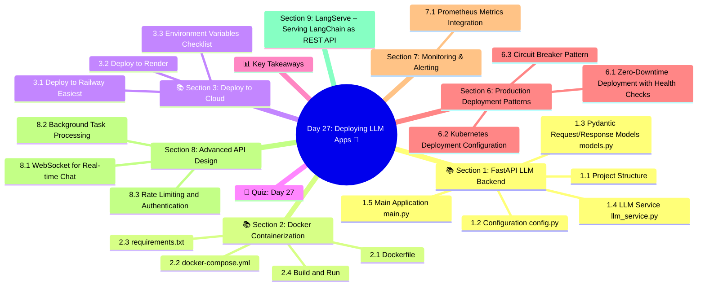

# Day 27: Deploying LLM Apps 🚀
### Week 4 — AI Agents & Production Systems

---

## 🧠 Concept Map




---

## 🎯 Learning Objectives

By the end of today, you will:
- Build a production FastAPI backend for your LLM app
- Containerize with Docker
- Add streaming chat endpoints
- Implement rate limiting, authentication, and error handling
- Deploy to cloud platforms (Railway, Render, or GCP)

**Estimated Time:** 4–4.5 hours  
**Difficulty:** ⭐⭐⭐⭐ Advanced  
**Prerequisites:** Day 22 (Agents), Day 26 (MLOps)

---

## 📚 Section 1: FastAPI LLM Backend

### 1.1 Project Structure

```
llm-api/
├── Dockerfile
├── docker-compose.yml
├── requirements.txt
├── .env
└── app/
    ├── main.py          ← FastAPI app + routes
    ├── models.py        ← Pydantic request/response schemas
    ├── llm_service.py   ← LLM interaction logic
    ├── auth.py          ← API key authentication
    └── config.py        ← App settings
```

### 1.2 Configuration (config.py)

```python
# app/config.py
from pydantic_settings import BaseSettings

class Settings(BaseSettings):
    openai_api_key: str
    app_title: str = "GenAI API"
    app_version: str = "1.0.0"
    max_tokens: int = 2000
    rate_limit_per_minute: int = 60
    valid_api_keys: str = "key1,key2,key3"  # Comma-separated
    
    class Config:
        env_file = ".env"

settings = Settings()
```

### 1.3 Pydantic Request/Response Models (models.py)

```python
# app/models.py
from pydantic import BaseModel, Field
from typing import Optional, Literal
from datetime import datetime

class ChatMessage(BaseModel):
    role: Literal["user", "assistant", "system"]
    content: str

class ChatRequest(BaseModel):
    messages: list[ChatMessage]
    model: str = "gpt-4o-mini"
    temperature: float = Field(default=0.7, ge=0.0, le=2.0)
    max_tokens: int = Field(default=1000, ge=1, le=4096)
    stream: bool = False

class ChatResponse(BaseModel):
    id: str
    content: str
    model: str
    usage: dict
    created_at: datetime = Field(default_factory=datetime.utcnow)

class RAGRequest(BaseModel):
    question: str = Field(..., min_length=1, max_length=2000)
    session_id: Optional[str] = None
    k: int = Field(default=5, ge=1, le=20, description="Number of documents to retrieve")

class HealthResponse(BaseModel):
    status: str
    version: str
    timestamp: datetime = Field(default_factory=datetime.utcnow)

class ErrorResponse(BaseModel):
    error: str
    detail: Optional[str] = None
    code: int
```

### 1.4 LLM Service (llm_service.py)

```python
# app/llm_service.py
from openai import AsyncOpenAI
from langchain_openai import ChatOpenAI
from langchain_community.vectorstores import Chroma
from langchain_community.embeddings import HuggingFaceEmbeddings
from langchain_core.prompts import ChatPromptTemplate
from langchain_core.output_parsers import StrOutputParser
from app.config import settings
from typing import AsyncGenerator
import uuid

class LLMService:
    def __init__(self):
        self.async_client = AsyncOpenAI(api_key=settings.openai_api_key)
        self.sync_llm = ChatOpenAI(
            model="gpt-4o-mini",
            openai_api_key=settings.openai_api_key,
            temperature=0
        )
        self._init_vectorstore()
    
    def _init_vectorstore(self):
        """Initialize vector store for RAG"""
        embeddings = HuggingFaceEmbeddings(model_name="all-MiniLM-L6-v2")
        try:
            self.vectorstore = Chroma(
                persist_directory="./db",
                embedding_function=embeddings
            )
            self._rag_available = self.vectorstore._collection.count() > 0
        except Exception:
            self._rag_available = False
    
    async def chat(self, messages: list[dict], model: str, temperature: float, max_tokens: int) -> dict:
        """Non-streaming chat completion"""
        response = await self.async_client.chat.completions.create(
            model=model,
            messages=messages,
            temperature=temperature,
            max_tokens=max_tokens
        )
        return {
            "id": f"chatcmpl-{uuid.uuid4().hex[:8]}",
            "content": response.choices[0].message.content,
            "model": model,
            "usage": {
                "prompt_tokens": response.usage.prompt_tokens,
                "completion_tokens": response.usage.completion_tokens,
                "total_tokens": response.usage.total_tokens
            }
        }
    
    async def chat_stream(self, messages: list[dict], model: str, temperature: float) -> AsyncGenerator[str, None]:
        """Streaming chat completion — yields SSE chunks"""
        stream = await self.async_client.chat.completions.create(
            model=model,
            messages=messages,
            temperature=temperature,
            stream=True
        )
        async for chunk in stream:
            delta = chunk.choices[0].delta
            if delta.content:
                yield f"data: {delta.content}\n\n"
        yield "data: [DONE]\n\n"
    
    def rag_answer(self, question: str, session_id: str = None) -> dict:
        """Answer a question using RAG"""
        if not self._rag_available:
            return {"answer": "No documents indexed. Please upload documents first.", "sources": []}
        
        retriever = self.vectorstore.as_retriever(search_kwargs={"k": 5})
        docs = retriever.invoke(question)
        
        context = "\n\n".join([d.page_content for d in docs])
        
        prompt = ChatPromptTemplate.from_template(
            "Answer based ONLY on this context:\n\n{context}\n\nQuestion: {question}"
        )
        chain = prompt | self.sync_llm | StrOutputParser()
        answer = chain.invoke({"context": context, "question": question})
        
        sources = list({(d.metadata.get("filename", "?"), d.metadata.get("page", 0)) for d in docs})
        
        return {
            "answer": answer,
            "sources": [{"file": s[0], "page": s[1]+1} for s in sources]
        }

# Singleton
llm_service = LLMService()
```

### 1.5 Main Application (main.py)

```python
# app/main.py
from fastapi import FastAPI, HTTPException, Depends, Request
from fastapi.responses import StreamingResponse, JSONResponse
from fastapi.middleware.cors import CORSMiddleware
from fastapi.security import HTTPBearer, HTTPAuthorizationCredentials
from slowapi import Limiter, _rate_limit_exceeded_handler
from slowapi.util import get_remote_address
from slowapi.errors import RateLimitExceeded
from datetime import datetime
import logging

from app.models import ChatRequest, ChatResponse, RAGRequest, HealthResponse, ErrorResponse
from app.llm_service import llm_service
from app.config import settings

# ── Logging ────────────────────────────────────────────────
logging.basicConfig(level=logging.INFO, format="%(asctime)s | %(levelname)s | %(message)s")
logger = logging.getLogger(__name__)

# ── Rate Limiting ──────────────────────────────────────────
limiter = Limiter(key_func=get_remote_address)

# ── App Setup ──────────────────────────────────────────────
app = FastAPI(
    title=settings.app_title,
    version=settings.app_version,
    description="Production-ready LLM API"
)
app.state.limiter = limiter
app.add_exception_handler(RateLimitExceeded, _rate_limit_exceeded_handler)

app.add_middleware(
    CORSMiddleware,
    allow_origins=["*"],
    allow_credentials=True,
    allow_methods=["*"],
    allow_headers=["*"],
)

# ── Authentication ─────────────────────────────────────────
security = HTTPBearer()
VALID_KEYS = set(settings.valid_api_keys.split(","))

def verify_api_key(credentials: HTTPAuthorizationCredentials = Depends(security)):
    if credentials.credentials not in VALID_KEYS:
        raise HTTPException(status_code=401, detail="Invalid API key")
    return credentials.credentials

# ── Exception Handler ──────────────────────────────────────
@app.exception_handler(Exception)
async def global_exception_handler(request: Request, exc: Exception):
    logger.exception(f"Unhandled error: {exc}")
    return JSONResponse(
        status_code=500,
        content=ErrorResponse(error="Internal server error", code=500).dict()
    )

# ── Routes ─────────────────────────────────────────────────
@app.get("/health", response_model=HealthResponse)
async def health_check():
    return HealthResponse(status="healthy", version=settings.app_version)

@app.post("/v1/chat", response_model=ChatResponse)
@limiter.limit(f"{settings.rate_limit_per_minute}/minute")
async def chat(
    request: Request,
    body: ChatRequest,
    _: str = Depends(verify_api_key)
):
    """Main chat endpoint — supports streaming and non-streaming"""
    logger.info(f"Chat request: {len(body.messages)} messages, model={body.model}")
    
    messages = [m.dict() for m in body.messages]
    
    if body.stream:
        return StreamingResponse(
            llm_service.chat_stream(messages, body.model, body.temperature),
            media_type="text/event-stream"
        )
    
    result = await llm_service.chat(messages, body.model, body.temperature, body.max_tokens)
    return ChatResponse(**result)

@app.post("/v1/rag/query")
@limiter.limit("30/minute")
async def rag_query(
    request: Request,
    body: RAGRequest,
    _: str = Depends(verify_api_key)
):
    """RAG question-answering endpoint"""
    result = llm_service.rag_answer(body.question, body.session_id)
    return result

@app.get("/v1/models")
async def list_models(_: str = Depends(verify_api_key)):
    """List available models"""
    return {"models": ["gpt-4o-mini", "gpt-4o", "gpt-3.5-turbo"]}
```

---

## 📚 Section 2: Docker Containerization

### 2.1 Dockerfile

```dockerfile
# Dockerfile
FROM python:3.11-slim

WORKDIR /app

# Install dependencies first (layer caching)
COPY requirements.txt .
RUN pip install --no-cache-dir -r requirements.txt

# Copy app code
COPY . .

# Create non-root user for security
RUN useradd -m appuser && chown -R appuser /app
USER appuser

EXPOSE 8000

# Health check
HEALTHCHECK --interval=30s --timeout=10s --start-period=5s --retries=3 \
  CMD curl -f http://localhost:8000/health || exit 1

CMD ["uvicorn", "app.main:app", "--host", "0.0.0.0", "--port", "8000", "--workers", "2"]
```

### 2.2 docker-compose.yml

```yaml
# docker-compose.yml
version: "3.9"

services:
  api:
    build: .
    ports:
      - "8000:8000"
    environment:
      - OPENAI_API_KEY=${OPENAI_API_KEY}
      - VALID_API_KEYS=${VALID_API_KEYS:-key1,key2,key3}
    volumes:
      - ./db:/app/db  # Persist ChromaDB
    restart: unless-stopped
    deploy:
      resources:
        limits:
          memory: 512M
```

### 2.3 requirements.txt

```
fastapi==0.115.0
uvicorn[standard]==0.30.0
pydantic==2.7.0
pydantic-settings==2.3.0
openai==1.35.0
langchain==0.2.0
langchain-openai==0.1.15
langchain-community==0.2.0
chromadb==0.5.0
sentence-transformers==3.0.0
slowapi==0.1.9
python-dotenv==1.0.0
httpx==0.27.0
```

### 2.4 Build and Run

```bash
# Local development
pip install -r requirements.txt
uvicorn app.main:app --reload --port 8000

# Docker
docker build -t llm-api .
docker run -p 8000:8000 --env-file .env llm-api

# Docker Compose
docker-compose up -d
docker-compose logs -f

# Test
curl http://localhost:8000/health
curl -X POST http://localhost:8000/v1/chat \
  -H "Authorization: Bearer key1" \
  -H "Content-Type: application/json" \
  -d '{"messages": [{"role": "user", "content": "What is RAG?"}]}'
```

---

## 📚 Section 3: Deploy to Cloud

### 3.1 Deploy to Railway (Easiest)

```bash
# Install Railway CLI
npm install -g @railway/cli
railway login

# Deploy from current directory
railway init
railway up

# Set environment variables
railway variables set OPENAI_API_KEY=your_key
railway variables set VALID_API_KEYS=prod_key1,prod_key2

# Open dashboard
railway open
```

### 3.2 Deploy to Render

```yaml
# render.yaml
services:
  - type: web
    name: llm-api
    env: docker
    dockerfilePath: ./Dockerfile
    plan: starter
    envVars:
      - key: OPENAI_API_KEY
        sync: false  # Set in Render dashboard
      - key: VALID_API_KEYS
        sync: false
```

```bash
# Connect repo to Render.com → New Web Service → Docker
# Or via CLI:
render deploy --service-id srv_xxxxx
```

### 3.3 Environment Variables Checklist

```bash
# Required
OPENAI_API_KEY=sk-...
VALID_API_KEYS=key1,key2

# Optional
RATE_LIMIT_PER_MINUTE=60
MAX_TOKENS=2000
APP_TITLE=My GenAI API
```

---

## 🧠 Quiz: Day 27

**Q1:** Why use `AsyncOpenAI` instead of `OpenAI` in FastAPI apps?
- A) AsyncOpenAI is cheaper to use
- B) **Async I/O allows handling multiple concurrent requests without blocking ✅**
- C) AsyncOpenAI supports more models
- D) It's required for Docker deployments

**Q2:** What does `HTTPBearer` in FastAPI do?
- A) Sets response headers
- B) **Extracts the Bearer token from the Authorization header for validation ✅**
- C) Encrypts the request body
- D) Adds HTTPS support

**Q3:** The Docker `HEALTHCHECK` instruction:
- A) Validates code syntax
- B) Runs unit tests on startup
- C) **Periodically checks if the container is healthy and restarts if not ✅**
- D) Monitors CPU usage

**Q4:** Rate limiting with `slowapi` protects against:
- A) SQL injection
- B) **API abuse, cost runaway, and DDoS attacks ✅**
- C) Memory leaks
- D) Model hallucinations

---

## 📊 Key Takeaways

| Component | Technology | Purpose |
|-----------|-----------|---------|
| **Framework** | FastAPI | High-performance async Python API |
| **Auth** | Bearer tokens | Protect endpoints from unauthorized use |
| **Rate Limiting** | slowapi | Prevent abuse and cost overruns |
| **Containerization** | Docker | Consistent, reproducible deployments |
| **Orchestration** | docker-compose | Local multi-container apps |
| **Cloud Deploy** | Railway/Render | Managed hosting without DevOps expertise |

---

*Day 27 Complete ✅ | GenAI Course — Week 4 | Next: Day 28 — Safety, Ethics & Responsible AI*


---

## Section 6: Production Deployment Patterns

### 6.1 Zero-Downtime Deployment with Health Checks

```python
from fastapi import FastAPI, Response
from contextlib import asynccontextmanager
from langchain_openai import ChatOpenAI
from langchain_community.vectorstores import Chroma
from langchain_openai import OpenAIEmbeddings
import asyncio, time

# Application state
class AppState:
    llm: ChatOpenAI = None
    vectorstore: Chroma = None
    startup_time: float = None
    request_count: int = 0
    error_count: int = 0
    is_healthy: bool = False

state = AppState()

@asynccontextmanager
async def lifespan(app: FastAPI):
    """Startup and shutdown lifecycle"""
    print("Starting application...")
    start = time.time()
    
    try:
        # Initialize models (with retries)
        for attempt in range(3):
            try:
                state.llm = ChatOpenAI(model="gpt-4o-mini", temperature=0)
                state.vectorstore = Chroma(
                    embedding_function=OpenAIEmbeddings(model="text-embedding-3-small"),
                    collection_name="production_kb",
                    persist_directory="./chroma_prod"
                )
                state.startup_time = time.time() - start
                state.is_healthy = True
                print(f"Ready in {state.startup_time:.2f}s")
                break
            except Exception as e:
                if attempt == 2:
                    raise
                print(f"Init failed (attempt {attempt+1}): {e}. Retrying...")
                await asyncio.sleep(2 ** attempt)
        
        yield  # App runs here
        
    finally:
        # Graceful shutdown
        print("Shutting down gracefully...")
        state.is_healthy = False
        await asyncio.sleep(0.5)  # Allow in-flight requests to complete
        print("Shutdown complete")

app = FastAPI(lifespan=lifespan, title="GenAI API", version="1.0.0")

@app.get("/health")
async def health_check():
    """Kubernetes/load balancer health check endpoint"""
    if not state.is_healthy or state.llm is None:
        return Response(
            content='{"status": "unhealthy"}',
            status_code=503,
            media_type="application/json"
        )
    
    return {
        "status": "healthy",
        "uptime_seconds": time.time() - (state.startup_time or 0),
        "requests_served": state.request_count,
        "error_rate": state.error_count / max(state.request_count, 1)
    }

@app.get("/ready")
async def readiness_check():
    """Kubernetes readiness probe — is app ready to serve traffic?"""
    if state.is_healthy and state.llm and state.vectorstore:
        return {"ready": True}
    return Response(content='{"ready": false}', status_code=503, media_type="application/json")
```

### 6.2 Kubernetes Deployment Configuration

```yaml
# deployment.yaml
apiVersion: apps/v1
kind: Deployment
metadata:
  name: genai-api
  labels:
    app: genai-api
    version: "1.0.0"
spec:
  replicas: 3
  selector:
    matchLabels:
      app: genai-api
  strategy:
    type: RollingUpdate
    rollingUpdate:
      maxSurge: 1
      maxUnavailable: 0  # Zero downtime
  template:
    metadata:
      labels:
        app: genai-api
    spec:
      containers:
      - name: api
        image: your-registry/genai-api:latest
        ports:
        - containerPort: 8000
        env:
        - name: OPENAI_API_KEY
          valueFrom:
            secretKeyRef:
              name: openai-secrets
              key: api-key
        resources:
          requests:
            cpu: "250m"
            memory: "512Mi"
          limits:
            cpu: "1000m"
            memory: "2Gi"
        livenessProbe:
          httpGet:
            path: /health
            port: 8000
          initialDelaySeconds: 30
          periodSeconds: 10
          failureThreshold: 3
        readinessProbe:
          httpGet:
            path: /ready
            port: 8000
          initialDelaySeconds: 20
          periodSeconds: 5
```

### 6.3 Circuit Breaker Pattern

```python
import asyncio, time
from enum import Enum
from typing import Callable, Any

class CircuitState(Enum):
    CLOSED = "closed"    # Normal — requests flow through
    OPEN = "open"        # Tripped — all requests fail fast
    HALF_OPEN = "half_open"  # Testing — allow one request through

class CircuitBreaker:
    """
    Prevents cascading failures during external service outages.
    Pattern: CLOSED → OPEN (on failure) → HALF_OPEN (after timeout) → CLOSED (if success)
    """
    
    def __init__(
        self,
        failure_threshold: int = 5,
        reset_timeout: float = 60.0,
        success_threshold: int = 2
    ):
        self.failure_threshold = failure_threshold
        self.reset_timeout = reset_timeout
        self.success_threshold = success_threshold
        
        self.state = CircuitState.CLOSED
        self.failure_count = 0
        self.success_count = 0
        self.last_failure_time = None
    
    async def call(self, func: Callable, *args, **kwargs) -> Any:
        if self.state == CircuitState.OPEN:
            # Check if we should try again
            if time.time() - self.last_failure_time > self.reset_timeout:
                self.state = CircuitState.HALF_OPEN
                print("Circuit: OPEN → HALF_OPEN")
            else:
                raise Exception(f"Circuit OPEN. Retry in {self.reset_timeout - (time.time() - self.last_failure_time):.0f}s")
        
        try:
            result = await func(*args, **kwargs) if asyncio.iscoroutinefunction(func) else func(*args, **kwargs)
            
            if self.state == CircuitState.HALF_OPEN:
                self.success_count += 1
                if self.success_count >= self.success_threshold:
                    self.state = CircuitState.CLOSED
                    self.failure_count = 0
                    self.success_count = 0
                    print("Circuit: HALF_OPEN → CLOSED (service recovered!)")
            
            return result
        
        except Exception as e:
            self.failure_count += 1
            self.last_failure_time = time.time()
            
            if self.failure_count >= self.failure_threshold:
                self.state = CircuitState.OPEN
                print(f"Circuit: CLOSED → OPEN ({self.failure_count} failures)")
            
            raise

# Usage
llm_circuit = CircuitBreaker(failure_threshold=3, reset_timeout=30)

async def call_llm_safely(prompt: str) -> str:
    from openai import AsyncOpenAI
    async_client = AsyncOpenAI()
    
    async def _call():
        response = await async_client.chat.completions.create(
            model="gpt-4o-mini",
            messages=[{"role": "user", "content": prompt}]
        )
        return response.choices[0].message.content
    
    return await llm_circuit.call(_call)
```

---

## Section 7: Monitoring & Alerting

### 7.1 Prometheus Metrics Integration

```python
from fastapi import FastAPI, Request
from prometheus_client import Counter, Histogram, Gauge, generate_latest, CONTENT_TYPE_LATEST
from starlette.responses import Response
import time

# Define metrics
REQUEST_COUNT = Counter(
    "genai_requests_total",
    "Total number of requests",
    ["method", "endpoint", "status"]
)

REQUEST_LATENCY = Histogram(
    "genai_request_latency_seconds",
    "Request latency in seconds",
    ["endpoint"],
    buckets=[0.1, 0.5, 1.0, 2.0, 5.0, 10.0, 30.0]
)

LLM_TOKEN_USAGE = Counter(
    "genai_llm_tokens_total",
    "Total LLM tokens used",
    ["model", "token_type"]
)

ACTIVE_SESSIONS = Gauge(
    "genai_active_sessions",
    "Number of active user sessions"
)

LLM_COST_USD = Counter(
    "genai_llm_cost_usd_total",
    "Total estimated LLM cost in USD",
    ["model"]
)

app = FastAPI()

@app.middleware("http")
async def track_metrics(request: Request, call_next):
    start = time.time()
    response = await call_next(request)
    latency = time.time() - start
    
    REQUEST_COUNT.labels(
        method=request.method,
        endpoint=request.url.path,
        status=response.status_code
    ).inc()
    
    REQUEST_LATENCY.labels(endpoint=request.url.path).observe(latency)
    
    return response

@app.get("/metrics")
async def metrics():
    """Prometheus scrape endpoint"""
    return Response(generate_latest(), media_type=CONTENT_TYPE_LATEST)

def track_llm_usage(model: str, input_tokens: int, output_tokens: int):
    """Call this after each LLM response"""
    LLM_TOKEN_USAGE.labels(model=model, token_type="input").inc(input_tokens)
    LLM_TOKEN_USAGE.labels(model=model, token_type="output").inc(output_tokens)
    
    # Track cost
    costs = {"gpt-4o-mini": (0.00015, 0.0006), "gpt-4o": (0.005, 0.015)}
    if model in costs:
        input_cost, output_cost = costs[model]
        LLM_COST_USD.labels(model=model).inc(
            input_tokens * input_cost / 1000 + output_tokens * output_cost / 1000
        )
```

---

*Day 27 Extended Complete — Kubernetes deployment, circuit breaker, Prometheus monitoring*


---

## Section 8: Advanced API Design

### 8.1 WebSocket for Real-time Chat

```python
from fastapi import FastAPI, WebSocket, WebSocketDisconnect
from langchain_openai import ChatOpenAI
from langchain_core.prompts import ChatPromptTemplate, MessagesPlaceholder
from langchain_core.output_parsers import StrOutputParser
from langchain_community.chat_message_histories import ChatMessageHistory
from langchain_core.messages import HumanMessage, AIMessage
import json, asyncio

app = FastAPI()

class ConnectionManager:
    """Manage multiple WebSocket connections"""
    
    def __init__(self):
        self.active: dict[str, WebSocket] = {}
    
    async def connect(self, session_id: str, ws: WebSocket):
        await ws.accept()
        self.active[session_id] = ws
        print(f"Client {session_id} connected. Active: {len(self.active)}")
    
    def disconnect(self, session_id: str):
        self.active.pop(session_id, None)
        print(f"Client {session_id} disconnected")
    
    async def send(self, session_id: str, message: str):
        if session_id in self.active:
            await self.active[session_id].send_text(message)

manager = ConnectionManager()
sessions: dict[str, ChatMessageHistory] = {}

llm = ChatOpenAI(model="gpt-4o-mini", temperature=0.7, streaming=True)

@app.websocket("/ws/chat/{session_id}")
async def websocket_chat(ws: WebSocket, session_id: str):
    await manager.connect(session_id, ws)
    
    if session_id not in sessions:
        sessions[session_id] = ChatMessageHistory()
    
    history = sessions[session_id]
    
    try:
        while True:
            # Receive message from client
            data = await ws.receive_text()
            msg = json.loads(data)
            user_message = msg.get("message", "")
            
            if not user_message:
                continue
            
            history.add_user_message(user_message)
            
            # Send typing indicator
            await manager.send(session_id, json.dumps({"type": "typing", "session": session_id}))
            
            # Build context and generate response with streaming
            prompt = ChatPromptTemplate.from_messages([
                ("system", "You are a helpful AI assistant."),
                MessagesPlaceholder("history"),
                ("human", "{input}")
            ])
            
            chain = prompt | llm | StrOutputParser()
            full_response = ""
            
            async for chunk in chain.astream({
                "history": history.messages[:-1],
                "input": user_message
            }):
                full_response += chunk
                # Stream each token to the client
                await manager.send(session_id, json.dumps({
                    "type": "token",
                    "content": chunk
                }))
            
            history.add_ai_message(full_response)
            
            # Signal completion
            await manager.send(session_id, json.dumps({
                "type": "done",
                "full_response": full_response
            }))
    
    except WebSocketDisconnect:
        manager.disconnect(session_id)
    except Exception as e:
        await manager.send(session_id, json.dumps({"type": "error", "message": str(e)}))
        manager.disconnect(session_id)
```

### 8.2 Background Task Processing

```python
from fastapi import FastAPI, BackgroundTasks
from langchain_openai import ChatOpenAI
from langchain_core.prompts import ChatPromptTemplate
from langchain_core.output_parsers import StrOutputParser
import uuid, asyncio, time
from enum import Enum
from typing import Optional
from pydantic import BaseModel

app = FastAPI()
llm = ChatOpenAI(model="gpt-4o-mini")

class TaskStatus(str, Enum):
    PENDING = "pending"
    RUNNING = "running"
    COMPLETED = "completed"
    FAILED = "failed"

class AsyncTask(BaseModel):
    task_id: str
    status: TaskStatus
    created_at: float
    completed_at: Optional[float] = None
    result: Optional[str] = None
    error: Optional[str] = None

tasks: dict[str, AsyncTask] = {}

async def run_long_llm_task(task_id: str, prompt: str):
    """Background task for long-running LLM operations"""
    tasks[task_id].status = TaskStatus.RUNNING
    
    try:
        chain = ChatPromptTemplate.from_template("{prompt}") | llm | StrOutputParser()
        result = await asyncio.to_thread(chain.invoke, {"prompt": prompt})
        
        tasks[task_id].status = TaskStatus.COMPLETED
        tasks[task_id].result = result
        tasks[task_id].completed_at = time.time()
    except Exception as e:
        tasks[task_id].status = TaskStatus.FAILED
        tasks[task_id].error = str(e)
        tasks[task_id].completed_at = time.time()

@app.post("/tasks/create")
async def create_task(prompt: str, background_tasks: BackgroundTasks):
    task_id = str(uuid.uuid4())[:8]
    
    task = AsyncTask(
        task_id=task_id,
        status=TaskStatus.PENDING,
        created_at=time.time()
    )
    tasks[task_id] = task
    
    # Queue as background task
    background_tasks.add_task(run_long_llm_task, task_id, prompt)
    
    return {"task_id": task_id, "status": "pending", "check_status_at": f"/tasks/{task_id}"}

@app.get("/tasks/{task_id}")
async def get_task_status(task_id: str):
    if task_id not in tasks:
        return {"error": "Task not found"}
    return tasks[task_id]
```

### 8.3 Rate Limiting and Authentication

```python
from fastapi import FastAPI, Request, HTTPException, Depends
from fastapi.security import HTTPBearer, HTTPAuthorizationCredentials
import time, hashlib, hmac, os
from collections import defaultdict, deque

app = FastAPI()
security = HTTPBearer()

# Simple API key auth
VALID_API_KEYS = {"key_prod_001": "customer_A", "key_prod_002": "customer_B"}

def verify_api_key(credentials: HTTPAuthorizationCredentials = Depends(security)) -> str:
    """Validate Bearer token API key"""
    token = credentials.credentials
    customer = VALID_API_KEYS.get(token)
    if not customer:
        raise HTTPException(status_code=401, detail="Invalid API key")
    return customer

# Token bucket rate limiter
class TokenBucketLimiter:
    def __init__(self, requests_per_minute: int = 60):
        self.rpm = requests_per_minute
        self.tokens: dict[str, deque] = defaultdict(deque)
    
    def is_allowed(self, client_id: str) -> bool:
        now = time.time()
        window = self.tokens[client_id]
        
        # Remove requests older than 60 seconds
        while window and window[0] < now - 60:
            window.popleft()
        
        if len(window) < self.rpm:
            window.append(now)
            return True
        return False

limiter = TokenBucketLimiter(requests_per_minute=20)

@app.get("/protected-endpoint")
async def protected(
    request: Request,
    customer: str = Depends(verify_api_key)
):
    if not limiter.is_allowed(customer):
        raise HTTPException(
            status_code=429,
            detail="Rate limit exceeded (20 requests/minute)",
            headers={"Retry-After": "60"}
        )
    return {"customer": customer, "message": "Success!"}
```

---

## Section 9: LangServe – Serving LangChain as REST API

```python
from fastapi import FastAPI
from langserve import add_routes
from langchain_openai import ChatOpenAI
from langchain_core.prompts import ChatPromptTemplate
from langchain_core.output_parsers import StrOutputParser
from pydantic import BaseModel

app = FastAPI(title="LangServe GenAI API", version="1.0.0")

# Define the chain
llm = ChatOpenAI(model="gpt-4o-mini")

chain = (
    ChatPromptTemplate.from_template("Answer this question: {question}")
    | llm
    | StrOutputParser()
)

# Add LangServe routes — creates /chain/invoke, /chain/stream, /chain/batch automatically
add_routes(
    app,
    chain,
    path="/chain",
    input_type=str,
    output_type=str
)

# Custom input model for better validation
class QAInput(BaseModel):
    question: str
    context: str = ""

qa_chain = (
    ChatPromptTemplate.from_messages([
        ("system", "Answer based on context: {context}"),
        ("human", "{question}")
    ])
    | llm
    | StrOutputParser()
)

add_routes(app, qa_chain, path="/qa")

# Run: uvicorn app:app --host 0.0.0.0 --port 8000
# Then: POST /chain/invoke with {"input": "What is RAG?"}
# Or:   GET /chain/playground for interactive UI

print("LangServe routes:")
print("  POST /chain/invoke     - single invocation")
print("  POST /chain/stream     - streaming SSE")
print("  POST /chain/batch      - batch invocation")
print("  GET  /chain/playground - interactive playground UI")
```

---

*Day 27 Second Pass Complete — WebSockets, background tasks, rate limiting, LangServe*
