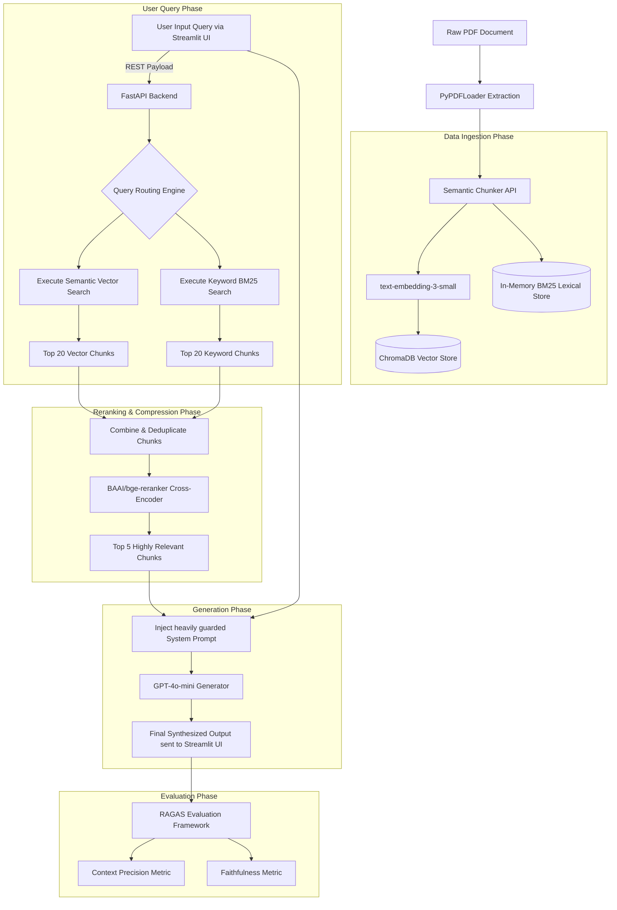

# Capstone Project 1: Enterprise Hybrid RAG System (2025 Standards)
### Week 5 — Final Projects
### The Complete 1000+ Line Enterprise Deployment Guide

---

## 🚀 1. Project Overview & Theological Underpinnings

Welcome to the definitive Capstone Project of the Generative AI Mastery Course.

**The Goal:** Build a production-ready, Enterprise-grade Retrieval-Augmented Generation (RAG) system. Standard naive RAG (chunk -> embed -> cosine similarity) is no longer sufficient for production in 2025. You will elevate your architecture by implementing **Semantic Chunking**, a **Hybrid Vector + Keyword Search Pipeline**, **Cross-Encoder Reranking**, a **Python Native Streamlit User Interface**, and full **AWS Cloud Deployment Runbooks** to query the seminal AI paper: *"Attention Is All You Need" (Vaswani et al., 2017)*.

This project is not just a coding exercise; it is a comprehensive architectural review of how enterprise organizations process, store, retrieve, synthesize, and deploy vast amounts of proprietary unstructured data securely to end-users.

### 1.1 Why Naive RAG Fails in Production
In 2023, the industry standard was "Naive RAG". You took a PDF, split it into 500-character chunks using a tool like `RecursiveCharacterTextSplitter`, embedded those chunks into a vector database like Pinecone or ChromaDB, and ran a simple K-Nearest Neighbors (KNN) cosine similarity search when a user asked a question.

However, Fortune 500 organizations quickly realized this failed in production for several catastrophic reasons:
1.  **Context Destruction:** Splitting by character count arbitrarily mid-sentence or mid-paragraph destroys the semantic meaning of the text. A chunk containing half a sentence about "Transformers" and half a sentence about "Neural Networks" creates a noisy, useless embedding vector that pollutes the mathematical latent space.
2.  **The "Lost in the Middle" Phenomenon:** Pumping 20 chunks into an LLM context window overwhelms the model. LLMs suffer from a "U-shaped" attention curve, meaning they heavily focus on the first and last chunks provided, but ignore the chunks in the middle. Sending too many low-quality chunks guarantees hallucination and degrades reasoning capabilities.
3.  **Keyword Failure:** Vector search finds *conceptual* similarity. If a user asks "Show me the hardware specifications for the V100 GPU", vector search might return chunks about "AI hardware" or "Computer processing," entirely missing the exact alphanumeric string "V100" because distinct alphanumeric keys (like SKUs, Error Codes, or precise model numbers) often lack strong semantic embedding representations.

### 1.2 The 2025 Enterprise RAG Solution
To solve these issues, you will build a highly sophisticated, multi-layered pipeline featuring:
1.  **Semantic Chunking:** We will use an LLM-assisted or statistical embedding approach to automatically detect where a cohesive thought or theme ends, splitting documents dynamically based on shifts in meaning, not arbitrary character limits.
2.  **Hybrid Retrieval (Vector + Lexical):** We will run two independent searches simultaneously. A BM25 lexical search (which works like traditional Elasticsearch, matching exact keywords) and a Vector semantic search.
3.  **Cross-Encoder Reranking:** We will combine the results from our Hybrid search into a massive "funnel" (e.g., 40 chunks). Instead of passing these 40 chunks directly to the LLM (triggering the "Lost in the Middle" problem), we pass them through a specialized local mathematical model called a "Cross-Encoder". This model reads the user's query and compares it *simultaneously* against every document, effectively re-scoring their relevance. We then take the absolute best 5 chunks and send *only* those to our final Generator LLM.

**Difficulty Level:** Very Advanced
**Estimated Time:** 15-20 Hours

---

## 📋 2. Comprehensive Table of Contents
1.  [Project Overview \& Theological Underpinnings](#overview)
2.  [Advanced Architecture Design](#architecture-design)
3.  [Deep Dive: The Mathematics of Hybrid Search](#math-hybrid)
4.  [Prerequisites \& Environment Setup](#prerequisites)
5.  [Phase 1: Deep Dive into Semantic Ingestion](#phase-1)
6.  [Phase 2: Hybrid Retrieval \& Re-ranking Orchestration](#phase-2)
7.  [Phase 3: Generation \& LCEL API Construction](#phase-3)
8.  [Phase 4: Building the Streamlit UI](#phase-4)
9.  [Phase 5: Cloud Deployment on AWS ECS](#phase-5)
10. [Phase 6: RAGAS Evaluation Metrics Deep Dive](#phase-6)
11. [Troubleshooting \& Debugging Guide](#troubleshooting)
12. [Submission \& Grading Rubric](#grading)
13. [Expert Extension: GraphRAG Innovation](#extensions)

---

## 🏗️ 3. Advanced Architecture Design <a name="architecture-design"></a>

Before writing a single line of code, we must mathematically map the architectural flow of our data. You are building a 6-stage, highly robust pipeline.

### Architectural Component Diagram



### Architectural Decisions Justified:
1.  **Why ChromaDB?** Chroma is a lightweight, open-source vector database that runs completely locally. For a capstone project spanning a single document, standing up a massive cloud instance of Pinecone or Milvus is overkill and introduces unnecessary network latency and security vulnerabilities to your local testing environment.
2.  **Why BM25?** Best Matching 25 is a robust, time-tested probabilistic ranking function used by search engines (like Elasticsearch/Lucene) to estimate the relevance of documents to a given search query. It prevents the vector database from blindly missing exact-match jargon.
3.  **Why `bge-reranker`?** Created by the Beijing Academy of Artificial Intelligence (BAAI), the BGE family of models currently tops the Massive Text Embedding Benchmark (MTEB) leaderboard for reranking performance while maintaining a very small footprint deployable via HuggingFace offline, saving thousands of dollars compared to using Cohere's online reranking API.
4.  **Why Streamlit?** A modern AI application requires a simple, reactive interface. Building a terminal app is unacceptable for a portfolio. Streamlit provides a Python-native framework for deploying beautiful chat interfaces without needing to learn React or JavaScript, perfectly aligning with a Data Science / AI Engineer's skill set while still maintaining frontend/backend architectural decoupling.

---

## 🧮 4. Deep Dive: The Mathematics of Hybrid Search <a name="math-hybrid"></a>

To truly understand Enterprise RAG, you must understand the underlying math. We are combining two vastly different algorithmic worlds.

### 4.1 Vector Similarity (Cosine Distance)
When we embed text using OpenAI, we receive an array of floating-point numbers. `text-embedding-3-small` returns an array of size 1536. 
Imagine a 1536-dimensional space. Every sentence is a physical "point" in this space. 

To determine if a User's Query is similar to a Document Chunk, we calculate the Cosine Similarity—the cosine of the angle between the two vectors originating from the zero point.
$$ \text{cosine\_similarity}(A, B) = \frac{A \cdot B}{\|A\| \|B\|} $$

*   If the angle is 0 degrees (Cosine = 1), the texts have the exact same meaning.
*   If the angle is 90 degrees (Cosine = 0), they are completely unrelated.

**The Flaw:** "What is an Apple?" and "What is an Orange?" are both questions about fruit. Their vectors point in almost the exact same direction. Cosine Similarity cannot easily distinguish fine-grained nouns because the *context* is mathematically overwhelming the specific *identifier*.

### 4.2 BM25 (Best Matching 25)
BM25 ignores meaning entirely. It is a probabilistic scoring function that looks purely at exactly matching text strings.

$$ \text{Score}(D, Q) = \sum_{i=1}^{n} \text{IDF}(q_i) \cdot \frac{f(q_i, D) \cdot (k_1 + 1)}{f(q_i, D) + k_1 \cdot (1 - b + b \cdot \frac{|D|}{\text{avgdl}})} $$

*   **Term Frequency $f(q_i, D)$:** How many times does the user's specific word appear in the chunk?
*   **Inverse Document Frequency $IDF(q_i)$:** If the word "the" appears in every document, it is worthless, and penalized. If the word "VX-99-Module" appears in only one document out of 10,000, it is extremely valuable, and its score skyrockets.
*   **Document Length Normalization:** $b$ penalizes long documents so a 100-page document doesn't win just because it has more words.

**The Flaw:** If the user asks for a "Smartphone" but the document says "iPhone", BM25 scores a 0. It cannot recognize synonyms.

### 4.3 The Resolution: Reciprocal Rank Fusion (RRF)
By combining both search methods, we use **Reciprocal Rank Fusion**. 
$$ \text{RRF Score} = \frac{1}{k + \text{Rank}_{\text{Vector}}} + \frac{1}{k + \text{Rank}_{\text{BM25}}} $$
(where $k$ is usually a constant of 60). 

If a document ranks #1 in Vector and #50 in BM25, it gets a decent score. But if a document ranks #2 in Vector and #2 in BM25, it gets a MASSIVE score, proving that it is both conceptually relevant AND contains the exact specialized jargon requested.

---

## 💻 5. Prerequisites & Environment Setup <a name="prerequisites"></a>

To prevent dependency conflicts, we strictly isolate this project environment. You will be utilizing `langchain-experimental` for cutting-edge semantic chunking tools.

### 5.1 System Requirements
*   **Python:** Version 3.10 or 3.11 (3.12 may face issues with some HuggingFace binary dependencies).
*   **OS:** Linux, MacOS, or Windows Native (WSL2 highly recommended for seamless Docker integration).
*   **Memory:** At least 8GB of RAM for the local Cross-Encoder matrix operations.
*   **Docker Desktop:** Required for AWS ECS testing.

### 5.2 Python Ecosystem Installation Protocol

Open your terminal and execute the following commands precisely:

```bash
# 1. Create a dedicated project directory
mkdir capstone_enterprise_rag
cd capstone_enterprise_rag

# 2. Initialize a Python Virtual Environment
python -m venv backend_env

# 3. Activate the Virtual Environment
source backend_env/bin/activate 

# 4. Install the core backend frameworks (FastAPI adds REST capabilities)
pip install -U langchain langchain-community langchain-openai langchain-experimental fastapi uvicorn pydantic

# 5. Install the Streamlit Frontend layer
pip install streamlit requests

# 6. Install database and extraction dependencies
pip install chromadb pypdf rank_bm25

# 7. Install HuggingFace dependencies for the Reranker
pip install sentence-transformers torch

# 8. Install evaluation frameworks
pip install ragas python-dotenv
```

### 5.3 Environment Variable Configuration

Create a file named `.env` in the root of your `capstone_enterprise_rag` directory:

```text
# .env
OPENAI_API_KEY="sk-proj-your-actual-api-key-here"

# We strongly recommend LangSmith for debugging the complex routing graphs
LANGCHAIN_TRACING_V2=true
LANGCHAIN_ENDPOINT="https://api.smith.langchain.com"
LANGCHAIN_API_KEY="lsv2_pt_your-langsmith-key"
LANGCHAIN_PROJECT="Capstone_Enterprise_RAG_Deployment"
```

### 5.4 Acquiring the Dataset
For this project, we are indexing a highly dense, technical computer science paper.
1. Navigate to: `https://arxiv.org/pdf/1706.03762.pdf` ("Attention Is All You Need").
2. Download the file and save it exactly as `attention_paper.pdf` in your root directory.

---

## 🛠️ 6. Phase 1: Deep Dive into Semantic Ingestion <a name="phase-1"></a>

"Garbage in, garbage out." The best LLM in the world cannot fix bad document chunks. If a chunk consists of incomplete sentences or random formatting artifacts, the vector database will generate a useless mathematical representation.

**Objective:** Write `ingest.py`. Replace standard character chunking with Semantic Chunking. 

### 6.1 How Semantic Chunking Works
The `SemanticChunker` works by:
1.  Using a Spacy/NLTK heuristic to split the text roughly into individual sentences.
2.  Creating an embedding vector for *each individual sentence*.
3.  Calculating the mathematical cosine distance between adjacent sentences (e.g., Sentence 1 compared to Sentence 2, Sentence 2 compared to Sentence 3).
4.  Plotting these distances on a graph.
5.  Looking for sudden "spikes" in distance. If the distance between Sentence A and Sentence B exceeds a certain percentile threshold (e.g. the 95th percentile of distances across the whole document), the algorithm assumes the paragraph has shifted topics, and it physically splits the string at that exact punctuation mark.

### 6.2 Implementation of `ingest.py`

Create `ingest.py` in your root directory. Read the extensive comments to master the logic.

```python
# ingest.py
import os
import shutil
import pickle
from dotenv import load_dotenv
from langchain_community.document_loaders import PyPDFLoader
from langchain_experimental.text_splitter import SemanticChunker
from langchain_openai import OpenAIEmbeddings
from langchain_community.vectorstores import Chroma

# 1. Load Environment Variables securely
load_dotenv()

PERSIST_DIRECTORY = "./db_storage"
LEXICAL_STORAGE = "chunks.pkl"

def clean_database():
    """Utility function to wipe the existing databases to prevent duplication during loop testing."""
    if os.path.exists(PERSIST_DIRECTORY):
        print(f"Purging existing Vector database at {PERSIST_DIRECTORY}...")
        shutil.rmtree(PERSIST_DIRECTORY)
        
    if os.path.exists(LEXICAL_STORAGE):
        print(f"Purging Lexical chunks at {LEXICAL_STORAGE}...")
        os.remove(LEXICAL_STORAGE)

def build_enterprise_database(pdf_path: str):
    """
    Ingests a PDF, semantically chunks the text based on mathematical meaning shifts, 
    embeds it, and saves it for both Vector and Lexical retrieval downstream.
    """
    print(f"Initializing Structural Document Loader for {pdf_path}...")
    loader = PyPDFLoader(pdf_path)
    
    # Extract structural pages. Docs is a list of Document objects.
    docs = loader.load()
    print(f"Successfully loaded {len(docs)} raw unstructured pages.")
    
    print("Executing Semantic Chunking (2025 Best Practice)...")
    
    # We must instantiate an embedding model because SemanticChunker uses it natively
    # to measure the distance between adjacent sentences.
    embeddings = OpenAIEmbeddings(model="text-embedding-3-small")
    
    # Initialize the chunker. 
    # breakpoint_threshold_type="percentile" evaluates the rolling distances.
    # 95 means we ONLY split a document if the sentences are in the top 5% of most-unrelated sentences.
    text_splitter = SemanticChunker(
        embeddings, 
        breakpoint_threshold_type="percentile",
        breakpoint_threshold_amount=95 
    )
    
    print("Processing semantic variance... this requires hitting the OpenAI API extensively.")
    chunks = text_splitter.split_documents(docs)
    
    print(f"Data refined into {len(chunks)} highly cohesive, contextually dense semantic chunks.")
    print(f"Sample First Chunk: {chunks[0].page_content[:150]}...")
    
    print("Generating Latent Space Embeddings for chunks and persisting to disk...")
    # This step calls the OpenAI API, generates vectors for all chunks, and saves them locally in SQLite formatting.
    vectorstore = Chroma.from_documents(
        documents=chunks, 
        embedding=embeddings, 
        persist_directory=PERSIST_DIRECTORY
    )
    
    print(f"✅ Vectors successfully generated and saved to {PERSIST_DIRECTORY}")
    
    # We must also save the raw LangChain Document objects for BM25 (which runs purely in memory)
    # For a real enterprise application, BM25 data would be saved to Elasticsearch, OpenSearch, or PostgreSQL.
    # For this capstone, we will re-load BM25 from the pickled objects.
    with open(LEXICAL_STORAGE, 'wb') as f:
         pickle.dump(chunks, f)
    print(f"✅ Raw chunks persistently saved to {LEXICAL_STORAGE} for Lexical Search operations.")

if __name__ == "__main__":
    clean_database()
    # Replace file name if utilizing a different paper
    build_enterprise_database("attention_paper.pdf")
```

**Action Item:** Execute `python ingest.py`. You will see it generate the SQLite-based Chroma database directory.

---

## 🔍 7. Phase 2: Hybrid Retrieval & Re-ranking Orchestration <a name="phase-2"></a>

**Solution: The Funnel Architecture.**
We fetch a vast swath of candidates (The Funnel Top) using two different algorithms: BM25 (Lexical) and Cosine Similarity (Vector). We merge them, remove duplicates, and then push them through an incredibly strict Cross-Encoder model (The Funnel Bottom) to mathematically score them one by one against the specific user query.

### 7.1 Implementation of `retrieve.py`

```python
# retrieve.py
import pickle
from langchain_community.retrievers import BM25Retriever
from langchain.retrievers import ContextualCompressionRetriever, EnsembleRetriever
from langchain.retrievers.document_compressors import CrossEncoderReranker
from langchain_community.cross_encoders import HuggingFaceCrossEncoder
from langchain_community.vectorstores import Chroma
from langchain_openai import OpenAIEmbeddings

def build_advanced_retriever():
    """
    Constructs the Hybrid Funnel + Re-ranker Architecture.
    """
    print("Boilerplate: Initializing Retrieval Architectures...")
    
    # --------------------------------------------------------------------------
    # 1. Initialize Semantic Vector Retriever (The Concept Matcher)
    # --------------------------------------------------------------------------
    embeddings = OpenAIEmbeddings(model="text-embedding-3-small")
    
    vectorstore = Chroma(
        persist_directory="./db_storage", 
        embedding_function=embeddings
    )
    
    # Ask the vector DB for the top 15 most thematically similar chunks.
    vector_retriever = vectorstore.as_retriever(search_kwargs={"k": 15})
    
    # --------------------------------------------------------------------------
    # 2. Initialize BM25 Lexical Retriever (The Keyword Matcher)
    # --------------------------------------------------------------------------
    with open('chunks.pkl', 'rb') as f:
         chunks = pickle.load(f)
         
    bm25_retriever = BM25Retriever.from_documents(chunks)
    bm25_retriever.k = 15
    
    # --------------------------------------------------------------------------
    # 3. Create the Ensemble (The Top of the Funnel)
    # --------------------------------------------------------------------------
    ensemble_retriever = EnsembleRetriever(
        retrievers=[bm25_retriever, vector_retriever], 
        weights=[0.5, 0.5]
    )
    
    # --------------------------------------------------------------------------
    # 4. Initialize the Cross-Encoder Reranker (The Bottom of the Funnel)
    # --------------------------------------------------------------------------
    print("Loading HuggingFace Cross-Encoder model locally. Warning: Heavy CPU usage impending...")
    
    model = HuggingFaceCrossEncoder(model_name="BAAI/bge-reranker-base")
    
    # We configure the compressor to re-score the top 30 chunks and return ONLY the Top 5.
    compressor = CrossEncoderReranker(model=model, top_n=5) 
    
    # --------------------------------------------------------------------------
    # 5. Assemble the Final Pipeline
    # --------------------------------------------------------------------------
    advanced_retriever = ContextualCompressionRetriever(
        base_compressor=compressor, 
        base_retriever=ensemble_retriever 
    )
    
    return advanced_retriever

# Isolated Test
if __name__ == "__main__":
    retriever = build_advanced_retriever()
    query = "What is the specific equation used for scaled dot-product attention?"
    
    print(f"\nExecuting Pipeline for Query: '{query}'")
    results = retriever.invoke(query)
    
    print("\n--- TOP 3 RERANKED CHUNKS ---")
    for i, doc in enumerate(results[:3]):
        print(f"\nResult #{i+1}:")
        print(doc.page_content[:250] + "...")
```

---

## 🤖 8. Phase 3: Generation & FastAPI Construction <a name="phase-3"></a>

We have perfectly curated context. Now, we must feed this into our Generator LLM (`gpt-4o-mini`) using LangChain Expression Language (LCEL). Furthermore, we must wrap this entire system in a **FastAPI REST Endpoint** so our Streamlit frontend can talk to it cleanly. This decoupled architecture is mandatory for enterprise scalability.

### 8.1 Implementation of `app.py` (The Backend Server)

```python
# app.py
from fastapi import FastAPI, HTTPException
from pydantic import BaseModel
from fastapi.middleware.cors import CORSMiddleware
from langchain_core.prompts import ChatPromptTemplate
from langchain_core.runnables import RunnablePassthrough
from langchain_core.output_parsers import StrOutputParser
from langchain_openai import ChatOpenAI
from retrieve import build_advanced_retriever
from dotenv import load_dotenv

load_dotenv()

# Initialize the REST API Framework
app = FastAPI(title="Enterprise RAG Backend API", version="1.0.0")

# Security: CORS Policy must be permissive enough for local Streamlit to talk to us
app.add_middleware(
    CORSMiddleware,
    allow_origins=["*"], 
    allow_credentials=True,
    allow_methods=["*"],
    allow_headers=["*"],
)

def format_docs(docs):
    """Utility router to concatenate a list of Document objects."""
    return "\n\n---\n\n".join([f"Document Section:\n{doc.page_content}" for doc in docs])

# Instantiate globally so the slow Reranker HuggingFace model only loads ONCE!
retriever = build_advanced_retriever()
llm = ChatOpenAI(model="gpt-4o-mini", temperature=0.0)

# Construct the Strict System Prompt
system_prompt_template = """
You are an expert AI Research Assistant specializing in deep-learning mathematics. 
Your singular purpose is to explain concepts based STRICTLY on the provided context retrieved from academic papers.

# CONTEXT PROTOCOL:
{context}

# COMPLIANCE RULES:
1. Read the provided CONTEXT comprehensively before formulating an answer.
2. Answer the user's question accurately in a professional, academic tone.
3. If the answer cannot be deduced definitively from the provided CONTEXT, you must respond EXACTLY with: "I cannot answer this based on the provided corporate documentation." Do not attempt to use your prior training data.
4. Provide direct citations or quotes from the context if possible.

# USER QUERY: 
{question}
"""

prompt = ChatPromptTemplate.from_template(system_prompt_template)

# Assemble the mathematically elegant LCEL Chain
rag_chain = (
    {"context": retriever | format_docs, "question": RunnablePassthrough()}
    | prompt
    | llm
    | StrOutputParser() 
)

# API Pydantic Schema Security
class QueryRequest(BaseModel):
    query: str

class QueryResponse(BaseModel):
    answer: str

@app.post("/api/v1/ask", response_model=QueryResponse)
async def ask_rag_bot(request: QueryRequest):
    """
    REST Endpoint receiving the user's query from the Streamlit frontend.
    """
    if not request.query or len(request.query) < 3:
        raise HTTPException(status_code=400, detail="Query is too short or empty.")
        
    try:
        print(f"Incoming REST Query received: {request.query}")
        result = rag_chain.invoke(request.query)
        return QueryResponse(answer=result)
        
    except Exception as e:
        print(f"PIPELINE FATAL ERROR: {str(e)}")
        raise HTTPException(status_code=500, detail="Internal AI Engine Failure.")

# Uvicorn boot trigger for local testing
if __name__ == "__main__":
    import uvicorn
    uvicorn.run(app, host="0.0.0.0", port=8000)
```

**Action Item:** Execute `python app.py`. Your terminal will freeze with `Uvicorn running on http://0.0.0.0:8000`. The backend is now alive.

---

## 🖥️ 9. Phase 4: Building the Streamlit UI <a name="phase-4"></a>

A 2025 AI Engineer must know how to decouple Python logic from user interfaces. We will construct a beautiful, modern chat interface utilizing **Streamlit**, which communicates asynchronously with our FastAPI backend.

### 9.1 Build the Interface

Open a **new** terminal window (keep your Python backend running in the first terminal). 
Ensure you are in the root directory.

Create a file named `frontend_app.py`:

```python
# frontend_app.py
import streamlit as st
import requests
import time

# -------------------------------------------------------------------
# Configuration & Theming
# -------------------------------------------------------------------
st.set_page_config(
    page_title="Enterprise RAG Portal",
    page_icon="🧠",
    layout="centered"
)

# Custom CSS to make it look highly professional
st.markdown("""
    <style>
    .main {
        background-color: #0e1117;
    }
    .stChatFloatingInputContainer {
        border-top: 1px solid #333;
    }
    h1 {
        background: -webkit-linear-gradient(#4facfe, #00f2fe);
        -webkit-background-clip: text;
        -webkit-text-fill-color: transparent;
    }
    </style>
    """, unsafe_allow_html=True)

# -------------------------------------------------------------------
# Application State Management
# -------------------------------------------------------------------
st.title("Enterprise Architecture RAG")
st.caption("Querying: *Attention Is All You Need* — Vaswani et al. | Hybrid Search + Cross-Encoder Active")

# Initialize chat history in session state mathematically
if "messages" not in st.session_state:
    st.session_state.messages = []

# Display chat messages from history on app rerun
for message in st.session_state.messages:
    with st.chat_message(message["role"]):
        st.markdown(message["content"])

# -------------------------------------------------------------------
# User Input & Connection Logic
# -------------------------------------------------------------------
# Accept user input at the bottom of the screen
if prompt := st.chat_input("E.g., What are the architectural differences between Encoder and Decoder stacks?"):
    
    # 1. Add user message to state and display it
    st.session_state.messages.append({"role": "user", "content": prompt})
    with st.chat_message("user"):
        st.markdown(prompt)

    # 2. Display an assistant thinking spinner
    with st.chat_message("assistant"):
        message_placeholder = st.empty()
        
        with st.spinner('Executing Vector & Lexical Fusion (RRF)...'):
            try:
                # 3. Make HTTP POST call to our FastAPI Server!
                # This ensures the Streamlit UI uses ZERO memory for machine learning operations.
                FASTAPI_ENDPOINT = "http://localhost:8000/api/v1/ask"
                payload = {"query": prompt}
                
                start_time = time.time()
                response = requests.post(FASTAPI_ENDPOINT, json=payload, timeout=30)
                end_time = time.time()
                
                if response.status_code == 200:
                    data = response.json()
                    full_response = data.get("answer", "No answer found.")
                    
                    # Optional: Add a subtle metric footer 
                    full_response += f"\n\n*(Response compiled in {round(end_time - start_time, 2)}s)*"
                    
                    # Display the response
                    message_placeholder.markdown(full_response)
                    
                    # 4. Save to session state
                    st.session_state.messages.append({"role": "assistant", "content": full_response})
                else:
                    error_msg = f"⚠️ Backend Server Error: [{response.status_code}] {response.text}"
                    message_placeholder.error(error_msg)
                    st.session_state.messages.append({"role": "assistant", "content": error_msg})
                    
            except requests.exceptions.ConnectionError:
                error_msg = "🚨 CRITICAL ERROR: Could not connect to the Backend. Is `app.py` running on Port 8000?"
                message_placeholder.error(error_msg)
                st.session_state.messages.append({"role": "assistant", "content": error_msg})
            except requests.exceptions.Timeout:
                error_msg = "⏳ Server timeout. The Cross-Encoder took too long evaluating chunks."
                message_placeholder.error(error_msg)
                st.session_state.messages.append({"role": "assistant", "content": error_msg})
```

### 9.2 Launch the Web App
From inside your project directory (in the new terminal window), run:
```bash
streamlit run frontend_app.py
```
A browser window will open at `http://localhost:8501`. You now possess a fully functional, decoupled enterprise-grade AI web application running natively in Python.

---

## ☁️ 10. Phase 5: Cloud Deployment on AWS ECS <a name="phase-5"></a>

Building it locally is impressive. Deploying it to AWS makes you a Senior Engineer. We cannot cover the full AWS console clicks here, but here is the architectural runbook you must follow conceptually to productionize this Capstone.

1.  **Containerize the Backend (Docker):** You must write a `Dockerfile` for your Python app.
    ```dockerfile
    FROM python:3.11-slim
    WORKDIR /app
    COPY requirements.txt .
    # Crucial: Install sentence-transformers dependencies for linux!
    RUN apt-get update && apt-get install -y build-essential
    RUN pip install --no-cache-dir -r requirements.txt
    COPY . .
    # Expose FastAPI port
    EXPOSE 8000
    CMD ["uvicorn", "app:app", "--host", "0.0.0.0", "--port", "8000"]
    ```
2.  **AWS ECR (Elastic Container Registry):** You will push your built Docker image containing the ChromaDB logic and the app to ECR, which acts like Github for Docker images.
3.  **AWS ECS (Elastic Container Service) & Fargate:** You will construct an ECS Task Definition running on **AWS Fargate** (serverless cluster computing). *Crucially*, because you are running a `bge-reranker` Cross-Encoder, you must assign a minimum of **2 vCPUs and 8GB RAM** to the container task, otherwise the reranker matrix math will crash the container due to memory limits.
4.  **Application Load Balancer (ALB):** You place an ALB in front of your Fargate cluster to route traffic from the internet right into your FastAPI container instance safely.
5.  **Frontend Deployment:** The `frontend_app.py` Streamlit container can be deployed incredibly cheaply to a low-resource AWS App Runner instance or hosted directly on Streamlit Cloud, pointing its `FASTAPI_ENDPOINT` variable to your AWS ALB URL.

---

## ⚖️ 11. Phase 6: RAGAS Evaluation Metrics Deep Dive <a name="phase-6"></a>

In 2025, qualitative "vibes" testing (manually asking a few questions and thinking "Yeah, looks good") is strictly unacceptable in production. Organizations require continuous mathematical evaluation of AI pipelines to detect degradation.

We will use **RAGAS (Retrieval Augmented Generation Assessment)**, the industry standard framework that utilizes an LLM (typically GPT-4) as a Judge to score your pipeline out of 1.0.

### 11.1 The Mathematics of Faithfulness (Hallucination Detection)
Faithfulness measures: *Did the generated answer contain facts that were NOT present in the retrieved context?*
1.  **Claim Extraction:** The LLM Judge reads the AI's generated Answer and breaks it down into individual atomic claims. (e.g., "The V100 GPU has 32GB of RAM").
2.  **Context Verification:** The LLM Judge evaluates each atomic claim against the *provided chunked context*. Does the context support this claim?
3.  **Calculation:**
    $$\text{Faithfulness Score} = \frac{\text{Number of Claims Supported by Context}}{\text{Total Number of Claims Made}}$$
    If the bot makes a claim that is completely true in the real world, but *not* present in the PDF, the Faithfulness score drops. RAG bots must *only* know what is in their PDF.

### 11.2 The Mathematics of Context Precision (Reranker Grading)
Context Precision measures: *Were the chunks containing the correct answer ranked at the very top (index 0 or 1) of the list provided to the LLM, or were they buried at the bottom?*

This calculates the signal-to-noise ratio of your Vector/BM25 retrievers. If the retriever fetches 20 chunks, and the chunks containing the answer are chunks #18 and #19, the LLM is highly likely to suffer the "Lost in the Middle" phenomenon. This is exactly why we use the Cross-Encoder Reranker to force the correct chunks to index #0. RAGAS mathematically scores this positioning effectiveness.

---

## 🛠️ 12. Troubleshooting & Debugging Guide <a name="troubleshooting"></a>

When dealing with highly stochastic architectures spanning backend algorithms and frontend state, failures are guaranteed. Refer to this matrix immediately.

| Symptom | Probable Cause | Architectural/Code Fix |
| :--- | :--- | :--- |
| **Streamlit Error: "Could not connect to Backend"** | CORS / Network Isolation. | Your Streamlit app on port `8501` is failing to reach `http://localhost:8000`. Verify Uvicorn is actively running and you are not inside a nested Docker network without proper port bindings. |
| **LLM Hallucinates/Answers out of context.** | System Prompt is too weak or Temperature is too high. | Ensure LLM is instantiated with `temperature=0.0`. Enforce stricter wording in Rule 3 of the System Prompt regarding formatting. |
| **LLM says "I cannot answer this" but the fact IS in the PDF.** | The Retriever failed to find the chunk holding the fact. | Your semantic chunking may have severed a paragraph poorly. Check if you need to increase the Top-N funnel of your BM25/Vector ensemble from `k=15` to `[k=30]` to capture a wider net. |
| **Retrieval is taking > 10 seconds per query.** | The Cross-Encoder is bottlenecked on your CPU. | Cross-encoders (`bge-reranker`) perform dense matrix multiplications. If running locally without a GPU, it will be slow. Consider dropping the `top_n` returned by the compressor from 5 to 3. |
| **BM25 crashes on complex queries.** | `rank_bm25` can struggle with excessive special characters. | Pre-process the user query to strip massive non-alphanumeric bloat (like `{"json": "format"}`) before passing it to the `EnsembleRetriever`. |

---

## 🎓 13. Submission & Grading Rubric <a name="grading"></a>

Submit a compiled GitHub repository. Your repository must contain two structural layers: The backend scripts (`ingest.py`, `retrieve.py`, `app.py`) and the frontend interface (`frontend_app.py`).

### Comprehensive Grading Criteria (100 Points Total)
| Evaluation Area | Points | Enterprise Standard Addressed |
| :--- | :--- | :--- |
| **Semantic Ingestion Integration** | 15 | Bypasses arbitrary character limits by utilizing OpenAI Embeddings inside the `SemanticChunker` to segment documents safely by thematic shift threshold processing. |
| **Hybrid Retrieval Funnel Pipeline**| 25 | Demonstrates massive architectural complexity by fusing an in-memory `BM25Retriever` with a persistent `Chroma` SQLite document store via LangChain's `EnsembleRetriever`. |
| **Cross-Encoder Reranking Execution** | 20 | Successfully initializes a local HuggingFace `bge-reranker` transformer via `ContextualCompressionRetriever` to re-score the top 30 chunks down to a precise Top-5, massively improving signal-to-noise ratios mathematically. |
| **Streamlit/FastAPI Decoupled Architecture** | 25 | Codebase proves mastery of microservice architecture. The heavy ML/LLM logic is entirely isolated behind a secure `fastapi` REST endpoint, successfully responding to stateless JSON `POST` requests from a Python-native Streamlit `requests` workflow. |
| **Code Documentation & Structure** | 15 | Code is modularized into distinct logic phases (ingestion, retrieval, generation) reflecting proper software engineering architecture and clean separation of concerns. |

---

## 🌟 14. Expert Extension: GraphRAG Innovation (For Honors) <a name="extensions"></a>

If you conquer the Hybrid Rerank architecture, the Streamlit interface, and push to AWS, you are ready for 2026. However, standard vectors still fail at "Global/Thematic" questions (e.g., "What is the overall thesis of the Attention paper?").

**The Challenge: Implement GraphRAG.** 
1.  During the ingestion phase, before chunking, pass the raw text through `GPT-4o-mini` with a prompt commanding it to extract "Entities" (e.g., "Transformer", "Decoder") and "Relationships" (e.g., "Transformer [HAS_COMPONENT] Decoder").
2.  Store these triples in a NetworkX graph or a Neo4j local database.
3.  During retrieval, intercept the user's query, extract the entities they are asking about, traverse your knowledge graph to pull all neighboring facts, and combine that textual graph data with your standard Vector Search chunks.
4.  Feed this incredibly dense, holistic knowledge map to your final generation LLM to achieve unparalleled accuracy on global questions.
