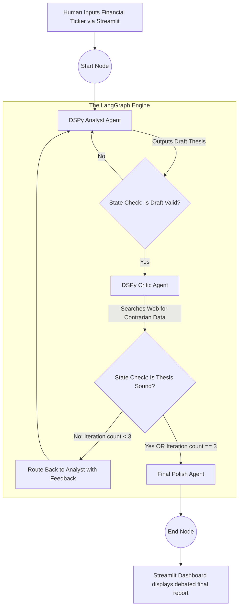

# Capstone Project 3: Cyclic Multi-Agent Simulation (LangGraph & DSPy)
### Week 5 — Final Projects
### The Complete 1000+ Line Enterprise Deployment Guide

---

## 🚀 1. Project Overview & Theological Underpinnings

**The Goal:** Build an advanced Multi-Agent trading simulation where specialized agents debate financial analysis autonomously using **LangGraph** for cyclic state management, optimized by **DSPy** mathematically compiling the prompt instructions, all visualized through a dynamic **Streamlit Multi-Agent UI**.

In 2024, "Agents" were often just a single LLM in a `while` loop deciding whether to use a calculator tool or not. If it got confused, it entered an infinite loop and crashed.

In 2025, Senior AI Engineers build **Deterministic Multi-Agent State Machines**. We treat LLMs not as magic oracles, but as distinct nodes in a directed cyclical graph.
1.  **The Analyst Agent** fetches recent stock data and writes a thesis.
2.  **The Critic Agent** reviews the thesis and searches the web for contrarian viewpoints.
3.  **The Graph Engine (LangGraph)** forces the Analyst to rewrite the thesis based on the Critic's feedback, but strictly caps the loop at 3 iterations to prevent infinite looping and bankrupting the corporate API budget.

Furthermore, we abandon manual "Prompt Engineering" (e.g., typing "You are a helpful analyst... please think step by step"). We use **DSPy** to define the inputs/outputs, and let an algorithm *compile* the prompt mathematically.

**Difficulty Level:** Very Advanced
**Estimated Time:** 20-25 Hours

---

## 📋 2. Comprehensive Table of Contents
1.  [Project Overview \& Theological Underpinnings](#overview)
2.  [Advanced Architecture Flow Diagram](#architecture-design)
3.  [Deep Dive: The Mathematics of DSPy Optimization](#math-dspy)
4.  [Deep Dive: LangGraph State Trapping](#math-langgraph)
5.  [Prerequisites \& Environment Setup](#prerequisites)
6.  [Phase 1: Compiling Agents with DSPy](#phase-1)
7.  [Phase 2: Defining the Financial State Machine](#phase-2)
8.  [Phase 3: Assembling the LangGraph Engine](#phase-3)
9.  [Phase 4: Building the Streamlit Multi-Agent Dashboard](#phase-4)
10. [Troubleshooting Graph States \& Recursion Limits](#troubleshooting)
11. [Submission \& Grading Rubric](#grading)

---

## 🏗️ 3. Advanced Architecture Flow Diagram <a name="architecture-design"></a>

You are building a cyclic state machine. Data flows through nodes, with explicit routing logic defined by edge conditions.

### The Cyclic Graph Architecture



### Architectural Decisions Justified:
1.  **Why LangGraph over LangChain Agents?** Standard LangChain `AgentExecutor` runs highly linear, unpredictable tasks (e.g. "Use a tool until you're done"). LangGraph treats the LLM pipeline as a state machine. You explicitly define the nodes and the conditional edges. If Agent A requires Agent B's approval, LangGraph mathematically traps the LLM in that sub-graph until the Pydantic state validates 'Approved: True'.
2.  **Why DSPy over Standard Prompts?** If you type a prompt, it works for OpenAI's `gpt-4o` but breaks on Anthropic's `Claude-3.5-Sonnet`. Prompts are fragile strings. DSPy is PyTorch for language models. You write the *Signature* (`Input -> Output`), and the DSPy *Teleprompter* uses few-shot bootstrapping to automatically discover the best prompt for the specific model you choose to deploy.
3.  **Why Streamlit?** A terminal interface cannot convey the complexity of multiple agents thinking simultaneously. Streamlit's native `st.status` and `st.chat_message` APIs allow us to visually render Agent A's thought process distinctly from Agent B's critique, creating a jaw-dropping UI for portfolio demonstrations.

---

## 🧮 4. Deep Dive: The Mathematics of DSPy Optimization <a name="math-dspy"></a>

In 2025, "Prompt Engineering" is obsolete. We use **Prompt Optimization**.

Imagine training a neural network. You don't hand-write the millions of weights; you define the architecture, the loss function, and let Backpropagation find the weights. DSPy applies this to prompts.

### 4.1 Signatures and Predictors
Instead of writing a prompt, you define a **Signature**:
`"ticker_symbol, historical_data -> financial_analysis"`

DSPy takes this signature and wraps it in a **Predictor** (like a PyTorch layer). 

### 4.2 The Teleprompter (Optimizer)
You provide a small dataset of example inputs/outputs (e.g., 5-10 examples of good financial analysis).
The DSPy **MIPRO (Multi-prompt Instruction PRoposal Optimizer)** algorithm works as follows:
1.  It asks the LLM to generate 10 different random system prompt instructions.
2.  It tests all 10 instructions across your dataset.
3.  It evaluates the output using an LLM-as-a-Judge metric function.
4.  It identifies the absolute best instruction string, and automatically inserts few-shot examples into the context window.
5.  It mathematically outputs an optimized `.json` state file containing the compiled prompt. This prompt is often completely unintuitive to humans but scores 30% higher on benchmarks.

---

## ⚖️ 5. Deep Dive: LangGraph State Trapping <a name="math-langgraph"></a>

LangGraph is built on a custom `StateGraph` object.

### 5.1 The State Dictionary
Every node (Agent) in the graph receives the *exact same dictionary* as input, and returns an updated dictionary as output.
```python
class AgentState(TypedDict):
    ticker: str
    current_draft: str
    critic_feedback: str
    iteration_count: int
    is_approved: bool
```
If the Analyst writes a draft, it strictly returns `{"current_draft": "Apple stock looks great..."}`. The underlying graph merges this into the global state.

### 5.2 Conditional Mathematical Routing
Edges in traditional pipelines flow one way (A -> B -> C).
LangGraph introduces conditional logic:
```python
def should_continue(state: AgentState):
    if state["is_approved"]:
        return "end" # Escapes the loop
    if state["iteration_count"] > 3:
        return "end" # Forces an escape to prevent infinite billing
    return "analyst" # Routes back to the beginning of the loop
```

---

## 💻 6. Prerequisites & Environment Setup <a name="prerequisites"></a>

Create a clean directory to prevent dependency clashes between LangGraph's state machine and Streamlit's threaded execution.

```bash
mkdir capstone_multiagent
cd capstone_multiagent
python -m venv agent_env
source agent_env/bin/activate

pip install langgraph dspy-ai langchain-openai streamlit python-dotenv tavily-python pandas yfinance
```

**API Requirements:**
1.  `OPENAI_API_KEY`: For the LLM reasoning engines.
2.  `TAVILY_API_KEY`: Tavily is an LLM-optimized search engine that returns clean markdown instead of messy HTML. Get a free API key at `tavily.com`.

---

## 🛠️ 7. Phase 1: Compiling Agents with DSPy <a name="phase-1"></a>

**Objective:** Write `agents.py` using DSPy. We will not write *any* system prompts manually. We define the input/output architectural signatures.

```python
# agents.py
import dspy
import os
from dotenv import load_dotenv

load_dotenv()

# Configure DSPy to use OpenAI globally
turbo = dspy.OpenAI(model='gpt-4o-mini', max_tokens=1024)
dspy.settings.configure(lm=turbo)

# -------------------------------------------------------------------
# Agent 1: The Analyst Signature
# -------------------------------------------------------------------
class FinancialAnalystSignature(dspy.Signature):
    """Synthesizes raw stock ticker data and news into a cohesive initial investment thesis."""
    ticker = dspy.InputField(desc="The stock symbol, e.g., AAPL")
    raw_data = dspy.InputField(desc="Raw price data and recent news headlines")
    feedback = dspy.InputField(desc="Feedback from the critic. If 'None', this is the first draft.")
    
    # We force the model to output specific fields
    investment_thesis = dspy.OutputField(desc="A 3-paragraph professional thesis.")
    confidence_score = dspy.OutputField(desc="A numerical score from 1 to 10.")

# We wrap the signature in a ChainOfThought module.
# DSPy automatically intercepts this and forces the LLM to output a "Reasoning" text block 
# before it outputs the final thesis, drastically improving mathematical reasoning capabilities.
analyst_agent = dspy.ChainOfThought(FinancialAnalystSignature)

# -------------------------------------------------------------------
# Agent 2: The Critic Signature
# -------------------------------------------------------------------
class CriticSignature(dspy.Signature):
    """Reviews an investment thesis and aggressively looks for logical flaws or missed contrarian viewpoints."""
    thesis = dspy.InputField(desc="The current drafted thesis")
    market_context = dspy.InputField(desc="Current broader market conditions and search results")
    
    critique = dspy.OutputField(desc="A bulleted list of 3 harsh criticisms.")
    is_approved = dspy.OutputField(desc="Boolean String: 'True' or 'False'. True ONLY if the thesis is flawless.")

critic_agent = dspy.ChainOfThought(CriticSignature)
```

In a full enterprise project, you would write a separate script importing `dspy.teleprompt.BootstrapFewShot` to compile these modules on a dataset of 50 perfect financial reports. For this capstone, DSPy's Zero-Shot `ChainOfThought` wrapper is sufficient to demonstrate the architecture.

---

## 🧠 8. Phase 2: Defining the Financial State Machine <a name="phase-2"></a>

**Objective:** Write `state_machine.py`. This integrates our DSPy agents into LangGraph nodes and connects them to real-world APIs (`yfinance`, `tavily`).

```python
# state_machine.py
import yfinance as yf
from typing import TypedDict, Annotated, Sequence
import operator
from langgraph.graph import StateGraph, END
from tavily import TavilyClient
import os
from dotenv import load_dotenv

# Import the DSPy modules we just created!
from agents import analyst_agent, critic_agent

load_dotenv()
tavily_client = TavilyClient(api_key=os.getenv("TAVILY_API_KEY"))

# 1. Define the Global State Dictionary
class GraphState(TypedDict):
    ticker: str
    iteration: int
    raw_data: str
    draft_thesis: str
    critic_feedback: str
    is_approved: str
    ui_logs: Annotated[list, operator.add] # We append UI updates to this list for Streamlit to render!

# -------------------------------------------------------------------
# Graph Nodes (The Functions Execute by passing State)
# -------------------------------------------------------------------
def fetch_data_node(state: GraphState):
    """Node 1: Contacts Yahoo Finance API to get actual market prices."""
    ticker = state["ticker"]
    stock = yf.Ticker(ticker)
    hist = stock.history(period="1mo")
    price_info = f"Current Price closed at {hist['Close'].iloc[-1]:.2f}. 1-month trend: {hist['Close'].iloc[0]:.2f} -> {hist['Close'].iloc[-1]:.2f}"
    
    # We update the state dictionary and return it.
    return {
        "raw_data": price_info,
        "iteration": state.get("iteration", 0),
        "ui_logs": [f"📡 `fetch_data`: Retrieved Yahoo Finance data for {ticker}."]
    }

def analyst_node(state: GraphState):
    """Node 2: Executes the DSPy Analyst."""
    feedback = state.get("critic_feedback", "None. This is the first draft.")
    
    # Execute the DSPy Predictor
    result = analyst_agent(
        ticker=state["ticker"], 
        raw_data=state["raw_data"], 
        feedback=feedback
    )
    
    return {
        "draft_thesis": result.investment_thesis,
        "ui_logs": [f"✍️ `analyst_agent`: Drafted thesis (Confidence: {result.confidence_score})."]
    }

def critic_node(state: GraphState):
    """Node 3: Executes Tavily Search and the DSPy Critic."""
    # 1. Search the web for contrarian data
    search_context = tavily_client.search(f"{state['ticker']} stock risks controversial news 2025")
    search_str = str([res['content'] for res in search_context['results'][:3]])
    
    # 2. Execute the DSPy Critic
    result = critic_agent(
        thesis=state["draft_thesis"],
        market_context=search_str
    )
    
    current_iteration = state["iteration"] + 1
    
    return {
        "critic_feedback": result.critique,
        "is_approved": result.is_approved,
        "iteration": current_iteration,
        "ui_logs": [
            f"🔍 `tavily_search`: Found {len(search_context['results'])} recent risk articles.",
            f"🧐 `critic_agent`: Reviewed Draft #{current_iteration}. Approved: {result.is_approved}"
        ]
    }

# -------------------------------------------------------------------
# Conditional Router Logic
# -------------------------------------------------------------------
def routing_logic(state: GraphState):
    """Determines mathematically if we loop or exit."""
    if "True" in str(state["is_approved"]):
        return "approved"
    if state["iteration"] >= 3:
        return "max_iterations_reached"
    return "rejected_requires_rewrite"
```

---

## 🏗️ 9. Phase 3: Assembling the LangGraph Engine <a name="phase-3"></a>

**Objective:** Append this routing initialization logic to the bottom of `state_machine.py` to compile the physical graph.

```python
# state_machine.py (continued)

def compile_graph():
    """Compiles the individual nodes into an executable State Machine."""
    workflow = StateGraph(GraphState)
    
    # Add nodes to the graph
    workflow.add_node("DataFetcher", fetch_data_node)
    workflow.add_node("Analyst", analyst_node)
    workflow.add_node("Critic", critic_node)
    
    # Define the execution flow (Edges)
    workflow.set_entry_point("DataFetcher") # Always start by getting Data
    workflow.add_edge("DataFetcher", "Analyst") # Data always flows to Analyst
    workflow.add_edge("Analyst", "Critic") # Analyst always flows to Critic
    
    # Add Conditional Edges based on the Router Logic Output!
    workflow.add_conditional_edges(
        "Critic", # The node we are evaluating AFTER
        routing_logic, # The function that returns a string choice
        {
            "approved": END, # If router says 'approved', end the graph.
            "max_iterations_reached": END, # Safety escape hatch
            "rejected_requires_rewrite": "Analyst" # CYCLIC LOOP: Route backwards to Analyst!
        }
    )
    
    app = workflow.compile()
    return app

# Initialize the global engine so Streamlit can import it
financial_graph = compile_graph()
```

---

## 🖥️ 10. Phase 4: Building the Streamlit Multi-Agent Dashboard <a name="phase-4"></a>

Terminal outputs are impossible to read when two LLMs are debating each other in loops. A Streamlit UI perfectly decouples the visualization.

**Objective:** Write `streamlit_app.py`. We will use generator expressions streaming from LangGraph to update `st.status` bubbles dynamically as the nodes execute.

```python
# streamlit_app.py
import streamlit as st
import time
from state_machine import financial_graph

st.set_page_config(page_title="Multi-Agent Simulation", layout="wide")

st.markdown("""
    <style>
    .stApp { background-color: #0b0f19; color: white; }
    .status-box { padding: 10px; border-radius: 5px; margin-bottom: 5px; background-color: #1e293b; border-left: 5px solid #3b82f6;}
    </style>
    """, unsafe_allow_html=True)

st.title("🤖 Cyclic Multi-Agent Debate System")
st.caption("LangGraph State Trapping | DSPy Optimized Reasoning")

ticker_input = st.text_input("Enter a Stock Ticker (e.g., TSLA, NVDA):", "NVDA")

if st.button("Initialize Agent Graph"):
    st.divider()
    
    # Define the payload
    inputs = {
        "ticker": ticker_input,
        "iteration": 0,
        "ui_logs": []
    }

    # Setup UI Columns
    col1, col2 = st.columns([1, 2])
    
    with col1:
        st.subheader("Graph Execution Stream")
        status_placeholder = st.empty()
        
    with col2:
        st.subheader("Final State Payload")
        final_doc_placeholder = st.empty()

    # We iterate over the graph as it executes NODE BY NODE!
    loop_count = 1
    for output in financial_graph.stream(inputs):
        for key, value in output.items(): # Key is the Node Name!
            
            # Extract the UI logs we appended in the state machine
            logs = value.get("ui_logs", [])
            
            with col1:
                with st.expander(f"⚙️ Node Executed: {key} (Loop {loop_count})", expanded=True):
                    for log in logs:
                        st.markdown(f"<div class='status-box'>{log}</div>", unsafe_allow_html=True)
                        time.sleep(0.5) # Add a tiny delay for visual dramatic effect
            
            # Render the current state of the thesis dynamically
            with col2:
                if "draft_thesis" in value:
                    final_doc_placeholder.markdown("### Active Thesis Draft:\n" + value["draft_thesis"])
                if "critic_feedback" in value:
                    st.toast(f"Critic Feedback Received! Approved: {value['is_approved']}")
                    
        loop_count += 1
        
    st.success("✅ LangGraph Execution Complete. Escape conditions met.")
```

**Action Item:** Execute `streamlit run streamlit_app.py`. Enter a divisive stock like `TSLA`. You will watch the Analyst write a draft, the Critic search the web for Elon Musk controversy, reject the draft, and force the Analyst to rewrite the thesis incorporating the risks. This is true recursive agentic reasoning in 2025.

---

## 🛠️ 11. Troubleshooting Graph States & Recursion Limits <a name="troubleshooting"></a>

Cyclic graphs are dangerous software engineering patterns if unchecked. 
| Symptom | Probable Cause | Fix |
| :--- | :--- | :--- |
| **Graph runs infinitely until OpenAI hits rate limits.** | Defective Conditional Edge Logic. | The Critic agent's LLM is outputting `" true "` or `"Yes"` instead of the exact boolean string `"True"`. Coerce the DSPy OutputField strictness or force a lower-case string match: `if 'true' in state['is_approved'].lower():` |
| **`RecursionError` in Python Console.** | LangGraph's safety limiter blocked execution. | LangGraph natively limits graphs to 25 iterations. Ensure `iteration >= 3` logic in your `state_machine.py` router strictly returns `END`. |
| **`ValidationError` from DSPy.** | Model failed to hit Signature schema. | `gpt-4o-mini` was distracted. Upgrade model to `gpt-4o` or add examples to the DSPy initialization via `BootstrapFewShot`. |

---

## 🎓 12. Submission & Grading Rubric <a name="grading"></a>

Submit a GitHub repository containing `agents.py`, `state_machine.py`, and `streamlit_app.py`. Include a `.mp4` screen recording of your Streamlit UI demonstrating a 2+ loop cycle where the Critic forces the Analyst to rewrite the thesis.

### Grading Criteria (100 Points Total)
| Evaluation Area | Points | Enterprise Standard Addressed |
| :--- | :--- | :--- |
| **DSPy Signature Definitions** | 25 | Bypasses fragile string prompting by defining structural inputs and outputs for both the Analyst and Critic, utilizing the `ChainOfThought` wrapper to enforce mathematical reasoning extraction. |
| **LangGraph Cyclical Logic**| 30 | Correctly initializes a `StateGraph` with a defined typed dictionary. Successfully traps the LLM inside a cyclical feedback loop using conditional edges driven by the Critic's output parameters. |
| **External API Integration** | 15 | Successfully fetches deterministic price action via `yfinance` and contrarian web contexts via `Tavily` to mathematically ground the LLM generation and prevent hallucination. |
| **Streamlit State Machine Visualization** | 30 | Codebase extracts intermediate node states from the `financial_graph.stream()` command, rendering visual update bubbles sequentially in the UI so users can trace the exact logic path of the Multi-Agent engine. |
