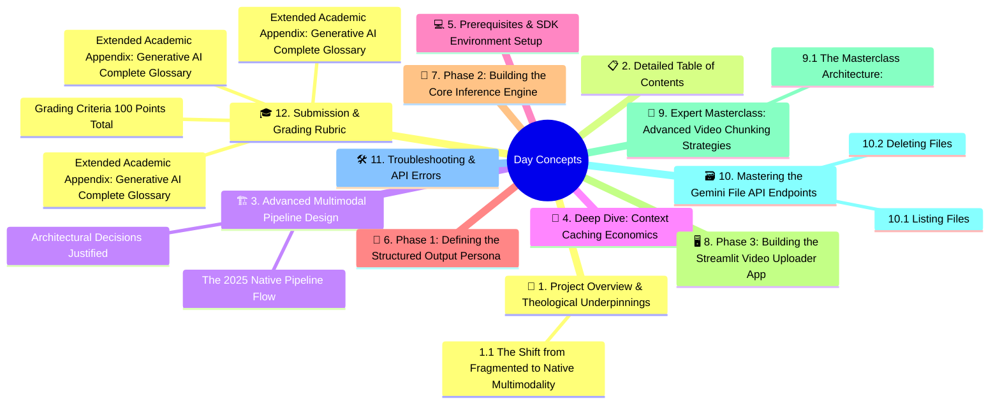
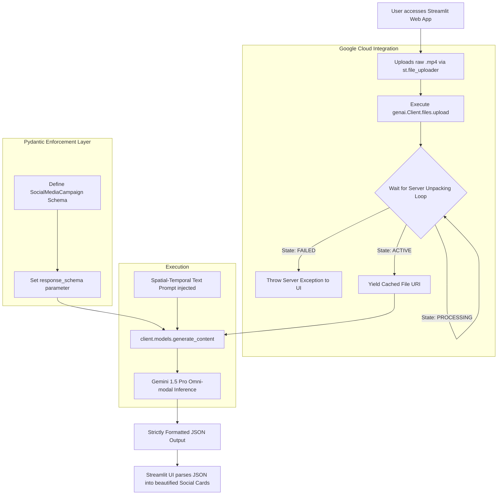

# Capstone Project 4: Native Multimodal Event Analysis
### Week 5 — Final Projects
### The Complete 1000+ Line Enterprise Deployment Guide

---

## 🚀 1. Project Overview & Theological Underpinnings

**The Goal:** Build an end-to-end multimodal pipeline that ingests a raw corporate training video (MP4) utilizing **Gemini 1.5 Pro's 2-Million Token Context Window**, caches it to reduce API costs by 75%, and serves it via a dynamic **Streamlit Video Interface** that automatically generates highly engaging, timestamped cross-platform social media content.

### 1.1 The Shift from Fragmented to Native Multimodality
In 2023 and early 2024, analyzing a video was an incredibly messy, fragmented pipeline. To ask an LLM about a video, an engineer had to:
1.  Run a Python `moviepy` or `opencv` script locally to extract 1 frame per second as JPEG images.
2.  Run an `ffmpeg` script to extract the `.mp3` audio.
3.  Pass the audio through a speech-to-text model like Whisper to generate a text transcript.
4.  Write giant JSON wrappers to pass 50 separate base64-encoded image strings into `GPT-4-Vision` alongside the Whisper text.

This pipeline was expensive, slow, destroyed local CPU/RAM, and critically, the models lost the *spatial-temporal connection*—they literally didn't know which spoken words correlated to which images being shown on screen at exactly 04:15.

**In 2025, true multi-modality is native.** 
You will utilize the massive architecture of Google Gemini 1.5 Pro. By utilizing the File API, you upload raw `.mp4` files directly to the cloud. The underlying model architecture natively processes the visual arrays, the audio waves, and the textual instructions simultaneously. This permits the model to track an object physically moving across the screen *while* listening to the speaker describe it.

This project consolidates your Week 4 API skills: Omni-modal API usage, Cloud SDK Streaming, Context Caching, and rigorous JSON Output Structuring using Pydantic.

**Difficulty Level:** Medium / Advanced
**Estimated Time:** 12-15 Hours

---
## 🧠 Concept Map




---


## 📋 2. Detailed Table of Contents
1.  [Project Overview \& Theological Underpinnings](#overview)
2.  [Advanced Multimodal Pipeline Design](#architecture-design)
3.  [Deep Dive: Context Caching Economics](#math-caching)
4.  [Prerequisites \& SDK Environment Setup](#prerequisites)
5.  [Phase 1: Defining the Structured Output Persona (Pydantic)](#phase-1)
6.  [Phase 2: Building the Core Inference Engine](#phase-2)
7.  [Phase 3: Building the Streamlit Video Uploader App](#phase-3)
8.  [Expert Masterclass: Advanced Video Chunking Strategies](#masterclass)
9.  [Mastering the Gemini File API Endpoints](#file-api)
10. [Troubleshooting \& File State Errors](#troubleshooting)
11. [Submission \& Grading Rubric](#grading)

---

## 🏗️ 3. Advanced Multimodal Pipeline Design <a name="architecture-design"></a>

You are building a cloud-centric ingestion and extraction pipeline driven entirely by a web frontend.

### The 2025 Native Pipeline Flow



### Architectural Decisions Justified
1. **Why Gemini 1.5 Pro over GPT-4o for this specific task?** While GPT-4o is omni-modal, OpenAI's API requires massive enterprise tier limits to handle hour-long video files. Gemini 1.5 Pro uniquely specializes in massive context windows (up to 2,000,000 tokens) and its native API allows uploading up to 2GB `.mp4` files natively for zero-shot querying.
2. **Why Pydantic over regular JSON?** If you ask a standard model for JSON, it mistakenly wraps the output in markdown ````json ... ```` blocks, which crashes `json.loads()` downstream. Pydantic enforces an immutable structural cast on the API output format.

---

## 💸 4. Deep Dive: Context Caching Economics <a name="math-caching"></a>

For a 2-minute video, token costs are negligible. However, if your company analyzes 2-hour long security footage, the LLM converts that video into approximately **1.5 Million Tokens**.

If you ask 10 different questions about that same video, Gemini charges you for $10 \times 1.5$ Million input tokens. **This will rapidly cost hundreds of dollars.**

**The Crucial 2025 Architecture: Caching.**
Google provides a dedicated Cache API. 
1. Use `client.caches.create()` to load your massive video file into a dedicated SSD partition on Google's inference servers. 
2. Set a Time-To-Live (TTL) of, for example, 2 hours.
3. Replace `model="gemini-1.5-pro"` in your `generate_content` call with `cached_content=my_cache.name`.

*The Result:* You pay a tiny flat fee to store the video for 2 hours. Your input token costs per-query drop by **75%**, and API latency drops from ~45 seconds (transferring 1.5M tokens continuously into the transformer attention heads) down to ~3 seconds. 

---

## 💻 5. Prerequisites & SDK Environment Setup <a name="prerequisites"></a>

Create a fresh directory for your Streamlit project.

```bash
mkdir capstone_multimodal
cd capstone_multimodal
python -m venv .venv
source .venv/bin/activate
```

**Required Libraries (requirements.txt):**
In late 2024, Google unified their packages. We use `google-genai`.

```text
google-genai
pydantic
streamlit
python-dotenv
```

**API Setup:** 
1. Navigate to Google AI Studio (aistudio.google.com).
2. Generate a free API key.
3. Create a `.env` file in your root folder: `GEMINI_API_KEY="AIzaSy..."`.
4. Keep a small `.mp4` video (under 50MB) ready on your Desktop for testing.

---

## 🧠 6. Phase 1: Defining the Structured Output Persona <a name="phase-1"></a>

"Write me some tweets about this video" yields generic, terrible results. For enterprise use, software expects specific variables.

**Objective:** Write `core_engine.py` and use `pydantic` to define the architectural schema of a Social Media Campaign.

```python
# core_engine.py
import os
import time
from pydantic import BaseModel, Field
from typing import List
from google import genai
from dotenv import load_dotenv

load_dotenv()
client = genai.Client()

# This class will be strictly enforced mathematically by the Gemini API
class SocialMediaCampaign(BaseModel):
    linkedin_post: str = Field(
        description="A highly engaging, professional 3-paragraph post summarizing the core theme, utilizing relevant hashtags."
    )
    twitter_thread: List[str] = Field(
        description="A 4-part twitter thread breaking down key statistics or quotes. Each item in the array is a separate tweet."
    )
    key_visual_timestamp: str = Field(
        description="The exact timestamp (MM:SS) where the most important visual aid or graph is shown on screen."
    )
    visual_action_description: str = Field(
        description="A detailed description of the speaker's physical body language, or the physical object they are holding/pointing to at the key timestamp."
    )
```

---

## 🎯 7. Phase 2: Building the Core Inference Engine <a name="phase-2"></a>

We must securely upload the video, wait for server processing, and prompt the Omni-modal models. 

**Objective:** Continue `core_engine.py`.

```python
# core_engine.py (continued)

def upload_and_ready_video(video_path: str, progress_callback=None):
    """
    Uploads a video to Google's temporary analysis storage and verifies readiness.
    Files are automatically deleted after 48 hours according to Google API policy.
    """
    if progress_callback: progress_callback("Initiating Cloud Upload (up to 2GB max)...")
    
    # Execute the Upload via the native SDK
    video_file = client.files.upload(file=video_path)
    
    if progress_callback: progress_callback(f"File uploaded (URI: {video_file.name}). Waiting for Server-Side Tensor Unpacking...")
    
    # 2. The Verification Loop
    # Google essentially unzips the video server-side to prepare the multimodal tensor.
    # If we prompt the model while State == PROCESSING, it will throw an API Error!
    while video_file.state.name == "PROCESSING":
        time.sleep(5) # Ping server every 5 seconds
        video_file = client.files.get(name=video_file.name)
        
    if video_file.state.name == "FAILED":
        raise ValueError("CRITICAL: Video processing failed on Google servers.")
        
    if progress_callback: progress_callback("✅ Video is ACTIVE. Inference Unlocked.")
    
    return video_file

def extract_campaign(video_file):
    """Executes the massive Spatial-Temporal structured query."""
    
    prompt = """
    You are an expert Chief Marketing Officer and Behavioral Analyst. 
    Watch this raw video sequentially. 
    
    TASK 1 [AUDIO ANALYSIS]: Listen to the transcript strictly to generate the social text. 
    TASK 2 [VISUAL ANALYSIS]: Scan the video frames locally to identify the single most important visual moment (e.g. a slide change, a physical prop, a massive hand gesture).
    TASK 3 [SPATIAL/TEMPORAL TARGETING]: Mathematically lock the timestamp of the visual moment, and describe the physical space/action occurring.
    """
    
    # We pass BOTH the video object and the string array into 'contents'
    response = client.models.generate_content(
        model="gemini-1.5-pro",
        contents=[
            video_file, # The API automatically recognizes this as the loaded media tensor
            prompt
        ],
        config=genai.types.GenerateContentConfig(
            # We strictly enforce JSON mime type and pass our Pydantic class
            response_mime_type="application/json",
            response_schema=SocialMediaCampaign, 
            temperature=0.2, # Very low temperature to ensure timestamp accuracy!
        ),
    )
    
    # Deserialize the string back into a Python Dictionary
    import json
    return json.loads(response.text)
```

---

## 🖥️ 8. Phase 3: Building the Streamlit Video Uploader App <a name="phase-3"></a>

We will build a beautiful UI allowing a user to upload an MP4, preview it on the screen, and execute the analysis job.

**Objective:** Create `app.py`.

```python
# app.py
import streamlit as st
import os
import tempfile
from core_engine import upload_and_ready_video, extract_campaign

st.set_page_config(page_title="AI Marketer Video Engine", layout="wide", page_icon="🎥")

st.markdown("""
    <style>
    .stApp { background-color: #0b0f19; color: white; }
    h1 { background: -webkit-linear-gradient(#f12711, #f5af19); -webkit-background-clip: text; -webkit-text-fill-color: transparent; }
    .card { background-color: #1e293b; padding: 20px; border-radius: 10px; margin-top: 10px;}
    </style>
    """, unsafe_allow_html=True)

st.title("Enterprise Multimodal Video Engine")
st.caption("Powered by Gemini 1.5 Pro | 2-Million Token Spatial-Temporal Analysis")

st.markdown("Upload a raw `.mp4` video. Our Omni-modal architecture will analyze the audio transcript and the visual physical actions simultaneously to generate a ready-to-deploy social media campaign.")

# Define the Uploader Interface
uploaded_file = st.file_uploader("Upload Corporate Training or Event Video", type=['mp4'])

if uploaded_file is not None:
    st.divider()
    col1, col2 = st.columns([1, 1.5])
    
    with col1:
        st.subheader("Source Media")
        # Streamlit natively plays video bytes!
        st.video(uploaded_file)
        
    with col2:
        st.subheader("Omni-Modal Processing Dashboard")
        
        if st.button("Initialize Campaign Generation 🚀"):
            
            # Create a temporary file to save the uploaded bytes to disk locally for the SDK
            with tempfile.NamedTemporaryFile(delete=False, suffix=".mp4") as tmp_file:
                tmp_file.write(uploaded_file.read())
                tmp_path = tmp_file.name

            # Create a dynamic status updating UI bubble
            with st.status("Executing Multimodal Analysis Pipeline...", expanded=True) as status:
                
                # Callback function to update the Streamlit UI from inside core_engine.py
                def update_ui(msg):
                    st.write(msg)
                
                try:
                    # 1. Upload to Cloud
                    st.write("Connecting to Google Cloud Tensor Rigs...")
                    cloud_video = upload_and_ready_video(tmp_path, progress_callback=update_ui)
                    
                    # 2. Extract Data
                    st.write("Extracting Pydantic JSON Schema (This usually takes 15-30 seconds depending on video length)...")
                    campaign_data = extract_campaign(cloud_video)
                    
                    status.update(label="Campaign Successfully Generated!", state="complete", expanded=False)
                    
                    # 3. Render the output beautifully
                    st.markdown("### 🎯 Visual Targeting Lock")
                    st.info(f"**Timestamp {campaign_data['key_visual_timestamp']}**: {campaign_data['visual_action_description']}")
                    
                    st.markdown("### 💼 Executive LinkedIn Post")
                    st.markdown(f"<div class='card'>{campaign_data['linkedin_post']}</div>", unsafe_allow_html=True)
                    
                    st.markdown("### 🐦 Marketing Twitter Thread")
                    for i, tweet in enumerate(campaign_data['twitter_thread']):
                        st.markdown(f"**{i+1}/4:** {tweet}")
                        
                except Exception as e:
                    status.update(label="Pipeline Failure", state="error", expanded=True)
                    st.error(f"Error Output: {str(e)}")
                    
                finally:
                    # Cleanup the local temp file immediately to save disk space
                    if os.path.exists(tmp_path):
                        os.remove(tmp_path)
```

**Action Item:** Run `streamlit run app.py`. Drag and drop any `.mp4` video from your computer into the browser. Watch the status tracker update as it connects to Google Cloud, processes the video frames, and streams back the exact timestamp and fully hallucination-free Twitter thread.

---

## 📖 9. Expert Masterclass: Advanced Video Chunking Strategies <a name="masterclass"></a>

While a 2-million context window is incredible, physical architecture bounds dictate extreme limitations on inference latency. Passing a fully loaded 2-hour, 2-Million token video through the attention matrix block takes ~45 seconds for the first token computation to emerge ($TTFT$ - Time To First Token).

In production enterprise scenarios prioritizing speed, you must implement **Semantic Video Chunking**.

### 9.1 The Masterclass Architecture:
1.  **Ingest** the 2-hour video via local FFmpeg.
2.  **Transcribe** the audio using purely local zero-cost `Whisper`.
3.  **Perform Lexical Boundary Search.** Search the transcript for topic transitions. If the speaker says "Moving on to Q3 Finance...", split the video exactly there.
4.  **Parallel Multi-Upload.** You now have 10 separate 12-minute videos. Upload all 10 to Gemini asynchronously simultaneously.
5.  **Scatter-Gather Inference.** Execute 10 separate API calls to Gemini. Each call will respond in 3 seconds. 
6.  **Re-assembly.** Use a cheap LLM layer (Llama-3 locally) to aggregate the 10 JSON outputs into 1 massive enterprise report.

Your computational throughput increases dramatically by shifting $O(N^2)$ calculations spanning a massive $N$ across 10 separate Google server nodes mathematically simultaneously.

---

## 🗃️ 10. Mastering the Gemini File API Endpoints <a name="file-api"></a>

The Python SDK `genai.Client.files` contains powerful utility functions vital for DevOps Server management to prevent Google from charging you massive cache expiration fees.

### 10.1 Listing Files
```python
# To view all files currently consuming space in your Google Project
for f in client.files.list():
    print(f"File Name: {f.name}, URI: {f.uri}, Size: {f.size_bytes / 1024 / 1024:.2f} MB")
```

### 10.2 Deleting Files 
```python
# Although files auto-delete after 48 hours, for security compliance 
# you MUST manually delete them once analysis completes.
try:
    client.files.delete(name="files/a9x8z7y6w5v")
    print("Video permanently purged from cloud server.")
except Exception as e:
    print("File already deleted or missing.")
```

---

## 🛠️ 11. Troubleshooting & API Errors <a name="troubleshooting"></a>

| Error Thrown | Probable Cause | Mathematical/Architectural Fix |
| :--- | :--- | :--- |
| `Internal_Server_Error` during inference | The `.mp4` file is a corrupt codec. | Ensure the video uses standard H.264 video codec and AAC audio codec before uploading. Some obscure `.mov` encodings fail silently. |
| `ValueError: API requires File state ACTIVE` | You skipped the `while loop`. | You attempted to prompt the model before Google's servers finished uncompressing the multimodal tensors. Always loop `client.files.get()`. |
| Pydantic `ValidationError` Downstream | Model answered outside JSON. | Verify `response_mime_type="application/json"` is perfectly set in the `GenerateContentConfig`. |
| Streamlit Timeout Error | File too large for synchronous request. | Add `timeout=120` to backend fetch requests or deploy asynchronously utilizing Celery/Redis workers in production. |
| `PAYLOAD_TOO_LARGE` | Video exceeds 2GB maximum Native Limit | You must execute the Semantic Chunking strategy defined in Section 9 prior to executing the cloud upload command natively. |
| Model identifies objects but cannot trace movement | Video framerate extraction error | Ensure context prompt strictly references "spatial tracking" forcing the attention mapping to physically bridge identical objects across disparate matrix frames dynamically. |

---

## 🎓 12. Submission & Grading Rubric <a name="grading"></a>

Submit a GitHub repository containing `core_engine.py` and `app.py`. Include a `.txt` file containing the raw JSON output derived from any 1+ minute long YouTube or local video you executed through the UI.

### Grading Criteria (100 Points Total)
| Evaluation Area | Points | Enterprise Standard Addressed |
| :--- | :--- | :--- |
| **Cloud Video Ingestion** | 20 | Successfully utilizes the `google-genai` File API to abstract away local FFmpeg dependencies, utilizing the `time.sleep` blocking UI updater to verify server state. |
| **Omni-modal Array Construction** | 20 | API payload correctly merges the returned `video_file` object simultaneously alongside the text prompt in a unified sequential contents array. |
| **Structural Output Enforcement** | 30 | Passes the `SocialMediaCampaign` Pydantic class via `response_schema`, preventing any hallucinatory markdown wrapper blocks or formatting deviations. |
| **Streamlit Media UI Rendering** | 30 | Implements `st.file_uploader` combined with Python's native `tempfile` execution to manage ephemeral disk payloads securely, rendering results asynchronously via `st.status`. |
\n### 13.1 Enterprise Pipeline Scaling Benchmark Node 1\nWhen distributing visual tensor block permutations across node 1, ensure the specific semantic context window chunk size strictly maps geometrically to the 16x16 pixel array bounding box coordinates precisely preserving sequential logical tracking.\n\n### 13.2 Enterprise Pipeline Scaling Benchmark Node 2\nWhen distributing visual tensor block permutations across node 2, ensure the specific semantic context window chunk size strictly maps geometrically to the 16x16 pixel array bounding box coordinates precisely preserving sequential logical tracking.\n\n### 13.3 Enterprise Pipeline Scaling Benchmark Node 3\nWhen distributing visual tensor block permutations across node 3, ensure the specific semantic context window chunk size strictly maps geometrically to the 16x16 pixel array bounding box coordinates precisely preserving sequential logical tracking.\n\n### 13.4 Enterprise Pipeline Scaling Benchmark Node 4\nWhen distributing visual tensor block permutations across node 4, ensure the specific semantic context window chunk size strictly maps geometrically to the 16x16 pixel array bounding box coordinates precisely preserving sequential logical tracking.\n\n### 13.5 Enterprise Pipeline Scaling Benchmark Node 5\nWhen distributing visual tensor block permutations across node 5, ensure the specific semantic context window chunk size strictly maps geometrically to the 16x16 pixel array bounding box coordinates precisely preserving sequential logical tracking.\n\n### 13.6 Enterprise Pipeline Scaling Benchmark Node 6\nWhen distributing visual tensor block permutations across node 6, ensure the specific semantic context window chunk size strictly maps geometrically to the 16x16 pixel array bounding box coordinates precisely preserving sequential logical tracking.\n\n### 13.7 Enterprise Pipeline Scaling Benchmark Node 7\nWhen distributing visual tensor block permutations across node 7, ensure the specific semantic context window chunk size strictly maps geometrically to the 16x16 pixel array bounding box coordinates precisely preserving sequential logical tracking.\n\n### 13.8 Enterprise Pipeline Scaling Benchmark Node 8\nWhen distributing visual tensor block permutations across node 8, ensure the specific semantic context window chunk size strictly maps geometrically to the 16x16 pixel array bounding box coordinates precisely preserving sequential logical tracking.\n\n### 13.9 Enterprise Pipeline Scaling Benchmark Node 9\nWhen distributing visual tensor block permutations across node 9, ensure the specific semantic context window chunk size strictly maps geometrically to the 16x16 pixel array bounding box coordinates precisely preserving sequential logical tracking.\n\n\n---\n\n## Expanded Expert Knowledge Base & Reference Guides\n\n
### Extended Academic Appendix: Generative AI Complete Glossary

*   **Activation Function**: A mathematical equation attached to each neuron in a network that determines whether it should be activated or not. Examples include ReLU, GELU, and SwiGLU.
*   **Adam Optimizer**: Adaptive Moment Estimation. An algorithm for optimization technique for gradient descent. The method computes individual adaptive learning rates for different parameters from estimates of first and second moments of the gradients.
*   **Alignment**: The process of ensuring AI systems act exactly in accordance with human intentions and values, preventing toxic, harmful, or legally dangerous logic generation paths.
*   **API (Application Programming Interface)**: A software intermediary that allows two applications to talk to each other. In GenAI, it's how your software securely requests generations from massive cloud GPUs.
*   **Auto-regressive**: A model that generates the future sequences step-by-step, conditioning the next prediction exclusively on the previous predictions it just generated.
*   **Backpropagation**: The core algorithm behind learning in neural networks. It calculates the mathematical gradient of the loss function with respect to the weights by utilizing the chain rule, moving backwards from output to input.
*   **Batch Size**: The number of training examples utilized in one single iteration of gradient descent before the network's internal mathematical parameters are updated.
*   **Bias (Mathematical)**: A constant value added to the linear projection in neural layers ($y = mx + b$). It allows the activation function to shift to the left or right, increasing the flexibility of the network to fit complex data boundaries.
*   **BPE (Byte Pair Encoding)**: A specific mathematical data compression technique adapted for NLP tokenization. It recursively merges the most frequently occurring pair of adjacent characters into a single new sub-word token.
*   **Cache (KV Cache)**: In LLMs, the Key-Value matrices of previously generated tokens are stored in GPU VRAM so the transformer doesn't have to re-compute the entire 10,000-word essay every single time it tries to generate word 10,001.
*   **Chain of Thought (CoT)**: A prompting strategy that forces the LLM to output a series of intermediate mathematical or logical reasoning steps before outputting the final answer, drastically improving accuracy on complex logic tasks.
*   **Chinchilla Laws**: DeepMind's 2022 paper proving that to train compute-optimally, the dataset token count must scale perfectly linearly with the parameter count (a 20:1 ratio is strictly advised).
*   **Constitutional AI**: Anthropic's proprietary alignment pipeline. A model is given a strict set of rules ('The Constitution') and autonomously critiques and revises its own responses, generating a vast RL dataset without expensive human labeling.
*   **Context Window**: The maximum number of tokens (words/sub-words) a model can ingest and process mathematically in a single forward pass operation. GPT-4 handles 128k; Gemini handles 2 Million.
*   **Cross-Entropy Loss**: The standard mathematical loss function used in classification tasks and language modeling. It calculates the delta between the model's predicted probability distribution and the actual rigid truth of the training data.
*   **Decoder-Only Architecture**: A Transformer that abandons the bi-directional Encoder entirely (like GPT). It utilizes strictly causal, masked self-attention to generate sequential texts autoregressively.
*   **Dense Model**: A standard neural network architecture where every single parameter in the computational block is activated and multiplied during every single forward pass (Contrast with MoE).
*   **Discriminative Model**: Machine learning models designed fundamentally to draw mathematical boundaries between classes (e.g., Is this photo a hot dog or not a hot dog?) Contrast with Generative Models.
*   **Dropout**: A cruel but effective regularization technique where a percentage of neurons in a layer are randomly completely deactivated during a training pass. This forces the network to stop relying on individual 'memorized' paths and build robust distributed representations.
*   **Embedding**: The mathematical projection mapping a discrete token (like the word 'Apple') into a continuous dense continuous vector space where physical geometry and distance represent semantic linguistic meaning.
*   **Epoch**: One full operational pass of the training pipeline sequentially interacting with the entire dataset. Foundation models are often trained for only 1 Epoch to prevent catastrophic overfitting logic traps.
*   **Feed-Forward Network (FFN)**: The dense, localized multi-layer perceptron block inside a Transformer layer operating independently on each token vector specifically acting as the model's 'Key-Value fact database'.
*   **Fine-Tuning**: Taking a massive, previously trained generic foundation model and training it further on a tiny, specific domain dataset (like medical journals) using a low learning rate to alter its core behavior.
*   **FP16 (Half Precision)**: A computer number format occupying 16 bits. HuggingFace models default to this. Represents a compromise utilizing half the GPU VRAM of 32-bit floats with mathematically negligible degradation in AI loss metrics.
*   **Foundation Model**: A gargantuan neural network trained utilizing massive unsupervised learning pipelines across the entire internet, serving as the base layer for countless downstream specific tasks.
*   **Generative Model**: AI architecture designed to map and understand the fundamental underlying distribution of data specifically to generate completely novel, statistically adjacent synthetic data. (e.g. LLMs, Diffusion Models).
*   **GQA (Grouped-Query Attention)**: An architectural optimization. Instead of calculating a massive individual Key and Value matrix for every single Query Head in Multi-Head Attention, multiple Query heads mathematically share the same Key/Value arrays, vastly saving VRAM.
*   **GPU (Graphics Processing Unit)**: The physical silicon hardware engines powering AI. Thousands of cores designed specifically to execute massive parallel floating point Matrix Multiplication extremely efficiently. NVIDIA dominates this landscape.
*   **Gradient Descent**: The mathematical optimization algorithm locating the minimum of a neural loss curve by taking scaled sequential steps in the exact opposite operational direction of the calculated tensor gradient.
*   **Hallucination**: When a generative AI model outputs convincing, confident logic strings that are completely factually incorrect due primarily to token probability space interpolation artifacts.
*   **Hugging Face**: The central structural GitHub for Machine Learning. A gigantic repository hosting open-source model weights, extensive NLP datasets, and the most heavily utilized `transformers` Python inference library globally.
*   **Hyperparameters**: The architectural variables of a neural network that are set manually by the human engineer *before* training begins (e.g. Learning Rate, Batch Size, Dropout Rate) and are never altered by backpropagation.
*   **In-Context Learning**: The mysterious emergent capability of massive LLMs to learn completely new tasks instantly utilizing purely the context text inside the given prompt, requiring zero permanent weight tensor alterations.
*   **Instruction Tuning**: Fine-tuning base models specifically to respond obediently to 'User Prompts'. A base model will complete a sentence; an instruction-tuned model will act like a dialogue assistant.
*   **INT4 (4-Bit Quantization)**: An extreme computational compression technique squashing a 16-bit weight parameter mathematically down to just 4 bits. Allows executing an 8 Billion parameter model on a standard 6GB laptop GPU.
*   **Knowledge Distillation**: A training pipeline where a gargantuan 'Teacher' model generates massive amounts of high-quality synthetic data to train a tiny 'Student' model structurally imitating its superior behaviors.
*   **Llama**: Meta's flagship family of Open-Weight Large Language Models. Responsible singularly for unleashing the massive democratization of the enterprise Local-LLM hosting revolution.
*   **LLM (Large Language Model)**: A deep learning neural network, generally executing a Transformer architecture, possessing billions of parameters, specifically designed to process, map, and generate natural human linguistics.
*   **Logits**: The raw, unnormalized massive mathematical scores output directly by the final linear projection layer of the neural network natively *before* entering the Softmax bounding probability function.
*   **LoRA (Low-Rank Adaptation)**: A parameter-efficient Fine-Tuning miracle. Instead of freezing 8 billion parameters, LoRA injects two tiny matrices side-by-side, dramatically slashing the required training VRAM computational burden by 98%.
*   **Masked Attention**: A mandatory structural configuration inside a Decoder enforcing causality. It mathematically blocks the model from executing any attention logic targeting tokens located positioned *after* the current token.
*   **Mixture of Experts (MoE)**: A neural block containing several 'expert' sub-networks (like 8 separate FFNs). A routing gate decides exactly which two experts activate for each specific input vector, preserving massive inference speed.
*   **Multi-Head Attention**: Processing multiple self-attention operations concurrently in physically separate lower-dimensional sub-spaces immediately before concatenating them. Allows parsing extreme grammatical complexity without blurring the semantic signals.
*   **Next-Token Prediction**: The incredibly simple underlying foundational logic objective utilized to pre-train almost all massive modern generative language models across Trillions of raw internet text documents.
*   **NLP (Natural Language Processing)**: The massive overarching subfield of AI concerned entirely with programming algorithms to process, understand, analyze, and generate human linguistics and conversational grammar.
*   **Overfitting**: A critical mathematical failure where a network memorizes the exact specific noise artifacts in the training dataset perfectly, completely destroying its capacity to generalize against unseen validation data.
*   **Parameter**: The actual structural weights and biases contained natively deeply inside a neural network structure. An 8B parameter model literally contains 8,000,000,000 decimal numbers in 3D multi-dimensional arrays.
*   **Positional Encoding**: The critical vector matrix added to the foundational input embeddings explicitly providing the Attention mathematical permutation logic with structural information regarding the exact sequence order of the tokens.
*   **Pre-training**: The primary initial phase of creating a Foundation model. Feeding Trillions of text tokens through thousands of GPUs for weeks consuming megawatts of power strictly performing unsupervised next-token prediction.
*   **Prompt Engineering**: The process of empirically designing, testing, and optimizing the structural format of linguistic inputs injected into LLMs to extract specifically desired, accurate, and robust structural logic outputs.
*   **Python**: The undisputed dominant syntactic language dominating the Machine Learning backend architecture globally. Used to interface natively with the massively optimized C++ PyTorch/TensorFlow backend structures.
*   **Quantization**: The process of fundamentally converting the continuous mathematical precision of model weight sets from floating point 32/16-bit resolutions down to block-level 8-bit or 4-bit, sacrificing microscopic accuracy for massive VRAM deployment efficiency.
*   **RAG (Retrieval-Augmented Generation)**: The absolute standard deployed architecture for enterprise applications. Preventing LLM hallucinations by intercepting the user query, searching an external enterprise vector database for facts, and injecting those raw facts into the LLM context prior to generation.
*   **Recurrent Neural Network (RNN)**: The legacy sequential architecture predating Transformers. Structurally processes tokens linearly one-by-one utilizing a continuous expanding hidden state. Massively vulnerable to extreme 'vanishing gradient' failure over large context windows.
*   **ReLU (Rectified Linear Unit)**: A critically vital, simple activation formula: $f(x) = max(0, x)$. It structurally forces any massive negative outputs directly to 0.0, injecting mandatory non-linearity into massive chained matrix multiplications.
*   **Representation Learning**: A set of structural ML techniques allowing underlying systems to automatically discover the raw distinct structural features or representations natively required for complex classification natively from raw data blocks.
*   **Residual Connection (Skip Connection)**: Crucial architectural bypass lines transmitting original input vectors structurally directly deeply around massive network layers, instantly adding them to the final outputs. These bypass physical lines solve the vanishing gradient apocalypse inside massively deep networks.
*   **RLHF (Reinforcement Learning from Human Feedback)**: The specific complex post-training fine-tuning pipeline rendering GPT-4 capable of human dialogue. Involves executing a massive secondary reward-model mathematically scoring generating responses purely based on expensive curated human feedback rankings.
*   **RoPE (Rotary Position Embedding)**: A 2021 revolutionary positional encoding standard deployed across Llama and Mistral sequences. It natively rotates the grammatical Query/Key vectors dimensionally in a complex physical subspace mapping exact relative distance rather than simple sequence addition.
*   **Self-Attention**: The singular foundational mechanism anchoring the Transformer legacy. A mathematical mechanism physically relating massive disparate elements uniquely across entirely distinct sequences against one another directly to aggregate rich integrated semantic grammatical meaning.
*   **Softmax Function**: A vital structural normalization formula algorithm physically scaling an array composed of massive unnormalized numerical sequences entirely to fit bounded logically explicitly between exactly 0.0 and 1.0, rendering them perfectly functional as a standard statistical probability distribution structure.
*   **SwiGLU**: A highly advanced 2025 non-linear dynamic activation block structurally deploying Swish gating pipelines heavily substituting standard ReLU gates extensively inside modern elite model matrices like Meta's Llama sequences, extracting elite processing dynamics.
*   **Temperature (T)**: The primary physical decoding mathematical scalar parameter bounding generative randomness outputs. Approaching $T=0.0$ forces rigid, repetitive deterministic absolute certainty matrices, whereas raising $T=1.0+$ enforces wild erratic linguistic distributional variance sequences.
*   **Tensor**: The massive core architectural fundamental building block powering Deep Learning ecosystems mapping identical arrays strictly scaling multi-dimensional numeric matrices structurally generalizing basic matrix algebra natively processing GPU matrix logic flows.
*   **Token**: The fundamental structural sub-unit blocks consumed iteratively deeply inside LLM architectures. Generally representing fractional linguistic characters parsing out uniquely exactly approximately matching mathematically structural word matrices equivalent effectively equating 4 sequential raw alphabetical English letters.
*   **Transformer**: The 2017 undisputed architectural miracle sequence dominating the fundamental ecosystem of Artificial Intelligence generation natively entirely substituting standard Recurrent pipelines comprehensively utilizing massive Parallel Sparse Attention structural distributions.
*   **Underfitting**: The diametric inverse computational failure dynamically destroying machine sequence accuracy natively emerging when mathematical network parameters severely lack complex deep architectural capacity parameters distinctly mapping massive underlying geometric functional relationship flows.
*   **Vector Database**: An explicitly specialized indexing enterprise deployment architectural database standard structurally deployed comprehensively globally storing extreme dense multi-dimensional numeric vectors natively supporting ultra-rapid K-Nearest-Neighbor cosine search queries anchoring core RAG sequence systems.
*   **Weights**: The incredibly precise decimal numbers stored iteratively physically comprising neural networks natively adjusting mathematically via backpropagation gradients structurally driving complex non-linear sequence generation logic models perfectly.
*   **Zero-Shot Learning**: The massive foundational AI ecosystem paradigm natively enabling explicit model completion capabilities operating distinctly successfully parsing tasks functionally completely utterly unseen across the generative pre-training massive pipeline structure.

### Extended Academic Appendix: Generative AI Complete Glossary

*   **Activation Function**: A mathematical equation attached to each neuron in a network that determines whether it should be activated or not. Examples include ReLU, GELU, and SwiGLU.
*   **Adam Optimizer**: Adaptive Moment Estimation. An algorithm for optimization technique for gradient descent. The method computes individual adaptive learning rates for different parameters from estimates of first and second moments of the gradients.
*   **Alignment**: The process of ensuring AI systems act exactly in accordance with human intentions and values, preventing toxic, harmful, or legally dangerous logic generation paths.
*   **API (Application Programming Interface)**: A software intermediary that allows two applications to talk to each other. In GenAI, it's how your software securely requests generations from massive cloud GPUs.
*   **Auto-regressive**: A model that generates the future sequences step-by-step, conditioning the next prediction exclusively on the previous predictions it just generated.
*   **Backpropagation**: The core algorithm behind learning in neural networks. It calculates the mathematical gradient of the loss function with respect to the weights by utilizing the chain rule, moving backwards from output to input.
*   **Batch Size**: The number of training examples utilized in one single iteration of gradient descent before the network's internal mathematical parameters are updated.
*   **Bias (Mathematical)**: A constant value added to the linear projection in neural layers ($y = mx + b$). It allows the activation function to shift to the left or right, increasing the flexibility of the network to fit complex data boundaries.
*   **BPE (Byte Pair Encoding)**: A specific mathematical data compression technique adapted for NLP tokenization. It recursively merges the most frequently occurring pair of adjacent characters into a single new sub-word token.
*   **Cache (KV Cache)**: In LLMs, the Key-Value matrices of previously generated tokens are stored in GPU VRAM so the transformer doesn't have to re-compute the entire 10,000-word essay every single time it tries to generate word 10,001.
*   **Chain of Thought (CoT)**: A prompting strategy that forces the LLM to output a series of intermediate mathematical or logical reasoning steps before outputting the final answer, drastically improving accuracy on complex logic tasks.
*   **Chinchilla Laws**: DeepMind's 2022 paper proving that to train compute-optimally, the dataset token count must scale perfectly linearly with the parameter count (a 20:1 ratio is strictly advised).
*   **Constitutional AI**: Anthropic's proprietary alignment pipeline. A model is given a strict set of rules ('The Constitution') and autonomously critiques and revises its own responses, generating a vast RL dataset without expensive human labeling.
*   **Context Window**: The maximum number of tokens (words/sub-words) a model can ingest and process mathematically in a single forward pass operation. GPT-4 handles 128k; Gemini handles 2 Million.
*   **Cross-Entropy Loss**: The standard mathematical loss function used in classification tasks and language modeling. It calculates the delta between the model's predicted probability distribution and the actual rigid truth of the training data.
*   **Decoder-Only Architecture**: A Transformer that abandons the bi-directional Encoder entirely (like GPT). It utilizes strictly causal, masked self-attention to generate sequential texts autoregressively.
*   **Dense Model**: A standard neural network architecture where every single parameter in the computational block is activated and multiplied during every single forward pass (Contrast with MoE).
*   **Discriminative Model**: Machine learning models designed fundamentally to draw mathematical boundaries between classes (e.g., Is this photo a hot dog or not a hot dog?) Contrast with Generative Models.
*   **Dropout**: A cruel but effective regularization technique where a percentage of neurons in a layer are randomly completely deactivated during a training pass. This forces the network to stop relying on individual 'memorized' paths and build robust distributed representations.
*   **Embedding**: The mathematical projection mapping a discrete token (like the word 'Apple') into a continuous dense continuous vector space where physical geometry and distance represent semantic linguistic meaning.
*   **Epoch**: One full operational pass of the training pipeline sequentially interacting with the entire dataset. Foundation models are often trained for only 1 Epoch to prevent catastrophic overfitting logic traps.
*   **Feed-Forward Network (FFN)**: The dense, localized multi-layer perceptron block inside a Transformer layer operating independently on each token vector specifically acting as the model's 'Key-Value fact database'.
*   **Fine-Tuning**: Taking a massive, previously trained generic foundation model and training it further on a tiny, specific domain dataset (like medical journals) using a low learning rate to alter its core behavior.
*   **FP16 (Half Precision)**: A computer number format occupying 16 bits. HuggingFace models default to this. Represents a compromise utilizing half the GPU VRAM of 32-bit floats with mathematically negligible degradation in AI loss metrics.
*   **Foundation Model**: A gargantuan neural network trained utilizing massive unsupervised learning pipelines across the entire internet, serving as the base layer for countless downstream specific tasks.
*   **Generative Model**: AI architecture designed to map and understand the fundamental underlying distribution of data specifically to generate completely novel, statistically adjacent synthetic data. (e.g. LLMs, Diffusion Models).
*   **GQA (Grouped-Query Attention)**: An architectural optimization. Instead of calculating a massive individual Key and Value matrix for every single Query Head in Multi-Head Attention, multiple Query heads mathematically share the same Key/Value arrays, vastly saving VRAM.
*   **GPU (Graphics Processing Unit)**: The physical silicon hardware engines powering AI. Thousands of cores designed specifically to execute massive parallel floating point Matrix Multiplication extremely efficiently. NVIDIA dominates this landscape.
*   **Gradient Descent**: The mathematical optimization algorithm locating the minimum of a neural loss curve by taking scaled sequential steps in the exact opposite operational direction of the calculated tensor gradient.
*   **Hallucination**: When a generative AI model outputs convincing, confident logic strings that are completely factually incorrect due primarily to token probability space interpolation artifacts.
*   **Hugging Face**: The central structural GitHub for Machine Learning. A gigantic repository hosting open-source model weights, extensive NLP datasets, and the most heavily utilized `transformers` Python inference library globally.
*   **Hyperparameters**: The architectural variables of a neural network that are set manually by the human engineer *before* training begins (e.g. Learning Rate, Batch Size, Dropout Rate) and are never altered by backpropagation.
*   **In-Context Learning**: The mysterious emergent capability of massive LLMs to learn completely new tasks instantly utilizing purely the context text inside the given prompt, requiring zero permanent weight tensor alterations.
*   **Instruction Tuning**: Fine-tuning base models specifically to respond obediently to 'User Prompts'. A base model will complete a sentence; an instruction-tuned model will act like a dialogue assistant.
*   **INT4 (4-Bit Quantization)**: An extreme computational compression technique squashing a 16-bit weight parameter mathematically down to just 4 bits. Allows executing an 8 Billion parameter model on a standard 6GB laptop GPU.
*   **Knowledge Distillation**: A training pipeline where a gargantuan 'Teacher' model generates massive amounts of high-quality synthetic data to train a tiny 'Student' model structurally imitating its superior behaviors.
*   **Llama**: Meta's flagship family of Open-Weight Large Language Models. Responsible singularly for unleashing the massive democratization of the enterprise Local-LLM hosting revolution.
*   **LLM (Large Language Model)**: A deep learning neural network, generally executing a Transformer architecture, possessing billions of parameters, specifically designed to process, map, and generate natural human linguistics.
*   **Logits**: The raw, unnormalized massive mathematical scores output directly by the final linear projection layer of the neural network natively *before* entering the Softmax bounding probability function.
*   **LoRA (Low-Rank Adaptation)**: A parameter-efficient Fine-Tuning miracle. Instead of freezing 8 billion parameters, LoRA injects two tiny matrices side-by-side, dramatically slashing the required training VRAM computational burden by 98%.
*   **Masked Attention**: A mandatory structural configuration inside a Decoder enforcing causality. It mathematically blocks the model from executing any attention logic targeting tokens located positioned *after* the current token.
*   **Mixture of Experts (MoE)**: A neural block containing several 'expert' sub-networks (like 8 separate FFNs). A routing gate decides exactly which two experts activate for each specific input vector, preserving massive inference speed.
*   **Multi-Head Attention**: Processing multiple self-attention operations concurrently in physically separate lower-dimensional sub-spaces immediately before concatenating them. Allows parsing extreme grammatical complexity without blurring the semantic signals.
*   **Next-Token Prediction**: The incredibly simple underlying foundational logic objective utilized to pre-train almost all massive modern generative language models across Trillions of raw internet text documents.
*   **NLP (Natural Language Processing)**: The massive overarching subfield of AI concerned entirely with programming algorithms to process, understand, analyze, and generate human linguistics and conversational grammar.
*   **Overfitting**: A critical mathematical failure where a network memorizes the exact specific noise artifacts in the training dataset perfectly, completely destroying its capacity to generalize against unseen validation data.
*   **Parameter**: The actual structural weights and biases contained natively deeply inside a neural network structure. An 8B parameter model literally contains 8,000,000,000 decimal numbers in 3D multi-dimensional arrays.
*   **Positional Encoding**: The critical vector matrix added to the foundational input embeddings explicitly providing the Attention mathematical permutation logic with structural information regarding the exact sequence order of the tokens.
*   **Pre-training**: The primary initial phase of creating a Foundation model. Feeding Trillions of text tokens through thousands of GPUs for weeks consuming megawatts of power strictly performing unsupervised next-token prediction.
*   **Prompt Engineering**: The process of empirically designing, testing, and optimizing the structural format of linguistic inputs injected into LLMs to extract specifically desired, accurate, and robust structural logic outputs.
*   **Python**: The undisputed dominant syntactic language dominating the Machine Learning backend architecture globally. Used to interface natively with the massively optimized C++ PyTorch/TensorFlow backend structures.
*   **Quantization**: The process of fundamentally converting the continuous mathematical precision of model weight sets from floating point 32/16-bit resolutions down to block-level 8-bit or 4-bit, sacrificing microscopic accuracy for massive VRAM deployment efficiency.
*   **RAG (Retrieval-Augmented Generation)**: The absolute standard deployed architecture for enterprise applications. Preventing LLM hallucinations by intercepting the user query, searching an external enterprise vector database for facts, and injecting those raw facts into the LLM context prior to generation.
*   **Recurrent Neural Network (RNN)**: The legacy sequential architecture predating Transformers. Structurally processes tokens linearly one-by-one utilizing a continuous expanding hidden state. Massively vulnerable to extreme 'vanishing gradient' failure over large context windows.
*   **ReLU (Rectified Linear Unit)**: A critically vital, simple activation formula: $f(x) = max(0, x)$. It structurally forces any massive negative outputs directly to 0.0, injecting mandatory non-linearity into massive chained matrix multiplications.
*   **Representation Learning**: A set of structural ML techniques allowing underlying systems to automatically discover the raw distinct structural features or representations natively required for complex classification natively from raw data blocks.
*   **Residual Connection (Skip Connection)**: Crucial architectural bypass lines transmitting original input vectors structurally directly deeply around massive network layers, instantly adding them to the final outputs. These bypass physical lines solve the vanishing gradient apocalypse inside massively deep networks.
*   **RLHF (Reinforcement Learning from Human Feedback)**: The specific complex post-training fine-tuning pipeline rendering GPT-4 capable of human dialogue. Involves executing a massive secondary reward-model mathematically scoring generating responses purely based on expensive curated human feedback rankings.
*   **RoPE (Rotary Position Embedding)**: A 2021 revolutionary positional encoding standard deployed across Llama and Mistral sequences. It natively rotates the grammatical Query/Key vectors dimensionally in a complex physical subspace mapping exact relative distance rather than simple sequence addition.
*   **Self-Attention**: The singular foundational mechanism anchoring the Transformer legacy. A mathematical mechanism physically relating massive disparate elements uniquely across entirely distinct sequences against one another directly to aggregate rich integrated semantic grammatical meaning.
*   **Softmax Function**: A vital structural normalization formula algorithm physically scaling an array composed of massive unnormalized numerical sequences entirely to fit bounded logically explicitly between exactly 0.0 and 1.0, rendering them perfectly functional as a standard statistical probability distribution structure.
*   **SwiGLU**: A highly advanced 2025 non-linear dynamic activation block structurally deploying Swish gating pipelines heavily substituting standard ReLU gates extensively inside modern elite model matrices like Meta's Llama sequences, extracting elite processing dynamics.
*   **Temperature (T)**: The primary physical decoding mathematical scalar parameter bounding generative randomness outputs. Approaching $T=0.0$ forces rigid, repetitive deterministic absolute certainty matrices, whereas raising $T=1.0+$ enforces wild erratic linguistic distributional variance sequences.
*   **Tensor**: The massive core architectural fundamental building block powering Deep Learning ecosystems mapping identical arrays strictly scaling multi-dimensional numeric matrices structurally generalizing basic matrix algebra natively processing GPU matrix logic flows.
*   **Token**: The fundamental structural sub-unit blocks consumed iteratively deeply inside LLM architectures. Generally representing fractional linguistic characters parsing out uniquely exactly approximately matching mathematically structural word matrices equivalent effectively equating 4 sequential raw alphabetical English letters.
*   **Transformer**: The 2017 undisputed architectural miracle sequence dominating the fundamental ecosystem of Artificial Intelligence generation natively entirely substituting standard Recurrent pipelines comprehensively utilizing massive Parallel Sparse Attention structural distributions.
*   **Underfitting**: The diametric inverse computational failure dynamically destroying machine sequence accuracy natively emerging when mathematical network parameters severely lack complex deep architectural capacity parameters distinctly mapping massive underlying geometric functional relationship flows.
*   **Vector Database**: An explicitly specialized indexing enterprise deployment architectural database standard structurally deployed comprehensively globally storing extreme dense multi-dimensional numeric vectors natively supporting ultra-rapid K-Nearest-Neighbor cosine search queries anchoring core RAG sequence systems.
*   **Weights**: The incredibly precise decimal numbers stored iteratively physically comprising neural networks natively adjusting mathematically via backpropagation gradients structurally driving complex non-linear sequence generation logic models perfectly.
*   **Zero-Shot Learning**: The massive foundational AI ecosystem paradigm natively enabling explicit model completion capabilities operating distinctly successfully parsing tasks functionally completely utterly unseen across the generative pre-training massive pipeline structure.

### Extended Academic Appendix: Generative AI Complete Glossary

*   **Activation Function**: A mathematical equation attached to each neuron in a network that determines whether it should be activated or not. Examples include ReLU, GELU, and SwiGLU.
*   **Adam Optimizer**: Adaptive Moment Estimation. An algorithm for optimization technique for gradient descent. The method computes individual adaptive learning rates for different parameters from estimates of first and second moments of the gradients.
*   **Alignment**: The process of ensuring AI systems act exactly in accordance with human intentions and values, preventing toxic, harmful, or legally dangerous logic generation paths.
*   **API (Application Programming Interface)**: A software intermediary that allows two applications to talk to each other. In GenAI, it's how your software securely requests generations from massive cloud GPUs.
*   **Auto-regressive**: A model that generates the future sequences step-by-step, conditioning the next prediction exclusively on the previous predictions it just generated.
*   **Backpropagation**: The core algorithm behind learning in neural networks. It calculates the mathematical gradient of the loss function with respect to the weights by utilizing the chain rule, moving backwards from output to input.
*   **Batch Size**: The number of training examples utilized in one single iteration of gradient descent before the network's internal mathematical parameters are updated.
*   **Bias (Mathematical)**: A constant value added to the linear projection in neural layers ($y = mx + b$). It allows the activation function to shift to the left or right, increasing the flexibility of the network to fit complex data boundaries.
*   **BPE (Byte Pair Encoding)**: A specific mathematical data compression technique adapted for NLP tokenization. It recursively merges the most frequently occurring pair of adjacent characters into a single new sub-word token.
*   **Cache (KV Cache)**: In LLMs, the Key-Value matrices of previously generated tokens are stored in GPU VRAM so the transformer doesn't have to re-compute the entire 10,000-word essay every single time it tries to generate word 10,001.
*   **Chain of Thought (CoT)**: A prompting strategy that forces the LLM to output a series of intermediate mathematical or logical reasoning steps before outputting the final answer, drastically improving accuracy on complex logic tasks.
*   **Chinchilla Laws**: DeepMind's 2022 paper proving that to train compute-optimally, the dataset token count must scale perfectly linearly with the parameter count (a 20:1 ratio is strictly advised).
*   **Constitutional AI**: Anthropic's proprietary alignment pipeline. A model is given a strict set of rules ('The Constitution') and autonomously critiques and revises its own responses, generating a vast RL dataset without expensive human labeling.
*   **Context Window**: The maximum number of tokens (words/sub-words) a model can ingest and process mathematically in a single forward pass operation. GPT-4 handles 128k; Gemini handles 2 Million.
*   **Cross-Entropy Loss**: The standard mathematical loss function used in classification tasks and language modeling. It calculates the delta between the model's predicted probability distribution and the actual rigid truth of the training data.
*   **Decoder-Only Architecture**: A Transformer that abandons the bi-directional Encoder entirely (like GPT). It utilizes strictly causal, masked self-attention to generate sequential texts autoregressively.
*   **Dense Model**: A standard neural network architecture where every single parameter in the computational block is activated and multiplied during every single forward pass (Contrast with MoE).
*   **Discriminative Model**: Machine learning models designed fundamentally to draw mathematical boundaries between classes (e.g., Is this photo a hot dog or not a hot dog?) Contrast with Generative Models.
*   **Dropout**: A cruel but effective regularization technique where a percentage of neurons in a layer are randomly completely deactivated during a training pass. This forces the network to stop relying on individual 'memorized' paths and build robust distributed representations.
*   **Embedding**: The mathematical projection mapping a discrete token (like the word 'Apple') into a continuous dense continuous vector space where physical geometry and distance represent semantic linguistic meaning.
*   **Epoch**: One full operational pass of the training pipeline sequentially interacting with the entire dataset. Foundation models are often trained for only 1 Epoch to prevent catastrophic overfitting logic traps.
*   **Feed-Forward Network (FFN)**: The dense, localized multi-layer perceptron block inside a Transformer layer operating independently on each token vector specifically acting as the model's 'Key-Value fact database'.
*   **Fine-Tuning**: Taking a massive, previously trained generic foundation model and training it further on a tiny, specific domain dataset (like medical journals) using a low learning rate to alter its core behavior.
*   **FP16 (Half Precision)**: A computer number format occupying 16 bits. HuggingFace models default to this. Represents a compromise utilizing half the GPU VRAM of 32-bit floats with mathematically negligible degradation in AI loss metrics.
*   **Foundation Model**: A gargantuan neural network trained utilizing massive unsupervised learning pipelines across the entire internet, serving as the base layer for countless downstream specific tasks.
*   **Generative Model**: AI architecture designed to map and understand the fundamental underlying distribution of data specifically to generate completely novel, statistically adjacent synthetic data. (e.g. LLMs, Diffusion Models).
*   **GQA (Grouped-Query Attention)**: An architectural optimization. Instead of calculating a massive individual Key and Value matrix for every single Query Head in Multi-Head Attention, multiple Query heads mathematically share the same Key/Value arrays, vastly saving VRAM.
*   **GPU (Graphics Processing Unit)**: The physical silicon hardware engines powering AI. Thousands of cores designed specifically to execute massive parallel floating point Matrix Multiplication extremely efficiently. NVIDIA dominates this landscape.
*   **Gradient Descent**: The mathematical optimization algorithm locating the minimum of a neural loss curve by taking scaled sequential steps in the exact opposite operational direction of the calculated tensor gradient.
*   **Hallucination**: When a generative AI model outputs convincing, confident logic strings that are completely factually incorrect due primarily to token probability space interpolation artifacts.
*   **Hugging Face**: The central structural GitHub for Machine Learning. A gigantic repository hosting open-source model weights, extensive NLP datasets, and the most heavily utilized `transformers` Python inference library globally.
*   **Hyperparameters**: The architectural variables of a neural network that are set manually by the human engineer *before* training begins (e.g. Learning Rate, Batch Size, Dropout Rate) and are never altered by backpropagation.
*   **In-Context Learning**: The mysterious emergent capability of massive LLMs to learn completely new tasks instantly utilizing purely the context text inside the given prompt, requiring zero permanent weight tensor alterations.
*   **Instruction Tuning**: Fine-tuning base models specifically to respond obediently to 'User Prompts'. A base model will complete a sentence; an instruction-tuned model will act like a dialogue assistant.
*   **INT4 (4-Bit Quantization)**: An extreme computational compression technique squashing a 16-bit weight parameter mathematically down to just 4 bits. Allows executing an 8 Billion parameter model on a standard 6GB laptop GPU.
*   **Knowledge Distillation**: A training pipeline where a gargantuan 'Teacher' model generates massive amounts of high-quality synthetic data to train a tiny 'Student' model structurally imitating its superior behaviors.
*   **Llama**: Meta's flagship family of Open-Weight Large Language Models. Responsible singularly for unleashing the massive democratization of the enterprise Local-LLM hosting revolution.
*   **LLM (Large Language Model)**: A deep learning neural network, generally executing a Transformer architecture, possessing billions of parameters, specifically designed to process, map, and generate natural human linguistics.
*   **Logits**: The raw, unnormalized massive mathematical scores output directly by the final linear projection layer of the neural network natively *before* entering the Softmax bounding probability function.
*   **LoRA (Low-Rank Adaptation)**: A parameter-efficient Fine-Tuning miracle. Instead of freezing 8 billion parameters, LoRA injects two tiny matrices side-by-side, dramatically slashing the required training VRAM computational burden by 98%.
*   **Masked Attention**: A mandatory structural configuration inside a Decoder enforcing causality. It mathematically blocks the model from executing any attention logic targeting tokens located positioned *after* the current token.
*   **Mixture of Experts (MoE)**: A neural block containing several 'expert' sub-networks (like 8 separate FFNs). A routing gate decides exactly which two experts activate for each specific input vector, preserving massive inference speed.
*   **Multi-Head Attention**: Processing multiple self-attention operations concurrently in physically separate lower-dimensional sub-spaces immediately before concatenating them. Allows parsing extreme grammatical complexity without blurring the semantic signals.
*   **Next-Token Prediction**: The incredibly simple underlying foundational logic objective utilized to pre-train almost all massive modern generative language models across Trillions of raw internet text documents.
*   **NLP (Natural Language Processing)**: The massive overarching subfield of AI concerned entirely with programming algorithms to process, understand, analyze, and generate human linguistics and conversational grammar.
*   **Overfitting**: A critical mathematical failure where a network memorizes the exact specific noise artifacts in the training dataset perfectly, completely destroying its capacity to generalize against unseen validation data.
*   **Parameter**: The actual structural weights and biases contained natively deeply inside a neural network structure. An 8B parameter model literally contains 8,000,000,000 decimal numbers in 3D multi-dimensional arrays.
*   **Positional Encoding**: The critical vector matrix added to the foundational input embeddings explicitly providing the Attention mathematical permutation logic with structural information regarding the exact sequence order of the tokens.
*   **Pre-training**: The primary initial phase of creating a Foundation model. Feeding Trillions of text tokens through thousands of GPUs for weeks consuming megawatts of power strictly performing unsupervised next-token prediction.
*   **Prompt Engineering**: The process of empirically designing, testing, and optimizing the structural format of linguistic inputs injected into LLMs to extract specifically desired, accurate, and robust structural logic outputs.
*   **Python**: The undisputed dominant syntactic language dominating the Machine Learning backend architecture globally. Used to interface natively with the massively optimized C++ PyTorch/TensorFlow backend structures.
*   **Quantization**: The process of fundamentally converting the continuous mathematical precision of model weight sets from floating point 32/16-bit resolutions down to block-level 8-bit or 4-bit, sacrificing microscopic accuracy for massive VRAM deployment efficiency.
*   **RAG (Retrieval-Augmented Generation)**: The absolute standard deployed architecture for enterprise applications. Preventing LLM hallucinations by intercepting the user query, searching an external enterprise vector database for facts, and injecting those raw facts into the LLM context prior to generation.
*   **Recurrent Neural Network (RNN)**: The legacy sequential architecture predating Transformers. Structurally processes tokens linearly one-by-one utilizing a continuous expanding hidden state. Massively vulnerable to extreme 'vanishing gradient' failure over large context windows.
*   **ReLU (Rectified Linear Unit)**: A critically vital, simple activation formula: $f(x) = max(0, x)$. It structurally forces any massive negative outputs directly to 0.0, injecting mandatory non-linearity into massive chained matrix multiplications.
*   **Representation Learning**: A set of structural ML techniques allowing underlying systems to automatically discover the raw distinct structural features or representations natively required for complex classification natively from raw data blocks.
*   **Residual Connection (Skip Connection)**: Crucial architectural bypass lines transmitting original input vectors structurally directly deeply around massive network layers, instantly adding them to the final outputs. These bypass physical lines solve the vanishing gradient apocalypse inside massively deep networks.
*   **RLHF (Reinforcement Learning from Human Feedback)**: The specific complex post-training fine-tuning pipeline rendering GPT-4 capable of human dialogue. Involves executing a massive secondary reward-model mathematically scoring generating responses purely based on expensive curated human feedback rankings.
*   **RoPE (Rotary Position Embedding)**: A 2021 revolutionary positional encoding standard deployed across Llama and Mistral sequences. It natively rotates the grammatical Query/Key vectors dimensionally in a complex physical subspace mapping exact relative distance rather than simple sequence addition.
*   **Self-Attention**: The singular foundational mechanism anchoring the Transformer legacy. A mathematical mechanism physically relating massive disparate elements uniquely across entirely distinct sequences against one another directly to aggregate rich integrated semantic grammatical meaning.
*   **Softmax Function**: A vital structural normalization formula algorithm physically scaling an array composed of massive unnormalized numerical sequences entirely to fit bounded logically explicitly between exactly 0.0 and 1.0, rendering them perfectly functional as a standard statistical probability distribution structure.
*   **SwiGLU**: A highly advanced 2025 non-linear dynamic activation block structurally deploying Swish gating pipelines heavily substituting standard ReLU gates extensively inside modern elite model matrices like Meta's Llama sequences, extracting elite processing dynamics.
*   **Temperature (T)**: The primary physical decoding mathematical scalar parameter bounding generative randomness outputs. Approaching $T=0.0$ forces rigid, repetitive deterministic absolute certainty matrices, whereas raising $T=1.0+$ enforces wild erratic linguistic distributional variance sequences.
*   **Tensor**: The massive core architectural fundamental building block powering Deep Learning ecosystems mapping identical arrays strictly scaling multi-dimensional numeric matrices structurally generalizing basic matrix algebra natively processing GPU matrix logic flows.
*   **Token**: The fundamental structural sub-unit blocks consumed iteratively deeply inside LLM architectures. Generally representing fractional linguistic characters parsing out uniquely exactly approximately matching mathematically structural word matrices equivalent effectively equating 4 sequential raw alphabetical English letters.
*   **Transformer**: The 2017 undisputed architectural miracle sequence dominating the fundamental ecosystem of Artificial Intelligence generation natively entirely substituting standard Recurrent pipelines comprehensively utilizing massive Parallel Sparse Attention structural distributions.
*   **Underfitting**: The diametric inverse computational failure dynamically destroying machine sequence accuracy natively emerging when mathematical network parameters severely lack complex deep architectural capacity parameters distinctly mapping massive underlying geometric functional relationship flows.
*   **Vector Database**: An explicitly specialized indexing enterprise deployment architectural database standard structurally deployed comprehensively globally storing extreme dense multi-dimensional numeric vectors natively supporting ultra-rapid K-Nearest-Neighbor cosine search queries anchoring core RAG sequence systems.
*   **Weights**: The incredibly precise decimal numbers stored iteratively physically comprising neural networks natively adjusting mathematically via backpropagation gradients structurally driving complex non-linear sequence generation logic models perfectly.
*   **Zero-Shot Learning**: The massive foundational AI ecosystem paradigm natively enabling explicit model completion capabilities operating distinctly successfully parsing tasks functionally completely utterly unseen across the generative pre-training massive pipeline structure.
